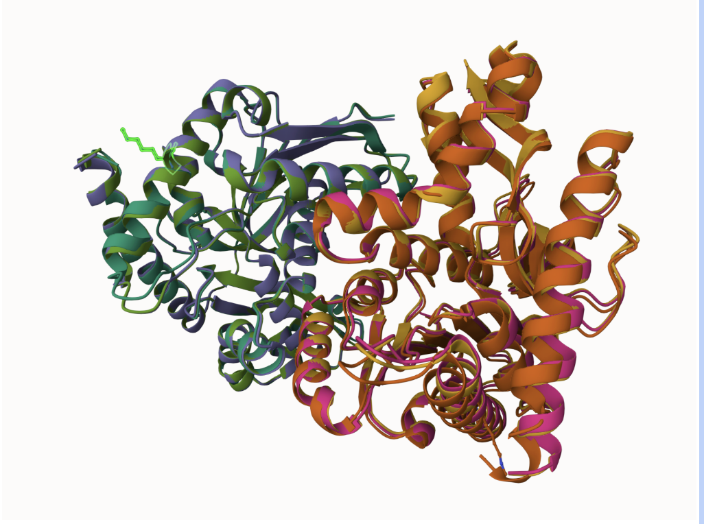
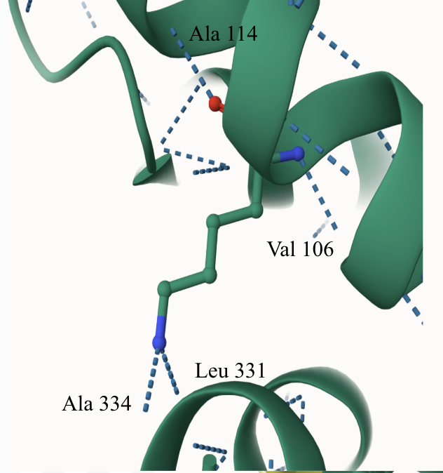
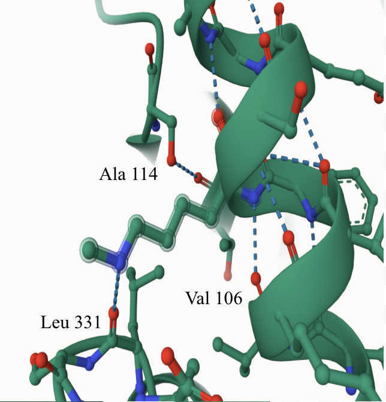
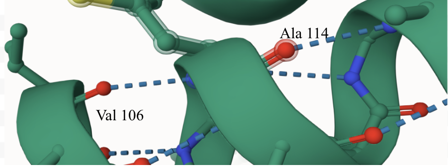
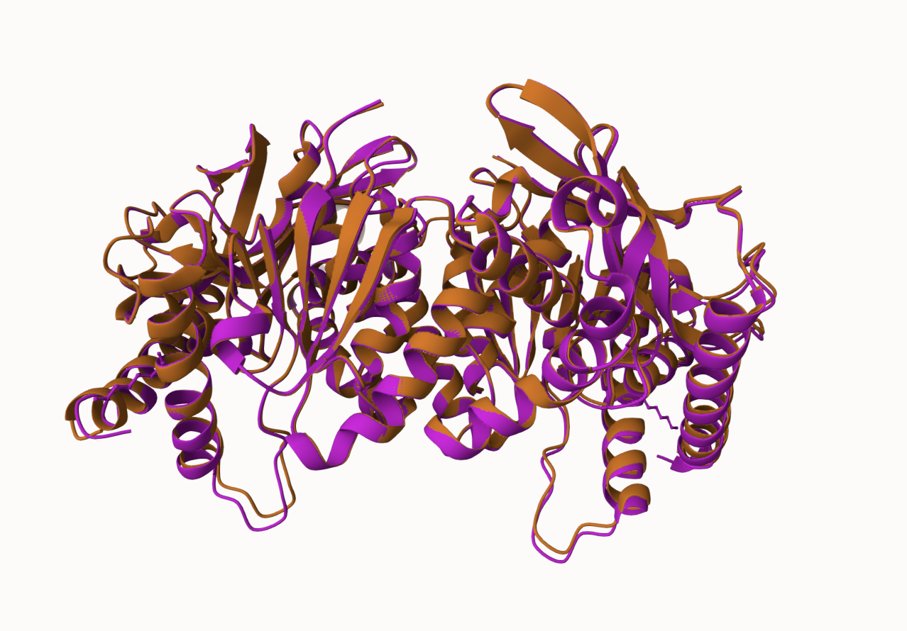
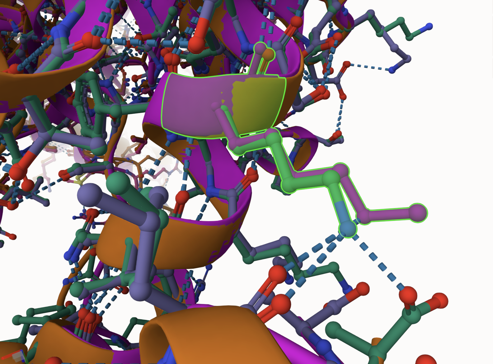
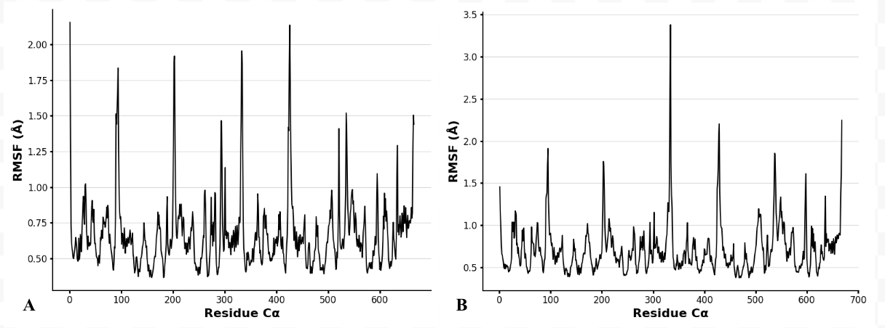
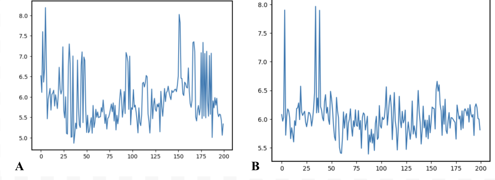
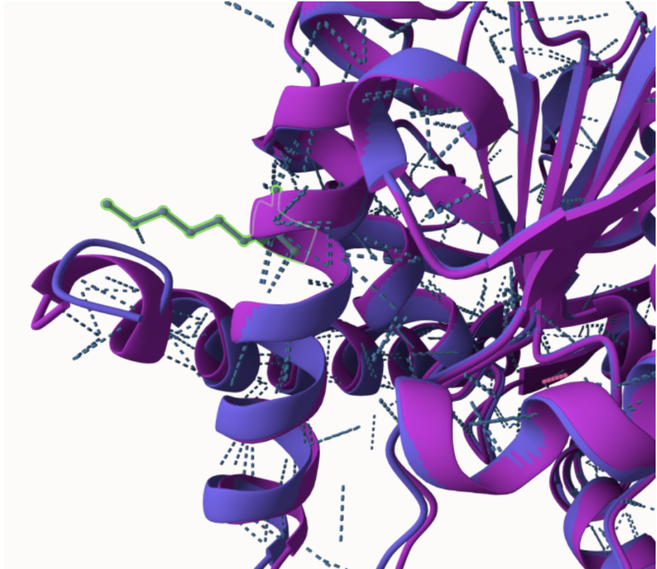

# Homo sapiens MDH1
# Uniprot ID: P40925
# Variation: methylation of K110

## Description

Human malate dehydrogenase, hMDH1, is a metabolic enzyme that catalyzes the oxidation of malate to oxaloacetate, utilizing the reduction of NAD+ to NADH. MDH1 can be modified using post-translational modifications (PTMs) that can change the protein composition and function (Kuhn et al., 2024). The PTM that was assigned and analyzed was a methylation at amino acid position 110. 

# Comparison of MDH1 models and methylation modified MDH1

1. Alignment of MDH1 (light green and yellow), MDH1 with methylation of K110 (dark green and orange), and K110M (pink and purple). 

2. Unmodified site of MDH1

3. PTM methylation site of MDH1

4. Mimic variant site of MDH1 (K110M)

The modification site is near to Val 106, Ala 114, Leu 331, and Ala 334, and it can decrease the number of hydrogen bonding interactions with these side chains when modified

## Effect of the sequence variant and PTM on MDH dynamics

1. The RMSD of the final frame from MD simulations of the unmodified MDH1 and the PTM modified MDh1  was 0.43Å. The unmodified MDH1 is shown in orange and the PTM modified MDH1 is displayed in pink. 

2. After performing the molecular dynamic simulations, the overall protein structures are considered similar, since the RMSD value was less than 2.0Å. However, the number of hydrogen bonding interactions decreased with the introduction of the modification. Hydrogen bonding between the site 110 and Leu 331 and Ala 334 were not observed in the modification enzyme. The modification site is highlighted in green.

3. After simulation, the protein dynamics as described by the root mean square fluctuation (RMSF) plots were compared. Between the two plots, there is a difference in peak height, with the unmodified site (A) and the associated peaks being taller than the modified site (B). The peak located around residue 190 displayed a significant reduction in peak height between the two models, indicating that the modification caused steric hindrance. This hindrance was introduced by the methylation of the previous lysine, restricting the residue flexibility of the modified site. 

4. To further analyze the mimic, the pKa values at the active site, His 187, were compared between the unmodified (A) and modified (B) sequences using the simulation. Lower pKa values for the PTM modified sequence indicated that His 187 can dissociate protons more easily. Since the protein folding pattern was relatively unchanged between the PTM and unmodified models, this substitution could have induced small conformational changes that created a more favorable environment for proton dissociation at the active site. 

## Comparison of the mimic and the authentic PTM

When comparing the PTM modified (purple) and the K110M (pink) structures, the RMSD value obtained was 0.50Å. Overall, there were no significant differences in structure or position between the two models, suggesting that the variant can be considered a valid approximation of the PTM methylation.

## Authors

Mallory L. Pham

## Deposition Date
2025-01-29

## License

Shield: [![CC BY-NC 4.0][cc-by-nc-shield]][cc-by-nc]

This work is licensed under a
[Creative Commons Attribution-NonCommercial 4.0 International License][cc-by-nc].

[![CC BY-NC 4.0][cc-by-nc-image]][cc-by-nc]

[cc-by-nc]: https://creativecommons.org/licenses/by-nc/4.0/
[cc-by-nc-image]: https://licensebuttons.net/l/by-nc/4.0/88x31.png
[cc-by-nc-shield]: https://img.shields.io/badge/License-CC%20BY--NC%204.0-lightgrey.svg

## References

* Kuhn, M. L.; Rakus, J. F.; Quenet, D. Acetylation, ADP-Ribosylation and Methylation of Malate. Essays Biochem 2024, 68 (2), 199–212. https://doi.org/10.1042/EBC20230080. 

