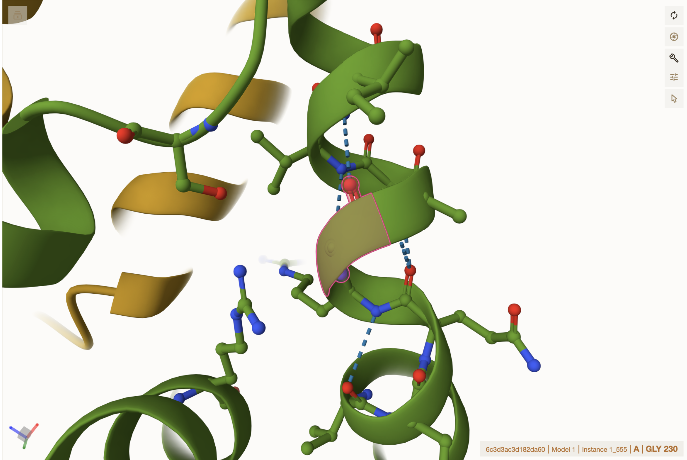
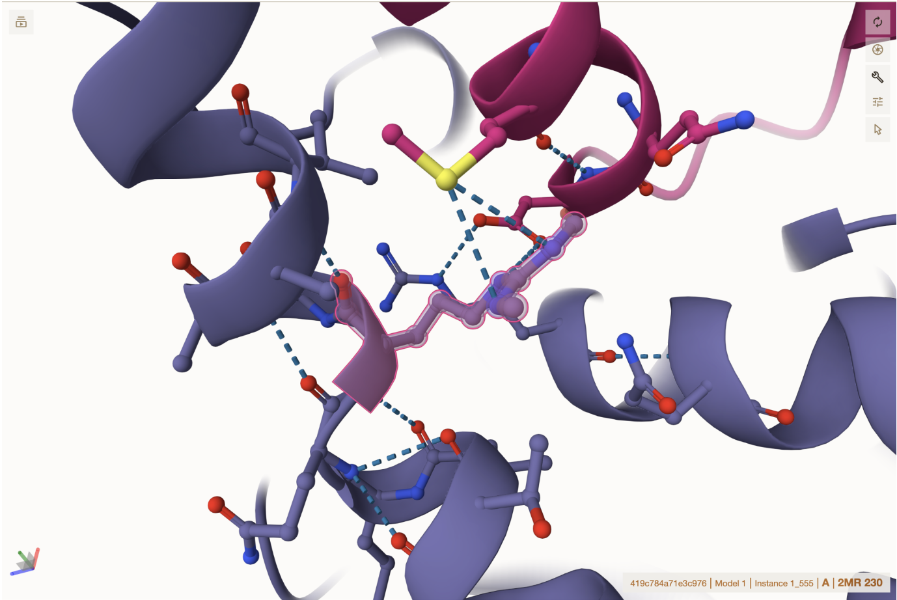
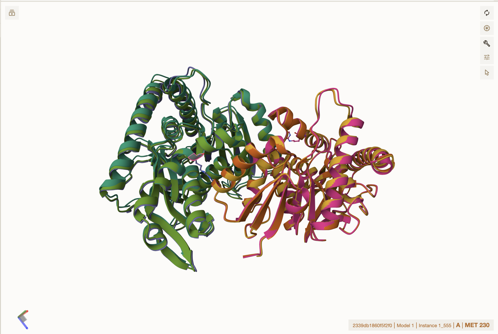
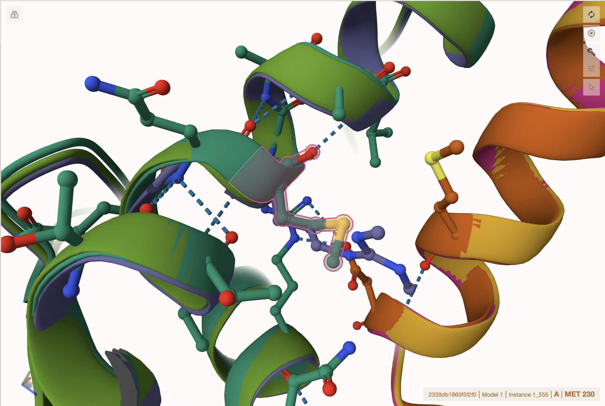
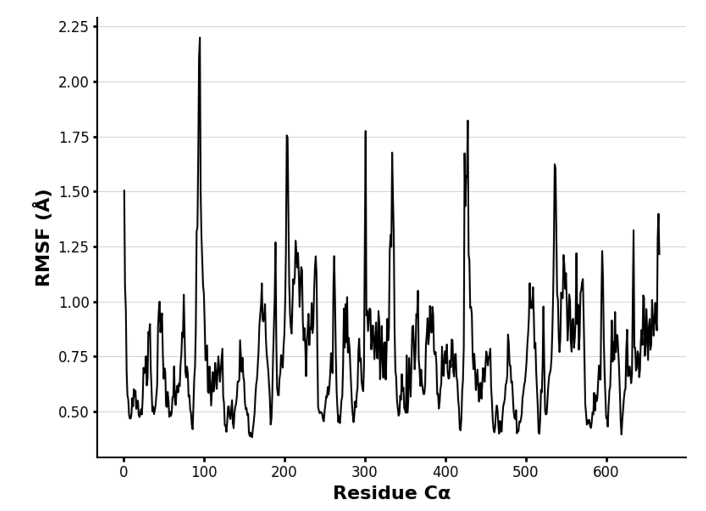
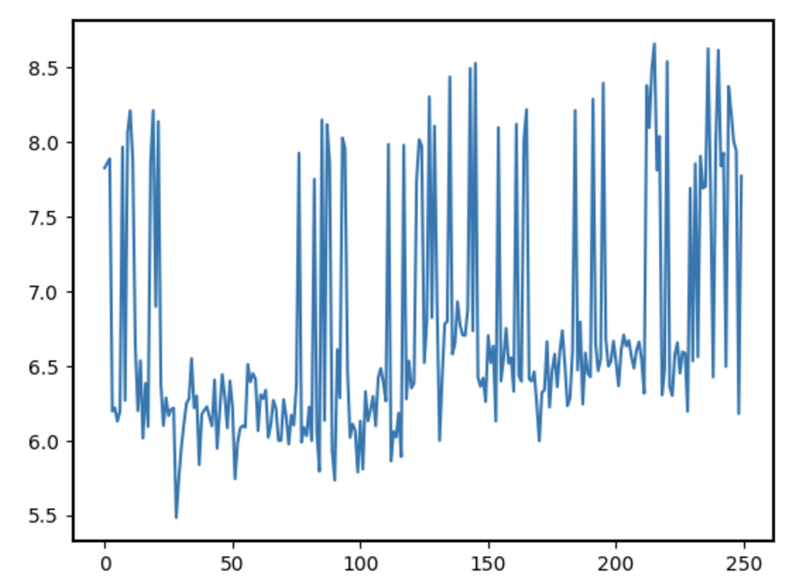
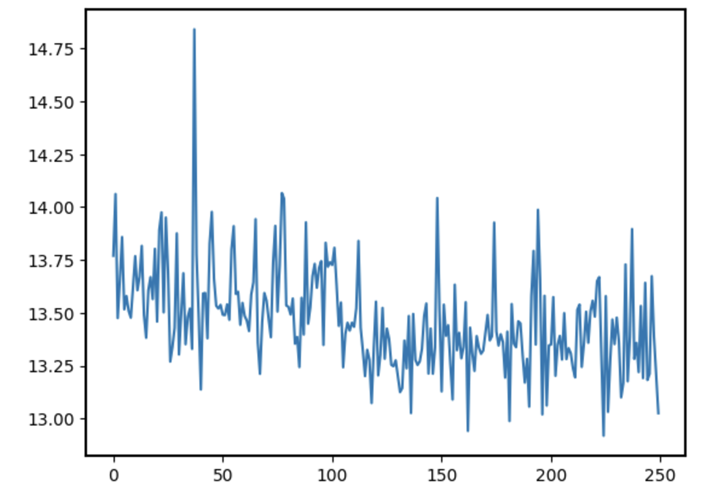
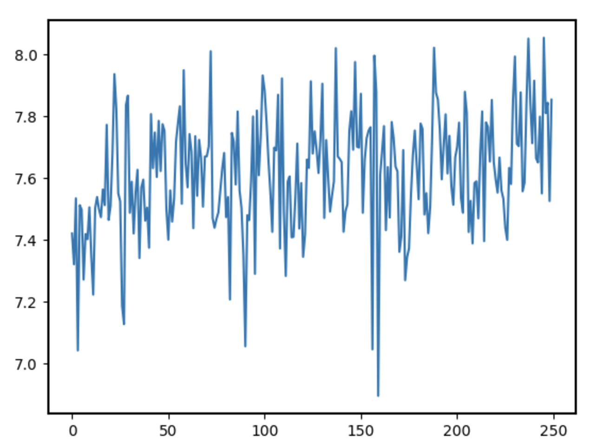
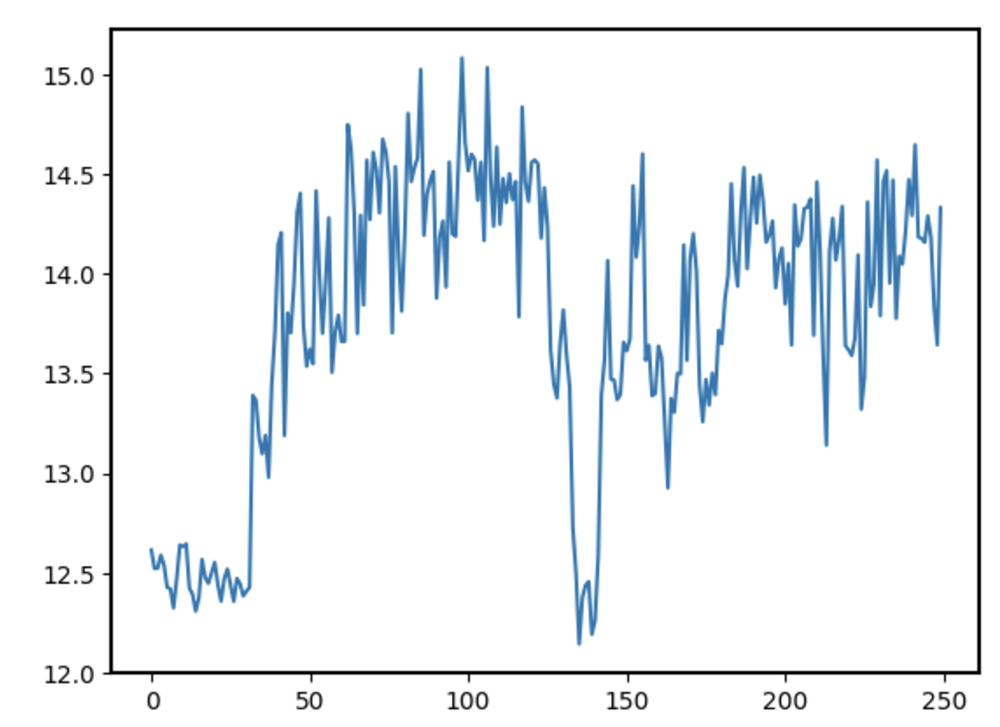

# Human Malate Dehydrogenase 1
# P40925
# Methylation at 230

## Description
Arginine 230 of human malate dehydrogenase 1 has not been studied for its functionality. One related entry is arginine methylation inhibiting metabolism and suppressing pancreatic cancer in MDH1 by (Wang, et al) https://doi.org/10.1016/j.molcel.2016.09.028

1. image of the unmodified site

2. image of modification site

## Effect of the sequence variant and PTM on MDH dynamics

1. Image of aligned PDB files (no solvent)

Modified variant is purple and mimic is teal

2. Image of the site with the aligned PDB files (no solvent)

Possible ionic or hydrogen bonding of the methylated amino acid with MET 55 and ASP 59
Selected methylation is N3, N4-Diethyl-L-arginine

3. Annotated RMSF plot showing differences between the simulations

4. Annotated plots of pKa for the key amino acids

5. If needed, show ligand bound images and how modification affects substrate binding

His 187 is highly dynamic in the range of 6-8. Arg 98 is fairly similar to unmodified, but big drop in pH at about 135. Arg162 is much more acidic than unmodified. Methylation of 230 is in an environment of around 7-8 pH. New possible interaction with ARG 98 and certainly with ARG 230

## Comparison of the mimic and the authentic PTM

The mimic's change doesn't likely affect structural change compared to PTM variant. The mimic is much more static and not nearly as dynamic as the PTM as well as the sterics of the methyl groups potentially being different altogether. 

## Authors

Ben Tanner

## Deposition Date 
12/6/24

## License

Shield: [![CC BY-NC 4.0][cc-by-nc-shield]][cc-by-nc]

This work is licensed under a
[Creative Commons Attribution-NonCommercial 4.0 International License][cc-by-nc].

[![CC BY-NC 4.0][cc-by-nc-image]][cc-by-nc]

[cc-by-nc]: https://creativecommons.org/licenses/by-nc/4.0/
[cc-by-nc-image]: https://licensebuttons.net/l/by-nc/4.0/88x31.png
[cc-by-nc-shield]: https://img.shields.io/badge/License-CC%20BY--NC%204.0-lightgrey.svg

## References

*Brosnan, M. E.; Brosnan, J. T. Histidine Metabolism and Function. J Nutr 2020, 150 (Suppl 1), 2570S-2575S 

*Leung, C. S.; Leung, S. S. F.; Tirado-Rives, J.; Jorgensen, W. L. Methyl Effects on Protein–Ligand Binding. J Med Chem 2012, 55 (9), 4489–4500.  

*McCue, W. M.; Finzel, B. C. Structural Characterization of the Human Cytosolic Malate Dehydrogenase I. ACS Omega 2021, 7 (1), 207–214.  

*Tanaka, T.; Inazawa, J.; Nakamura, Y. Molecular Cloning and Mapping of a Human cDNA for Cytosolic Malate Dehydrogenase (MDH1). Genomics 1996, 32 (1), 128–130 

*Wang, Y.-P.; Zhou, W.; Wang, J.; Huang, X.; Zuo, Y.; Wang, T.-S.; Gao, X.; Xu, Y.-Y.; Zou, S.-W.; Liu, Y.-B.; Cheng, J.-K.; Lei, Q.-Y. Arginine Methylation of MDH1 by CARM1 Inhibits Glutamine Metabolism and Suppresses Pancreatic Cancer. Molecular Cell 2016, 64 (4), 673–687. [10.1016/j.molec.2016.09.028](https://doi.org/10.1016/j.molcel.2016.09.028)

