# Human and MDH1

# P40925

# Phosphorylation of Amino Acid 10

Malate Dehydrogenase 1 is a protein in charge of the conversion, as well as the reversal, of malate to oxaloacetate, using NADH and NAD+ as a cofactor, within eukaryotic cells. This conversion is formally known as the malate aspartate shuttle. The protein plays an important role in assisting in the urea cycle in humans, which is the cycle of turning ammonia, a toxic waste, into urea, a less toxic molecule that can be eliminated in urine. When doing so, its structure is in the form of a dimer in its role in the malate and aspartate cycle. Additionally, MDH1 plays a role in the tricarboxylic acid cycle with overlapping mechanisms, and its use of oxaloacetate and malate within the cycle itself, as well as NAD+, which is used in the tricarboxylic acid cycle. The tricarboxylic acid cycle uses the malate produced during the malate aspartate shuttle, as well as producing the oxaloacetate that will be used in the malate aspartate shuttle (Broeks et al., 2019). MDH1 is also amplified in tumors in humans, and studies have shown that an MDH1 inhibitor could lead to slowing the progression of cancer in patients. This is due to the fact that MDH1 supports lactate dehydrogenase (LDH) in the regeneration of NAD+, in which LDH converts pyruvate and NADH into lactate and NAD+. MDH1 also regenerates NAD+ during the malate aspartate cycle, in which oxaloacetate and NADH is converted to malate and NAD+. High levels of NAD+ are important for glycolysis, and glucose consumption of cancer cells (McCue and Finzel).

Previous research has demonstrated that the surrounding area of MDH1 that was phosphorylated in this project, amino acid 10, belongs to a segment that is considering a cofactor binding motif. This means it’s important for bindings of cofactors which aid in catalysis for the protein. In this case, the segment considered a cofactor binding motif is important for the binding of NAD+ or it’s reduced form NADH, which is critical for MDH1’s function in the malate aspartate shuttle, it’s role in the conversion of oxaloacetate to malate. Studies found that phosphorylated MDH was three times more active in the oxaloacetate to malate, but not vice versa. It was also less likely to be inhibited by other molecules, however, phosphorylated MDH was shown to be less resistant in oxygen poor environments. The specific amino acid, T10, is towards the N terminus of the protein on the end of a beta sheath, this leads the amino acid to play an important role in protein folding. The phosphorylation of this amino acid, adding a negative charge, leads to a disruption in the hydrogen bonds, impacting the proteins folding and stability (Provost et al., 2024).

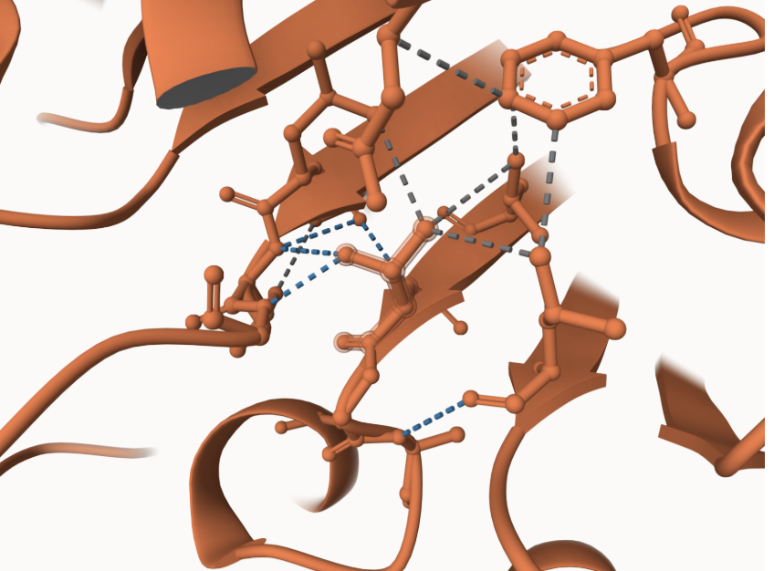

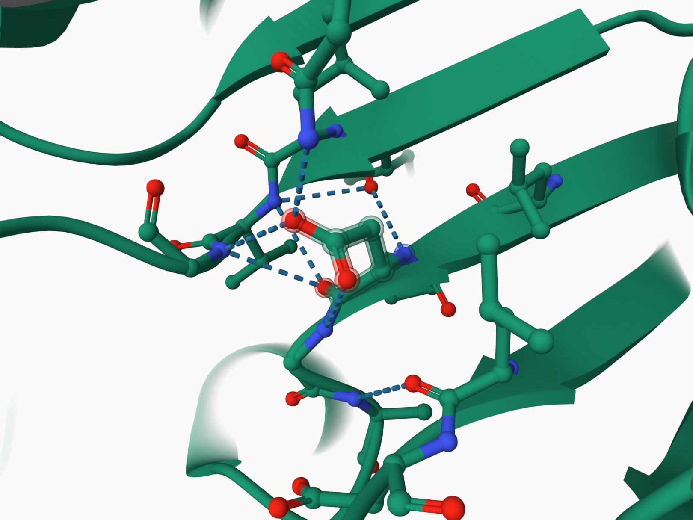 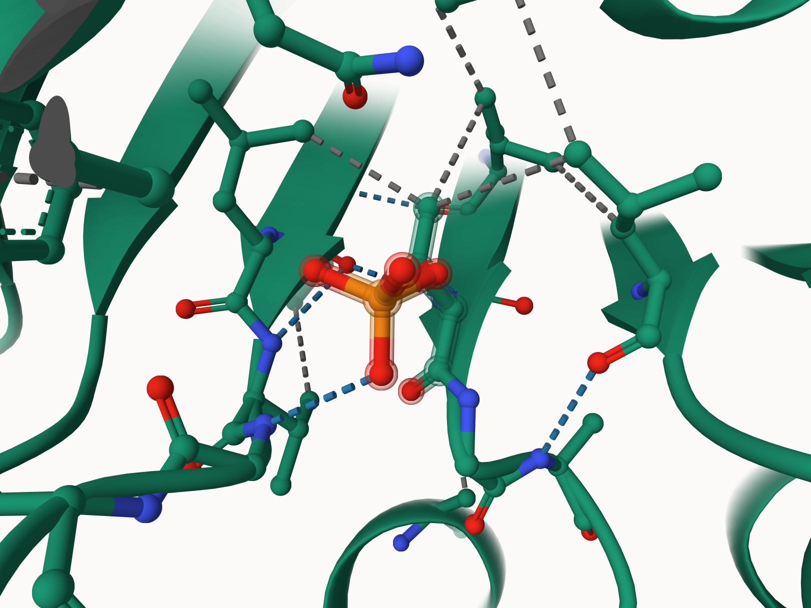

In the mimic the amino acid 10 was changed from a T (Threonine), which is neutral and polar, to D (Aspartic Acid), which is negative at pH 7. The 10th amino acid is located at the end of a beta sheath in the protein. The change in the mimic, from an alcohol to an carboxylate ion, led to adding an additional hydrogen bond between the ketone with Gly 11. When superimposing the mimic model and the model from project 3, they have relatively similar hydrogen bonds . The biggest difference is an additional hydrogen bond between Asp 10 and Gln 112 (Figure 1). The change in the post translational enzyme was more drastic in structure but did not vary drastically in bonds, a bonded oxygen hydrogen bonding to Gly 88 remained, but a hydrogen bond between the amino acid and Val 87 was removed (Figure 2). This is likely due to the fact that phosphate has a negative charge, which creates steric hindrance impeding certain bonds from occurring. There was a drastic change in the structure of the amino acid itself, the phosphorylation of amino acid Thr 10 led to a phosphate bonded to 4 oxygens in place of just an oxygen. Both of these changes, in regards to the mimic and the modified protein could affect the folding of the protein, as additional or fewer hydrogen bonds can change the type of protein structure. Especially considering the placement of the amino acid, near the n-terminus and the end of a beta sheath, the structure of the protein can change drastically, adding new hydrophilic areas of the protein and potentially increasing the protein's surface area. This can lead the protein to be more susceptible to its environment. Additionally the change in charge could lead to a difference in how the protein interacts with ligands or potential inhibitors. Although the unmodified amino acid did not directly interact with the active site, a change in the protein's structure could modify the active site itself (Figure 3).The change in the structure was not drastic, the end of the amino acid rotated, adding hydrogen bonds between the oxygens at one of the ends of the amino acid and neighboring nitrogens of amino acids, Gln112, Gly 88, and Gly 11 (Figure 4 and 5). The RMSD plot showed a rapid increase at first, demonstrating its instability, however after there were only slight fluctuations demonstrating the protein's stability and structural change (Figure 6). The RMSF plot demonstrated two peaks, showing high flexibility and variation during the simulation; this could be due to the change in charge from the modification (Figure 7). The pKa plot showed a difference in the pKa values of the amino acids we found key to the proteins function, the active site. Arg 161, which originally ranged from 10-13, now showed a range of 12 to 14, with the median moving from 11 to 13. His 186’s range did not vary greatly, however the median changed from about 5 to 8. The last amino acid, Arg 91 did not vary drastically in range or median (Figure 8). The changes in Arg 161 and His 186 could indicate their change in location and interactions with neighboring amino acids. This change could mean their role in the active site could be disrupted, in turn changing the protein's ability to function, more specifically for MDH 1, its ability to bind with malate and NAD+.

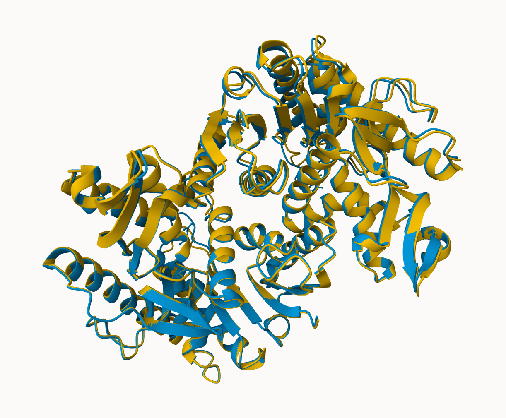 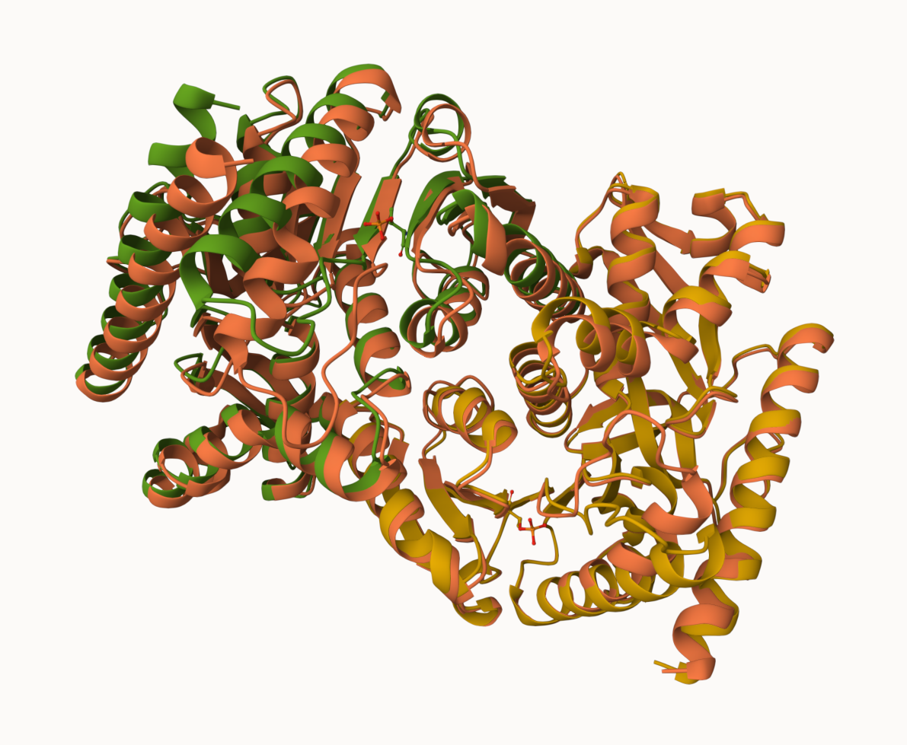

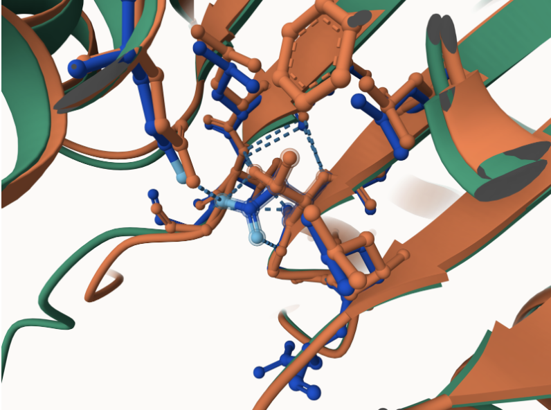 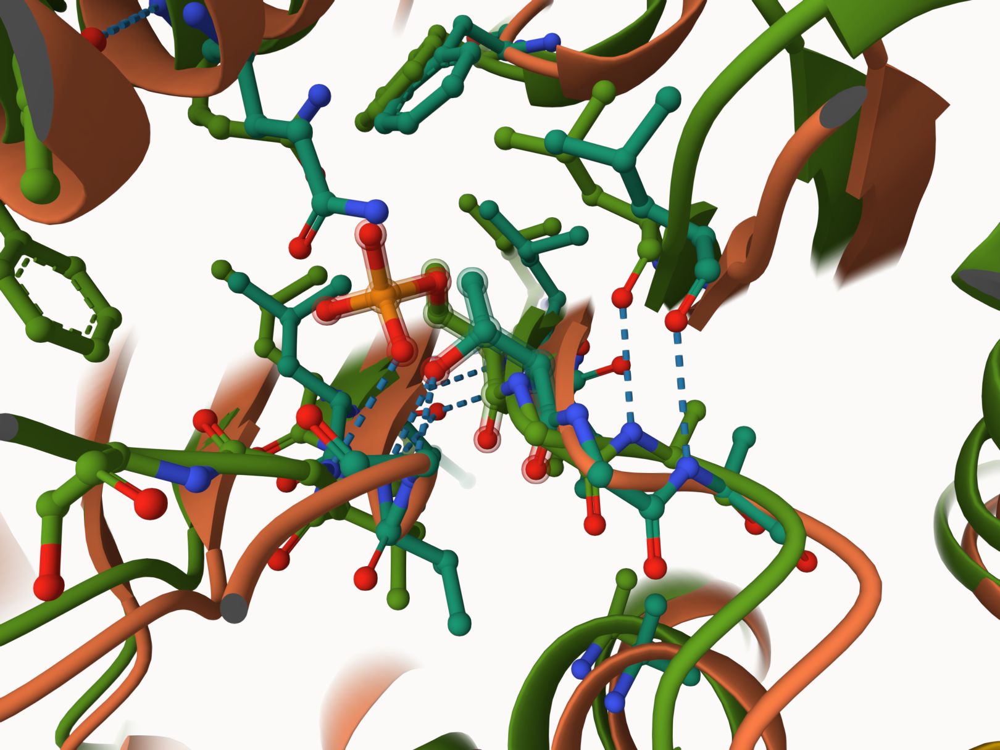

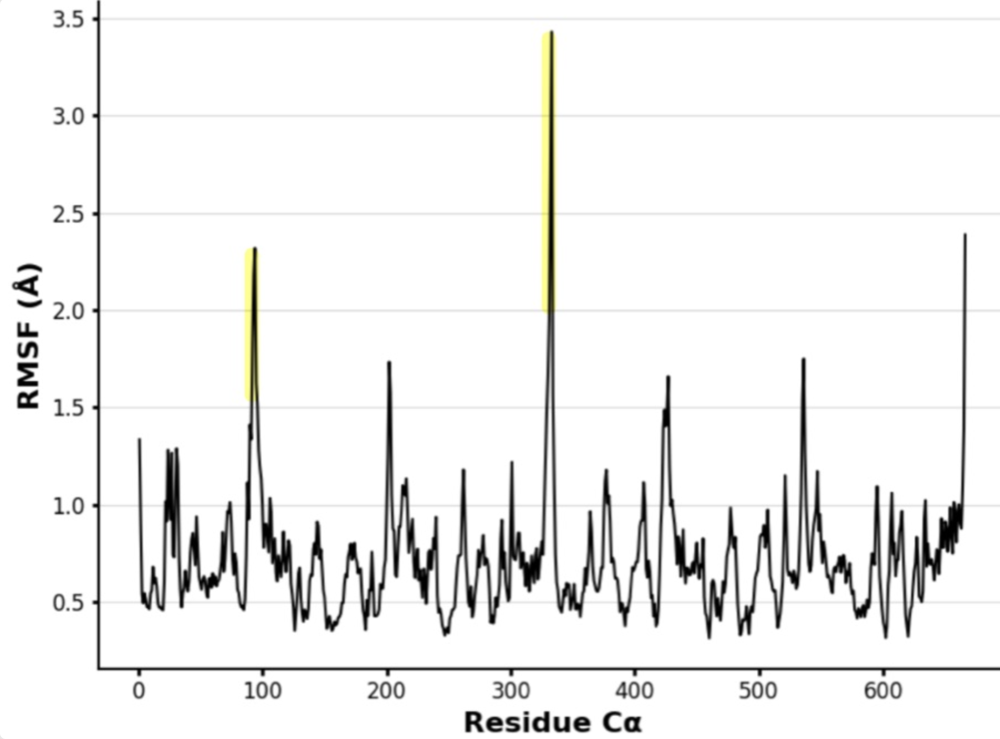

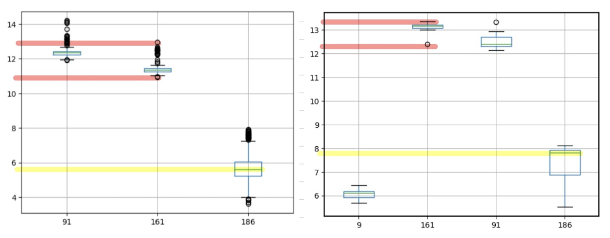

The mimic variant shows a slight difference in the structure of the amino acid itself compared to the PTM modified protein; there are a different assortment of hydrogen bonds, more specifically bonds with Gln112 and Gly 11 that the modified model does not have. In regards to structure the amino acid of the mimic model resembles the unmodified more closely compared to the modified model (Figure 9). Additionally to a few hydrogen bond differences, the mimic variant contains less hydrophobic interactions. The modified model demonstrates hydrophobic interactions with amino acids Leu 8, Leu 86, Leu 41 (Figure 10). This difference is likely due to the shift in location of a carbon, which enabled a now hydrophobic area of the protein that did not occur before, this area could lead to a change in the structure of a protein, as now the neighboring hydrophobic or hydrophilic areas may interact with this hydrophobic region. Additionally, it can affect the binding of cofactors or ligands, as their interactions with the now hydrophobic area can differ. However, when looking at the entire structure, the proteins superimposed, the mimic and modified models line up more closely than either of the models with the unmodified protein, this demonstrates they have similar influences in the changes within the structure of MDH 1 itself (Figure 9). This could demonstrate that although the amino acid area itself differs for the mimic versus the modified protein, the overall structure of the protein is similar enough for the mimic variant to be a good approximation of the post translational modification of the phosphorylation of amino acid 10 in MDH 1.

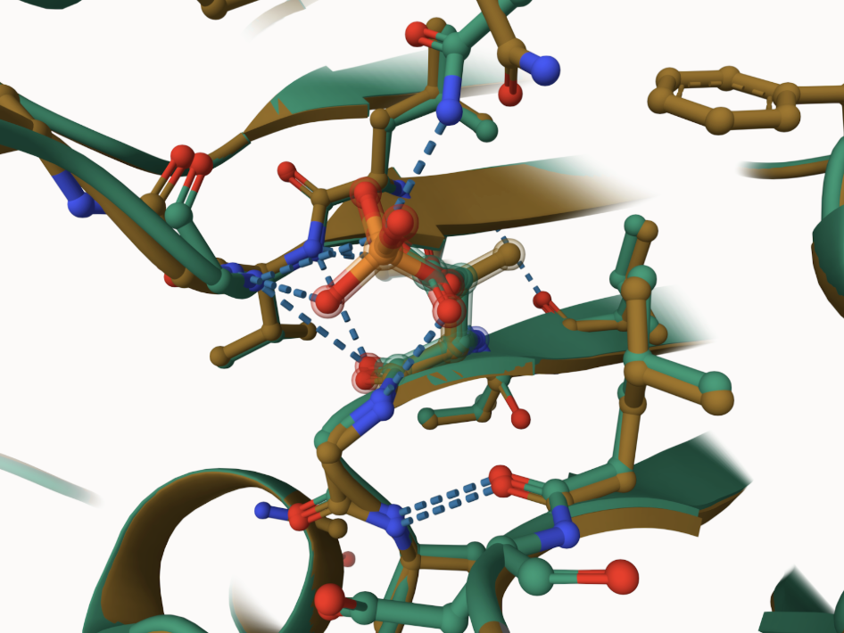 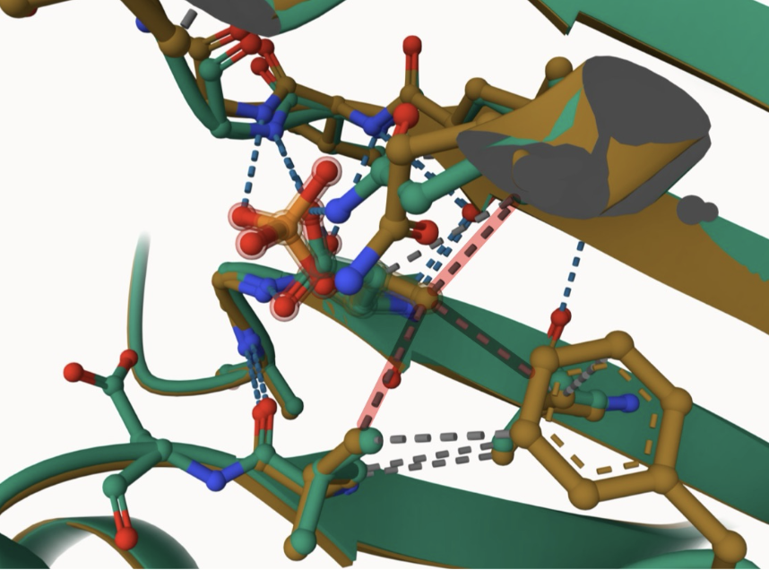

## Contributor

Olivia Abdallah

## Deposition Date

## License

Shield: 

This work is licensed under a [Creative Commons Attribution-NonCommercial 4.0 International License](https://creativecommons.org/licenses/by-nc/4.0/).

## References

-   Broeks, M. H., Shamseldin, H. E., Alhashem, A., Hashem, M., Abdulwahab, F., Alshedi, T., Alobaid, I., Zwartkruis, F., Westland, D., Fuchs, S., Verhoeven-Duif, N. M., Jans, J. J. M., & Alkuraya, F. S. (2019). MDH1 deficiency is a metabolic disorder of the malate–aspartate shuttle associated with early onset severe encephalopathy. Human Genetics, 138(11–12), 1247–1257. 

-   McCue, W. M., & Finzel, B. C. (2022). Structural characterization of the human cytosolic malate dehydrogenase i. ACS Omega, 7(1), 207–214. <https://doi.org/10.1021/acsomega.1c04385> 

-   Provost, J. J., Cornely, K. A., Mertz, P. S., Peterson, C. N., Riley, S. G., Tarbox, H. J., Narasimhan, S. R., Pulido, A. J., & Springer, A. L. (2024). Phosphorylation of mammalian cytosolic and mitochondrial malate dehydrogenase: Insights into regulation. Essays in Biochemistry, 68(2), 183–198. <https://doi.org/10.1042/EBC20230079> 
