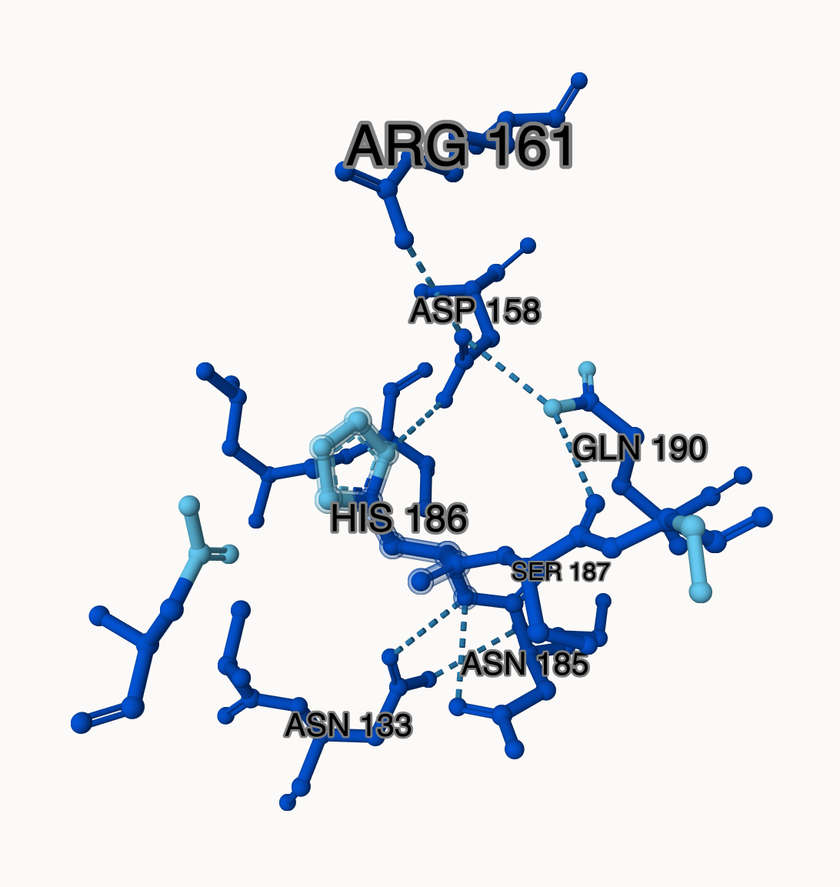
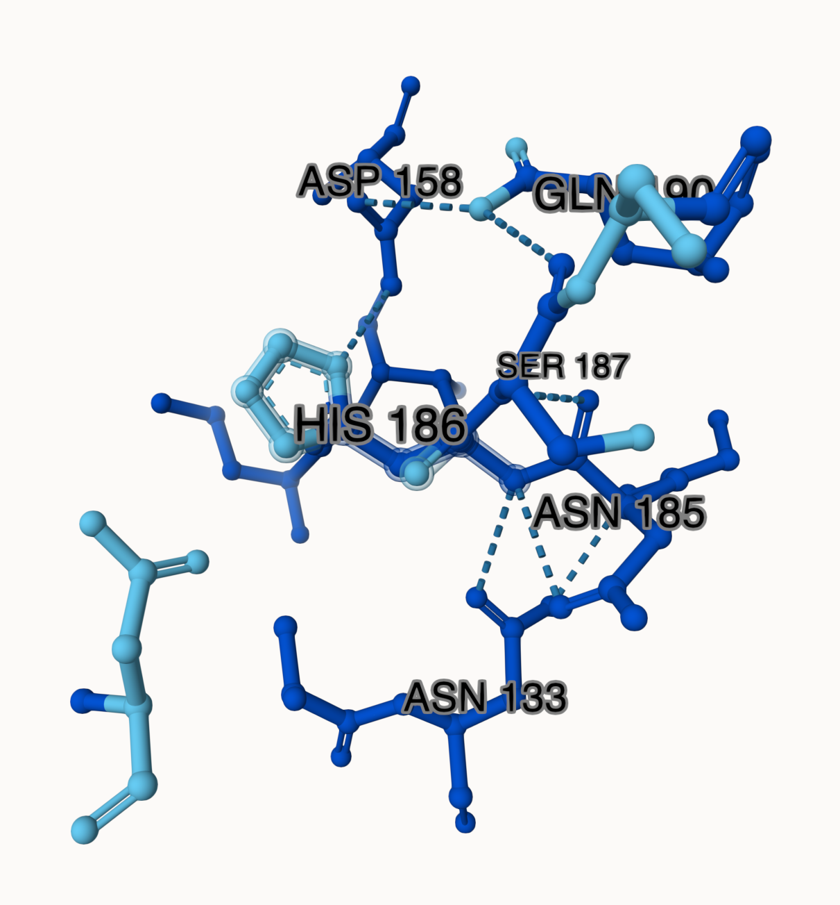
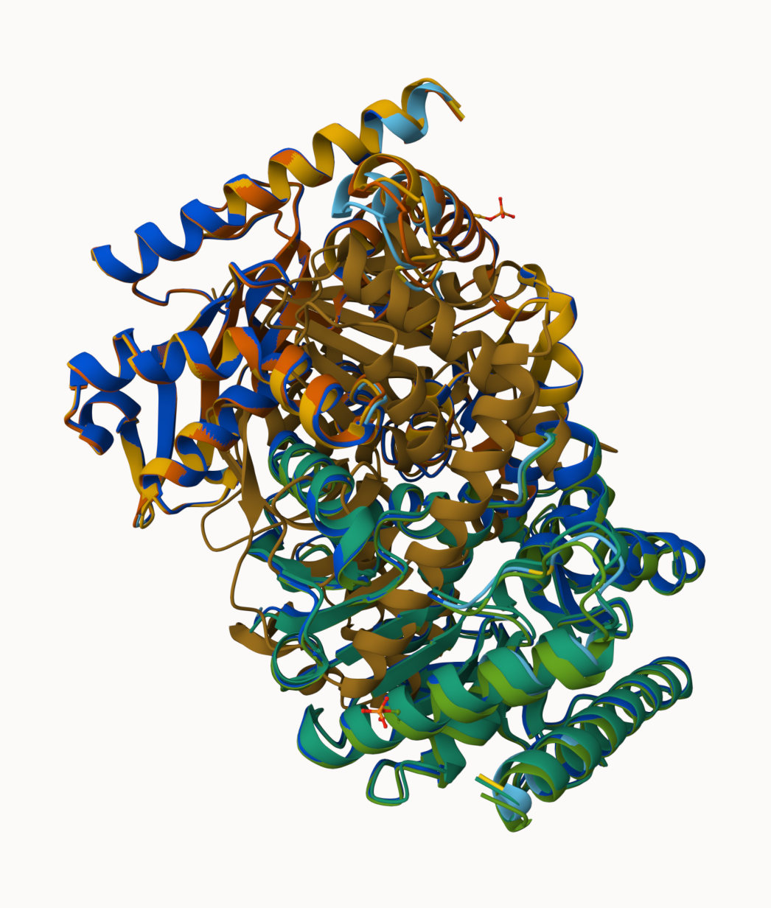
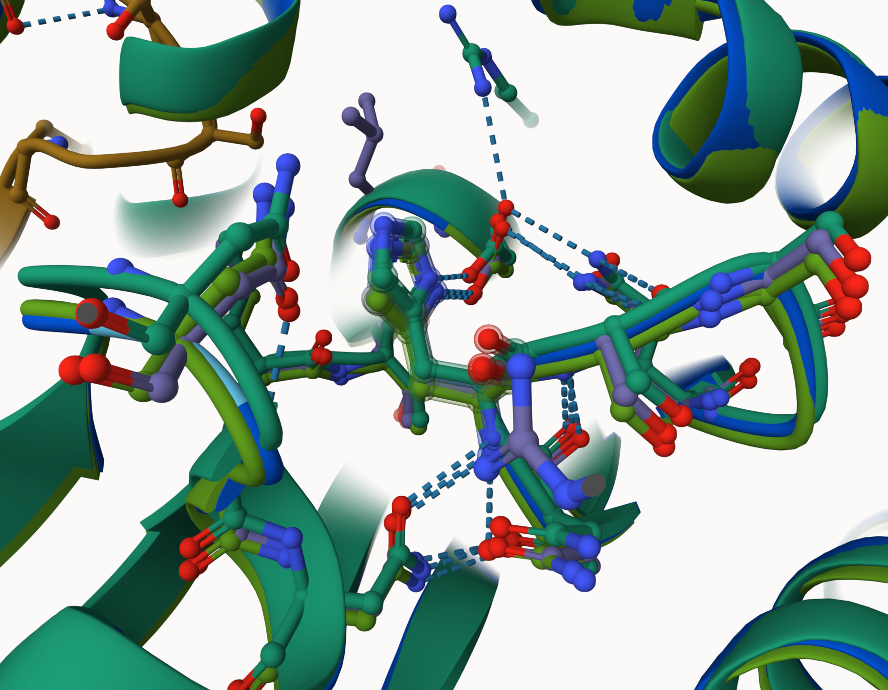
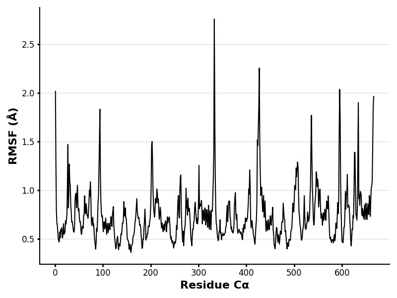
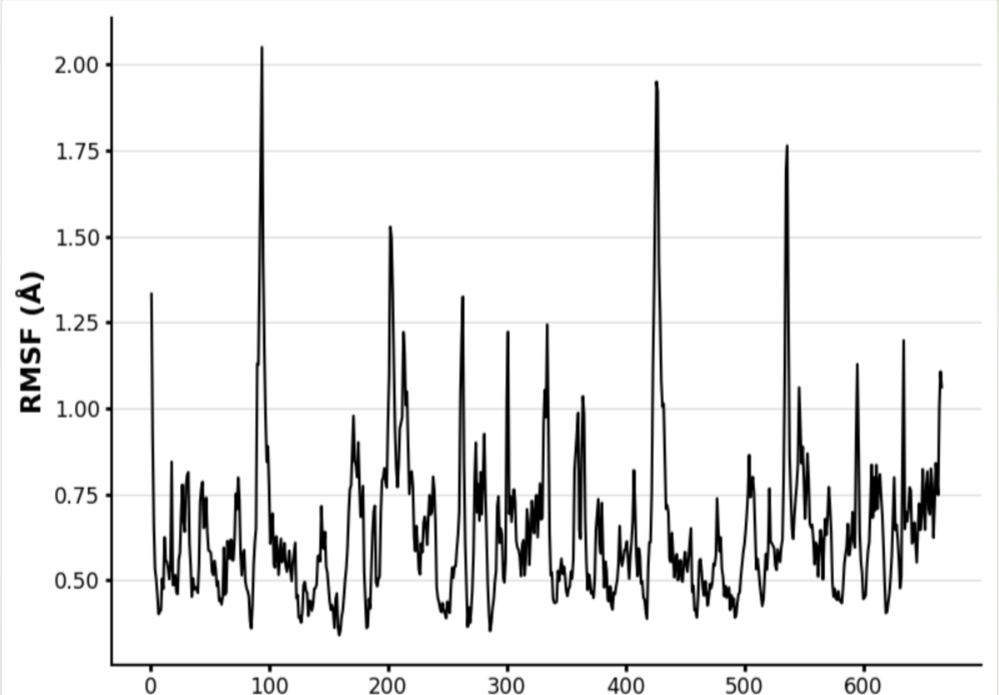
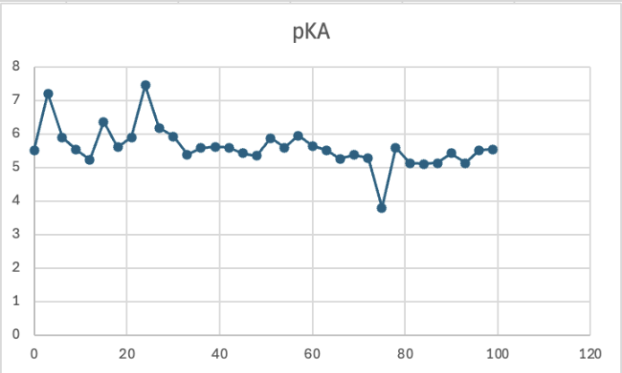
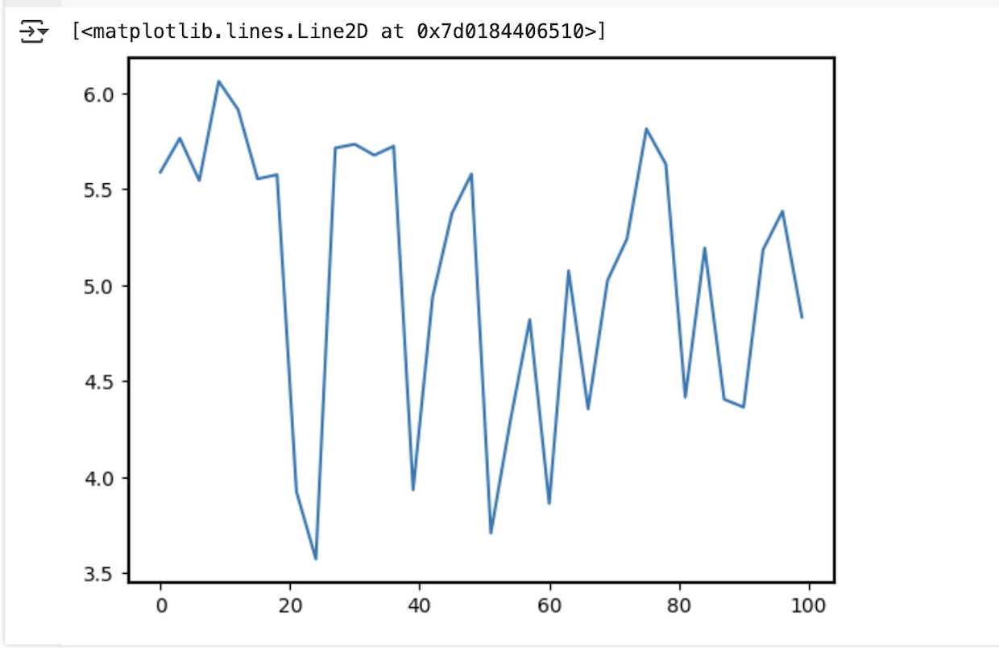
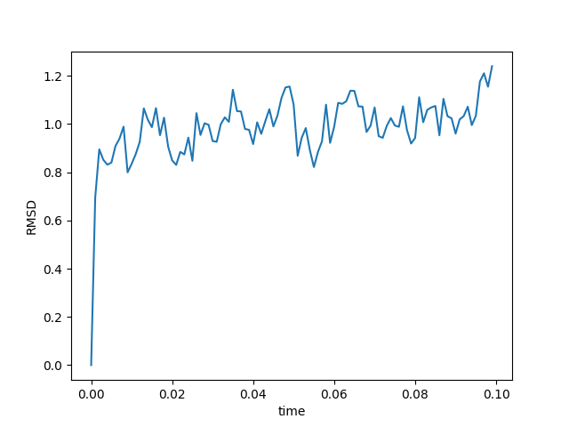
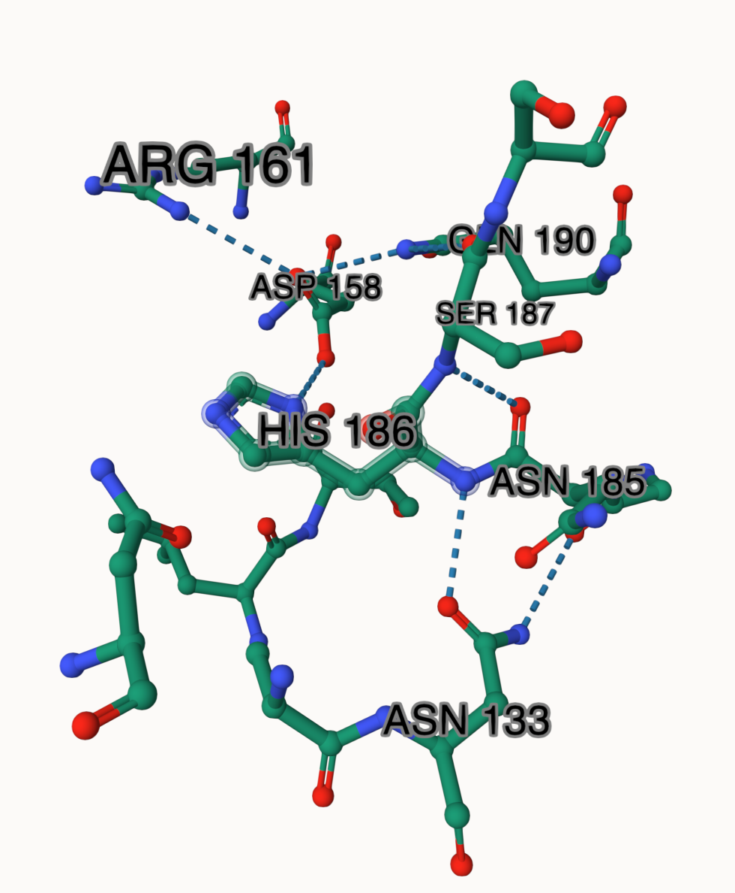

# Human MDH1

# P40925

# (S) 111p

## Description

# Part 1 from Project 4 report outline (with citations as appropriate)

1.  image of the unmodified site 

2.  image of modification site 

## Effect of the sequence variant and PTM on MDH dynamics

Part 3 from the Project 4 report

1.  Image of aligned PDB files (no solvent) 

2.  Image of the site with the aligned PDB files (no solvent) 

3.  Annotated RMSF plot showing differences between the simulations   The RMSF plots showed differences in flexibility between the mimic and unmodified models. For example, the mimic model’s loop region near residue 111 showed more fluctuation. This suggests that the mimic is causing the loop to be more flexible, which could impact the active site function and overall enzyme function. Although weak interactions stayed the same, the increased flexibility could affect substrate binding or the positioning of active site residues.

4.  Annotated plots of pKa for the key amino acids  

The mimic fluctuated more than the unmodified model, suggesting that the surrounding charges of the mimic were less stable. This could be due to the introduction of the negative charge from changing the serine to the aspartate.

5.  If needed, show ligand bound images and how modification affects substrate binding

Description of the data and changes

## Comparison of the mimic and the authentic PTM

Part 4 from the Project 4 report outline include images as needed The mimic and modified models both had structures with low RMSD values, so the two structures were highly similar and there was no significant difference in their overall shapes. Therefore, the mimic provides a reasonable structure substitute for the modified version. The mimic and PTM retain the same hydrogen bonding at the active site residue HIS 186 and at nearby residues, including ASP 158, ASN 185, and SER 187. However, one hydrogen bond was present in the PTM model that was not in the mimic, suggesting a small difference in active site stabilization.   

## Authors

Syndey Brearley \## Deposition Date

## License

Shield: 

This work is licensed under a [Creative Commons Attribution-NonCommercial 4.0 International License](https://creativecommons.org/licenses/by-nc/4.0/).

## References

-   Citation1 

-   Citation2 
