# Homo sapien MDH1
# Uniprot ID:P40925
# Variation: phosphorylation of S111 (pS111 in structure)

## Description 
This study investigates the structural and functional effects of post-translational modifications (PTMs) on human malate dehydrogenase (hMDH1). Specifically, it examines two models of modification at serine 111: an authentically modified model, in which serine is phosphorylated to phosphoserine, and a mimic variant model, where serine is substituted with aspartic acid. The use of both models is critical because the production and purification of authentically modified proteins can be challenging. The goal of this study is to build a model database of human modified MDH proteins and to compare the effects of the authentically modified enzyme with those of the established PTM mimic. 

However, to better understand the potential implications of these modifications, it is important to consider the findings from previous research on nearby modification sites, particularly position 110.Previous studies have described a modification site at position 110 of hMDH1 (Schmitt, 2022). Although this site is not identical to position 111, the proximity of the two suggests that the findings provide insight into the modification at position 111. This prior work indicated that the modification site lies within the active site loop of hMDH1, and mutations at this site can alter the enzyme’s substrate specificity. Specifically, mutating the active site from proline to serine resulted in reduced specificity for oxaloacetate. Given that the effects of modification at position 111 have not been directly studied, further investigation into its role and significance is crucial.

# Comparison of MDH1 model, phosphomodified MDH1, and mimic variant
To begin addressing this gap in knowledge, this study examines the structural interactions at position 111 in both the unmodified and modified forms of hMDH1, with a particular focus on how serine 111 influences enzyme function. In the unmodified enzyme, the serine at position 111 interacts with glutamic acid 74, alanine 115, and lysine 107 (Figures 1, 2).

1. Model of unmodified human MDH1, showing serine at position 111 forming 2 hydrogen bonds with the carboxyl group of glutamic acid at position 74.
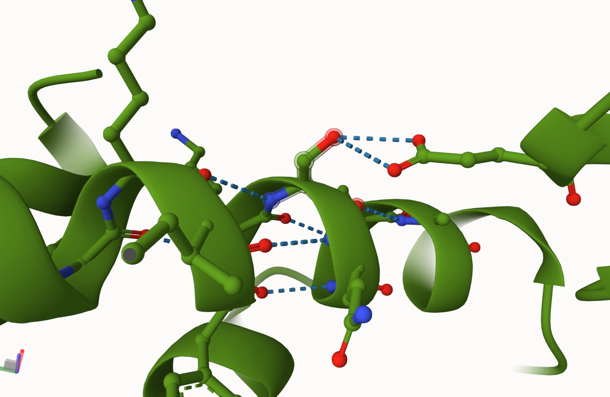

2. Alternate view of the unmodified human MDH1, showing the ketone group in serine forming a hydrogen bond with the nitrogen atom of alanine 115. The nitrogen of serine also forms a hydrogen bond with lysine 107.
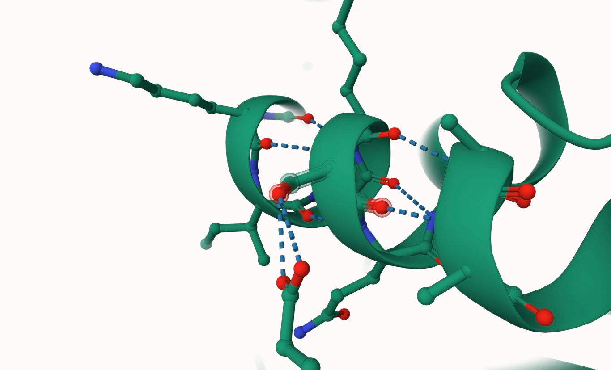

When serine is replaced with aspartic acid in the mimic variant, the interaction with glutamic acid 74 is lost, and the aspartic acid residue forms hydrogen bonds with alanine 115 and lysine 107 (Figure 3).

3. Model of the PTM mimic variant of human MDH1, where serine at position 111 is substituted with aspartic acid. The hydrogen bonds to glutamic acid at position 74 are lost, but the aspartic acid residue forms hydrogen bonds with alanine 115 and lysine 107. The ketone in aspartic acid forms a hydrogen bond with the nitrogen in alanine 115. The nitrogen forms a hydrogen bond with the ketone of lysine 107.
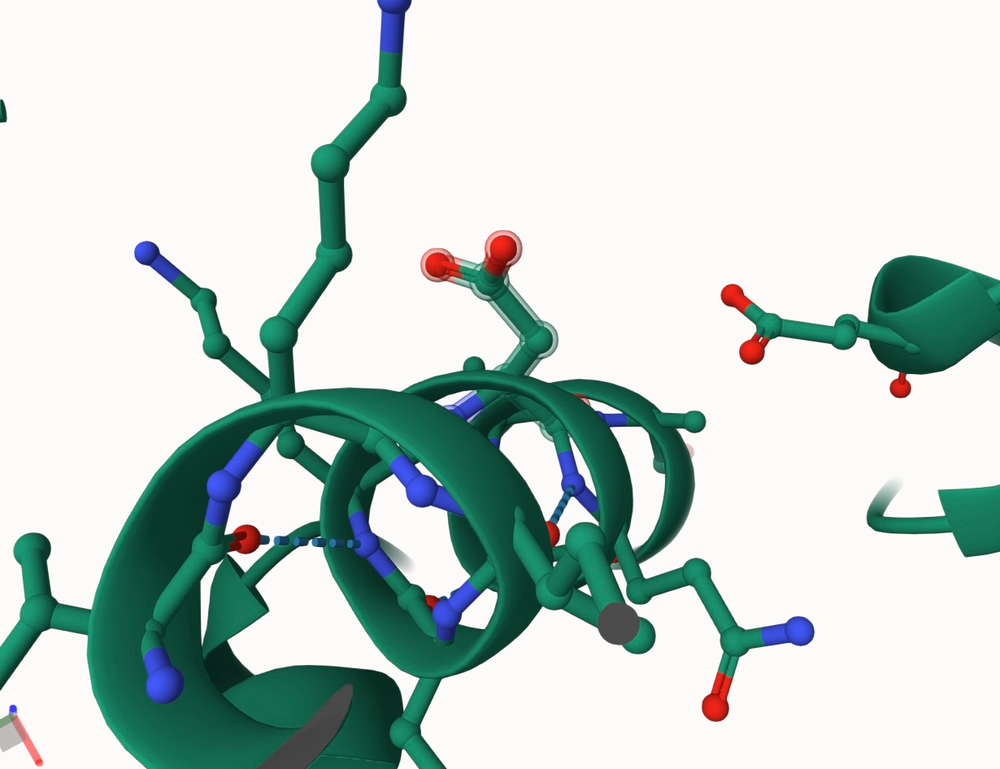

In contrast, the phosphorylation of serine at position 111 results in the formation of phosphoserine, which interacts with glutamic acid 74, alanine 115, lysine 107, and isoleucine 108 (Figure 4).

4. Model of the phosphorylated human MDH1. Phosphoserine at position 111 forms a hydrogen bond with the carboxyl group of glutamic acid at position 74. Additionally, hydrogen bonds are formed with alanine 115, lysine 107, and isoleucine 108. The nitrogen in the modified enzyme forms hydrogen bonds with the ketones on isoleucine 108 and lysine 107. The ketone in the modified site also forms a hydrogen bond with nitrogen in alanine 115.

To better compare the unmodified structure with the modified and mimic variant forms, the sequences were superimposed at position 111. This alignment reveals notable changes in the weak interactions between residues when transitioning from the unmodified to the modified enzyme.

5. Aligned models of the unmodified and phosphorylated enzymes, showing structural differences. The alcohol group in serine is modified to a phosphate group. The interaction with glutamic acid 74 is reduced, and a new hydrogen bond with isoleucine 108 is formed in the modified enzyme.
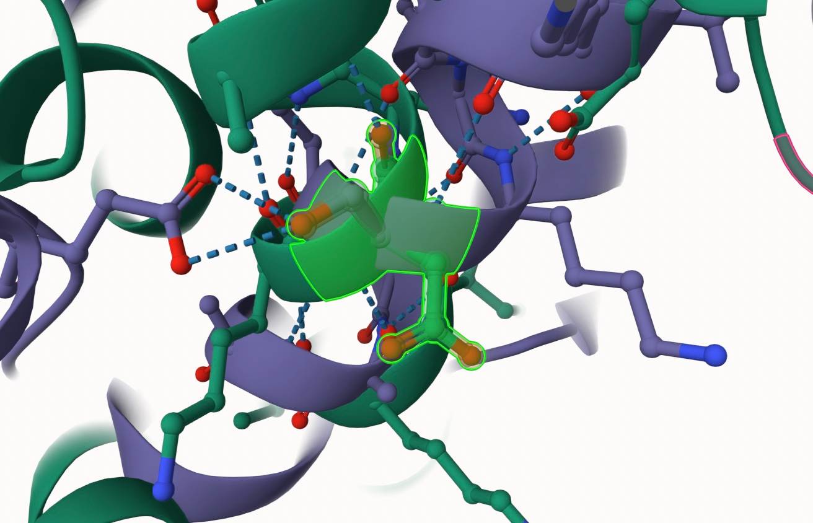

6.  Aligned models of the unmodified enzyme and the PTM mimic variant. The serine is replaced by aspartic acid, and the hydrogen bond with glutamic acid 74 is lost. However, interactions with lysine 107 and alanine 115 are preserved.
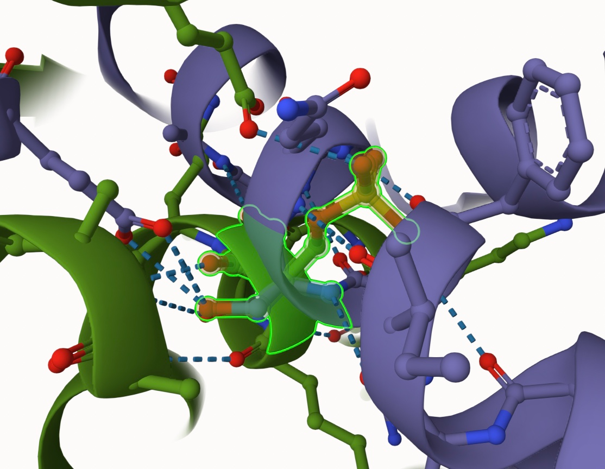

## Effect of the sequence variant and PTM on MDH dynamics

The structural comparisons reveal that phosphorylation of serine at position 111 introduces new interactions, particularly with isoleucine 108, which are absent in the unmodified enzyme. This newly formed interaction could alter the enzyme’s active site conformation, potentially affecting substrate binding or catalysis. Additionally, the phosphorylation reduces the interaction with glutamic acid 74, decreasing the number of hydrogen bonds from two to one. This weakened interaction may affect the enzyme's stability or its affinity for substrates, potentially leading to altered substrate specificity and changes in the enzyme's overall catalytic efficiency.

In contrast, the PTM mimic variant, where serine is replaced by aspartic acid, disrupts the hydrogen bond with glutamic acid 74 entirely. This disruption is likely to have a more pronounced effect on substrate binding and enzyme function. The loss of this key interaction could reduce the enzyme’s affinity for its substrate, resulting in decreased enzymatic activity. Although the mimic variant retains interactions with alanine 115 and lysine 107, these may not be sufficient to maintain the enzyme’s original substrate specificity or catalytic efficiency. The introduction of a negatively charged aspartic acid at position 111 could also destabilize the active site, alter interactions with cofactors, and potentially shift the enzyme’s substrate preference, further decreasing activity.

Both the phosphorylation of serine 111 and the serine-to-aspartic acid mutation could significantly disrupt hMDH1’s activity, thereby impacting key metabolic processes such as the TCA cycle and the malate-aspartate shuttle. Phosphorylation may lead to a more finely tuned regulation of enzyme activity, potentially increasing or decreasing the efficiency of the TCA cycle depending on how it influences substrate binding and catalysis. On the other hand, the PTM mimic variant is likely to cause a more severe functional impairment, with larger disruptions to substrate interactions, potentially altering the flux through these metabolic pathways.

## Comparison of molecular dynamic simulations

Based on the molecular dynamics simulations, the PTM mimic variant of hMDH1 exhibits significant structural and functional changes compared to the unmodified enzyme. These alterations are evident in key aspects of the protein's dynamics, including RMSF (Root Mean Square Fluctuation), RMSD (Root Mean Square Deviation), and pKa values at the active site, all of which suggest that the mimic variant undergoes structural adjustments that likely influence its function.

The RMSF plots (Figure 7) reveal notable differences between the unmodified and mimic enzymes. For the unmodified enzyme, the major peaks in RMSF occur at amino acids 100, 205, 415, and 550, indicating regions with greater flexibility. In contrast, the mimic variant shows additional peaks around amino acids 330 and 680, suggesting increased flexibility in these regions. This increased motion in the mimic variant implies that the protein is more dynamic in these areas, which could lead to altered protein stability and active site conformation, potentially affecting its catalytic efficiency and substrate binding.

7. RMSF plot of the unmodified and mimic enzyme. Peaks represent amino acids or sections of the protein where there is more motion than lower RMSF values. The peaks of the unmodified enzyme occur around amino acids 100, 205, 415, and 550. The peaks of the modified enzyme occur around amino acids 100, 205, 330, 415, 550, and 680. Arrows represent the peaks we’re comparing in the two plots.
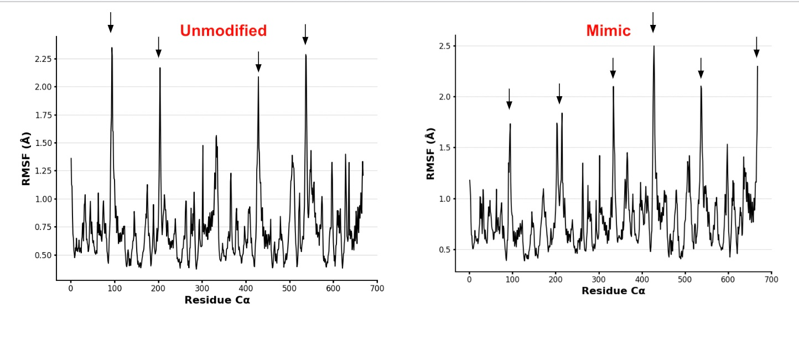

Additionally, the RMSD plot (Figure 8) shows that the unmodified enzyme stabilizes at a lower level, around 1.2 Å, while the mimic variant stabilizes at around 0.15 Å after an initial increase. This suggests that while the mimic variant undergoes significant conformational changes initially, it reaches a more stable structural state than the unmodified enzyme, potentially indicating a new equilibrium. The fact that the unmodified enzyme stabilizes at a higher RMSD value implies that it may retain some structural flexibility even after equilibration, possibly affecting its functional dynamics compared to the mimic.

8. RMSD plot of the PTM mimic variant. There’s a large initial increase and then the plot levels out at about 0.15 seconds. Since it plateaued, there’s reliable data collection.
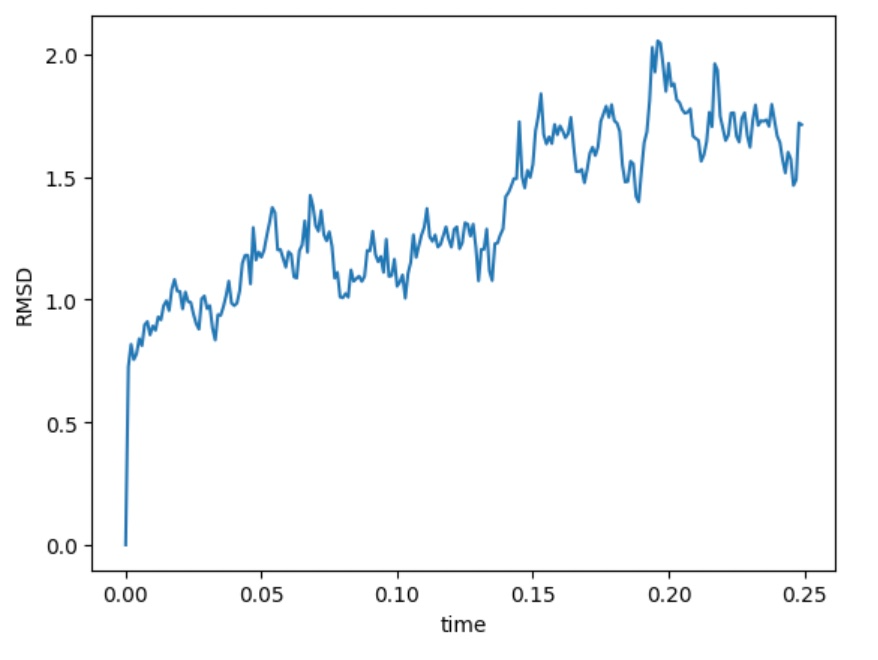

The heatmap of RMSD (Figure 9) further illustrates these differences. For the unmodified enzyme, a transition at around frame 145 is observed, similar to the mimic variant. However, the transition is less pronounced, with the blue regions (representing structural similarity) being lighter than in the mimic. This suggests that the unmodified enzyme undergoes a less dramatic structural transition compared to the mimic, and the unmodified enzyme maintains greater structural similarity to its initial conformation. In contrast, the mimic variant experiences a more significant reorganization, reflecting its increased flexibility and potential for altered function.

9. Heat map of RMSD. The dark blue regions represent sets of frame pairs where the structure is very similar, while yellow regions are sets where it’s different. At around frame 145, there seems to be a transition from one kind of structure to another.
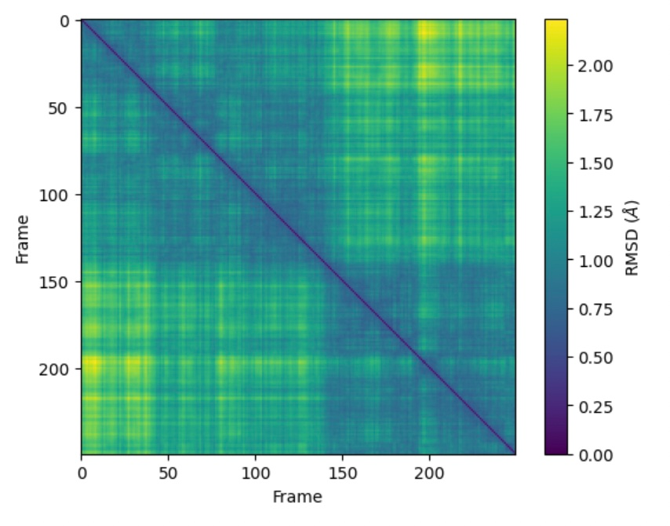

The pKa values of critical residues also show alterations in the mimic variant that likely affect enzyme function. In particular, the pKa of histidine 187 at the active site decreased from a mean value of 6.15 in the unmodified enzyme (with a standard deviation of 0.54) to 5.247 in the mimic variant (with a standard deviation of 0.494). This decrease suggests a shift in the protonation state of histidine 187, which could affect the enzyme's catalytic properties, as this residue plays a role in proton transfer during substrate conversion.

Moreover, the pKa value at position 111 in the mimic variant (Figure 10) was measured at 4.2126, with a standard deviation of 0.293. The substitution of serine with aspartic acid at position 111 likely altered the local electrostatic environment, potentially destabilizing the active site and altering enzyme-substrate interactions. The introduction of a negatively charged aspartic acid could disrupt the enzyme’s original electrostatic interactions, leading to changes in its substrate affinity and overall catalytic activity.

10. pKa values of the mimic variant. At site 111, the mean pKa is 4.2126 and the standard deviation is 0.293. 
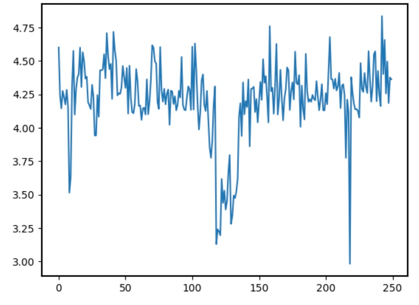

11. Box plot showing how dynamic amino acids 111 and 187 was statistically across the overall trajectory. The increased fluctuation of position 111 indicates that this region is more flexible and undergoes greater conformational changes compared to the active site histidine.
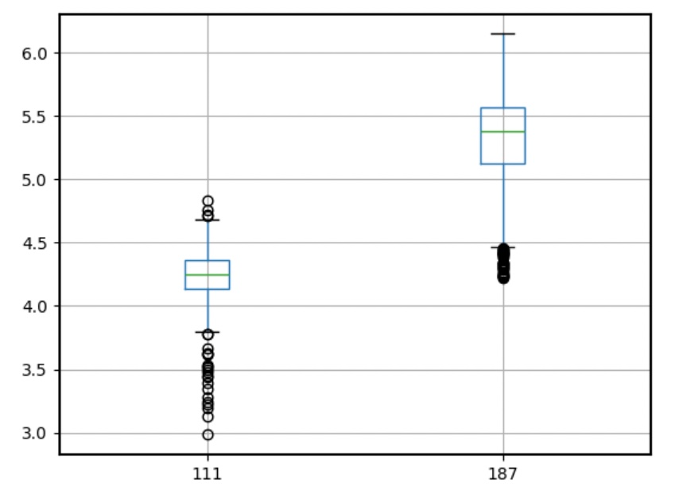

## Comparison of the mimic and the authentic PTM

The structural and dynamic comparison of the phosphoserine model (authentically phosphorylated) and the aspartic acid mimic model at position 111 reveals important differences that suggest the mimic variant does not fully replicate the functional consequences of the phosphorylation modification. Although both modifications introduce a negative charge at position 111, the structural and functional implications are distinct.

12. Aligned model of the mimic variant and the PTM modified model.
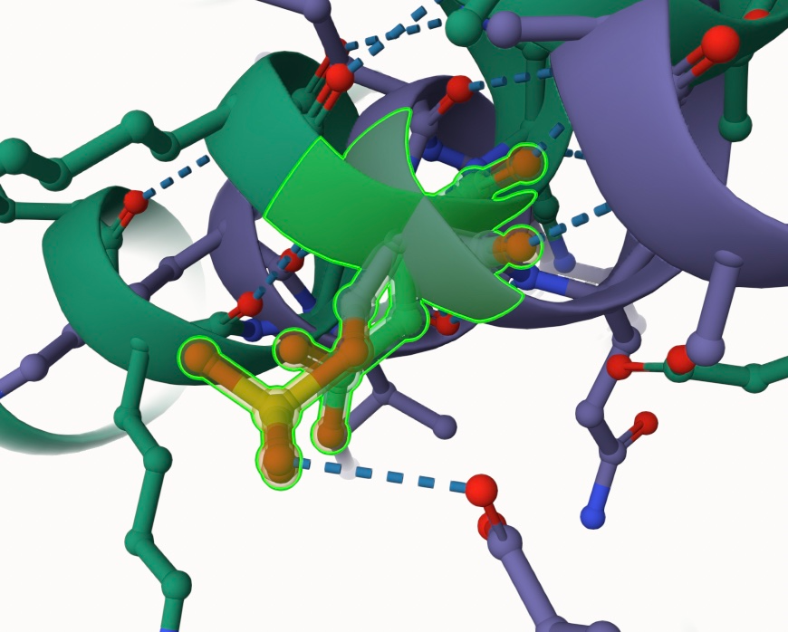

In the phosphoserine model, the phosphate group at position 111 facilitates hydrogen bonds with glutamic acid 74 and introduces a new interaction with isoleucine 108. These additional interactions help stabilize the enzyme’s active site and may increase its substrate specificity and overall catalytic efficiency. The phosphorylated enzyme benefits from these stabilizing effects, which likely play a role in fine-tuning the enzyme’s activity in response to cellular needs.

In contrast, the mimic variant, where serine is replaced by aspartic acid, shows a different pattern of interactions. The aspartic acid at position 111 loses the ability to form the hydrogen bond with glutamic acid 74, which could disrupt the enzyme’s stability and substrate binding. Instead of the phosphate group, the carboxyl group in aspartic acid introduces a negative charge, but the charge distribution is different from that of the phosphate group, potentially leading to less stability in the enzyme’s active site. As a result, the mimic variant may have decreased enzyme activity compared to the phosphorylated form due to these altered interactions.

Further evidence of this structural instability is seen in the RMSF plots, where the mimic variant shows flexibility around position 111. The greater movement observed in the mimic variant suggests a less stable enzyme, which could affect substrate binding and catalytic efficiency.

Additionally, the phosphoserine modification likely alters the pKa of nearby residues, particularly histidine 187, which plays a role in substrate binding and catalysis. The phosphate group may shift the protonation state of histidine, optimizing it for catalytic activity. The aspartic acid mimic, however, introduces a different charge at position 111, which could affect the local environment of histidine 187 in a way that destabilizes the active site or reduces the enzyme's ability to bind its substrate effectively.

Given these differences in hydrogen bond formation, structural stability, and electrostatic properties, it is unlikely that the aspartic acid mimic fully replicates the functional consequences of serine phosphorylation. The phosphorylation model provides a more accurate approximation of the regulatory effects of the PTM, with the phosphate group offering more precise control over the enzyme’s activity and substrate specificity. The mimic variant introduces a negative charge, but its structural flexibility and the altered charge distribution suggest it may have a reduced ability to stabilize the active site or regulate enzyme function, making it a less accurate representation of phosphorylation at position 111.

The phosphorylation of serine 111 or its mimic variant (serine-to-aspartic acid substitution) in human malate dehydrogenase (hMDH1) would disrupt key metabolic pathways, particularly the TCA cycle and the malate-aspartate shuttle, primarily affecting mitochondria, where these processes occur. The modifications could reduce enzyme activity, impair cellular energy production, and alter redox balance by affecting NAD+/NADH ratios. This would most significantly impact energy-demanding tissues such as muscle cells, neurons, and liver cells, which rely heavily on efficient ATP generation. Additionally, the altered function of hMDH1 could impair electron transfer into the mitochondria, further compromising oxidative phosphorylation. The disruption of these pathways could lead to shifts in amino acid metabolism, cellular stress, and impaired biosynthetic processes, ultimately affecting overall cellular and organ steady-state. In the source organism, such modifications could cause reduced metabolic efficiency, leading to diminished cellular function, particularly under conditions of high metabolic demand, such as exercise or neuronal activity. This could result in organ dysfunction, especially in tissues with high ATP turnover, and potentially contribute to metabolic disorders over time.

## Authors

Carolina Moscote

## Deposition Date

## License

Shield: [![CC BY-NC 4.0][cc-by-nc-shield]][cc-by-nc]

This work is licensed under a
[Creative Commons Attribution-NonCommercial 4.0 International License][cc-by-nc].

[![CC BY-NC 4.0][cc-by-nc-image]][cc-by-nc]

[cc-by-nc]: https://creativecommons.org/licenses/by-nc/4.0/
[cc-by-nc-image]: https://licensebuttons.net/l/by-nc/4.0/88x31.png
[cc-by-nc-shield]: https://img.shields.io/badge/License-CC%20BY--NC%204.0-lightgrey.svg

## References

* Schmitt, Olivia J., "Proline to Serine Mutation in the Active Site Loop of Malate Dehydrogenase Alters Substrate Specificity" (2022). Chemistry & Biochemistry Student Scholarship. 13. https://digitalcommons.providence.edu/chemistry_students/13 
