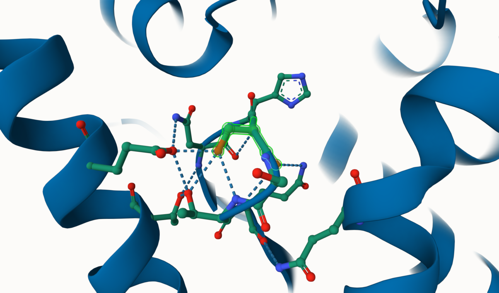
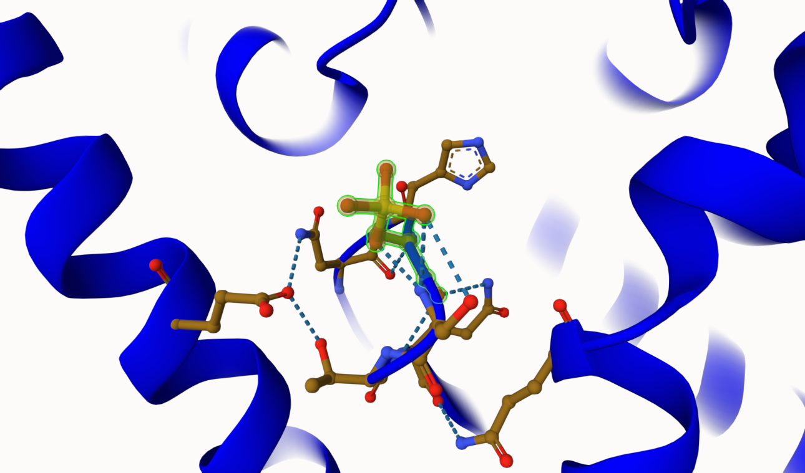
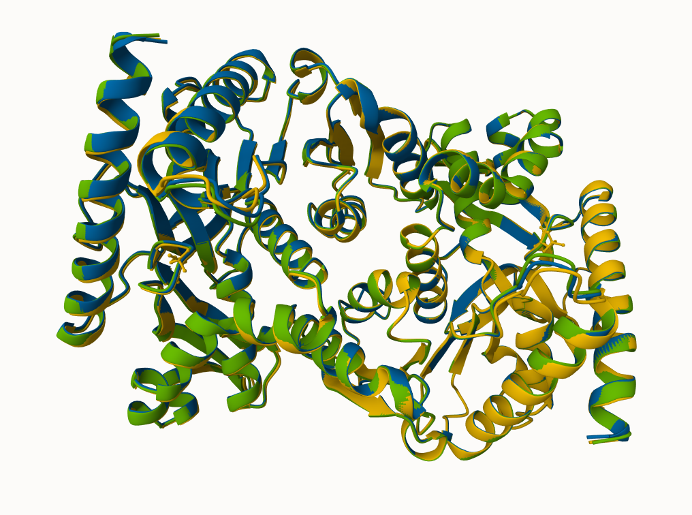
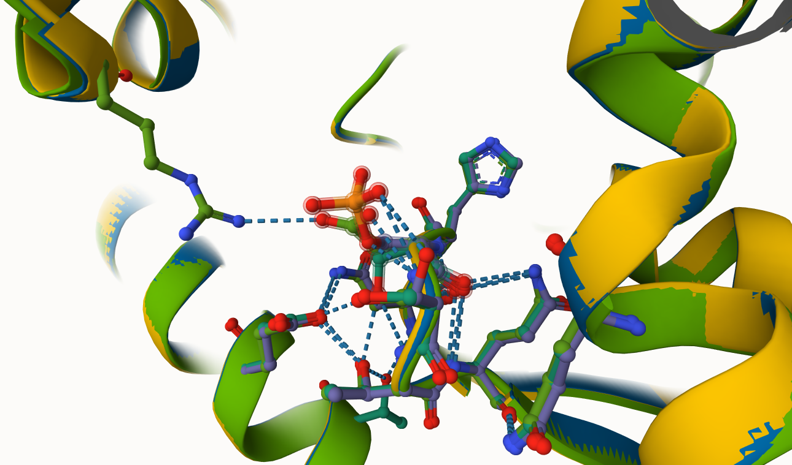
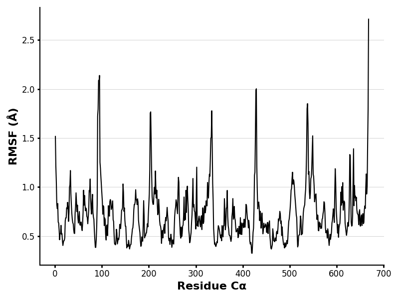
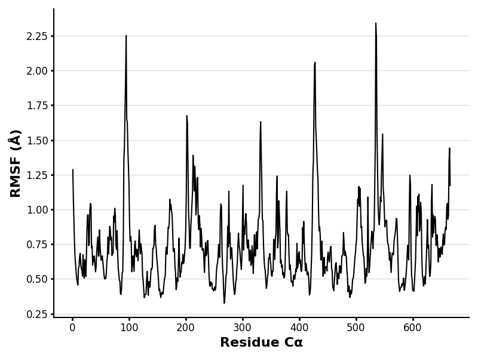
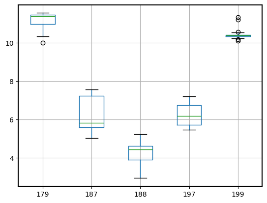
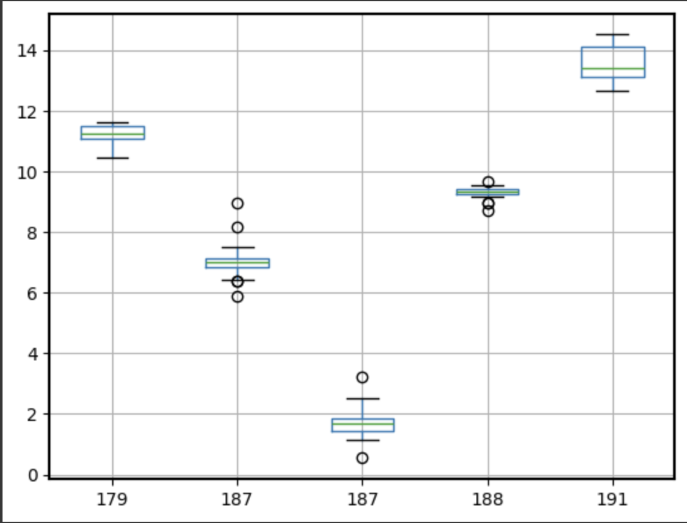

# Homo sapian Malate Dehydrogenase 1 (MDH1)
# P40925
# Phosphorylation of S188

## Description

Serine 188 (S188) in malate dehydrogenase 1 (MDH1) is located in a loop region between two alpha helices, near the enzyme's active site. This loop is flexible and plays an important role in substrate binding and overall enzyme stability. S188’s side chain forms hydrogen bonds with nearby residues such as THR190 and GLU319, which stabilize the loop and help orient the substrate in the catalytic pocket. S188 is about 5-7 angstroms from the active site and directly influences substrate alignment. It is positioned near the outer edge of the dimer interface, which suggests that it may play an indirect role in dimer stability. The loop containing S188 borders the malate/NADH binding pocket, which is critical for the catalytic reaction. The unmodified S188 contributes to loop stability and substrate positioning through its hydrogen-bonding interactions. The D188 variant introduces a negative charge, leading to potential electrostatic interactions with nearby positively charged residues, disruption of loop dynamics, and loss of hydrogen bonds. This modification can result in misalignment of the substrate in the active site. Phosphorylation of S188 adds steric bulk and a negative charge. The phosphorylated residue can form new hydrogen bonds with THR190 and solvent molecules, which may stabilize an alternate loop conformation. However, this stabilization may hinder substrate access to the active site, potentially impacting catalytic efficiency. 

Image of the unmodified site

Image of modification site

## Effect of the sequence variant and PTM on MDH dynamics

MDH1 catalyzes the reversible oxidation of malate to oxaloacetate. S188, through its stabilizing interactions with neighboring residues, ensures proper alignment of the substrate and coenzyme within the active site. Its role in maintaining loop stability is crucial for efficient catalysis. In the mimic, the substitution of serine with aspartate introduces a negative charge, disrupting local hydrogen-bonding networks and loop dynamics. This can misalign the substrate or coenzyme, leading to reduced catalytic efficiency. The loss of serine’s hydrogen-bonding ability destabilizes the active site environment even more. Phosphorylation of S188 adds a bulky, negatively charged phosphate group. This modification may stabilize the loop through new hydrogen bonds with nearby residues like THR190. However, the added steric hindrance could reduce access to the active site, which would end up lowering substrate turnover and catalytic efficiency. 
Both the mimic and S188 phosphorylation could propagate allosteric effects throughout the enzyme. These changes may change binding kinetics for NADH or malate by shifting the enzyme’s conformational dynamics. These modifications can significantly impact cellular metabolism, considering the fact that MDH1 has an important role in the TCA cycle. 

Image of the alignment of MDH1 (blue), MDH1 with phspho S188 (green), and S188D (yellow)

Image of the modification site alignment within MDH1 

A potential Consequence of disrupted MDH1 Function is impaired Cellular Respiration. Mitochondrial energy transduction pathways can be mediated by NAD+ (Walker et al,. 2018). Reduced catalytic efficiency could limit NADH availability, in turn impairing mitochondrial ATP production. If the catalytic efficiency decreases that results from this occurs, the ability to regenerate NADH in the mitochondria may decrease as well. Another consequence is metabolic imbalances. Reduced MDH1 activity could impair gluconeogenesis and TCA cycle flux, causing broader metabolic dysregulation.  

RMSF plot showing differences between the simulations

These RMSF (Root Mean Square Fluctuation) graphs show the different flexibilities of the amino acids. The higher RMSF values correlate with having more flexibility. The RMSF graphs reveal a large increase in flexibility around positions 98, 340, 430, and 540 in both the mimic and PTM modified versions of MDH1. This shows that there may be significant loop destabilization, which is important for the proper function of the enzyme. Key substrate-binding residues, such as Arg 98, which are located near S188, show higher fluctuations as a result of the destabilized loop. Increased dynamic motion in these residues can disrupt interactions with the substrate or coenzyme, reducing binding efficiency and catalytic effectiveness. This effect is especially seen in the phosphorylated form, where the addition of a negatively charged phosphate group introduces steric hindrance and alters local hydrogen-bonding networks. The destabilization not only affects substrate orientation but could also have downstream effects on the enzyme's interaction with the NADH coenzyme and the overall catalytic cycle. 

## Comparison of the mimic and the authentic PTM

Plots of pKa for the key amino acids

Overall, the pKa values when comparing the mimic and PTM models are fairly similar and can be considered to be closely aligned. They show minimal variation and have a lot of overlap between both of their structures. The main difference in pKa value is specifically at position 188, which is to be expected as one is phosphorylated. Along with that, the simulation behavior and structure showed no major differences. The minor difference is the pKa change at residue 188 in the PTM model. The higher pKa in the PTM model suggests that the phosphate group can hold a partial protonation longer, which leads to a reduced net negative charge. This also lets it form more stabilizing hydrogen bonds. The RMSF values for both the PTM model and the mimic variant are about the same, which indicates that they have about the same flexibility and loop stability. The places of fluctuation also seem to be at the same corresponding residues, which is shown in the RMSF graphs. The overall functions of the two models are shown to be very similar to one another. There are several minor differences between them, however they largely stay consistent with each other. The several consistencies between the two models help to prove that the mimic is a good resemblance of the PTM model. 

## Authors

Andrew D. Smalls Jr.

## Deposition Date
12/06/2024

## License

Shield: [![CC BY-NC 4.0][cc-by-nc-shield]][cc-by-nc]

This work is licensed under a
[Creative Commons Attribution-NonCommercial 4.0 International License][cc-by-nc].

[![CC BY-NC 4.0][cc-by-nc-image]][cc-by-nc]

[cc-by-nc]: https://creativecommons.org/licenses/by-nc/4.0/
[cc-by-nc-image]: https://licensebuttons.net/l/by-nc/4.0/88x31.png
[cc-by-nc-shield]: https://img.shields.io/badge/License-CC%20BY--NC%204.0-lightgrey.svg

## References

* Citation1 UniProt. Uniprot.org. https://www.uniprot.org/uniprotkb/P40925/entry#structure (accessed 2024-12-04). (https://www.uniprot.org/uniprotkb/P40925/entry)
* Citation2 [10.1016/j.cophys.2018.03.011](Walker, M. A.; Tian, R. NAD(H) in Mitochondrial Energy Transduction: Implications for Health and Disease. Current Opinion in Physiology 2018, 3, 101–109.https://pmc.ncbi.nlm.nih.gov/articles/PMC7112453/)
