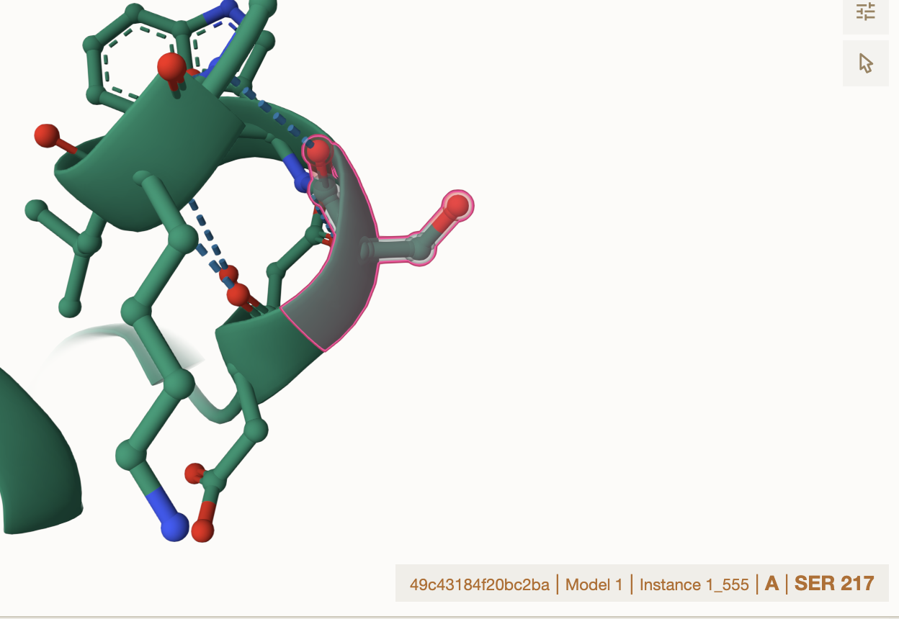
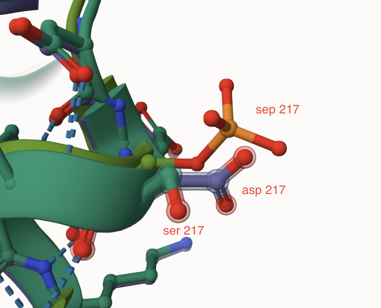
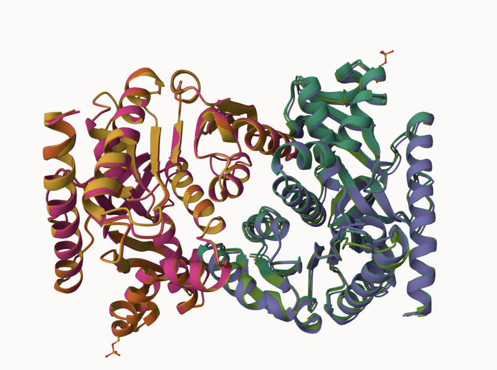
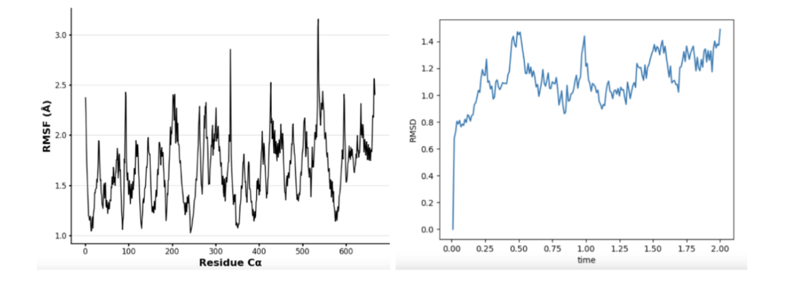
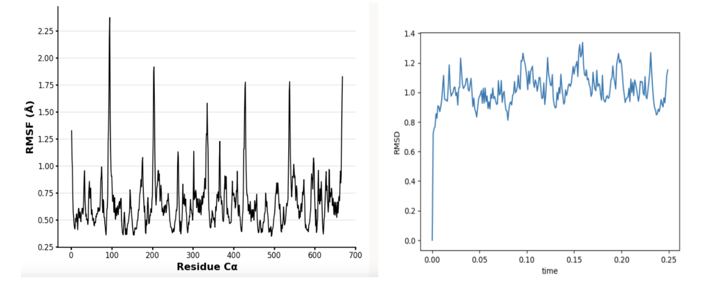
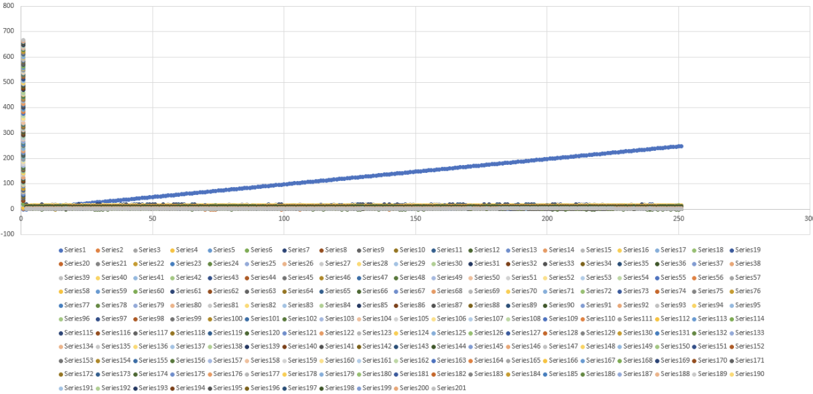

# human MDH1
# P40925
# PTM phosphoserine and variant aspartic acid

## Description

The modification site, amino acid 217, in human malate dehydrogenase 1, has been researched and described before. In human MDH1, the amino acid at 217 is normally serine. In a particular example from UniProt, the serine at amino acid placement 217 was changed to an isoleucine.

1. image of the unmodified site

2. image of modification site

## Effect of the sequence variant and PTM on MDH dynamics

Part 3 from the Project 4 report

1. Image of aligned PDB files (no solvent)

2. Image of the site with the aligned PDB files (no solvent)

3. Annotated RMSF plot showing differences between the simulations

4. Annotated plots of pKa for the key amino acids

5. If needed, show ligand bound images and how modification affects substrate binding

Description of the data and changes

## Authors

Natalie Sandridge

## Deposition Date 
12/06/2024

## License

Shield: [![CC BY-NC 4.0][cc-by-nc-shield]][cc-by-nc]

This work is licensed under a
[Creative Commons Attribution-NonCommercial 4.0 International License][cc-by-nc].

[![CC BY-NC 4.0][cc-by-nc-image]][cc-by-nc]

[cc-by-nc]: https://creativecommons.org/licenses/by-nc/4.0/
[cc-by-nc-image]: https://licensebuttons.net/l/by-nc/4.0/88x31.png
[cc-by-nc-shield]: https://img.shields.io/badge/License-CC%20BY--NC%204.0-lightgrey.svg

## References
* Bank, R. P. D. RCSB PDB - SEP Ligand Summary Page. https://www.rcsb.org/ligand/SEP (accessed 2024-11-23). 
* EMBL-EBI ProtVar - Contextualising human missense variation. https://www.ebi.ac.uk/ProtVar/query?search=P40925+S217I&annotation=structural-row-1 (accessed 2024-11-23). 
* RMSD/RMSF Analysis | BioChemCoRe 2018. https://ctlee.github.io/BioChemCoRe-2018/rmsd-rmsf/  (accessed 2024-12-04).

* Olsen, J. V.; Blagoev, B.; Gnad, F.; Macek, B.; Kumar, C.; Mortensen, P.; Mann, M. Global, In Vivo, and Site-Specific Phosphorylation Dynamics in Signaling Networks. Cell 2006, 127 (3), 635–648. https://doi.org/10.1016/j.cell.2006.09.026. 

* UniProt. https://www.uniprot.org/uniprotkb/P40925/entry (accessed 2024-11-23). 
