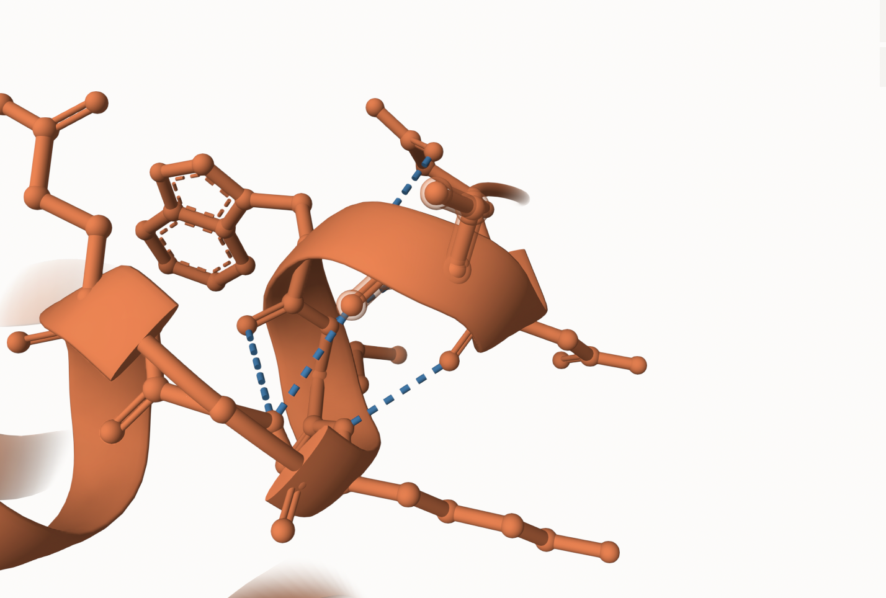
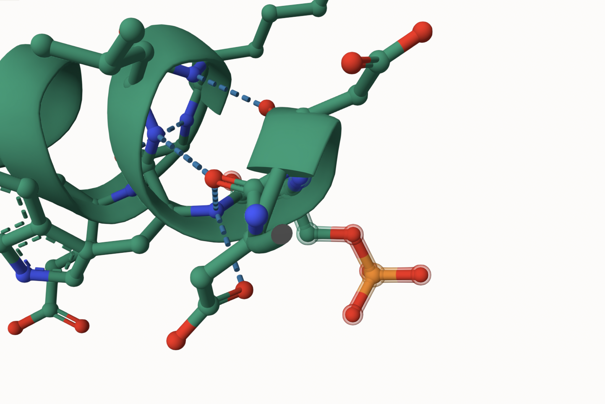
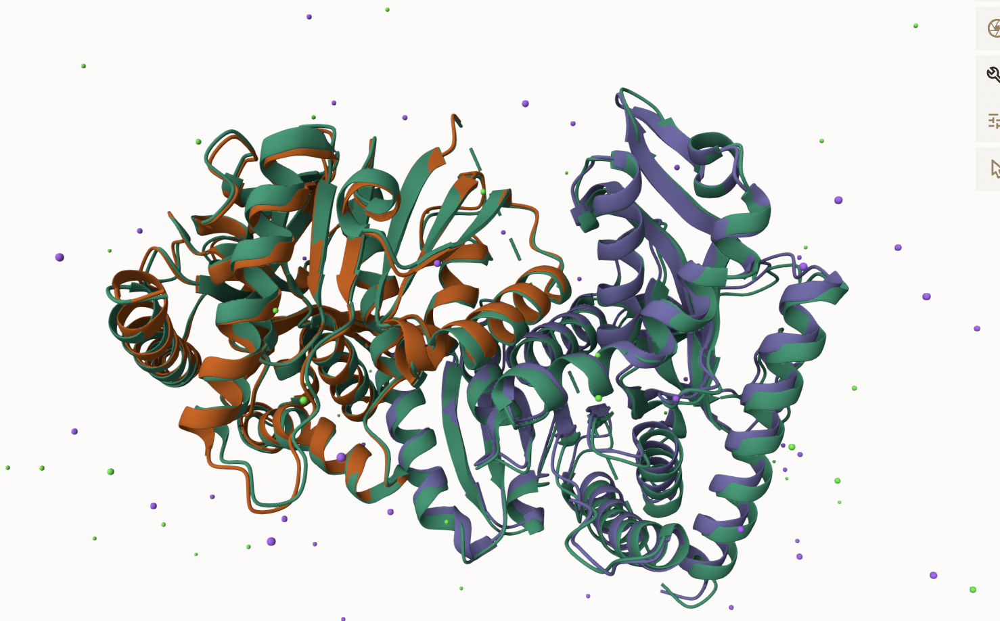
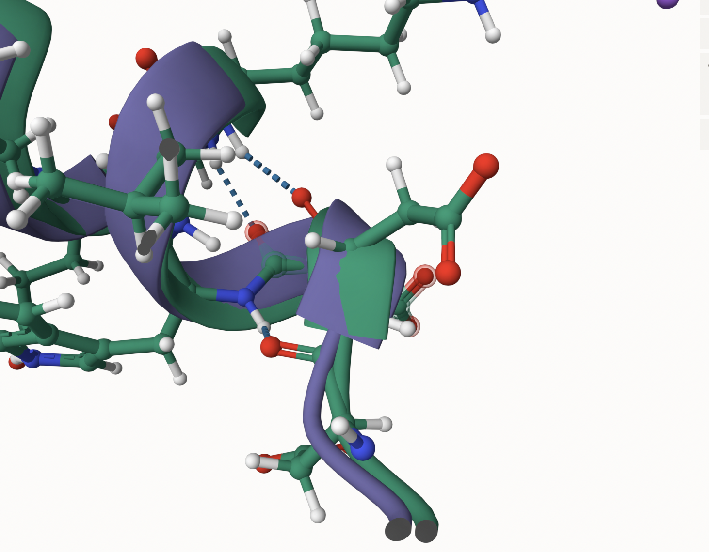
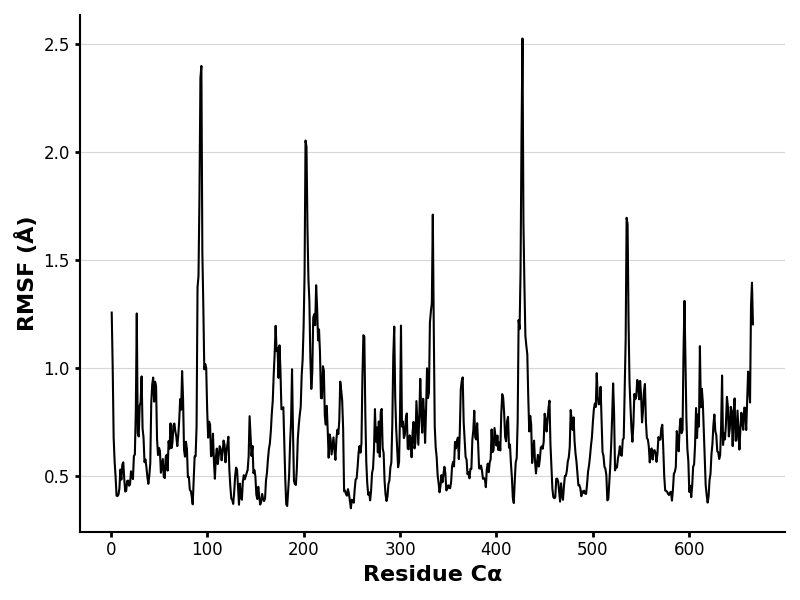
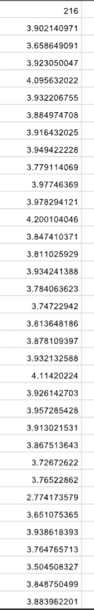
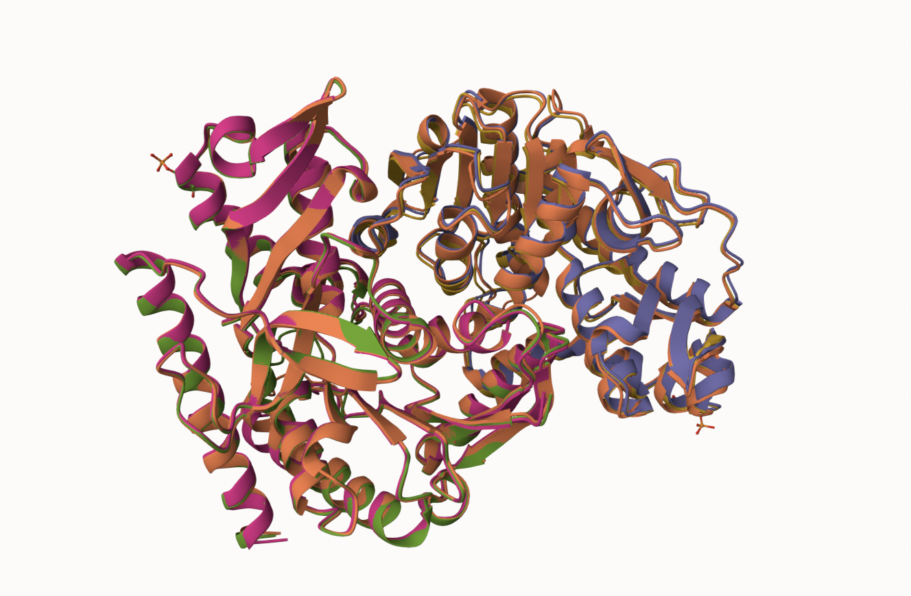
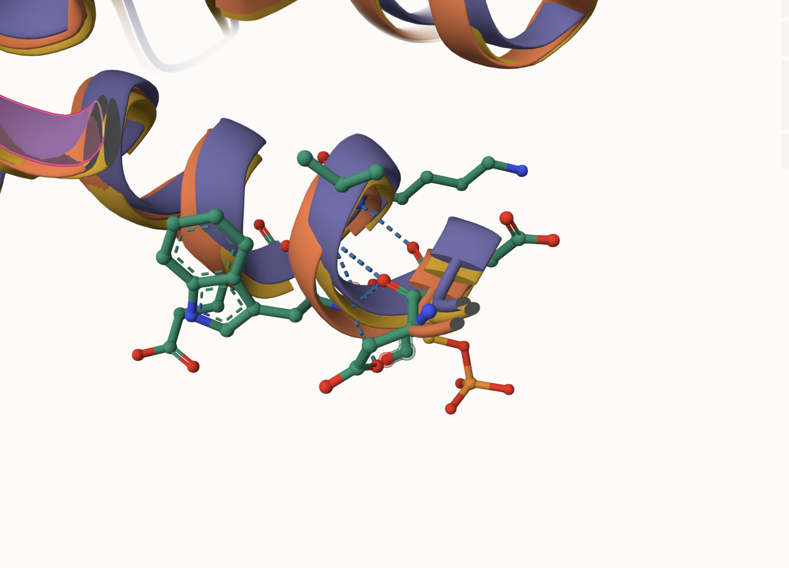

Human Malate Dehydrogenase (MDH) Uniprot ID: P40925

Phosphorylation of S217 Description:

Serine 217 of human MDH is the site of a post-translational modification, phosphorylation. As a result, a phosphate group was added, changing the structure of serine, along with the interactions and function of this enzyme. There is no previous literature on this specific modification site.

1.  image of the unmodified site 
2.  image of modification site 

## Effect of the sequence variant and PTM on MDH dynamics

1.  Image of aligned PDB files (no solvent)

 2. Image of the site with the aligned PDB files (no solvent)

 3. Annotated RMSF plot showing differences between the simulations  4. Annotated plots of pKa for the key amino acids

 5. If needed, show ligand bound images and how modification affects substrate binding

Description of the data and changes:

Images of the modification site with the unmodified, PTM mimic, and modified enzyme superposed are provided. This depicts the specific changes at the modification site. The PDB files produced by the molecular dynamics colab step 1 are also provided, showing structural differences. The RMSF plot and pKa charts were produced in molecular dynamic colab step 2, providing detail on the function of the PTM mimic.

## Comparison of the mimic and the authentic PTM

### Colab notebook links

Copy_of_MD_simulation_Step1v2.ipynb

Copy_of_MDanalysis_Step2.ipynb

## Authors

Caitrin Crawson

## Deposition Date

5/1/25

## License

Shield: [![CC BY-NC 4.0][cc-by-nc-shield]][cc-by-nc] This work is licensed under a [Creative Commons Attribution-NonCommercial 4.0 International License][cc-by-nc].

[![CC BY-NC 4.0][cc-by-nc-image]][cc-by-nc] [cc-by-nc]: <https://creativecommons.org/licenses/by-nc/4.0/> [cc-by-nc-image]: <https://licensebuttons.net/l/by-nc/4.0/88x31.png> [cc-by-nc-shield]: <https://img.shields.io/badge/License-CC%20BY--NC%204.0-> lightgrey.svg \## References \* Mol\* Viewer. molstar.org.  \* AlphaFold Server. alphafoldserver.com. \* UniProt. Uniprot.org. ! [Uniprot] (<https://www.uniprot.org/uniprotkb/P40925/entry>.)
