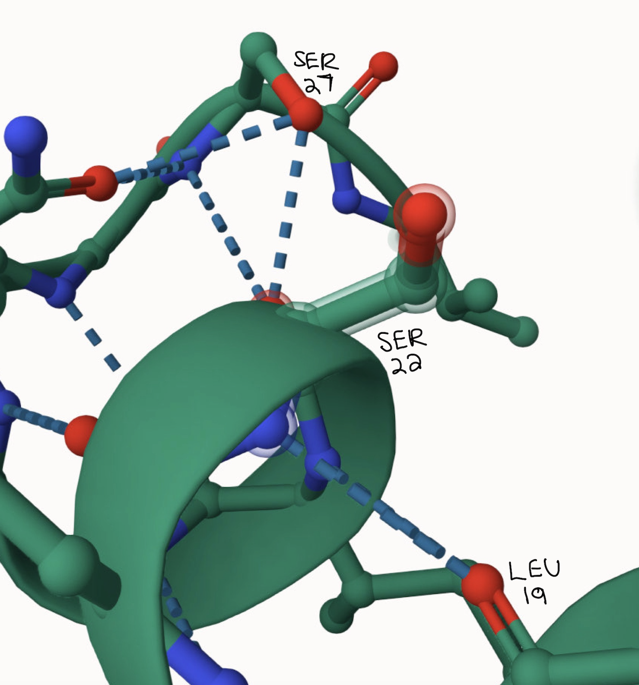
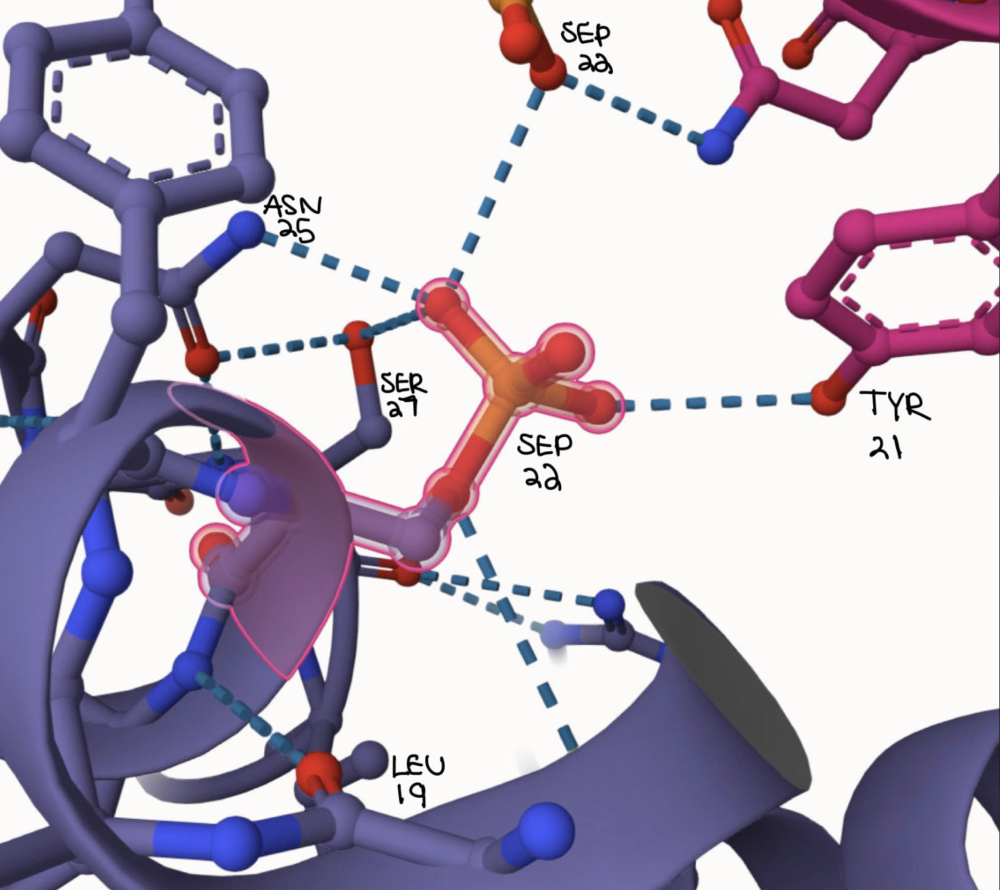
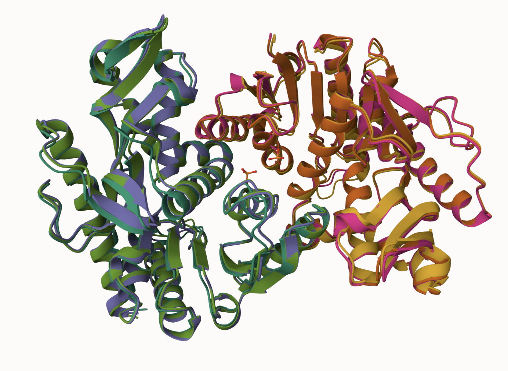
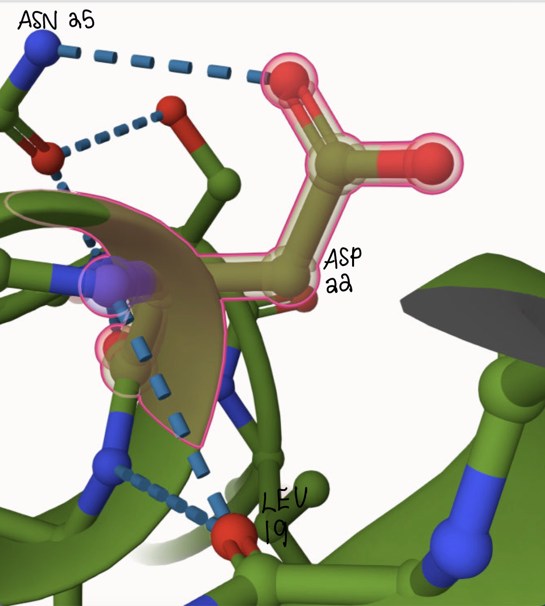
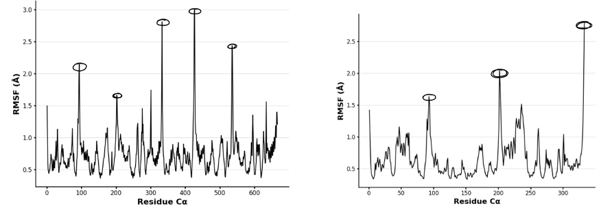
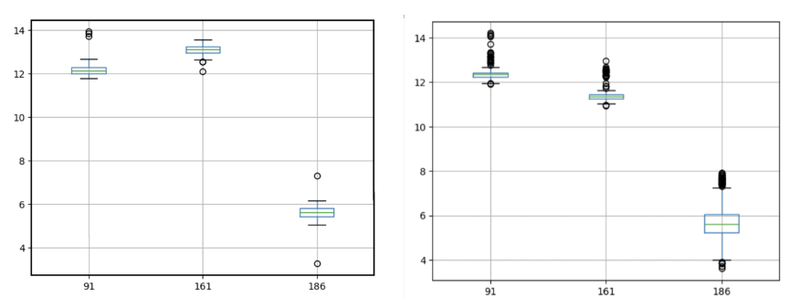
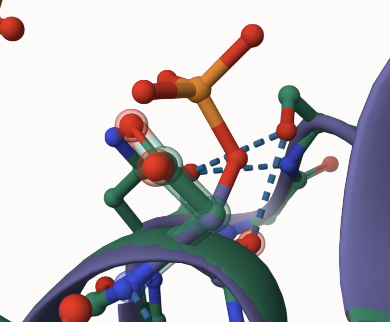

# Human and MDH1
# P40925
# Phosphorylation of Amino Acid 23

## Description

# Malate dehydrogenase or MDH is considered a nucleotide-binding protein, specifically MDH belongs to NAD-dependent dehydrogenases which is the largest family in nucleotide-binding proteins. Malate dehydrogenase catalyzes the NAD+ dependent reduction of L-malate to oxaloacetate. This happens because of the conversion of NAD+ to NADH + H+, in addition to the pro-R hydrogen to NAD+. In Eukaryotes, there is cytosolic MDH as well as isozymes that are specifically transported to the organelles, mitochondria, chloroplasts, peroxisomes, and glyoximes (1). There are specific functions of two of these isoforms in Eukaryotes, one is in the mitochondria while the other is in the cytosol. For the isoform present in the mitochondria, this is specifically involved in the citric acid cycle, or the TCA cycle, which has the important function of making ATP which is the main energy for the cell. The second isoform present in the cytosol is involved in the malate/aspartate shuttle, the process of taking the NADH produced during glycolysis and putting them into the mitochondrial matrix where they can be used for oxidative phosphorylation (3). The size of MDH varies among organisms but it is around 36 kDa and functions as a dimer most commonly (1). MDH is regulated by a variety of factors including substrate and specific product concentrations, this regulation is important for maintaining metabolic balance and preserving cellular health so that MDH can participate in the processes mentioned above. The PTM that was assigned and analyzed was a phosphorylation at amino acid position 23. 

1. image of the unmodified site

2. image of modification site

## Effect of the sequence variant and PTM on MDH dynamics

The modifications were modeled using Alphafold3. Since the modification was occurring at amino acid Serine 23 that was the amino acid that was selected and then phosphorylated for the modification sequence and the Serine at 23 was changed into a D for the mimic sequence. All three sequences were downloaded and uploaded into Mol*. The sequences were superimposed and then compared. From the comparison of the three different sequences in mol*, it was clear that they are very similar. The RMSD value between the mimic and modification sequence was 0.75, the value for the unmodified sequence and the modified sequence was 0.32 and the value for the unmodified and the mimic was 0.69. Lastly, all three of these structures superimposed in mol* have an RMSD value of 0.36. All these values are below 1, which would classify these sequences as having high structural similarity. Overall, the modeling showed there was no significant difference between the mimic, PTM modified, and unmodified structure. 

1. Image of aligned PDB files (no solvent)

2. Image of the site with the aligned PDB files (no solvent)

3. Annotated RMSF plot showing differences between the simulations

An RMSF comparison was done on the structure of this mimic sequence and unmodified sequence of MDH1, showing which parts of the protein move the most during simulations. Between the two plots, the 333rd residue is the highest and has an RMSF value of 2.81, this residue represents a terminus, so it is expected to be more flexible. These specific, peak residues between the sequences are areas that are flexible and most likely helping the protein to interact with other molecules as well as change shape for function. These results from both RMSF plots are expected as they align with the loop regions seen on mol*. Overall, the comparisons of the mimic and unmodified sequence through the RMSF plots show similarities in flexibility and movement.

4. Annotated plots of pKa for the key amino acids

In a further analyzation, the active site of His 186 was compared between the modified sequence (left) and unmodified sequence (right) using the simulation. At His 186, in the mimic sequence since the pKa values are lower, this would indicate that His 186 is able to dissociate protons more easily than in the unmodified active site (1). Overall, these pKa ranges are relatively close, that they are not significantly changing the active site, there is just a slightly better dissociation of protons occurring at the active site of the mimic sequence.

5. If needed, show ligand bound images and how modification affects substrate binding

## Comparison of the mimic and the authentic PTM

Part 4 from the Project 4 report outline
include images as needed

When comparing the PTM modified (orange) and the mimic (green) structures, the RMSD value was 0.75Å, this value indicates that these two structures are similar, as any value below 3Å is considered a “success” when comparing two sequences (6). There are no significant structural differences between the two models, so it can be concluded that the mimic variant is a good approximation of the PTM phosphorylation. 

### Colab notebook links

Provide file names of completed colab notebooks

###colab_1.ipynb
###colab_2.ipynb

## Authors

Contributors names

Mather Williamson 

## Deposition Date

## License

Shield: [![CC BY-NC 4.0][cc-by-nc-shield]][cc-by-nc]

This work is licensed under a
[Creative Commons Attribution-NonCommercial 4.0 International License][cc-by-nc].

[![CC BY-NC 4.0][cc-by-nc-image]][cc-by-nc]

[cc-by-nc]: https://creativecommons.org/licenses/by-nc/4.0/
[cc-by-nc-image]: https://licensebuttons.net/l/by-nc/4.0/88x31.png
[cc-by-nc-shield]: https://img.shields.io/badge/License-CC%20BY--NC%204.0-lightgrey.svg

## References

* Citation1 

* Citation2 

* Citation3 

* Citation4  

* Citation5 00019-4.) 

* Citation6 
