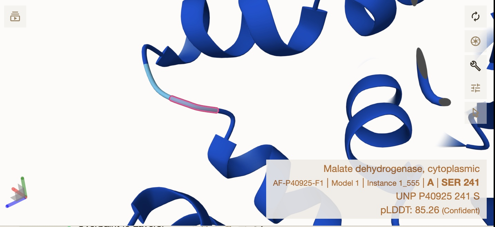
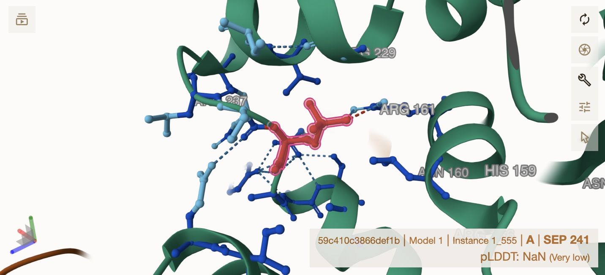
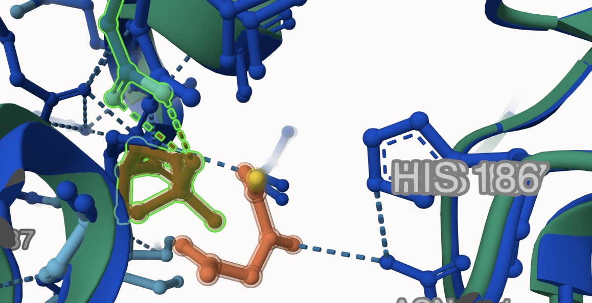
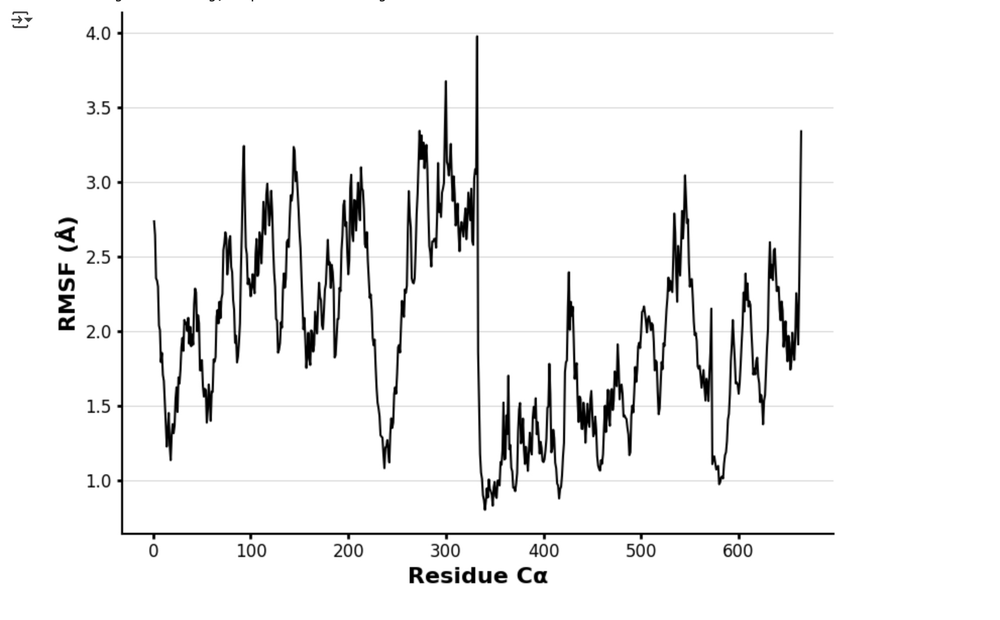
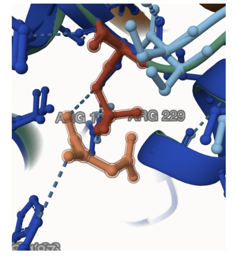

# Human MDH

# Uniprot ID: P40925

# Variation: phosphorylation of S241 (pS241 in structure)

## Description

Serine 241 of human MDH1 was identified to be a residue involved in
NAD+/NADH binding by [Kuhn and coworkers]
(<https://doi.org/10.1042/EBC20230080>) in 2024. It is also close to the
dimerization location where it interacts with the stabilizing amino
acids for the quaternary structure \# Part 1 from Project 4 report
outline (with citations as appropriate)

1.  Image of the unmodified site 

2.  Image of modification site 

3.  Alignment of MDH1 (lime green), MDH1 with pS241 (red), and
    S241D(Pink), 

4.  The modification site is near Arg161 and OAA and may make ionic or
    hydrogen bonding interactions with both of those side chains when
    modified
    

## Effect of the sequence variant and PTM on MDH dynamics

Part 3 from the Project 4 report

The RMSD of the final frame from MD simulations of MDH1 and MDHS241D was
0.44 Å. The unmodified MDH1 is shown in pink and blue, while the
modified form is shown in orange and green. 

After simulation, the overall protein structures are similar, as well as
the area surrounding the modification sites.

3.  After simulation, the dynamics as described by the root mean square
    fluctuation (RMSF) value were compared. This RMSF plot shows that
    residues around positions 300–400 are the most stable, indicating a
    likely structured core, while the N- and C-terminal regions and
    several loops exhibit higher flexibility. Peaks above 2.5 Å suggest
    dynamic regions, possibly involved in interactions or conformational
    changes.

### Effect of modification on the pKa values

Overall, both show relatively stable pKa values around 6, but the
wild-type displays more fluctuation and outliers, suggesting that the
S241D mutation may stabilize the local environment around His186. 

## Comparison of the mimic and the authentic PTM

The RMSD between the S241D mimic and the phosphoS241 hMDH1 was 0.44 Å,
indicating high structural similarity. Both structures align closely
overall, with no major deviations, though slight differences near the
OAA binding site suggest the mimic may not fully replicate the weak
interactions formed by the authentic phosphate group.

## Authors

Aubrey Duelm

## Deposition Date

05/07/2025

## License

Shield: 

This work is licensed under a [Creative Commons
Attribution-NonCommercial 4.0 International
License](https://creativecommons.org/licenses/by-nc/4.0/).

## References

Kuhn, Misty L., et al. “Acetylation, ADP-Ribosylation and Methylation of
Malate.” Essays in Biochemistry, vol. 68, no. 2, Oct. 2024, pp. 199–212.
PubMed Central, <https://doi.org/10.1042/EBC20230080>.
