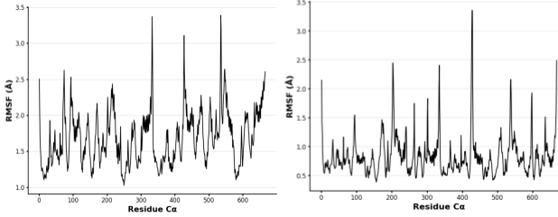

# Human MDH1

# Uniprot number: P40925

# Variation: S245D

## Description

The variant assigned was S245D in MDH1. Based on Uniprot, the modification of amino acid 245 in MDH1 has not been previously researched. Two differently altered structures of MDH1 position 245 were generated by either amino acid substitution or post-translational modification (PTM). The PTM structure displays MDH1 where phosphorylation of Ser245 creates a phosphorylated Serine displayed as SEP in mol\*. The Mimic structure is created by substituting Serine (S) for Aspartic acid (D) at position 245.

1.  image of the unmodified site 

2.  image of modification site 

3.  image of variant site 

## Effect of the sequence variant and PTM on MDH dynamics

Part 3 from the Project 4 report

1.  Image of aligned PDB files (no solvent)  Variant (orange), PTM (blue), and Unmodified (green) models superposed

2.  Image of the site with the aligned PDB files (no solvent)  Position 245 of Variant (orange), PTM (blue), and Unmodified (green) models superposed

3.  Annotated RMSF plot showing differences between the simulations  Flexibility changes are most noticeable around residues 80, 300, and 400?regions distant from Arg162, where the mimic?s shorter Asp245 side chain reduces interaction likelihood. This may explain less flexibility near the active site, including His187 and Arg162. Compared to the original structure, the mimic shows smaller RMSF spikes, indicating increased rigidity and decreased efficiency in substrate binding.

4.  Annotated plots of pKa for the key amino acids  The Scatter plot comparing pKa values of the original and mimic MDH1 active sites over 100 seconds shows the original maintains a stable pKa (6?8), supporting efficient proton transfer during catalysis. The mimic shows a lower, unstable pKa, indicating a deprotonated and less stable active site, likely impairing oxaloacetate binding and conversion

5.  If needed, show ligand bound images and how modification affects substrate binding 

Displays SEP245 interacting with Arg162, a residue critical for stabilizing oxaloacetate binding at the active site (His187). The new ionic interaction may either disrupt or enhance Arg162?s role in substrate binding

## Comparison of the mimic and the authentic PTM

1.  image of modification and PTM site aligned ! [Mimic (orange) superposed with PTM (blue) at amino acid 245. RMSD: 0.22.](images/mimicandmodified_compare.png) The RMSD value supports the minimal variation between both structures. The mimic further supports a good approximation of the PTM based on the same weak interactions displayed in mol\* apart from 1 additional weak interaction with Asp59. This would likely further increase instability in catalytic conversion based on the opposition of both negatively charged side chains.]

## Authors

Addison Irvin

## Deposition Date

5/7/2025

## License

Shield: 

This work is licensed under a [Creative Commons Attribution-NonCommercial 4.0 International License](https://creativecommons.org/licenses/by-nc/4.0/).

## References

-   [AlphaFold Protein Structure Database. (2022). Malate dehydrogenase, cytoplasmic (P40925)](https://alphafold.ebi.ac.uk/entry/P40925)

-   [Andrew, C. D., Warwicker, J., Jones, G. R., & Doig, A. J. (2002). Effect of phosphorylation on alpha-helix stability as a function of position. Biochemistry, 41(6), 1897?1905.](https://doi.org/10.1021/bi0113216)

-   [Bisong, E. (2019). Google Colaboratory. In Building machine learning and deep learning models on Google Cloud Platform (pp. 59?64). Apress.] (<https://doi.org/10.1007/978-1-4842-4470-8_7>)

-   [Guo, X., Park, J. E., Gallart-Palau, X., & Sze, S. K. (2020). Oxidative Damage to the TCA Cycle Enzyme MDH1 Dysregulates Bioenergetic Enzymatic Activity in the Aged Murine Brain. Journal of proteome research, 19(4), 1706?1717.](https://doi.org/10.1021/acs.jproteome.9b00861)

-   [McCue, W. M., & Finzel, B. C. (2021). Structural Characterization of the Human Cytosolic Malate Dehydrogenase I. ACS omega, 7(1), 207?214.](https://doi.org/10.1021/acsomega.1c04385)

-   [National Center for Biotechnology Information (2025). PubChem Pathway Summary for Pathway MALATE-ASPARTATE-SHUTTLE-PWY, malate-aspartate shuttle, Source: BioCyc.](https://pubchem.ncbi.nlm.nih.gov/pathway/BioCyc:HUMAN_MALATE-ASPARTATE-SHUTTLE-PWY.)

-   [Sehnal, D., Bittrich, S., Deshpande, M., Svobodov?, R., Berka, K., Bazgier, V., Velankar, S., Burley, S. K., Ko?a, J., & Rose, A. S. (2021). Mol\* Viewer: modern web app for 3D visualization and analysis of large biomolecular structures. Nucleic acids research, 49(W1), W431?W437.](https://doi.org/10.1093/nar/gkab314)

-   [The UniProt Consortium. (2025). UniProt: The universal protein knowledgebase in 2025. Nucleic Acids Research, 53(D1), D609?D617](https://doi.org/10.1093/nar/gkae1010)
