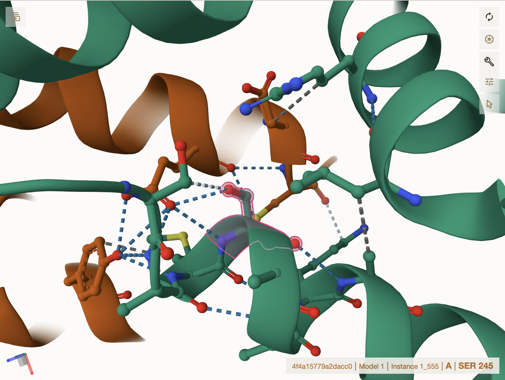
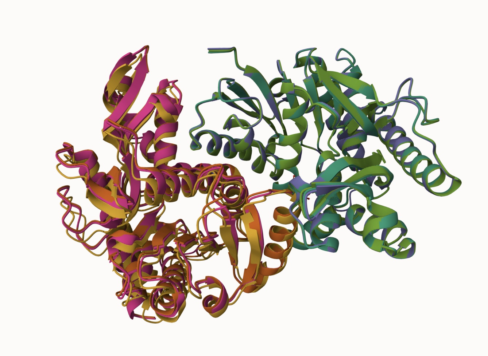
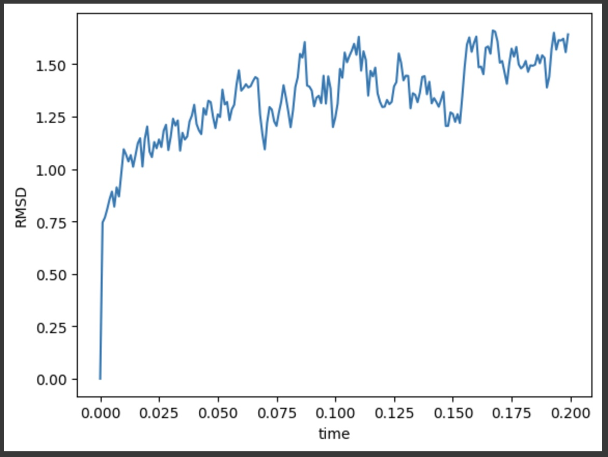

# Human MDH1
# P40925
# pS245

## Description: Human MDH1 protein has been phosphorylated at residue 245 from an S to D

Human malate dehydrogenase 1 (MDH1) is a cytosolic enzyme integral to the malate-aspartate shuttle, which facilitates the transport of NADH across mitochondrial membranes, maintaining cellular redox balance.1 High-throughput proteomics studies have revealed extensive post-translational modifications (PTMs) of MDH1, but their structural and functional impacts remain unclear.2 To address this, residue 245 of MDH1, originally a serine (S 245), was modified to phosphoserine (SEP 245) to mimic phosphorylation, a common PTM.3 Additionally, a mimic variant was created by substituting S 245 with aspartic acid (D 245) to simulate the negative charge introduced by phosphorylation.

1. image of the unmodified site

2. image of modification site

## Effect of the sequence variant and PTM on MDH dynamics

1. Image of aligned PDB files (no solvent)

2. Image of the site with the aligned PDB files (no solvent)

3. Annotated RMSF plot showing differences between the simulations

4. Annotated plots of pKa for the key amino acids

Description of the data and changes:
The RMSF analysis highlighted dynamic changes around key regions of the protein. At residue 245, the PTM mimic (D245) exhibited a slightly higher motion (~1.25–1.5 Å) compared to the unmodified protein (~1.0 Å). This increased flexibility reflects the structural influence of the negatively charged aspartic acid, which adds local dynamic variability to the loop region. However, this motion remained localized and did not propagate to structured elements or functional sites. The active site residues, including His187, exhibited low fluctuations (~0.5 Å) in both the mimic and unmodified protein, ensuring that the catalytic site remained stable. This indicates that the mimic did not affect the structural integrity of critical residues involved in enzymatic function. Similarly, regions with higher RMSF values, such as terminal residues and flexible loops, exhibited comparable flexibility in both the mimic and unmodified protein. This consistency across the models suggests that the mimic-induced flexibility did not result in global destabilization.Additionally, pKa predictions for active site residues showed remarkable consistency between the two models, although there were two spikes around 40 and 50 for the mimic. His187 maintained a pKa range of 5.0–6.5, crucial for its role in proton transfer during catalysis. Asp159, Asn131, and Asn134 also displayed stable pKa values and hydrogen-bonding behavior, confirming that the mimic preserved the active site's electrostatic properties and catalytic potential.

## Comparison of the mimic and the authentic PTM

The PTM mimic (D 245) approximates the structural and functional effects of the PTM-modified protein (SEP 245), but distinct differences remain, particularly in the interaction network and flexibility of the loop region surrounding residue 245. The phosphorylated residue (SEP 245) forms an extensive interaction network, including three hydrogen bonds with Arg 162, two hydrogen bonds with Asp 59, and two hydrogen bonds with Ser242, along with additional interactions with Glu 56 and Ala 249. These stabilizing interactions are facilitated by the bulky, negatively charged phosphate group, which enhances local stability and electrostatic interactions within the loop region. In comparison, the mimic (D 245) forms fewer interactions, including a hydrogen bond with Arg 162, a hydrophobic contact with Leu 158, and a hydrogen bond with Ala 246. While the mimic retains some key stabilizing interactions, the lack of a phosphate group results in a reduced ability to replicate the expanded bonding network of SEP 245. This is reflected in the RMSF analysis (Figure 4), which shows slightly higher fluctuations (~1.25–1.5 Å) in the mimic’s loop region compared to the PTM-modified protein, where the phosphate group would provide additional stabilization. Despite these differences in local stability, the mimic and PTM-modified models exhibit comparable global stability, as suggested by the mimic’s RMSD values (~1.2–1.6 Å). The PTM-modified protein is also expected to maintain low RMSD values due to the localized nature of the phosphorylation. Importantly, neither model shows significant structural changes or destabilization of structured regions such as the active site or substrate-binding residues. At the active site, centered on His 187, both the mimic and SEP245 maintain consistent interactions. The mimic preserves the electrostatic properties of key residues, including His 187, which exhibited a stable pKa range of 5.0–6.5, critical for proton transfer during catalysis. Other key residues, such as Asp159 and Asn131, also maintain consistent pKa values and interactions, ensuring the functional integrity of the catalytic site.
In terms of functional approximation, the mimic (D 245) captures many of the key features of SEP 245, including global stability, active site integrity, and some local interactions. However, the mimic falls short of fully replicating SEP 245’s enhanced loop stability, which could influence dynamics in regions critical for protein regulation or interaction with other biomolecules. While these differences are unlikely to significantly impair catalytic function, they underscore the limitations of the mimic in replicating the complete effects of phosphorylation. The PTM mimic is a reasonable but imperfect approximation of SEP 245. It preserves the enzyme’s overall structural and functional integrity but lacks the capacity to replicate the full stabilizing effects of the phosphate group. Figures comparing RMSD, RMSF, and interaction networks highlight the mimic’s strengths and limitations, providing insights into its efficacy as a model for studying phosphorylation in MDH1.

## Authors

Ryan Srivastava

## Deposition Date

## License

Shield: [![CC BY-NC 4.0][cc-by-nc-shield]][cc-by-nc]

This work is licensed under a
[Creative Commons Attribution-NonCommercial 4.0 International License][cc-by-nc].

[![CC BY-NC 4.0][cc-by-nc-image]][cc-by-nc]

[cc-by-nc]: https://creativecommons.org/licenses/by-nc/4.0/
[cc-by-nc-image]: https://licensebuttons.net/l/by-nc/4.0/88x31.png
[cc-by-nc-shield]: https://img.shields.io/badge/License-CC%20BY--NC%204.0-lightgrey.svg

## References

* Citation1 

* Citation2 

* Citation 3 ! [DOI] (https://doi.org/10.1016/j.plipres.2005.05.001)
