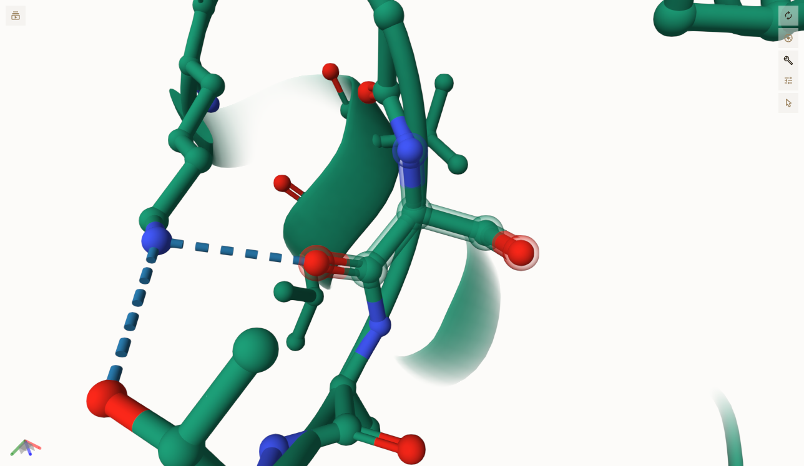

# Homo sapiens MDH2, mitochondrial

# Uniprot: P40926

# Variation: Phosphorylation of S246

## Description

The mitochondrial enzyme malate dehydrogenase 2 (MDH2) is a part of the
citric acid cycle that converts malate to oxaloacetate (OAA) (NIH,
2025). This is important to humans because it is important for cellular
metabolism. The redox balance in the nicotinamide adenine dinucleotide
(NAD+) reaction is maintained by malate dehydrogenases (MDHs). MDH2 can
adapt to any mitochondrial changes due to its flexibility (Peterson et
al., 2024). Within the Protein Data Bank, there are over 100 structures
of MDH of different species. Although MDH has a variety of ligands and
conditions for crystallization, the MDH conformation and configuration
are still similar. The structure of MDH2 makes it a homodimeric protein
that has a Rossmann fold domain. The domain is in charge of the binding
of NAD+ and is also the domain for catalysis. NAD+, OAA, and malate are
important for the regulation of the enzyme’s activity. The functional
and evolutionary significance of MDH2 is highlighted by the high
conservation and localization in the mitochondrial matrix. The functions
of the enzyme mix with redox homeostasis and oxidative phosphorylation
(National Center for Biotechnology Information, 2025). Other than the
role that MDH2 plays in metabolism, it has implications in human
diseases. Cancers were observed to have an overexpression of MDH2, which
impacts metabolic states and chemoresistance. Studies are being done to
inhibit the activity of MDH2 as a therapeutic strategy because of the
role it plays in mitochondrial bioenergetics (Peterson et al., 2024).

# Literature on the phosphorylation of S246

There is literature that supports mammalian MDH function being modulated
by phosphorylation. In a review by Provost et al. (2024), mass
spectrometry was used to find phosphorylation sites that have an overlap
with MDH domain function. This perspective shows how enzyme activity can
be influenced by the modifications (Provost et al., 2024).
Unfortunately, the phosphorylation of serine 246 in human MDH has not
been previously described in any current literature. Analysis of the
modification site shows that S246 can be located within a loop region
next to the active site. The implications that this may have can
influence any catalytic activity and the binding of substrates. The S246
in the unmodified state shows a stabilization of the active site
conformation due to hydrogen bonding networks. The enzyme functions
could potentially be altered, and interactions could be disrupted
because phosphorylation of S246 has the potential to introduce negative
charges. These effects are visualized by using AlphaFold3, which can
produce unmodified, phosphorylated, and variant models of the MDH. All
three models are shown to interact with lysine 241, alanine 247, and
glycine 245.

1.  image of S246 

2.  image of SEP246 

3.  image of D246 

AlphaFold3 was used to model the modifications at S246. Two jobs were
run, one with the modified model and one with the mimic variant. First,
the modified model was made by inputting the entire unmodified MDH
sequence. Then, the phosphorylation at 246 was applied from the PTM tool
by selecting phospho-serine in place of S246. On the other hand, the
mimic variant follows the same steps except replacing the serine (S) at
the 246 position with aspartic acid (D). The job ran two copies to
replicate the dimeric nature of MDH. After the jobs were run, there was
finally data for analysis. AlphaFold3 produced a visual structure and
confidence scores (pLDDT). Using the data provided, analysis can be done
on the orientation of side chains, conformational changes, and weak
interaction disruptions around the 246 position. By using the models
from AlphaFold3 and Boltz-1 and viewing them with Mol\*, analysis can be
done on the binding of nearby amino acids, dimer interfaces, and
secondary structure elements.

1.  image of D246 

2.  image of D246 

## Effect of the sequence variant and PTM on MDH dynamics

A phosphate group gets introduced when serine 246 (S246) is
phosphorylized. This phosphate group, which has a negative charge
attached, can change any nearby electrostatic interactions that occur
and hydrogen bonding. It is shown that in the unmodified system of S246
hydrogen bonding may happen with any nearby amino acids like lysine 241
(K241), alanine 247 (A247), and glycine 245 (G245) which also happens to
affect the stability of the region of the loop. Due to the charge
repulsion that is caused by the phosphate group pushing away K241, this
can cause instability in the interface of the dimer and also cause
nearby altered conformations. The dimeric structure of human MDH2 is
important for catalytic activity to occur (Berndsen, 2024). The
catalytic efficiency and substrate binding can still affect any
structural changes made at the dimer interface even though S246 is not
within the active site. In a similar way, enzyme activity has shown to
be modulated by conformational shifts that were phosphorylation-induced.
For example, the modification has a role in regulation, the function is
influenced by mammalian MDH (Provost et al, 2024). The malate-aspartate
shuttle gives MDH2 an important role to play. Oxidative phosphorylation
happens when the NADH transport is facilitated into the mitochondria.
The shuttle could be impaired if any changes occur in the MDH2 activity
because of phosphorylation at S246. This can lead to ATP production
decreasing and a redox balance disruption. These effects are significant
in high metabolic demanding tissues. When aspartic acid replaces serine
at 246, the negative charge is similar to phosphorylation. The specific
interactions that the phosphate group can achieve include recognizing
phospho-specific binding domains and forming salt bridge. Those
interactions cannot be replicated by aspartic acid. All in all, the
mimic variant has its uses, but it is limited in its interactions and
cannot represent a phosphorylated state.

Part 3 from the Project 4 report

1.  Image of aligned PDB files (no solvent) 

2.  Image of the site with the aligned PDB files (no solvent) 

3.  Annotated RMSF plot showing differences between the simulations
    

4.  Annotated plots of pKa for the key amino acids 

Description of the data and changes

The simulations showed us that structural rearrangements can occur due
to the substitution, specifically in the positions 241 through 247. The
dimer interface stability can be influenced by these changes. Analysis
of the Root Mean Square Fluctuation (RMSF) showed us that the region
with S246D mutation had increased flexibility as opposed to the
wild-type. This mobility can potentially affect optimal enzyme function
because of the disrupted alignment, which can also affect catalysis and
binding of substrates (Fields, 2018). When the negatively charge
aspartic acid was introduced at position 246, any ionizable groups
nearby had their pKa values influenced. The protonation states of the
amino acids nearby were shifted according to the pKa predictions. This
can alter the electrostatic environment nearby and have an effect on
enzyme activity. In both the mimic variant and the phosphorylated
models, we can see that their similarities in their changes show us the
mimic producing similar aspects of change. These changes are
phosphorylation-induced. On the other hand, their difference in charge
distribution and size of the phosphate group and aspartic acid can lead
to differing interactions they can have with other amino acids. The
mimic does exhibit some features of phosphorylation, but, ultimately, it
cannot replicate phosphorylation exactly.

## Comparison of the mimic and the authentic PTM

A comparison between the mimic variant and the modified models in human
mitochondrial malate dehydrogenase (MDH2) can be made highlighting their
many differences including dynamics, charge distribution, and hydrogen
bonding. Both of the models show that their is a negative charge at
position 246, as stated earlier, the mimic cannot fully replicate
phosphorylation. This is the difference that the modification and mimic
variant have between each other which is shown in models and
simulations. Specifically, when the electrostatics around the site that
was modified and patterns of hydrogen bonding are being assessed. The
phospho-serine 246 phosphate group brings in a bulky section as opposed
to the aspartate carboxyl group that the mimic variant has. We can see
this leading into a high shift in electrostatics and increased capacity
for hydrogen bonding. The phosphorylated serine 246 forms temporary salt
bridges that have positively charged amino acids. The phosphate group
had a higher interaction potential which can lead us to small measurable
shifts in orientations. The orientations that are shifts are
electrostatic environment and loops. In the mimic model we can see that
the electrostatic environment is less noticeable. The differences that
this will make functionally is that it can affect substrate binding and
alter cofactors. The modified serine can decrease or increase
accessibility of the binding site based on the context of the dynamics.
While the mimic variant has slighter changes. The data shows that the
modified serine’s adjacent backbone has led it to have an increased
rigidity, this could be due to the phosphate’s anchoring effects. The
mimic on the other hand only has a small increase in its flexibility
because of the hydrogen bonding being weaker. We can see this in Figure
7 because of the differences in the loop regions of the models.

Part 4 from the Project 4 report outline include images as needed

### Colab notebook links

colab2outputs.zip

## Authors

Jayric Miles E. Bolano

## Deposition Date

## License

Shield: 

This work is licensed under a [Creative Commons
Attribution-NonCommercial 4.0 International
License](https://creativecommons.org/licenses/by-nc/4.0/).

## References

-   Citation1
    

-   Citation2
    

-   Citation3
    

-   Citation4
    

-   Citation5
    

-   Citation6
    3:7)

-   Citation7
    

-   Citation8
    

-   Citation9
    

-   Citation10 

-   Citation11
    

-   Citation12
    

-   Citation13
    

-   Citation14
    
