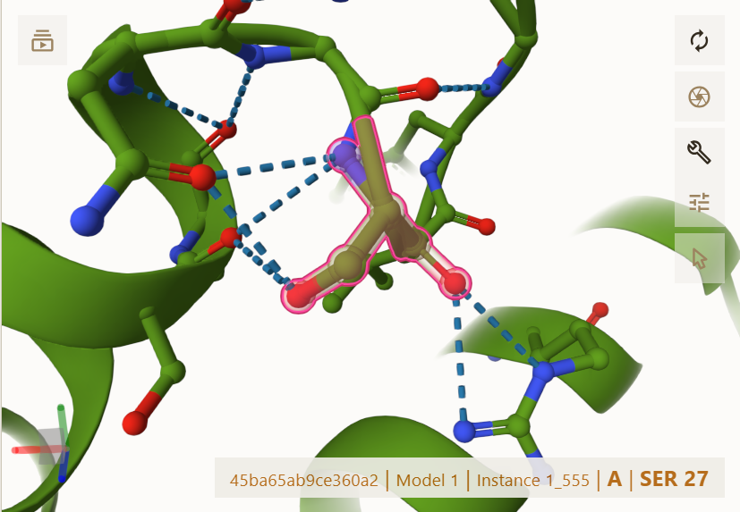
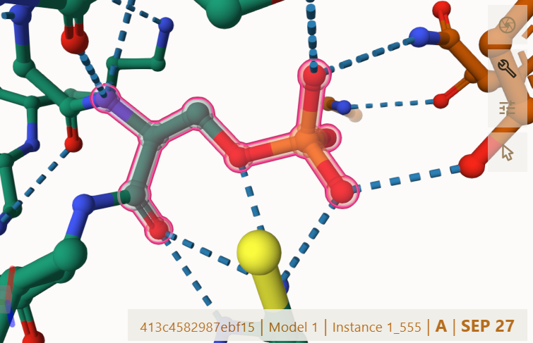
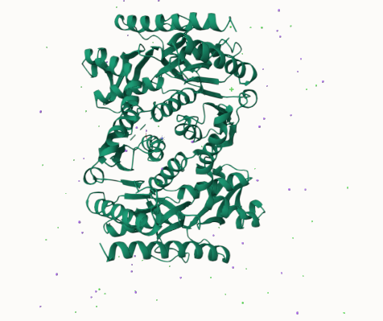
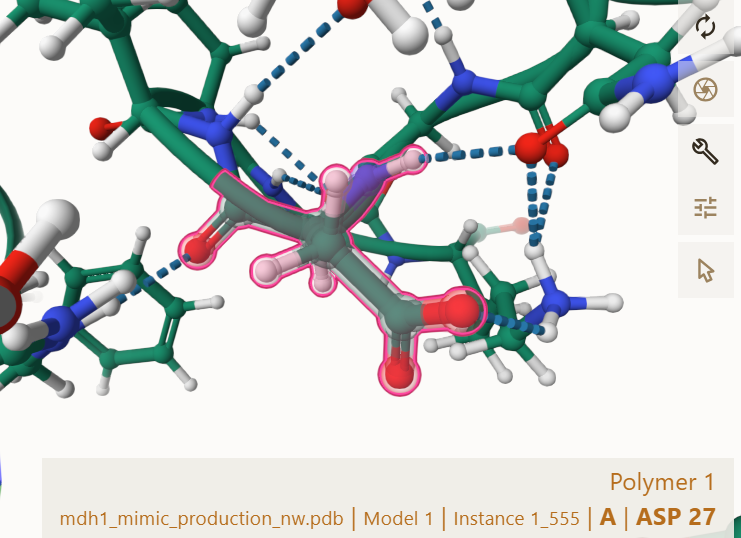
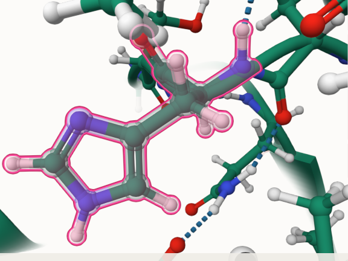
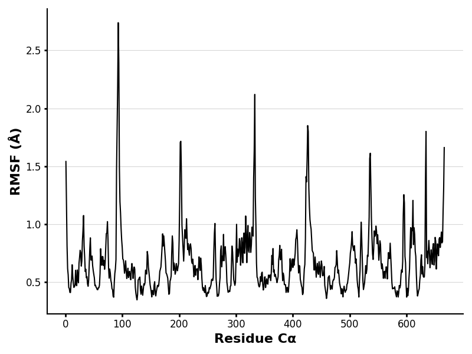
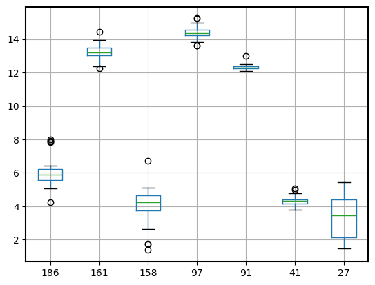
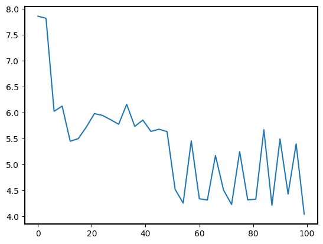
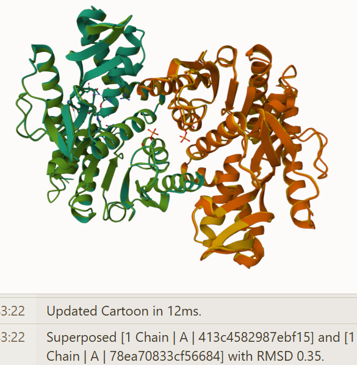

# Cytoplasmic MDH1

# P40925

# Phosphoylation on Serine 27

## Description

Malate dehydrogenase (MDH) is a critical enzyme that catalyzes the reversible conversion of malate to oxaloacetate using the cofactor NAD+/NADH.(1) This reaction is central in metabolic pathways, such as the citric acid cycle, which is essential for transporting particles across the mitochondrial membrane and generating ATP.(2) In humans, two isoforms of MDH exist: mitochondrial MDH (MDH2) and cytoplasmic MDH (MDH1), both with similar mechanisms and structures. MDH2 is particularly crucial for energy production, while MDH1 contributes to amino acid metabolism in mitochondria and gluconeogenesis in the cytoplasm.(3)(4) Analysis of structure, function and variation was conducted on MDH1 throughout all projects. Structurally, human MDH proteins function as homodimers, with dimerization for active site stability and function.(2) The catalytic mechanism of MDH involves specific residues that facilitate the hydride transfer between malate and NAD⁺, forming OAA and NADH.(1)(4) MDH’s activity is tightly regulated, meaning modifications like phosphorylation, acetylation, and methylation can cause disruption in activity. These modifications can influence enzyme stability, dimerization, substrate affinity, and metabolic function.1,3 Post-translational modifications can have sweeping effects on cellular metabolism due to changes in protein structure, highlighting the biological significance of understanding these modifications at a molecular level.\
Analyses of human mitochondrial malate dehydrogenase (MDH2) have identified multiple phosphorylation sites. However, specific mention of phosphorylation at serine 28 is absent from the literature. Similarly, in the cytosolic isoform MDH1, phosphorylation has been observed at other serine residues, not at serine 28. Therefore, current literature does not provide evidence for phosphorylation at S28 in human MDH. In the absence of literature for S28 phosphorylation, structural modeling can offer insights into the potential impact of such a modification.(5) Using a fitted, modified sequence from Uniprot, the serine amino acid is located as the 27th amino acid.(5) Serine 27 is in a loop region, distant from the active site at histidine 186 in MDH1. These loops contribute to the structural flexibility required for substrate and cofactor binding. Although no known phosphorylation at S27 has been reported in current literature on MDH1, its proximity to functional regions of the enzyme suggests that a phosphate addition, or a phosphomimic mutation, could impact residue interactions and enzyme activity if the overall protein structure is dramatically affected or influenced by a sequence change or phosphorylation. Previous MDH1 structure prediction and AlphaFold3 and new data collection involving a sequence change were viewed in Mol*.(6)(7) Modeling of the original, unmodified structure, mimic (serine to aspartic acid sequence change at amino acid 27) and phosphorylation on serine 27 (pS27) variants revealed subtle, yet meaningful changes in local residue weak interactions and hydrogen bonding. To investigate the effects of S27 changes, three dimeric MDH1 models from AlphaFold3 were used; original MDH1, S to D mimic, and phosphorylation at residue 27(pS27). The PTM was added using AlphaFold3’s modification tool, while the mimic was created by sequence substitution. Mol* was used to analyze structural alignment and weak interactions, along with Boltz-1 models further confirmed dimer consistency between the original and mimic structures. Molecular dynamics simulations (RMSD, RMSF, and pKa) were performed in Google Colab. (8)(9) These computational tools provided consistent results that were easily compared, supporting the methods and the conclusion that there were no major structure disruptions or changes to enzyme function or metabolism.

1.  image of the unmodified site 
2.  image of modification site 

## Effect of the sequence variant and PTM on MDH dynamics

1.  Image of aligned PDB files (no solvent) 

2.  Image of the site with the aligned PDB files (no solvent)  

Analysis of the Colab mimic structure revealed that the mimic site at ASP 27 forms several stabilizing interactions, including ARG 254, LYS 31, and ASN 25. This analysis was very consistent with structural analysis from AlphaFold and Boltz-1. The HIS186 at the active site interacts with only ASN 185, suggesting a more accessible and less stabilized region, varying from above analysis of the active site above. This contrast in interaction density may contribute to a lower pKa observed for HIS 186 in the mimic model. These changes could support lower pKa’s and higher rate of protonation, through the change in weak interactions or dynamics, potentially increasing enzyme rate and activity.

3.  Annotated RMSF plot showing differences between the simulations

 RMSF analysis revealed distinct flexibility across the protein. Most residues fluctuated below 1.0, indicating relative rigidity throughout the enzyme. However, several peaks, particularly around residues 110, 200, and 360, and near the C-terminus exceeded 2.0, identifying dynamic, flexible loop regions. These flexible regions are common in regulatory domains, not core active site residues. Notably, the region surrounding residue 27 showed no unusual fluctuations, supporting the notion that the mimic does not significantly alter loop mobility at the mutation site.

4.  Annotated plots of pKa for the key amino acids

 The pKa predictions for key active site residues, including ASP158, HIS186, and ASN 133 showed no large deviations from expected values. HIS 186 maintained a pKa close to the neutral range (6–7), supporting its continued ability to switch between protonated and deprotonated states during catalysis. ASP 158 and surrounding acidic residues retained steady pKa values, thus the active site remains functional and capable of hydride transfer and regular metabolic function. These results reinforce the structural observations that the S27D variant does not disrupt the protonation environment of the active site.  The differences in pKa suggest that the mimic alters the pKa range of the local environment around HIS 186, likely because of additional hydrogen bonding throughout the protein. The lower pKa observed in the mimic may reflect a structural context that favors deprotonation, while the original structure appears to stabilize the protonated form of HIS 186, leading to a higher observed pKa. The lower pKa in the mimic suggests the active site around HIS 186 is likely more accessible or exposed for deprotonation, which could mean it is more reactive, but potentially less stable. This fits with the idea that the mimic maintains overall structure but could potentially subtlely effect function or dynamics.

## Comparison of the mimic and the authentic PTM

 Both the mimic and modified models display high global structural similarity to the wild-type enzyme, with no significant deviations observed with and RMSD of .35. Superposition of the models yielded no major alterations in the tertiary or quaternary structures. Importantly, the conserved active site residues including HIS 186, ASP 158, and ASN 133 maintain the same interaction networks, suggesting that neither S27D nor pS27 directly alters the catalytic active site of MDH1. However, local differences around residue 27 are notable. In the mimic model, D27 introduces a single negative charge and forms new interactions with LYS 31, ARG 254, ASN 25, and SER 22. These interactions suggest a modest shift in the local electrostatic environment. The phosphorylated serine residue (pS27) has a larger negatively charged phosphate group and engages in more weak interactions due to this. This expanded binding pattern implies a greater degree of loop stabilization or structural constraint in the modified enzyme. While S27D may reproduce some of the local effects of phosphorylation, like additional hydrogen bonding, it may not fully model the allosteric effects imposed by a phosphate group.

Part 4 from the Project 4 report outline include images as needed

Phosphorylation at S27, if physiologically relevant, could lead to changes in NAD+/NADH accessibility or turnover by altering the flexibility of loops surrounding the active binding pocket. Though the mimic variant did not exactly replicate the phosphorylation, it did indicate a potential effect on the pKA value at HIS 186, suggesting it may increase the accessibility to deprotonate due to a change in structure dynamics by hydrogen bonding. This would also be seen in the modified variant and may influence the efficiency of gluconeogenesis in tissues throughout the human body. Though direct catalytic activity was not disrupted and no large structural changes were observed, new weak interactions may subtlety include the MDH1 enzyme's regulatory role.

## Authors

Alicia Bare

## Deposition Date

## License

Shield: 

This work is licensed under a [Creative Commons Attribution-NonCommercial 4.0 International License](https://creativecommons.org/licenses/by-nc/4.0/).

## References

1 Martinez-Vaz, B. M.; Howard, A. L.; Jamburuthugoda, V. K.; Callahan, K. P. Insights into the Regulation of Malate Dehydrogenase: Inhibitors, Activators, and Allosteric Modulation by Small Molecules. Essays Biochem 2024, 68 (2), 173–181. <https://doi.org/10.1042/EBC20230087> !(<https://doi.org/10.1042/EBC20230087>)

2 Fermaintt, C. S.; Wacker, S. A. Malate Dehydrogenase as a Multi-Purpose Target for Drug Discovery. Essays Biochem 2024, 68 (2), 147–160. <https://doi.org/10.1042/EBC20230081>. !(<https://doi.org/10.1042/EBC20230081>)

3 Haberman, A.; Peterson, C. N. Genetics of MDH in Humans. Essays Biochem 2024, 68 (2), 107–119. <https://doi.org/10.1042/EBC20230078>. !(<https://doi.org/10.1042/EBC20230078>)

4 Berndsen, C. E.; Bell, J. K. The Structural Biology and Dynamics of Malate Dehydrogenases. Essays Biochem 2024, 68 (2), 57–72. <https://doi.org/10.1042/EBC20230082>. !(<https://doi.org/10.1042/EBC20230082>)

5 The Uniprot Consortium. UniProt: the Universal Protein Knowledgebase in 2025. Nucleic Acids Res. 53:D609–D617 (2025) !(<https://www.uniprot.org/>)

6 AlphaFold Protein Structure Database. <https://alphafold.ebi.ac.uk/> (accessed 2025-02-18). !(<https://alphafold.ebi.ac.uk/>)

7 Mol\* Viewer. <https://molstar.org/viewer/> (accessed 2025-05-07). !(<https://molstar.org/viewer/>)

8 Wohlwend J, Corso G, Passaro S, et al. Boltz-1: democratizing biomolecular interaction modeling. December 2024. <doi:10.1101/2024.11.19.624167>\
![10.1101/2024.11.19.624167]

9 Google Colab. <https://colab.research.google.com/drive/1TxxiMhNc1YkrrMpHk0LJMt8tQKBm-t1?usp=sharing> (accessed 2025-02-18) !(<https://colab.research.google.com/drive/1TxxiMhNc1YkrrMpHk0LJMt8tQKBm-t1?usp=sharing> )
