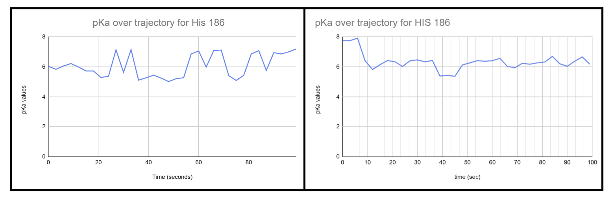

# Human MDH1

# Uniprot ID:P40925

# Variation: phosphorylation of S272

## Description

The modification of serine 272 of human MDH1 (P40925) has yet to be described. Serine of 272 was post-transitionally modified using AlphaFold3. Serine was changed to aspartic acid to create a mimic model that follows phosphorylation of serine. Minimal change was found when these three models were compared.

# Comparison of MDH1 Models at site 272

1.  Unmodified Model at Site 272 

2.  Modification Model at Site 272 

3.  PTM Model at Site 272 

# Comparison of Overall Structure for All Models

4.  All Models Superimposed 

# Comparison of MDH1 Models at active site 186

5.  Histidine 186 in the All Models 

The modification site is not near the active site, histidine 186, but is located in a loop.

After simulation, the overall protein structures are similar as well as the area surrounding the modification site.

There is minor variation seen in the number and classification of amino acids between all three models at both the active site and modified site.

## Effect of the sequence variant and PTM on MDH dynamics

Part 3 from the Project 4 report

1.  Unmodified and Mimic Superimposed 

2.  Unmodified and PTM Superimposed 

3.  RMSF Plots of Modified and Unmodified Models 

4.  RMSD Plots of Modified and Unmodified Models 

5.  pKa Plots of Histidine 186 of the Modified and Unmodified Models 

Following simulation, the overall protein structures remain largely unchanged, including the region surrounding the modification sites.

There was little change between the modified and unmodified at site 272 in regards to RMSF. However,the modification decreased the RMSF value for the active site more than the modified site. The active site went from around 0.85 in the unmodified model to about 1.55 in the modified model. If this created an impact, then it most likely had stabilizing effects as the RMSF values were lower in the active site in the modified model compared to the unmodified model.

As for the RMSD plots, the modified has higher values at the beginning than does the unmodified. Both models level out at different values as well with the modified stabilizing around 1.4, while the unmodified evens out near 2. The closer the RMSD is to 0, the more stable the protein is. Thus, these increased values indicate that there is less structural stability and possible conformational changes occurring. However, it's important to note that this does not coincide with the Mol\* values described above.

The pKA values for histidine 186 vary concerning peaks between the modified and unmodified models. The unmodified has a more level line value, whereas the modified has uneven peaks. This could hint towards more instability. Nonetheless, both teeter between 6 and 7 verifying there is more similarity than difference to truly influence change.

## Comparison of the mimic and the authentic PTM

1.  Mimic and PTM Superimposed 

Some change is seen in various spaces between loops for the two. Both have the same number of weak interactions shown at site 272, however each entail different interactions. Both interact with ASN 275 and LEU 283, but the PTM also interacts with PRO 280, while the mimic interacts with ASP 272. As for the active site, both have the same interactions, but the mimic has one less weak interaction than the mimic. These findings can be found in figures above. I suggest that the mimic is a good approximation of the PTM model.

## Authors

Grace Smith

## Deposition Date

5/7/2025

## License

Shield: 

This work is licensed under a [Creative Commons Attribution-NonCommercial 4.0 International License](https://creativecommons.org/licenses/by-nc/4.0/).

## References

-   McCue, W. M., & Finzel, B. C. (2022). Structural characterization of the human cytosolic malate dehydrogenase I. ACS Omega, 7(207-214). <https://pubs.acs.org/doi/pdf/10.1021/acsomega.1c0>
-   Sehnal, D., Bittrich, S., Deshpande, M., Svobodová, R., Berka, K., Bazgier, V., Velankar, S., Burley, S. K., Koča, J., & Rose, A. S. (2021). Mol\* Viewer: modern web app for 3D visualization and analysis of large biomolecular structures. Nucleic acids research, 49(W1), W431–W437. <https://doi.org/10.1093/nar/gkab314>
-   UniProt Consortium. (2025). P40925 - Malate dehydrogenase 1 (MDH1) human entry. UniProt. Retrieved from <https://www.uniprot.org/uniprotkb/P40925/entry>
-   Wohlwend, J., Corso, G., Passaro, S., Reveiz, M., Leidal, K., Swiderski, W., Portnoi, T., Chinn, I., Silterra, J., Jaakkola, T., & Barzilay, R. (2024). Boltz-1 Democratizing Biomolecular Interaction Modeling. bioRxiv : the preprint server for biology, 2024.11.19.624167. <https://doi.org/10.1101/2024.11.19.624167>
