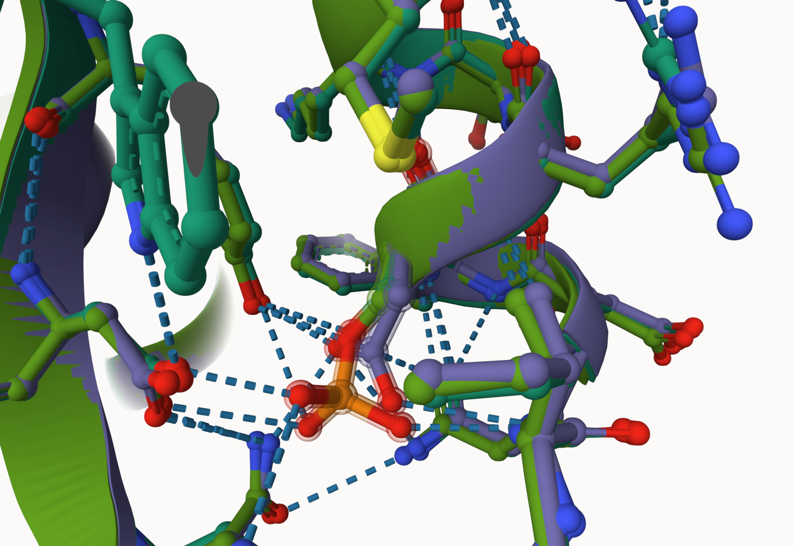
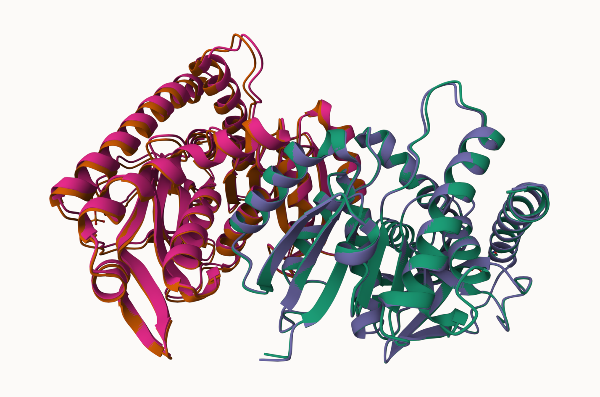
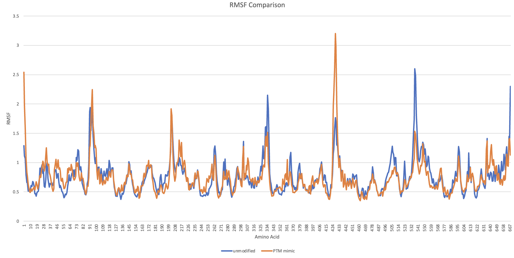
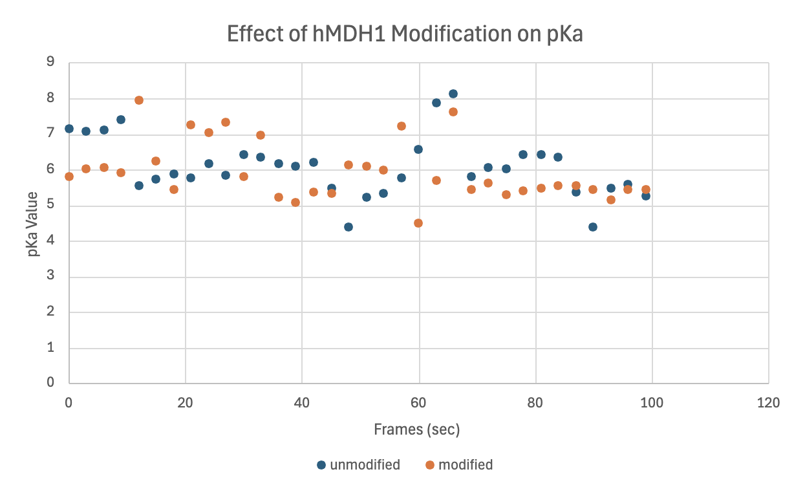
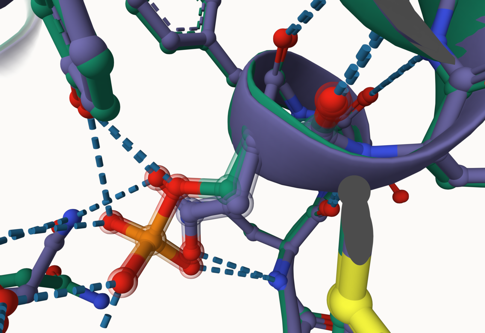

# Human cytoplasmic MDH1

# Uniprot ID: P40925

# Variation: phosphorylation of pS309

## Description

The phosphorylation of serine 309 in human MDH1 has not been described previously, but has been suggested to parallel [lactate dehydrogenase] (<https://doi.org/10.1042/ebc20230079>.) and has been observed in mice according to [Uniprot] (<https://www.uniprot.org/uniprotkb/P40925/entry>).
While these observations may provide insight as to the effect on enzymatic activity with phosphorylation, this specific amino acid sequence phosphorylation has not been observed in human MDH1.

# Comparison of MDH1 models and phosphorylation modified MDH1

1.  Alignment of hMDH1 and pS309 modified and PTM mimic.
    

2.  Modification site alignment within MDH1 

The modification is located on a helix 309 – SER309 in the unmodified enzyme, SEP309 in the modified enzyme, and ASP309 in the PTM mimic enzyme.
Each of these three amino acids are found at the outer edge of the superposed dimers.
SER309 has weak interactions with surrounding amino acids TYR192 and ASN306, SEP309 has weak interactions with TYR192, ASP 194, HIS197, and ASN306, andASP309 has weak interactions with TYR192, ASN196, and ASN306.

## Effect of the sequence variant and PTM on MDH dynamics

There are differences in similarities between the two superimposed structures based on differing RMSF and RMSD values at site appearing visually similar.
The modified enzyme is represented with the orange and teal dimer and the PTM mimic enzyme is represented with the purple and pink dimer.

After the MD simulation, the overall protein structures still present with visual similarities related to structure.
Each variant sequence includes more weak interactions than the two shared between all three structures.
In the modified enzyme, phosphoserine, SEP309, has weak interactions with TYR192, ASP 194, HIS197, and ASN306.
In the PTM mimic enzyme, aspartate, ASP309, has weak interactions with TYR192, ASN196, and ASN306.

The dynamics between the unmodified hMDH1 and PTM mimic hMDH1 were compared in terms of root mean squared fluctuation (RMSF).
RMSF values indicate the degree to which a certain residue moves or fluctuates during a dynamics simulation.
The peaks in the PTM mimic hMDH1 enzyme are higher than those in the unmodified enzyme for subunit 1, with the same trend in subunit 2.
Despite the trend in peak height, the unmodified enzyme has a higher RMSF value around amino acid 309, whereas the RMSF value at the same amino acid in the PTM mimic is significantly lower and therefore less flexible.
This creates the implication that the phosphorylation earlier in the chain significantly influenced protein structure and folding within the dimer in the second subunit.
Overall, it can be concluded that the PTM mimic enzyme has greater flexibility than the unmodified enzyme through the difference in RMSF plot peak heights.\

Both enzymes have variations in pKa values over time, but most fall within the 5 to 7 pKa range with outliers throughout the frame for both the modified and unmodified enzymes.
Despite pKas being within the same range, there is little consistency between the two sequences in alignment of pKa over time.
Therefore, it can be concluded that the modification overall did affect pKa values of the active site due to increased pKa values within the spread of the data.

## Comparison of the mimic and the authentic PTM

The modified enzyme structure at SEP309 has a greater effect on enzymatic structure and function due to the increased number of weak interactions through hydrogen bonds to four other amino acids.
The overall structures and location of the PTM mimic and the modified enzyme are similarly aligned, with a difference in the number of weak interactions between each amino acid in the 309 position within the dimer.

## Authors

Caroline T. Richardson

## Deposition Date

04/28/2025

## License

Shield: 

This work is licensed under a [Creative Commons Attribution-NonCommercial 4.0 International License](https://creativecommons.org/licenses/by-nc/4.0/).

## References

-   Citation1 [Berndsen, C.; Bell, J. The Structural Biology and Dynamics of Malate Dehydrogenases. Essays in Biochemistry 2024, 68 (2)](https://doi.org/10.1042/ebc20230082)

-   Citation2 [McCue, W. M.; Finzel, B. C. Structural Characterization of the Human Cytosolic Malate Dehydrogenase I. ACS Omega 2021, 7 (1), 207–214](https://doi.org/10.1021/acsomega.1c04385)

-   Citation3 [Huynh, N. H.; Hoang, A.; Sohl, C. D. Catalytic Characterization of Human Malate Dehydrogenase 1 (MDH1). The FASEB Journal 2020, 34 (S1), 1–1](https://doi.org/10.1096/fasebj.2020.34.s1.04837)

-   Citation4 [Provost, J.; Cornely, K.; Mertz, P.; Peterson, C.; Riley, S.; Tarbox, H.; Narasimhan, S.; Pulido, A.; Springer, A. Phosphorylation of Mammalian Cytosolic and Mitochondrial Malate Dehydrogenase: Insights into Regulation. Essays in Biochemistry 2024, 68 (2)](https://doi.org/10.1042/ebc20230079)

-   Citation5 [Bateman, A.; Martin, M.-J.; Orchard, S.; Magrane, M.; Adesina, A.; Ahmad, S.; Bowler-Barnett, E. H.; Hema Bye-A-Jee; Carpentier, D.; Denny, P.; Fan, J.; Garmiri, P.; Jose, L.; Hussein, A.; Alexandr Ignatchenko; Insana, G.; Rizwan Ishtiaq; Joshi, V.; Dushyanth Jyothi; Swaathi Kandasaamy. UniProt: The Universal Protein Knowledgebase in 2025. Nucleic Acids Research 2024, 53 (D1)](https://doi.org/10.1093/nar/gkae1010)

-   Citation6 [Abramson, J.; Adler, J.; Dunger, J.; Evans, R.; Green, T.; Pritzel, A.; Ronneberger, O.; Willmore, L.; Ballard, A. J.; Bambrick, J.; Bodenstein, S. W.; Evans, D. A.; Hung, C.-C.; O’Neill, M.; Reiman, D.; Tunyasuvunakool, K.; Wu, Z.; Žemgulytė, A.; Arvaniti, E.; Beattie, C. Accurate Structure Prediction of Biomolecular Interactions with AlphaFold 3. Nature 2024, 630 (630), 493–500](https://doi.org/10.1038/s41586-024-07487-w)

-   Citation7 [Mirdita, M.; Schütze, K.; Moriwaki, Y.; Heo, L.; Ovchinnikov, S.; Steinegger, M. ColabFold: Making Protein Folding Accessible to All. Nature Methods 2022, 19 (6), 1–4](https://doi.org/10.1038/s41592-022-01488-1)

-   Citation8 [Sehnal, D.; Bittrich, S.; Deshpande, M.; Svobodová, R.; Berka, K.; Bazgier, V.; Velankar, S.; Burley, S. K.; Koča, J.; Rose, A. S. Mol\* Viewer: Modern Web App for 3D Visualization and Analysis of Large Biomolecular Structures. Nucleic Acids Research 2021, 49 (W1)](https://doi.org/10.1093/nar/gkab314)
