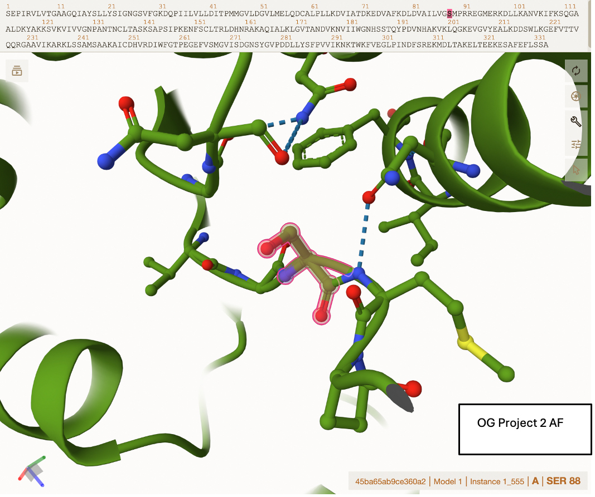
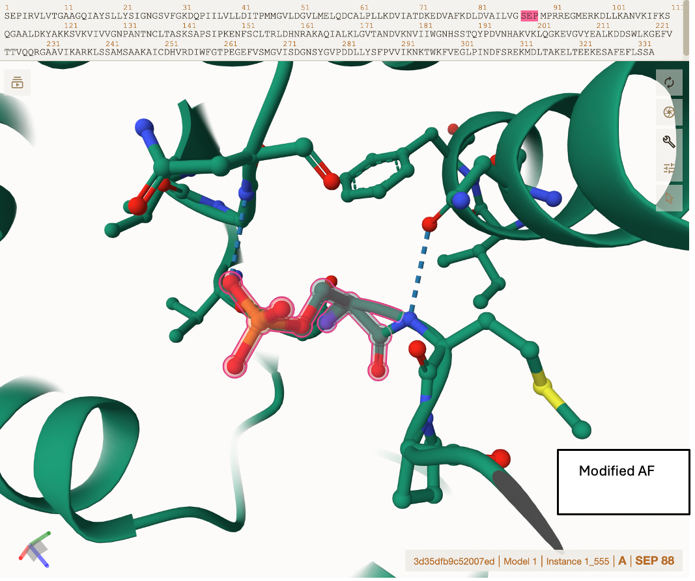
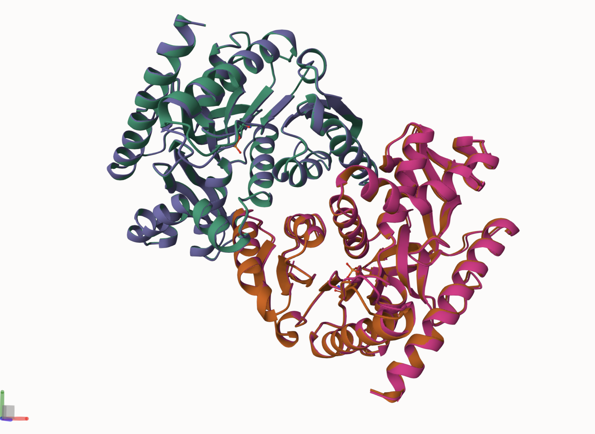
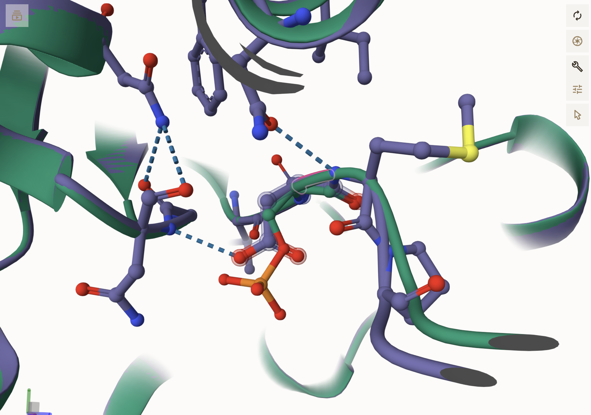
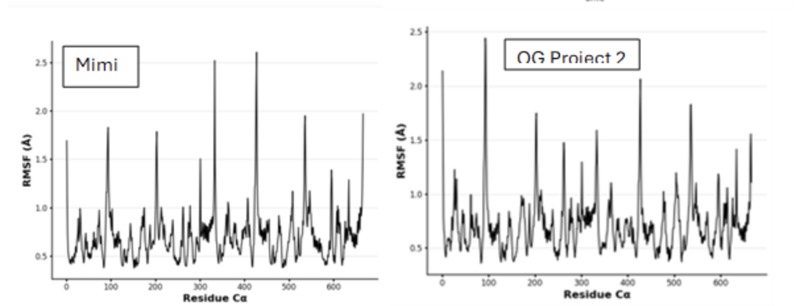
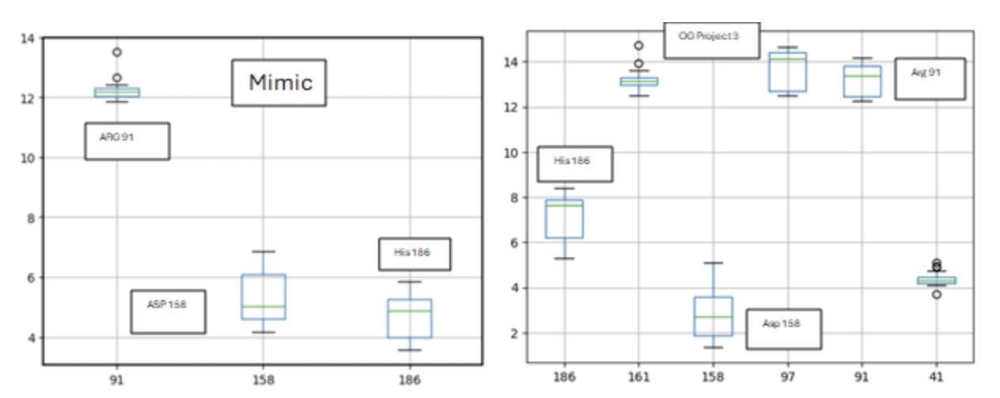

Cytoplasmic MDH1 P4025 Uniprot number Phosphorylation of S89

## Description

1.  image of the unmodified site 

2.  image of modification site 

## Effect of the sequence variant and PTM on MDH dynamics

Part 3 from the Project 4 report

1.  Image of aligned PDB files (no solvent) 

2.  Image of the site with the aligned PDB files (no solvent) 

3.  Annotated RMSF plot showing differences between the simulations 

4.  Annotated plots of pKa for the key amino acids 

5.  If needed, show ligand bound images and how modification affects substrate binding

Description of the data and changes

## Comparison of the mimic and the authentic PTM

Part 4 from the Project 4 report outline include images as needed

### Colab notebook links

Provide file names of completed colab notebooks

## Authors

Contributors names Makayla Overbey

## Deposition Date

## License

Shield: 

This work is licensed under a [Creative Commons Attribution-NonCommercial 4.0 International License](https://creativecommons.org/licenses/by-nc/4.0/).

## References

-   Citation1 

-   Citation2 
