# Human MDH1
# Uniprot ID:P40925
# Variation: phosphorylation of S89

## Description

 MDH1 is an essential enzyme involved in glutamine metabolism, a mechanism that supplies nutrients to rapidly growing and dividing cells; whose overexpression is also linked to a variety of cancers, like breast, pancreatic, as well as prostate cancers.2 The result of this mutation is the establishment of an O-phosphoserine group. Throughout chemistry, phosphorylation is a method to regulate the activity of proteins by changing the stability, dynamics, and chemical interactions present wherever it is added.3 There is existing research on the phosphorylation of different positions in the MDH1 protein, but there is currently no existing literature of this particular position and the subsequent events that may follow. Despite this, existing research can provide useful insight and help to refine predictions and conclusions. Serine 89 is located on an à loop near a Beta sheet consisting of  Val 83 ,ALA 84, ILE  85, and LEU 86. The phosphorylated Ser89 is approximately 18.9Å from the interacting residues in the dimer interface ,which is a substantial distance but not necessarily outside the range of influence. Relative to the active site Ser89 is 12.38Å from the His187, an amino acid located in the active site that plays a key role in ligand binding. In terms of interactions between amino acids at the site of modification, in  the PTM ( the phosphorylated Ser89) there was a hydrogen bond between the O-phosphoserine (shown SEP) and ASN 131 that is observed. A similar interaction was present in the mimic/ variant model (SER89-Asn131) but not in the unmodified MDH model. Outside of these interactions, Ser89 does not make any other interactions with surrounding amino acids.

1. image of the unmodified site
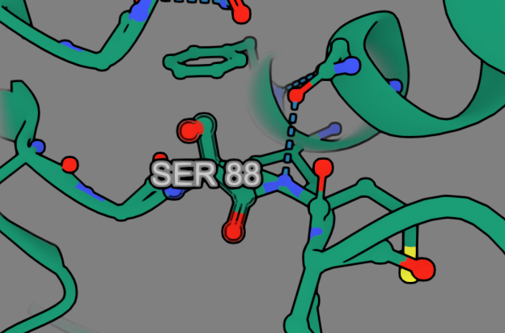

2. image of modification site
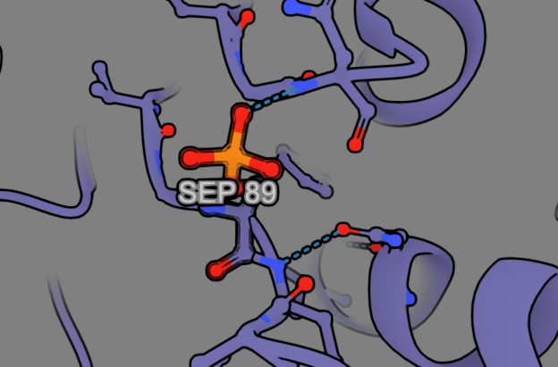

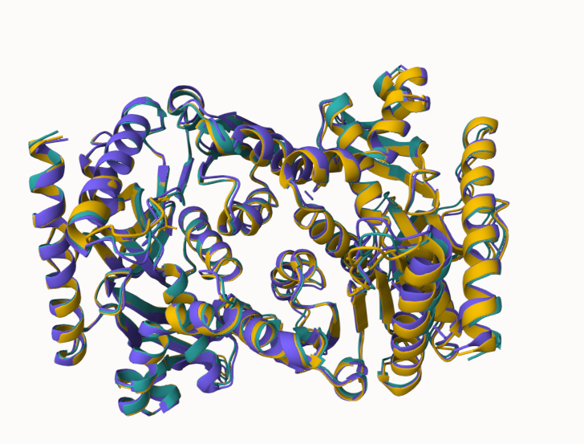

Looking at the protein globally, there were no outstanding differences in structure. Zooming into the modification site, the unmodified MDH1 was shown to participate in no weak interactions, likely in part to the neutral nature of serine at biological pH, even though it's a polar amino acid. The modified PTM model displayed a new hydrogen bond between the phosphorylated serine (SEP89) and the nearby asparagine 131. Likely due in part to the introduction of the negative charge associated with the phosphorylation.

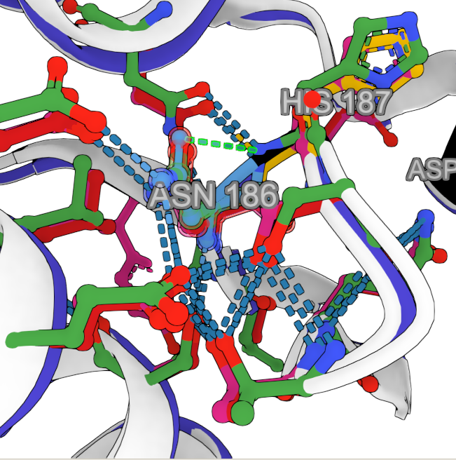

## Effect of the sequence variant and PTM on MDH dynamics

Part 3 from the Project 4 report
1. Image of aligned PDB files (no solvent)
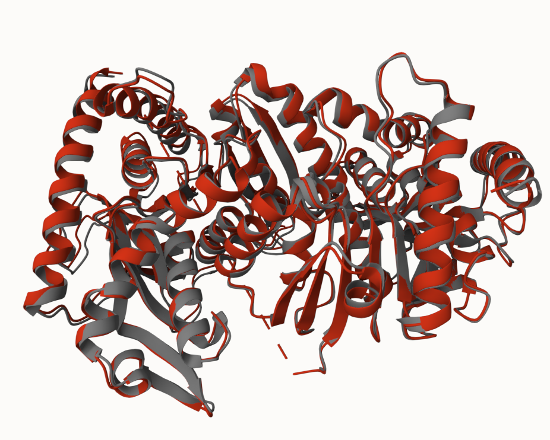

2. Image of the site with the aligned PDB files (no solvent)
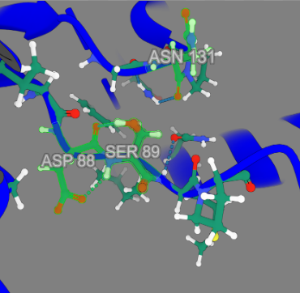
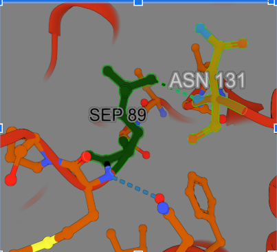

The no solvent mimic variant derived from the exhibited multiple changes in H bonding, where the H-bond between Ser89 and Asn131 was no longer observed, and instead an additional bond to Asp88 was seen.

**Comparison of enzyme dynamics 

3.  RMSF plot showing simulation differences
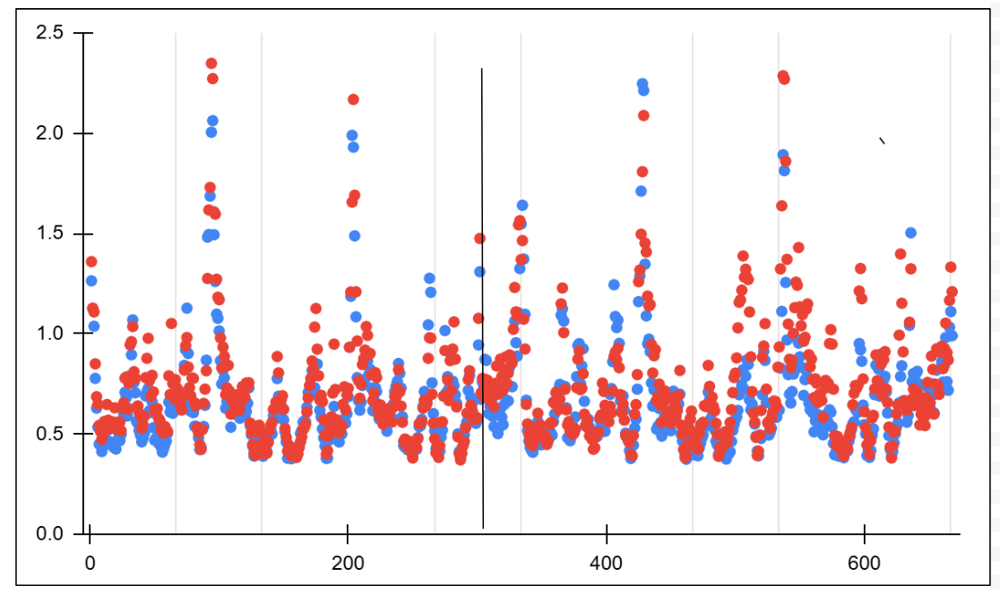

The root means square fluctuation plot serves to show how much each amino acid moves during the simulation. In this plot, both data sets exhibit relatively low RMSF values (lower than 1.5Å), where the peaks likely indicate certain regions of higher flexibility like loops.

4. RMSD plot showing simulation differences
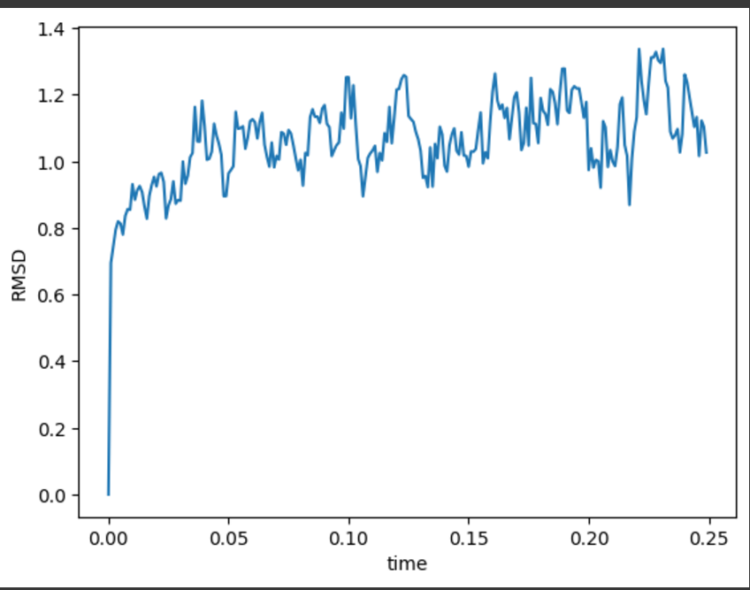

5. Pka plots for key amino acids 
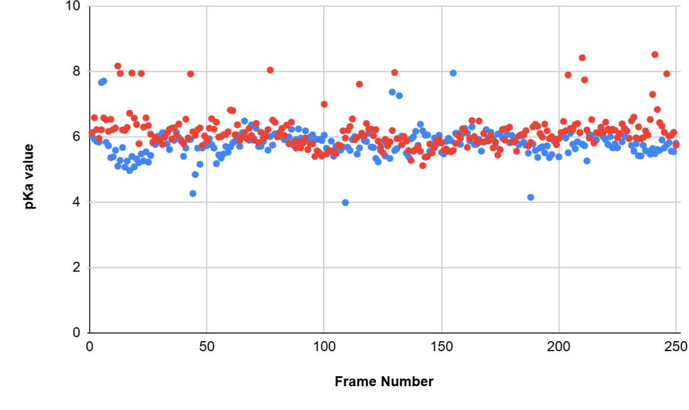

## Comparison of the mimic and the authentic PTM
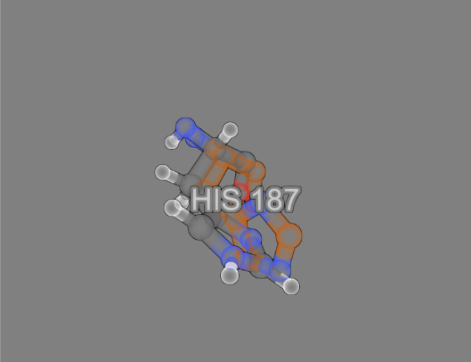

The His187 in the active site showed a distinct difference in it's orientation likely as a result of differences in stabilizing H-bonds.

## Authors

Mason Leslie 

## Deposition Date
12/7/2024
## License

Shield: [![CC BY-NC 4.0][cc-by-nc-shield]][cc-by-nc]

This work is licensed under a
[Creative Commons Attribution-NonCommercial 4.0 International License][cc-by-nc].

[![CC BY-NC 4.0][cc-by-nc-image]][cc-by-nc]

[cc-by-nc]: https://creativecommons.org/licenses/by-nc/4.0/
[cc-by-nc-image]: https://licensebuttons.net/l/by-nc/4.0/88x31.png
[cc-by-nc-shield]: https://img.shields.io/badge/License-CC%20BY--NC%204.0-lightgrey.svg

## References

* The UniProt Consortium. UniProt: The Universal Protein Knowledgebase in 2023. Nucleic Acids Res. 2023, 51 (D1), D523–D531

* Parente, A. D.; Bolland, D. E.; Huisinga, K. L.; Provost, J. J. Physiology of Malate Dehydrogenase and How Dysregulation Leads to Disease. Essays Biochem. 2024, 68 (2), 121–134. 

* 	Nishi, H.; Shaytan, A.; Panchenko, A. R. Physicochemical Mechanisms of Protein Regulation by Phosphorylation. Front. Genet. 2014, 5, 270.

* Karplus, M.; McCammon, J. A. Molecular Dynamics Simulations of Biomolecules. Nat. Struct. Biol. 2002, 9 (9), 646–652 

