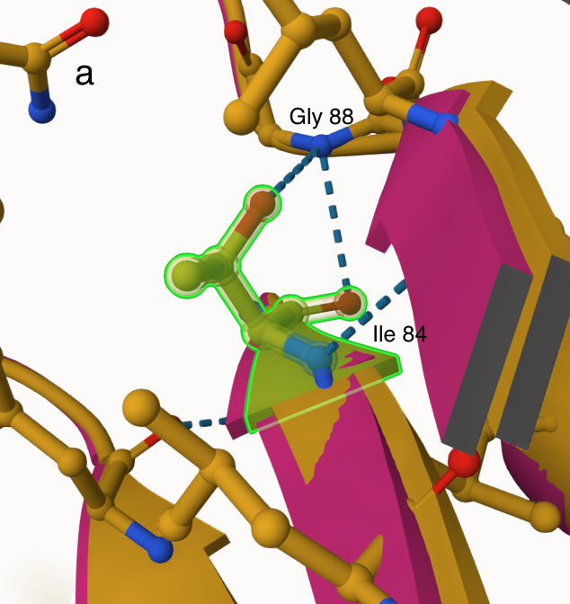
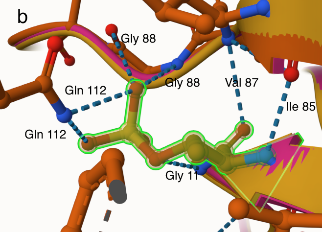
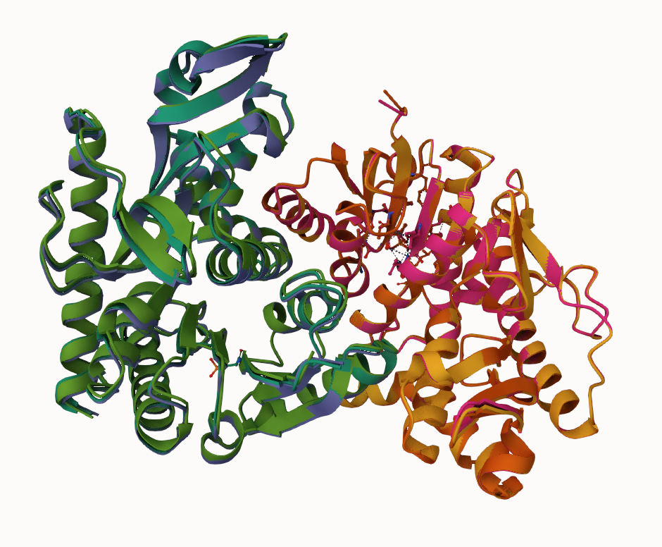
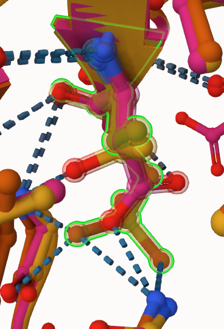
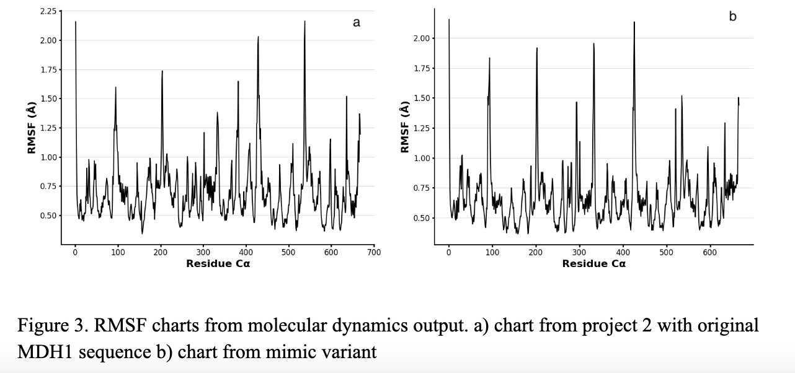
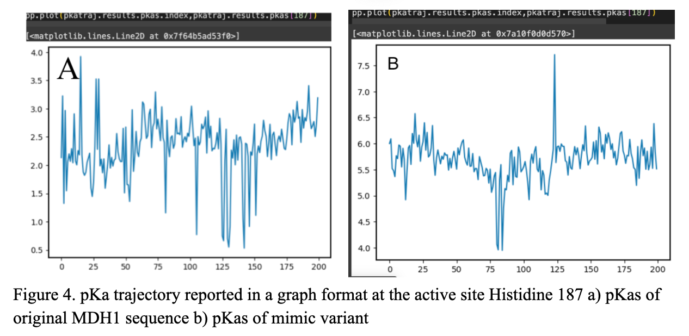

# Homo sapiens MDH1
# P40925
# phosphorylation of T10

## Description

The phosphorylation modification to MDH1 has not been described previously at site 10. The modification will take place at position 10 of the sequence at amino acid threonine (T), which is a part of a beta-sheet at this position in the sequence. Phosphorylation will change the amino acid threonine to TPO, creating new weak interactions, and by changing structure, we’ll look at how it may change its function. Its position to the dimeric equivalent in the dimer interface is a great distance of 33.2 Å. However, the phosphorylated addition to the amino acid does directly interact at a binding site at position 112 with glutamine (Q) and has a distance of 12.34Å. There’s also a directly adjacent distance to relevant substrate binding sites to positions 11-17, which makes for great conditions for weak interactions. The active site, His 187, is further across the parallel beta sheets and has a distance of 17.14Å, which is not relatively close enough to make any weak interactions. At the site, the amino acids glycine and isoleucine appear in all three versions, but the modified and mimic variant made additional interactions with glutamine, glycine at position 11, and valine (Fig. 1).

1. image of the unmodified site

2. image of modification site

## Effect of the sequence variant and PTM on MDH dynamics

Part 3 from the Project 4 report

1. Image of aligned PDB files (no solvent)

2. Image of the site with the aligned PDB files (no solvent)

3. Annotated RMSF plot showing differences between the simulations

4. Annotated plots of pKa for the key amino acids

## Authors

Jada Thomas

## Deposition Date

12/06/2024

## License

Shield: [![CC BY-NC 4.0][cc-by-nc-shield]][cc-by-nc]

This work is licensed under a
[Creative Commons Attribution-NonCommercial 4.0 International License][cc-by-nc].

[![CC BY-NC 4.0][cc-by-nc-image]][cc-by-nc]

[cc-by-nc]: https://creativecommons.org/licenses/by-nc/4.0/
[cc-by-nc-image]: https://licensebuttons.net/l/by-nc/4.0/88x31.png
[cc-by-nc-shield]: https://img.shields.io/badge/License-CC%20BY--NC%204.0-lightgrey.svg

## References

Cruzat, V.; Macedo Rogero, M.; Noel Keane, K.; Curi, R.; Newsholme, P. Glutamine: Metabolism and Immune Function, Supplementation and Clinical Translation. Nutrients 2018, 10 (11), 1564. https://doi.org/10.3390/nu10111564.
Wang, B.; Wu, G.; Zhou, Z.; Dai, Z.; Sun, Y.; Ji, Y.; Li, W.; Wang, W.; Liu, C.; Han, F.; Wu, Z. Glutamine and Intestinal Barrier Function. Amino Acids 2015, 47 (10), 2143–2154. https://doi.org/10.1007/s00726-014-1773-4.
