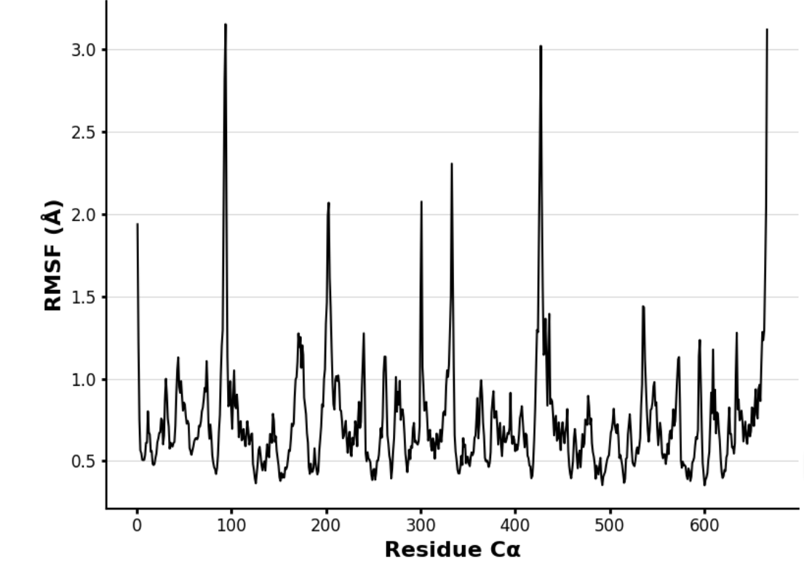

# Species and enzyme: Homo Sapien MDH1

# Uniprot ID:P40925

# Variation: Phosphorylation of T139 (pT138 in structure)

## Description

This project investigates the potential phosphorylation of Threonine at position 139 in human malate dehydrogenase 1 (MDH1), referred to as residue 138 throughout the analysis due to a one-residue offset in the modeling sequence. MDH1 is a cytosolic enzyme involved in the malate-aspartate shuttle, where it facilitates the reversible conversion of malate to oxaloacetate using NAD⁺ as a cofactor (Minárik et al., 2002). Phosphorylation is a post-translational modification that can alter protein function, structure, or interactions, but the effects of this specific modification have not been studied previously (UniProt, 2024; Tulloch et al., 2021).

To explore the structural consequences of this PTM, two models were created: one with a phosphorylated threonine at position 138 (pD138), and one mimic version where threonine was replaced with aspartic acid (D138). These were compared to the unmodified structure using structural overlays, pKa predictions, and molecular dynamics simulations to evaluate potential changes in stability, flexibility, or active site behavior.

# Part 1 from Project 4 report outline (with citations as appropriate)

1.  image of the unmodified site  *In the unmodified model, THR138 is solvent-exposed on a loop and forms hydrogen bonds with THR134 and SER142. It is not directly involved in the active site or dimer interface.*

2.  image of modification site  *The phosphorylated D138 (pD138) shows altered bonding, forming additional interactions with HIS186 and ASP158. These new bonds suggest potential influence on active site microenvironment.*

3.  image of variant site  *The D138 variant mimics the phosphorylation geometry. It retains bonding with THR134 but shows minor positional shifts.*

## Effect of the sequence variant and PTM on MDH dynamics

Images show structural alignments between the models.The RMSD values for the models were low to moderate with 0.41 (modified vs unmodified), 1.25 (mimic vs modified), 1.38 (mimic vs unmodified), and 0.61 (Boltz mimic vs Boltz unmodified). The values mean that the overall protein fold is consistent throughout all models but the mimic model has the most deviation.In all models residue 138 is located on an outward facing loop and away from the active site. Its bonding pattern stays the same, bonding to THR134 and SER142 and forms consistent interactions. This suggests local stability and no major disruption in the structure. However, even if the structure stays mostly unchanged any disruption, even minor, could alter cytosolic redox balance. MDH1 is key in the malate-aspartate shuttle, transferring NADH to the mitochondria. If the phosphorylation destabilized MDH1, liver and brain cells could be affected.The MDH1 active sites images include Histidine 186 which helps catalyze proton transfer. In all models histidine remained in the same position with stable bonds to the same amino acid, ASP158. The phosphorylation and mimic substitution do not seem to have an effect on the active site. The preservation of the catalytic residues suggest that the change at residue 138 does not disrupt the enzyme's function.

Part 3 from the Project 4 report

1.  Image of aligned PDB files (no solvent)  *All three structures align closely with RMSD values \< 1.5 Å, indicating consistent overall folding.*

2.  Image of the site with the aligned PDB files (no solvent)

Alignment of the unmodified and mimic structures at active site 

Alignment of the unmodified and mimic structures at modification site 

Alignment of the unmodified and modified structures at active site 

Alignment of the unmodified and modified structures at modification site 

3.  Annotated RMSF plot showing differences between the simulations  

4.  Annotated plots of pKa for the key amino acids   

Description of the data and changes Initially the pKa for the unmodified MDH1 sequence showed a decently stable distribution. The values across the protein were in range with the normal functioning values and suggested a well balanced electrostatic environment, especially around Histidine 186. The mimic plot shows more fluctuations and sharp peaks and dips. This could suggest that the substitution/phosphorylation has a slight effect on the surface charge especially near the more flexible or exposed regions. Key residues involved in catalysis did not have major pKa changes which means the active sites function remains stable. This is confirmed by the box plot which shows that His186 kept a tight pKa range around 6 which is its optimal functioning range in acid base chemistry. Overall the pKa results show minor changes but the environment around the active site remains consistent, and the PTM most likely did not disrupt any substrate binding or enzyme function. It’s important to note that if a significant pKa shift were to occur the redox cycle of MDH1 could have been impaired and consequently affect the ATP production in the mitochondria. Since this does not appear to be the case, there is still homeostasis in the liver, heart, and brain. The unmodified RMSF plot has mostly low values, indicating stability. Peaks around 100 and 300 show some flexible regions that are likely loops. The mimic shows a higher peak at 100 and slightly lower peak at 300. The values near the adjusted residue, 138, and active site, 186, remain stable but slightly elevated. The change may have introduced some flexibility but the overall structure and function of the enzyme is likely unchanged.

5.  If needed, show ligand bound images and how modification affects substrate binding

## Comparison of the mimic and the authentic PTM

The mimic and phosphorylated forms of MDH1 show highly similar local structure and dynamics. Both maintain the backbone conformation and key interactions at site 138. While the mimic shows slightly higher RMSF and broader pKa distribution, especially at HIS186, these changes are modest. The mimic is likely a good experimental substitute for studying the functional consequences of phosphorylation at this site.

Part 4 from the Project 4 report outline include images as needed

### Colab notebook links

Provide file names of completed colab notebooks

Copy of MD_simulation_Step1v2.ipynb

Copy of MDanalysis_Step2.ipynb

## Authors

Rachel Bump

## Deposition Date

05/07/2025

## License

Shield: 

This work is licensed under a [Creative Commons Attribution-NonCommercial 4.0 International License](https://creativecommons.org/licenses/by-nc/4.0/).

## References

-   Boland, M. L., Chourasia, A. H., & Macleod, K. F. (2013). Mitochondrial dysfunction in cancer. *Frontiers in Oncology, 3*, 292. <https://doi.org/10.3389/fonc.2013.00292>

-   Jumper, J., Evans, R., Pritzel, A., et al. (2021). Highly accurate protein structure prediction with AlphaFold. *Nature, 596*, 583–589. <https://doi.org/10.1038/s41586-021-03819-2>

-   Tulloch, L. B., Ashford, P., Guther, M. L. S., & Ferguson, M. A. J. (2021). Protein phosphorylation regulates glycolysis and protein expression in *Trypanosoma brucei*. *ACS Omega, 6*(43), 28785–28799. <https://doi.org/10.1021/acsomega.1c04385>

*UniProt Consortium.* P40925 – Malate dehydrogenase, cytoplasmic – Homo sapiens (Human). *UniProt*. 

-   Yao, Z., Xu, W., & Deng, Y. (2024). Malate dehydrogenase 1 (MDH1): A redox checkpoint and emerging therapeutic target in cancer.Frontiers in Pharmacology, 15\*, 38818725. <https://pubmed.ncbi.nlm.nih.gov/38818725/>
