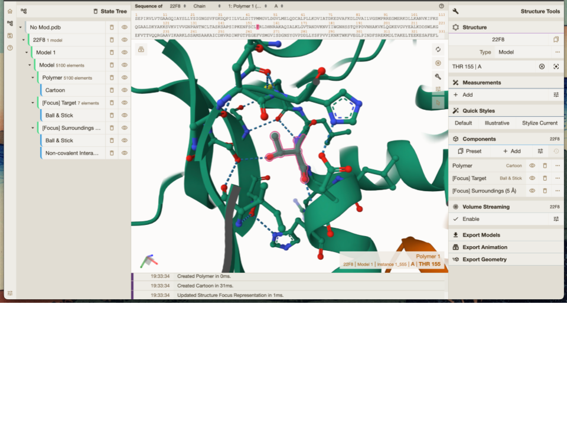
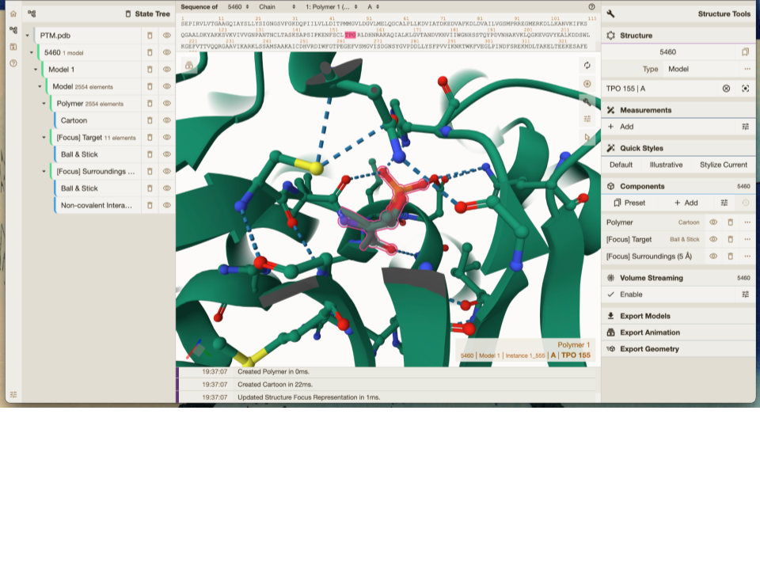
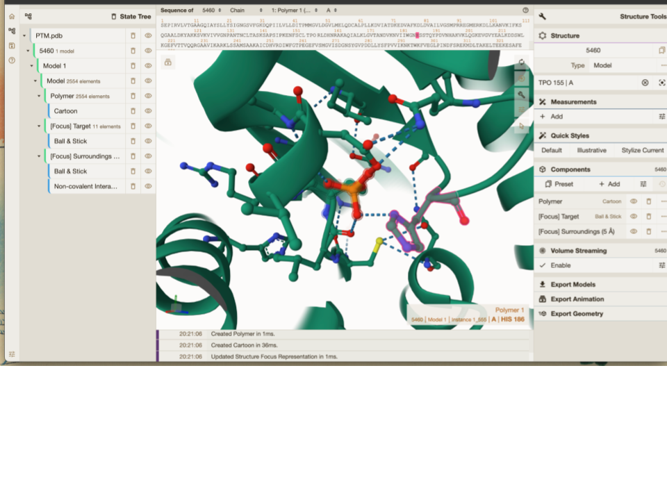
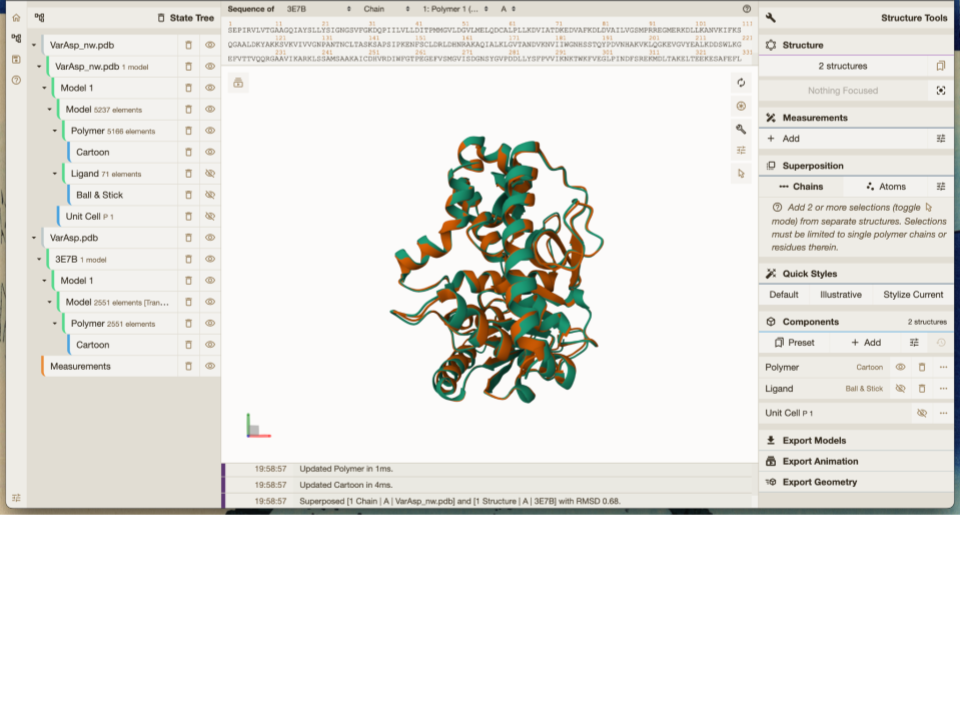
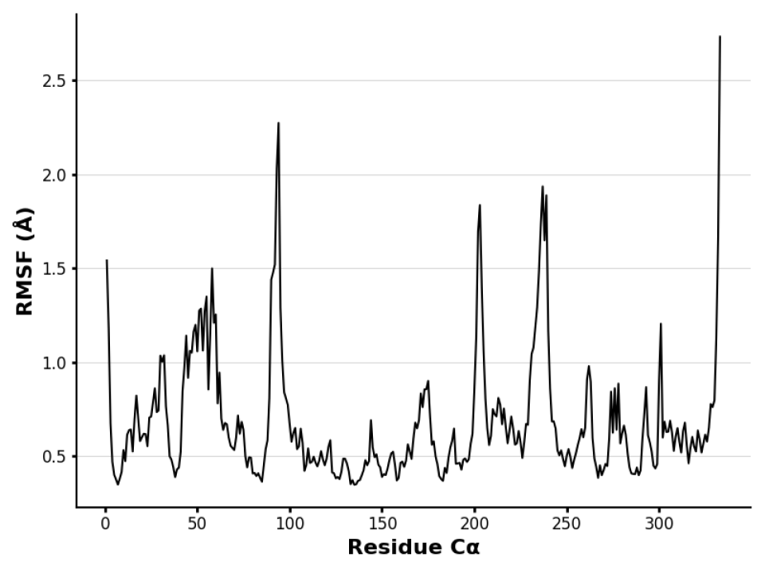
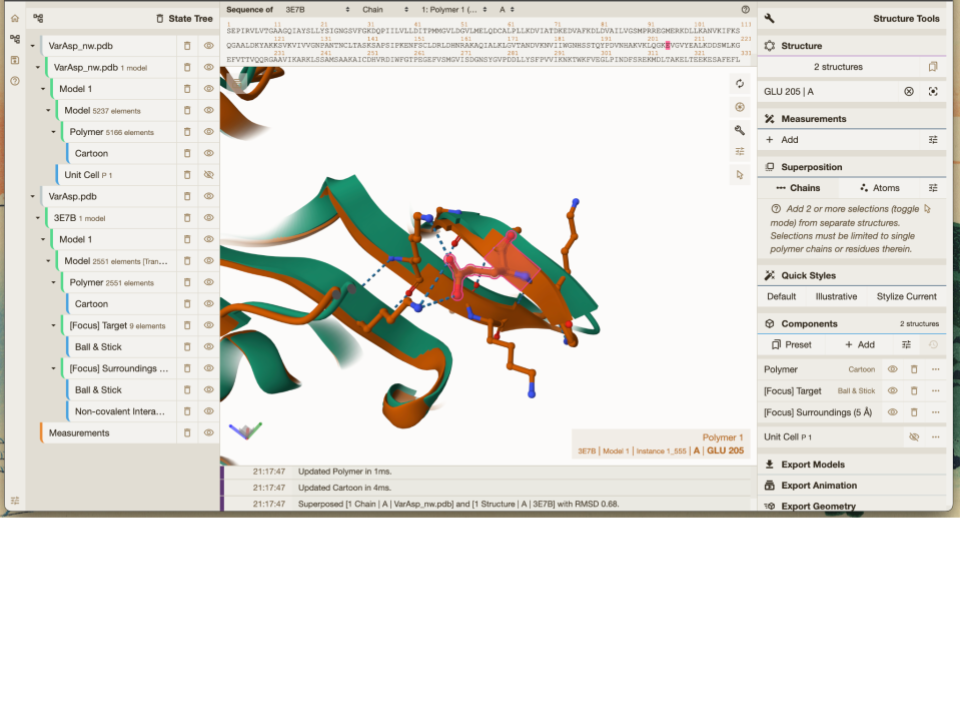
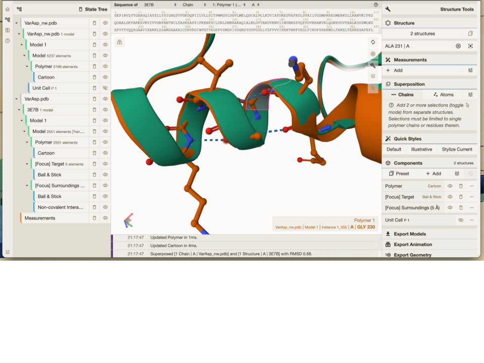
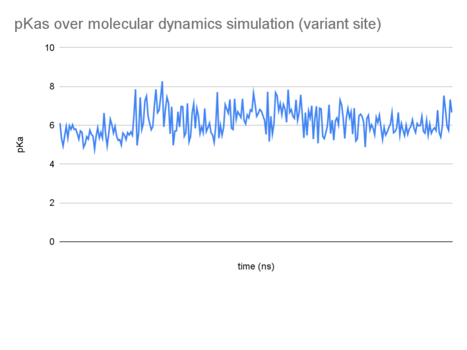
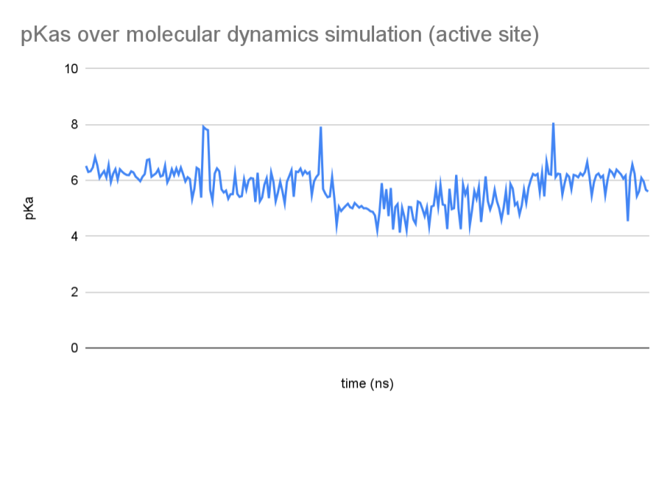
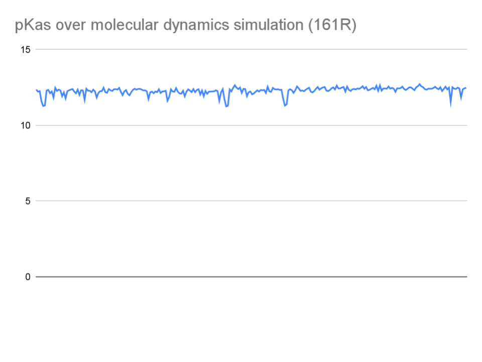

# Homo sapiens Malate dehydrogenase I
# Uniprot number: P40925
# Variation: pT156

## Description

Threonine phosphorylation has been documented in Malate Dehydrogenases (MDH) in the past, but it has only been extensively researched in bacterial and mycological samples. There are two main effects of phosphorylation (not exclusively threonine phosphorylation) on MDH (Wang et al,. 2011). First is the inhibition of in vitro activity from losing substrate affinity. Second, is increased binding to other proteins in charge of cell growth and peptidoglycan synthesis. The increased binding contributes heavily to proteolysis of the phosphorylated MDH protein (Roumestand et al., 2015). 

As stated previously, threonine phosphorylation (TPo) has not been well documented in human MDH. This report will document one specific threonine phosphorylation on the 155th amino acid of Human MDH I. 155TPo is located on a loop between an alpha helix and beta strand, and does not appear in secondary protein structures. The phosphorylation site is relatively far from the dimer interface and active site of MDH, but it is very close to 161R, a substrate binding site. Based on the enzyme mechanism, this arginine residue stabilizes the malate molecule during oxidation. Hinting at a possible change in MDH I function with the PTM modification. 

In the unmodified MDH enzyme the 155T residue interacts with 286S, 153C and 159H through hydrogen bonding (Figure I). The PTM modified site has weak interactions with 186H 154L, 190Q, 158D and 157L in the form of hydrogen bonds (Figure II). Phosphorylation as a whole adds extra electrons to the amino acid residue making it considerably more negatively charged. For ease in experimentation in laboratory settings, the post-transcriptional modification (PTM) can be emulated by substituting the threonine with an aspartic acid amino acid. The mimic variant MDH’s modified site has weak interactions with 153C,159H and 158D (Figure III). 

1. image of the unmodified site

2. image of PTM modified site

3. image of mimic variant site

## Effect of the sequence variant and PTM on MDH dynamics

Molecular dynamics (MD) simulations are computational techniques used to model the physical movements of atoms and molecules over time. By solving complex equations of motion, MD provides a dynamic view of molecular interactions based on physical principles. In each simulation step, the physics of all particles are updated, allowing researchers to observe how the system evolves. These simulations are crucial for studying biomolecular processes such as protein folding, enzyme function, and ligand binding. This is done by adding kinetic energy to the system, and visualizing how the protein falls back into a lower energy state. Additionally, longer timescales and larger system sizes may increase computational cost. For this reason, the molecular dynamic simulations for this analysis were done on the order of pico and nano seconds. 
By comparing the models of both the mimic variant before, and after the molecular dynamic simulations, it is evident that there is not much change in the structure of MDH. the secondary and to structures are identically overlapping, and do not seem to change the weak interactions they have within the protein (Figure V).

Since there are no gross changes in the models, the Root Mean Square Fluctuation (RSMF) plot can be used to visualize the distance each amino acid moved from its original position before and after the simulations. Note that the mimic variant simulations were run on one monomer, while the actual MDH protein is a dimer containing similar monomers. Notable results include a relatively low RMSF at the mimic variation site (155), and a spike in RMSF approximately at 186, the protein active site (Figure VI). A low RMSF value on a residue in a molecular dynamics simulation indicates that the residue is relatively rigid and does not deviate significantly from its average position over the simulation time. The opposite is true for a higher RMSF, the residue is more dynamic, and is able to deviate from its average position to a degree. Other notable findings are larger peaks in RMSF at around positions 205 and 230. The two amino acid residues are on the outermost surface of the protein in alpha helices. There is nothing remarkable about these positions, since the weak interactions at both positions seem largely unchanged (Figures VII, VIII). 

During MD simulations, the pKa values of key ionizable sites in biomolecules, such as amino acid residues in proteins, can shift due to dynamic changes in their local environment. These shifts occur because pKa is influenced by factors like hydrogen bonding and other weak interactions. As the molecule undergoes conformational changes or interacts with ligands and solvents, the local electrostatic environment fluctuates, altering protonation states and potentially affecting the molecule's structure and function. Notable key sites that could lead to valuable dynamics data are the mimic variant site (155D), the active site (186H) and the substrate binding site (161R). There are no major changes in pKa over the three sites indicating no changes in substrate binding or active site function (Figures IX, X, XI). 

4. image of the interactions between PTM site and active site

5. image of superimposed models

6. image of RMSF plot

7. image of notable RMSF changes

8. image of notable RMSF changes

9. image of notable pKa changes

10. image of notable pKa changes

11. image of notable pKa changes

## Comparison of the mimic and the authentic PTM

Threonine phosphorylation and the aspartic acid mimic variant both introduce negative charges to residue 155 of human malate dehydrogenase. This negatively charged environment impacts nearby interactions and the enzyme’s overall function. However, key structural and functional differences between the two models suggest that the mimic variant may not fully replicate the effects of the phosphorylation.

As discussed in the literature research and modification site section of this report, there were little to no differences in the protein structure of MDH I. There is considerable overlap of the secondary protein structures indicating that there is no major change in weak interactions differences between amino acid residues. Minor weak interaction differences between the PTM modified protein and the mimic variant are evident through PDB analysis in MolStar, but there are no changes to the dimer interface, substrate binding site or active site weak interactions (Figures I, II and III). 
The pKa shifts observed during simulations highlight differences in protonation dynamics. The PTM-induced negative charge significantly alters the local electrostatic environment, raising the pKa of 186H and reducing its ability to switch between protonated and unprotonated states. This change compromises malate oxidation efficiency. In the mimic variant, the pKa shifts are less pronounced, indicating that while there is some impact on protonation dynamics, it is not as severe as in the PTM model (Figure V). Further experimentation with both protein models is required to fully understand the functional change from the structural change. Km and Vmax experimentation could show such effects. 
The functional impact of threonine phosphorylation on MDH1 extends beyond structural changes, significantly reducing enzyme activity and substrate binding. Phosphorylation at residue 155 introduces a negative charge that disrupts nearby electrostatic interactions, impairing malate oxidation efficiency. In contrast, the T155D mimic variant introduces a smaller negative charge, which alters electrostatics less dramatically. Simulations show a weaker shift in the pKa of H186 in the mimic, allowing for a less impaired protonation cycle and higher catalytic efficiency. While the mimic approximates phosphorylation, it underestimates the full functional impairment, failing to replicate the phosphorylation-induced effect on MDH function. 
While the mimic variant T155D captures several structural and functional effects of threonine phosphorylation, it does not fully replicate the significant electrostatic and dynamic changes introduced by the PTM. The mimic variant serves as a useful approximation but may underestimate the extent of functional impairment caused by phosphorylation near the substrate binding and active sites.

## Author
Manav Rahul

## Deposition Date
06-Dec-2024

## License

Shield: [![CC BY-NC 4.0][cc-by-nc-shield]][cc-by-nc]

This work is licensed under a
[Creative Commons Attribution-NonCommercial 4.0 International License][cc-by-nc].

[![CC BY-NC 4.0][cc-by-nc-image]][cc-by-nc]

[cc-by-nc]: https://creativecommons.org/licenses/by-nc/4.0/
[cc-by-nc-image]: https://licensebuttons.net/l/by-nc/4.0/88x31.png
[cc-by-nc-shield]: https://img.shields.io/badge/License-CC%20BY--NC%204.0-lightgrey.svg

## References

* Citation1 MDH1—Malate dehydrogenase, cytoplasmic—Homo sapiens (Human) | UniProtKB | UniProt. (n.d.). Retrieved December 5, 2024, from https://www.uniprot.org/uniprotkb/P40925/entry

* Citation2 Roumestand, C., Leiba, J., Galophe, N., Margeat, E., Padilla, A., Bessin, Y., Barthe, P., Molle, V., & Cohen-Gonsaud, M. (2011). Structural insight into the Mycobacterium tuberculosis Rv0020c protein and its interaction with the PknB kinase. Structure (London, England: 1993), 19(10), 1525–1534. https://doi.org/10.1016/j.str.2011.07.011 [10.1016/j.str.2011.07.011](https://doi.org/10.1016/j.str.2011.07.011)

* Citation3 Wang, X. M., Soetaert, K., Peirs, P., Kalai, M., Fontaine, V., Dehaye, J. P., & Lefèvre, P. (2015). Biochemical Analysis of the NAD+-Dependent Malate Dehydrogenase, a Substrate of Several Serine/Threonine Protein Kinases of Mycobacterium tuberculosis. PLOS ONE, 10(4), e0123327. https://doi.org/10.1371/journal.pone.0123327[10.1371/journal.pone.0123327](https://doi.org/10.1371/journal.pone.0123327)

