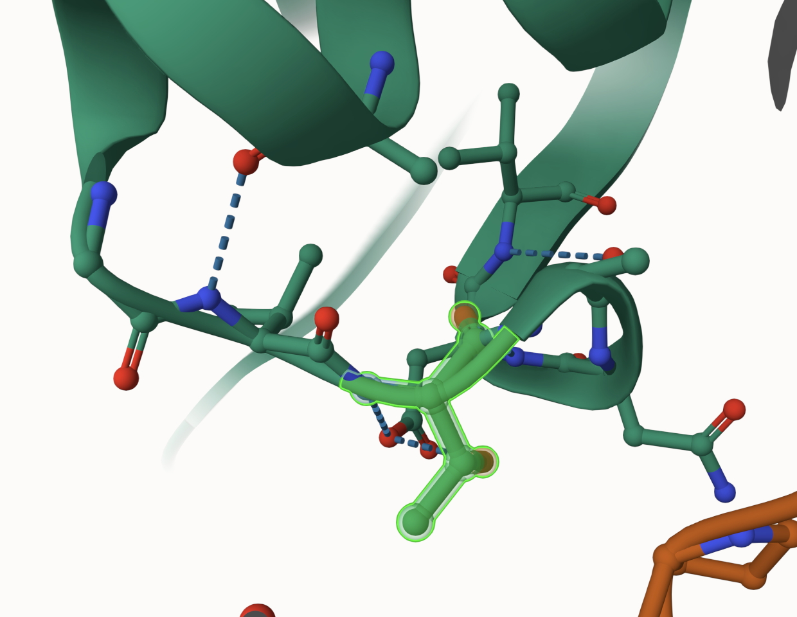
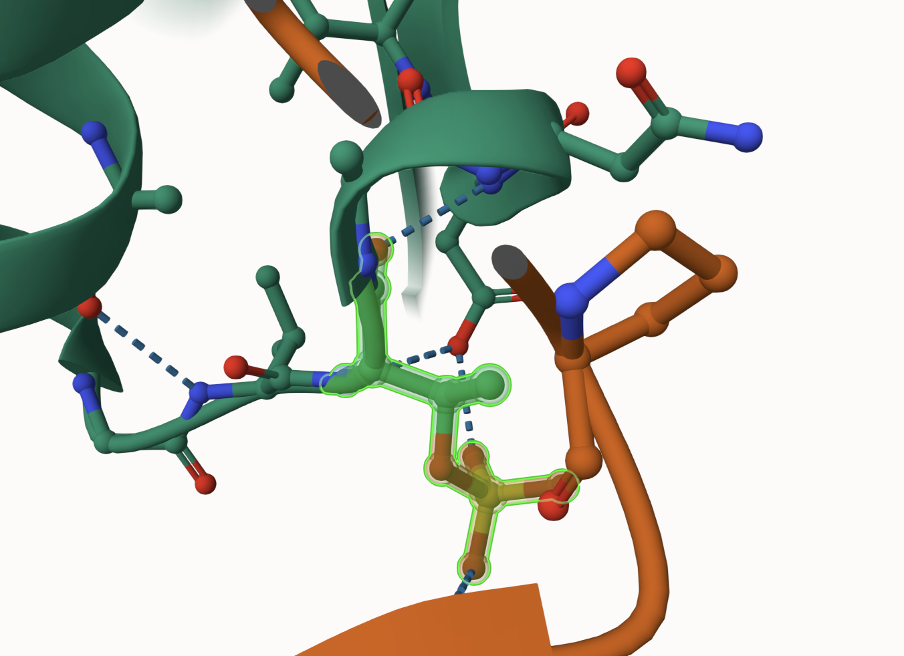
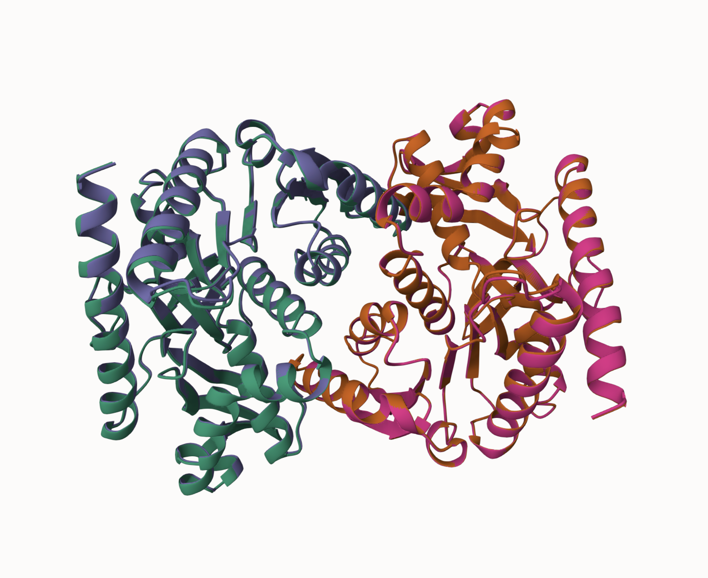
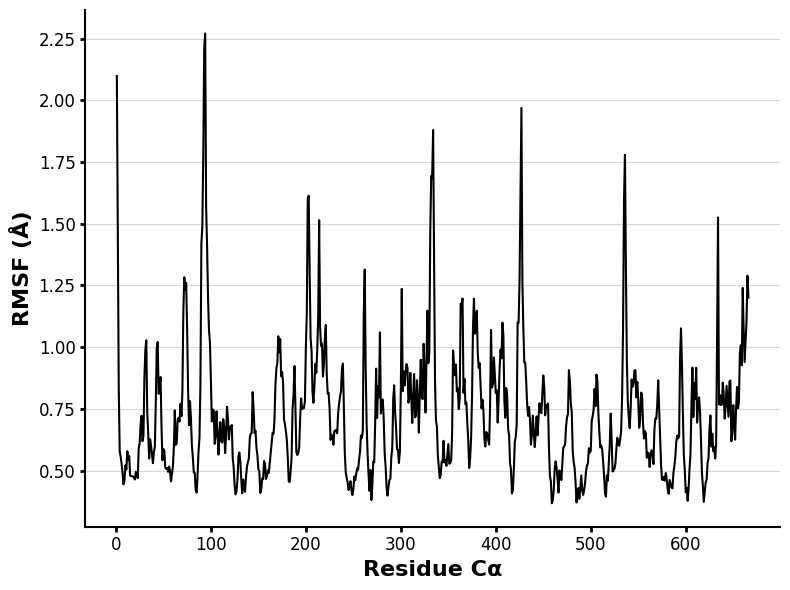
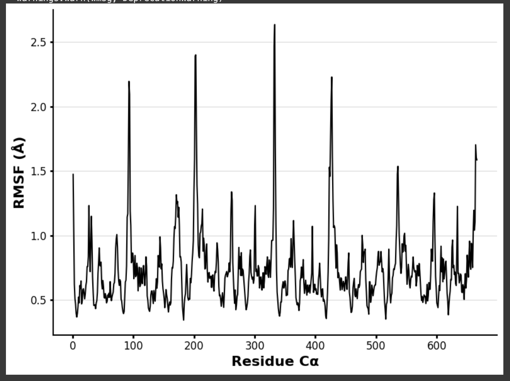
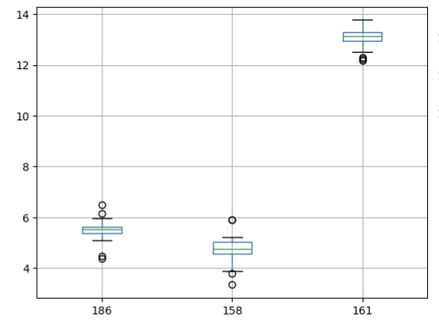
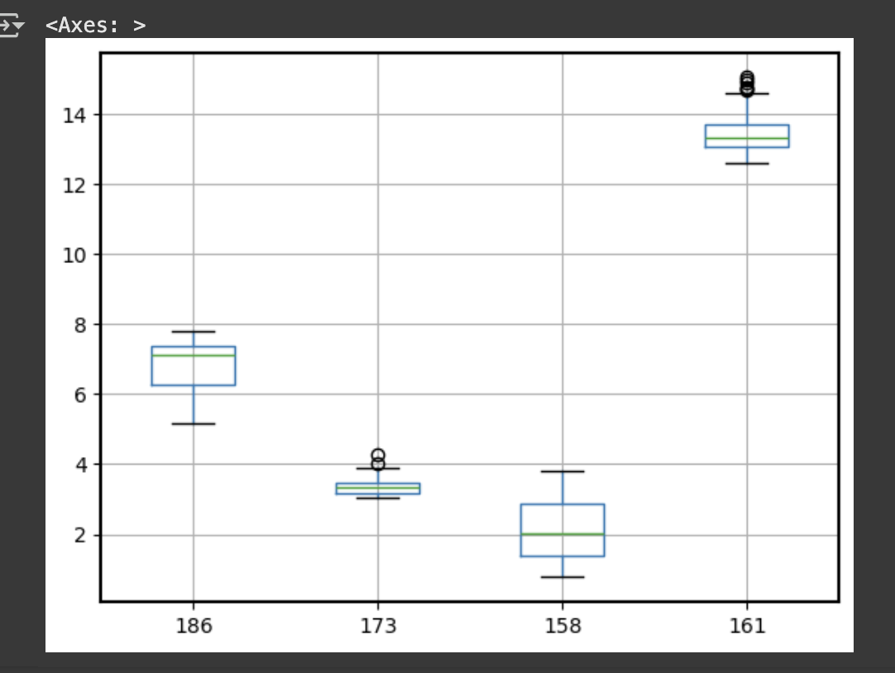

# Human and MDH1

# P40925

# T174D

## Description

According to the literature, there is limited data available on modification sites in MDH1 (Broeks, 2019). According to Uniprot, a modification at reside 174 has not been previously described before (The UniProt Consortium, 2023). Note that in this analysis, residue 174 will be referred to as residue 173 due to the use of the processed sequence, which resulted in a shift in residue numbers. The modification was developed at residue 173, in which the Threonine (T) residue was substituted for an aspartic acid (D) within the sequence. The residue 173 in the sequence is located towards the end of an alpha helix where the structure transitions into a beta sheet. Residue 173 is not observed to be positioned close to the dimer interface or the active site.

1.  Image of the unmodified site 

2.  Image of modification site 

## Effect of the sequence variant and PTM on MDH dynamics

Molecular dynamics simulations were ran in order to determine how much movement can be observed in a residue. After the simulation, there were no observed changes in the structure. Although the structures remained similar, a change in the dynamics (RMSF) was observed; A significant change was observed around the 200 residue, which was LYS. It was observed in mol\* to be positioned relatively close to the modification site and presented a hydrogen bond to the added phosphate group; The additional hydrogen bond could be a possible explanation of the shift in flexibility. At residue 200, the original RMSF presents a much lower value than the mimic RMSF. For RMSF data plots, the higher peaks commonly indicate high higher flexibility. According to the RMSF plot residue 200, LYS 65, appears to have an increase in flexibility; This is supported by the observation in mol\* of similar weak interactions.

1.  Image of aligned PDB files (no solvent) 

2.  Image of the site with the aligned PDB files (no solvent) 

3.  Annotated RMSF plots showing differences between the simulations

Image of the unmodified RMSF 

Image of the modified RMSF 

4.  Annotated plots of pKa for the key amino acids

Image of the unmodified pKa 

Image of the modified pKa 

## Comparison of the mimic and the authentic PTM

When comparing the mimic variant to the PTM modified model, it was observed that the structures were very similar. This is supported by the structures being able to be structurally aligned in mol\* as well as the low RMSD values also indicating high similarity. The weak interactions are similar in which both structures hydrogen bond to ASP 176 and LYS 65. Due to the structural alignment in Mol\*, the low RMSD value, and the identical weak interactions, it was determined that the mimic is a good approximation of the modified; therefore the mimic and modified can be used interchangeably. The alignment of the structures, the identical hydrogen bonds and low RMSD suggest no inference in the chemistry of the modification, which should indicate no change to the function; however, there was a significant change to the pKa of the active site, which could disrupt the proton transfer process that could affect hydrogen bonding leading to potential issues in function. This disfunction could alter high energy-demanding cells and organelles like the mitochondria as well as vital organs like the brain, heart, liver, and kidneys (Minárik et al., 2002).

## Authors

Karley Arbogast

## 5/7/2025

## License

Shield: 

This work is licensed under a [Creative Commons Attribution-NonCommercial 4.0 International License](https://creativecommons.org/licenses/by-nc/4.0/).

## References

-   [Broeks, M. H., Shamseldin, H. E., Alhashem, A., Hashem, M., Abdulwahab, F., Alshedi, T., Alobaid, I., Zwartkruis, F., Westland, D., Fuchs, S., Verhoeven-Duif, N. M., Jans, J. J., & Alkuraya, F. S. (2019). MDH1 deficiency is a metabolic disorder of the malate–aspartate shuttle associated with early onset severe encephalopathy. Human Genetics, 138(11–12), 1247–1257.] (<https://doi.org/10.1007/s00439-019-02063-z>)

-   [UniProt. (2025, May 7). MDHC_HUMAN (P40925).] (<https://www.uniprot.org/uniprotkb/P40925>)

-   [Minárik, P., Tomásková, N., Kollárová, M., & Antalík, M. (2002). Malate dehydrogenases—structure and function. General Physiology and Biophysics, 21(3), 257–265.]
