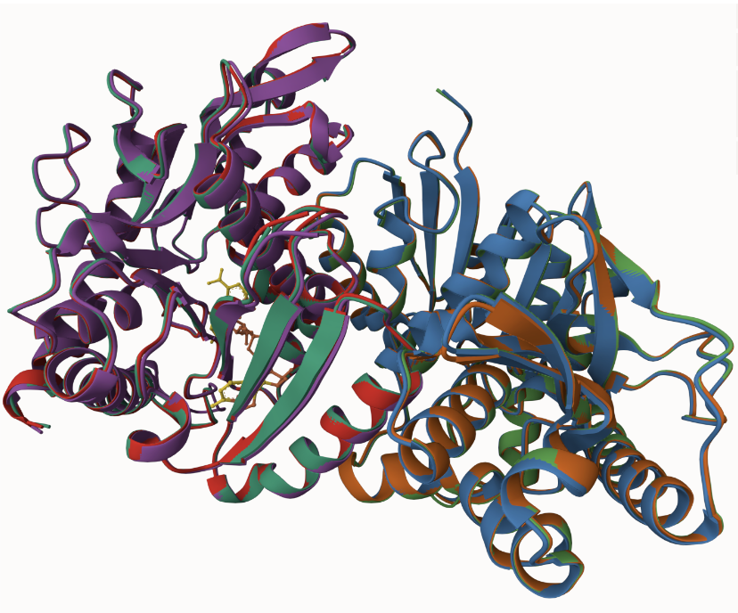
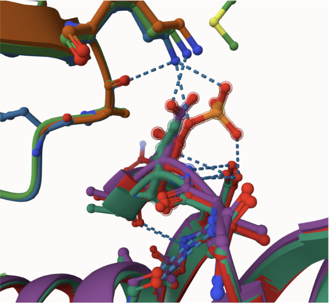
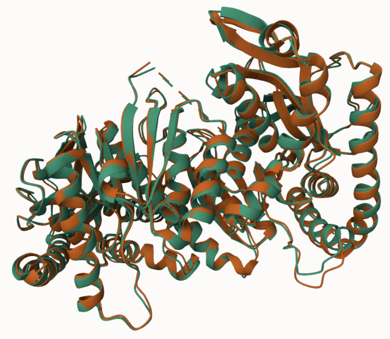
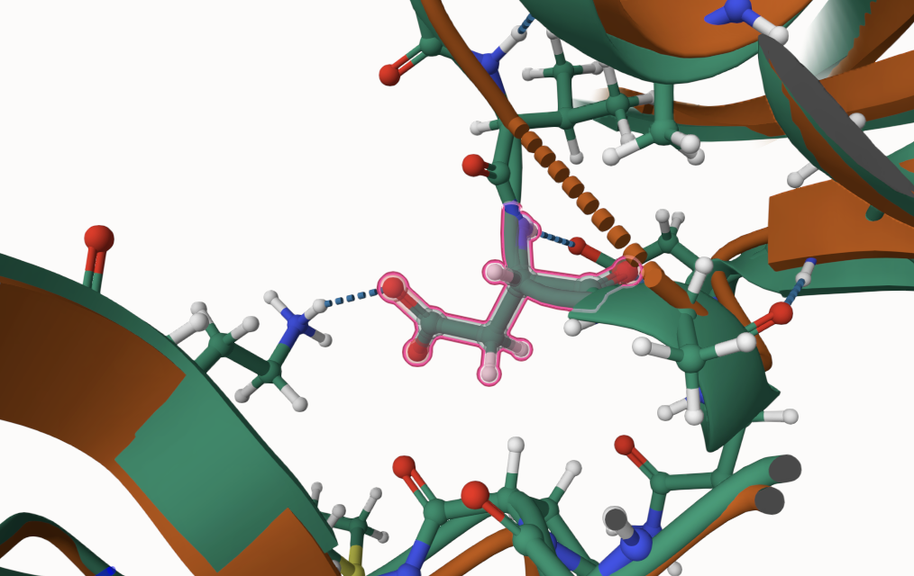
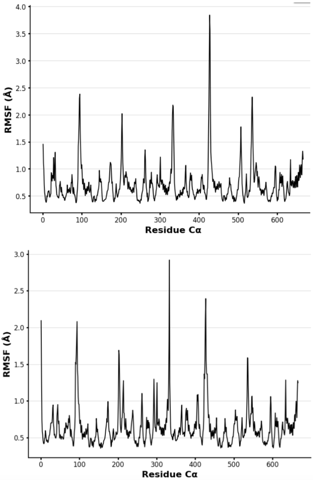
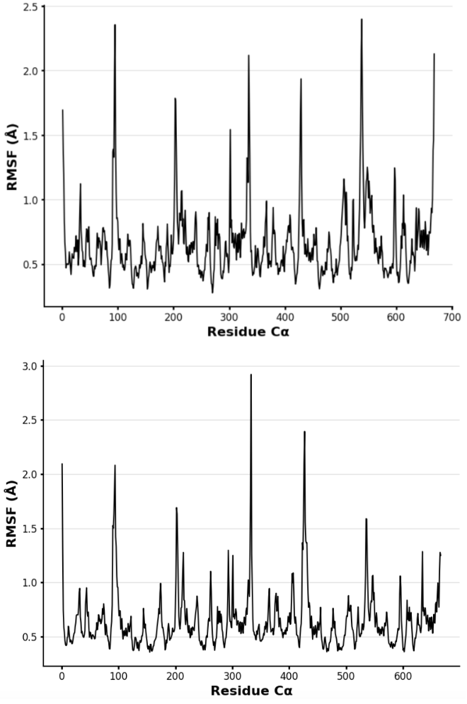
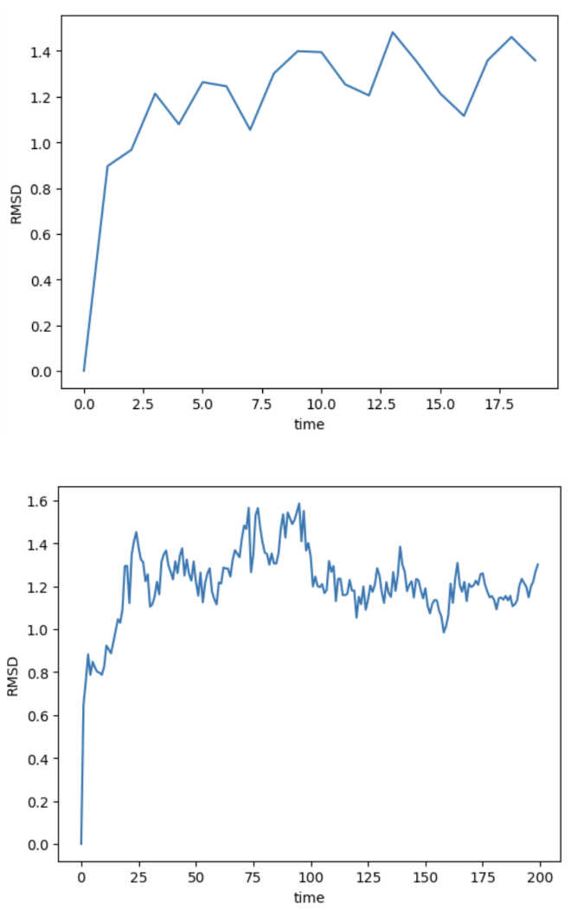
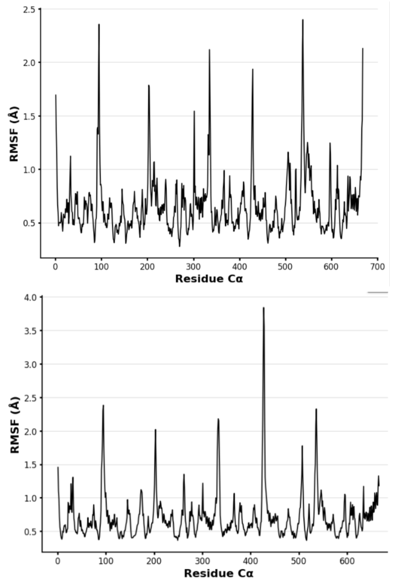

# Homo sapien MDH1
# Uniprot ID:P40925
# Variation: phosphorylation of T174

## Description

The phosphorylation of threonine at position 174 in the mutant and mimic variants and position 173 in the unmodified model has not been researched before. This residue is located on the surface of the enzyme within one of its loop regions and is situated at the dimer interface, on the same monomer as the active and substrate-binding sites, though at the opposite end. In the unmodified model, the threonine side chain forms weak interactions with asparagine at residue 175 and aspartic acid at residue 176, but these interactions are confined to the monomer and do not extend across the dimer interface. In contrast, the mutant and mimic variants both form weak interactions with lysine at residue 66, which lies on the opposite monomer, suggesting potential changes in the dimeric interface that could affect enzyme function. Furthermore, in the mutant model, threonine at position 174 forms a hydrogen bond with aspartic acid at residue 177, a feature not observed in the unmodified structure. These alterations may contribute to the structural and functional differences between the variants, particularly in how they interact with each other and with the substrate.

Alignment of MDH1(teal and orange), MDH1 with phosphoT 174(blue and red), and T174D(purple and green)

Modification site alignment within MDH1

These figures illustrate that the modified amino acid residue is located on the surface, distant from the active site, as indicated by the positioning of the ligands. Additionally, it shows that both the mimic and mutant models form hydrogen bonds across the dimer interface, as well as other interactions within one of the single monomers that are absent in the unmodified model.

## Effect of the sequence variant and PTM on MDH dynamics

These figures illustrate that the overall conformation between the phosphoT 174 and T174D models is consistent. A difference can be seen at the modification site, where the T174D model forms a hydrogen bond across the dimer interface. 

These graphs illustrate the flexibility of amino acid residues, with higher RMSF values reflecting greater flexibility. All of the models show peak values in similar residues, but there is a noticeable difference in the magnitude of these peaks. The mimic and PTM models exhibit higher peaks overall, suggesting greater flexibility compared to the unmodified model. This indicates that, in general, the mimic model is more dynamic in its structural flexibility.

These figures present the pKa values for various binding sites in MDH-1. Notably, residues that interact with similar ligands or substrates tend to exhibit comparable pKa values. This could be due to several factors: for instance, the binding of one substrate may influence the binding of another, or different residues might interact with distinct regions of NAD+, potentially enhancing catalytic efficiency. All residues shown have pKa values that overlap with those in the corresponding model, but the active site in the unmodified version displays a broader range, particularly with the outliers around a pKa of 11.

Following the simulation of the models, several noteworthy changes were observed, suggesting that even subtle structural alterations can have significant functional implications. While the structural modifications may appear minor at first glance, small changes in protein structure can influence protein-protein interactions, potentially affecting MDH-1�s role within the metabolic pathway. In particular, these changes could alter how MDH-1 interacts with other proteins, which in turn might impact its overall function.
One key observation is the increased flexibility in the T174D and phosphoT 174 models, particularly at the peaks, including at the modified residue. This heightened flexibility suggests potential changes in the enzyme's dynamic behavior, which could influence its interactions with substrates or other proteins. Interestingly, when comparing the flexibility in the region corresponding to the active site, the unmodified model shows a slightly higher RMSF value. This indicates that the unmodified model may have greater flexibility in the active site region, which could affect the enzyme�s activity and its ability to interact with substrates or regulatory molecules.
Despite these changes in flexibility, there is little variation in the pKa values at the binding sites and active site between the variant and unmodified models. This suggests that the amino acid substitution likely does not directly affect the chemical properties of these key regions. However, the changes in flexibility and the overall structure imply that the mutation could influence the enzyme's function in other ways, such as through altered conformational states or changes in protein stability. These modifications may ultimately impact how MDH-1 operates within the metabolic pathway, even if the binding interactions at the active site remain largely unaffected.

## Comparison of the mimic and the authentic PTM

Although the plots may look different, they convey similar data. The mimic model graph, while less precise, shows that MDH-1 reaches a relatively stable conformation, with the RMSD value stabilizing around 1.3. This suggests that both models achieve a stable structural state. It�s also important to note that the time durations differ between the graphs, which may account for variations in the time each model takes to reach this stable state.

The mimic variant and the mutant exhibit similar peaks in their RMSF values at corresponding residues. While the mimic variant appears to have higher RMSF values and more pronounced peaks, it is important to note that the graph for the mimic variant is scaled with a maximum value of 2.5, whereas the mutant graph is scaled to a maximum value of 4. This discrepancy in the highest peak likely arises from differences in ion positioning between the two simulations. Otherwise, the overall patterns in the RMSF profiles are quite comparable.

The pKa values for the mimic and PTM models are closely aligned, showing minimal variation. Each residue in the mimic model closely corresponds to its counterpart in the mutant model, demonstrating a strong overlap between the two structures.
Overall, the mimic and mutant protein models exhibit significant structural similarity, with no major differences observed in their overall structure or simulation behavior. Both models reach a stable conformation, with the RMSD stabilizing at approximately 1.3, indicating that they achieve a comparable level of structural stability. The residues that correspond to one another between the two models also display similar fluctuations, as evidenced by the comparable RMSF values shown in Figure 7.
Several key binding sites were analyzed for their pKa values, which remained relatively consistent across both models. The primary difference observed is in the spread of data, indicating minor variations in the local environment around some residues, though the overall trend remains consistent. Notably, the active site remains stable throughout the simulation in both the mimic and mutant models, further supporting the structural similarity between the two.
These findings suggest that, despite minor variations in data spread and specific residue interactions, both the mimic and mutant proteins preserve a high level of structural integrity. While there are differences in the altered residues, the overall function of the two models remains similar. This consistency supports the reliability of the models and demonstrates that the mimic model effectively replicates the intended structure and function.

## Authors

Caitlyn Ruth

## Deposition Date

12/06/2024

## License

Shield: [![CC BY-NC 4.0][cc-by-nc-shield]][cc-by-nc]

This work is licensed under a
[Creative Commons Attribution-NonCommercial 4.0 International License][cc-by-nc].

[![CC BY-NC 4.0][cc-by-nc-image]][cc-by-nc]

[cc-by-nc]: https://creativecommons.org/licenses/by-nc/4.0/
[cc-by-nc-image]: https://licensebuttons.net/l/by-nc/4.0/88x31.png
[cc-by-nc-shield]: https://img.shields.io/badge/License-CC%20BY--NC%204.0-lightgrey.svg

## References

* Citation1 

* Citation2 
