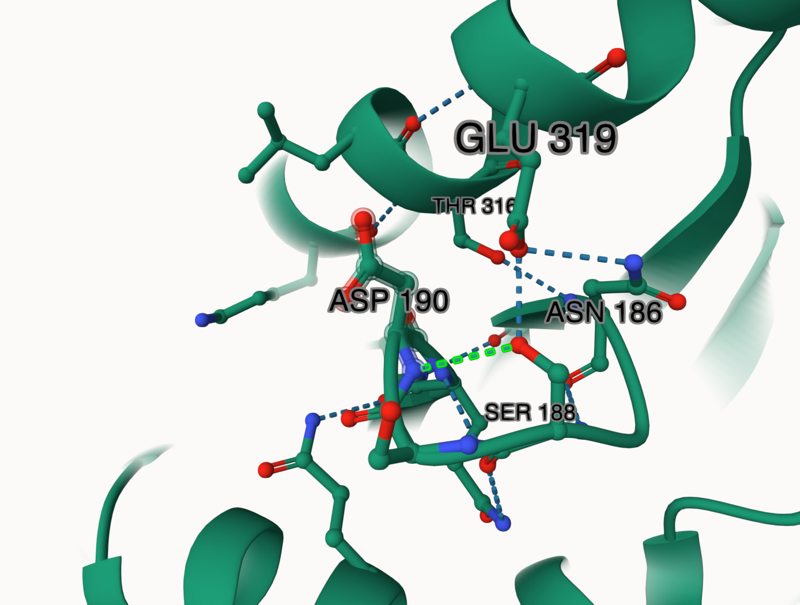

# Human MDH1
# Uniprot ID: P40925
# Variation: Phosphorylation of T190 and proline mimic variant 

Threonine 190 of human MDH1 was found to be a post translational modification site (Ochoa et al., 2020). Phosphorylation is described as being extremely important for disease related mechanisms. This study compared many phosphosites and scored them according to how important they are. The phosphates threonine at T190 was given a functional score of 0.265, which coincides with how close it is to the active site at AA186. Another study found a common proline variant in place of the threonine (EMBL-EBI ProtVar). This variant was found to be pathogenic and deleterious in nature, although no diseases have been directly linked to this variant yet.

Among the three different states, several amino acids interact with the modification site. In the unmodified state, GLN190 is near SER187, ASP158, GLN227, and PRO192 (Figure 1). In this unmodified state, GLN190 forms two hydrogen bonds to SER187, one hydrogen bond to ASP158, and one hydrogen bond to GLN227. In the modified state, TPO190 is near GLU319, SER189 and SER188 (Figure 2). The phosphothreonine forms a total of three hydrogen bonds with each of the previous amino acids (Figure 2). The variant state modification site is near SER188, ASN186, GLU319, SER189, and THR316. Although this variant is close to several amino acids, it only forms one hydrogen bond with SER188. There are no ionic interactions close to the modification site throughout the three different states. Secondary structure is retained throughout all three states. In the unmodified state, AA190 is not located on an alpha helix or beta sheet, and this structural component remains the same across all states. 

1. image of the unmodified site

2. image of modification site PTM

3. image of mimic variant

The PTM changed the unmodified state of the modification site by replacing the glutamine amino acid with a phosphothreonine. The mimic variant changed the structure by replacing the threonine with an aspartic acid. Starting from the unmodified state and transitioning into the modified and variant states, a loss of weak interactions is observed. The unmodified state begins with four hydrogen bonds to surrounding amino acids, whereas the modified and variant states only have three and one hydrogen bonds respectively. This progressive lack of hydrogen bonds indicates less stability within the modified and variant states (Bowie, 2011). This difference in stability may cause problems for the function of the PTM and mimic variant states. The function could also change given that the mimic variant state involves a substitution of an aspartic acid. While both threonine and aspartic acid are polar, threonine is uncharged while aspartic acid is negatively charged. This change in charge status could alter the types of weak interactions that are taking place within the protein and allow for new interactions to happen. The introduction of aspartic acid may allow for ionic interactions to take place with neighboring amino acids. Specifically, an ionic interaction could take place between ASP190 and LYS312 or HIS187, since they have complementary charges. 

Although these amino acids are slightly far from AA190, the substitution of an aspartic acid opens the door for ionic interactions to occur at this site. Slight changes in structure like the addition of a phosphate or the switch of an amino acid could be detrimental to MDH1 activity and have broader implications. Since MDH1 plays a role in the malate-aspartate shuttle it is responsible for the balance of NAD/NADH+ throughout the cytosol. Once thrown off, this balance can cause trouble for other pathways that rely on NAD/NADH+ such as the citric acid cycle (McCue & Finzel, 2022). Additionally, increased NAD concentrations have been linked to cancer and tumor progression (McCue & Finzel, 2022). 
Molecular dynamics revealed that the mimic variant state had an effect on flexibility. When comparing the unmodified state RMSF plot and the mimic variant RMSF plot, the mimic variant plot showed more areas of large differences between peaks and surrounding valleys (Figure 5). These large differences indicate flexibility within these positions that may be attributed to functional or conformational changes. The mimic variant displayed high areas of flexibility in the regions of ~95-105, ~195-200, and ~550-600 (Figure 5). When comparing the unmodified and mimic variant RMSF plots, these regions of flexibility align with each other (Figure 5). The height of the peaks in the mimic variant RMSF plot is more drastic, and this may be because the single amino acid change reduced the number of stabilizing hydrogen bonds which made the protein more flexible. The regions near key sites are expected to have higher flexibility, since they are undergoing more functional changes via binding and interacting with other molecules.. Both RMSF plots indicate a valley around the active site position of AA186/187, which can be compared to the heightened peak near the 200 position. When comparing the pKa values of key sites between the unmodified and mimic variant states, some discrepancies are present. In the mimic variant state, AA190 had pKa values between 3.3-4.7 and AA187 had values between 4.3-7.5. This greater range of values associated with AA187 makes sense, because it is closer to the active site and would be undergoing changes such as substrate binding, which alters pKa values. The unmodified values indicate that AA191 had a range from 12-14 and AA186 had a range from 5-8. A major difference is seen between the two ranges of AA190/191. The higher pKa values from the unmodified AA191 indicate that the amino acid glutamine is less inclined to donate protons in chemical interactions and reactions. The lower pKa value range in the mimic variant state indicates that AA190 aspartic acid is a stronger acid and is willing to give up its protons more readily. This difference means that the unmodified state is more stiff and less reactive and the mimic variant state is more reactive, which also coincides with the varying amounts of hydrogen bonds. 

The model and simulation data match well between the mimic variant and PTM modified protein. Looking at the model, similar structures are seen and secondary structure is conserved (Figure 6). The PTM and mimic variant also have similarly sized side chains (Figure 6). One key difference between the PTM and mimic variants structurally is the difference in hydrogen bonding (Figure 6). While the PTM state forms three hydrogen bonds, the mimic variant only forms one hydrogen bond. This further confirms the difference in stability between the two, and points to the PTM state as being more stable. Additionally, this lack of hydrogen bonds in the mimic variant state may impact the nearby active site. Substrates may not be able to bind correctly to the active site if it is not stable enough, which would impact the rest of the metabolic pathway. Overall, the mimic is not a good representation of the PTM despite the structural similarities. The biggest concern is the difference in hydrogen bonds, and the integrity of the active site with less stabilizing bonds nearby. The proline variant also is charged while the PTM remains uncharged, which is another difference that could result in new ionic interactions within the protein. The best representation of the PTM would be a mimic variant with the same amount of hydrogen bonds, the same charge status, and the same polarity status. 

2. image of modification site PTM

# Author name

Katherine Marnell 

## Deposition Date

## License

Shield: [![CC BY-NC 4.0][cc-by-nc-shield]][cc-by-nc]

This work is licensed under a
[Creative Commons Attribution-NonCommercial 4.0 International License][cc-by-nc].

[![CC BY-NC 4.0][cc-by-nc-image]][cc-by-nc]

[cc-by-nc]: https://creativecommons.org/licenses/by-nc/4.0/
[cc-by-nc-image]: https://licensebuttons.net/l/by-nc/4.0/88x31.png
[cc-by-nc-shield]: https://img.shields.io/badge/License-CC%20BY--NC%204.0-lightgrey.svg

## References

* UniProt. https://www.uniprot.org/uniprotkb/P40925/entry (accessed 2024-11-08). 

* Ochoa, D.; Jarnuczak, A. F.; Viéitez, C.; Gehre, M.; Soucheray, M.; Mateus, A.; Kleefeldt, A. A.; Hill, A.; Garcia-Alonso, L.; Stein, F.; Krogan, N. J.; Savitski, M. M.; Swaney, D. L.; Vizcaíno, J. A.; Noh, K.-M.; Beltrao, P. The Functional Landscape of the Human Phosphoproteome. Nat Biotechnol 2020, 38 (3), 365–373.  

* EMBL-EBI ProtVar - Contextualising human missense variation. https://www.ebi.ac.uk/ProtVar/query?search=P40925%20T190P (accessed 2024-12-06) 

* Bowie, J. U. Membrane Protein Folding: How Important Are Hydrogen Bonds? Curr Opin Struct Biol 2011, 21 (1), 42–49 

* McCue, W. M.; Finzel, B. C. Structural Characterization of the Human Cytosolic Malate Dehydrogenase I. ACS Omega 2022, 7 (1), 207–214. 
