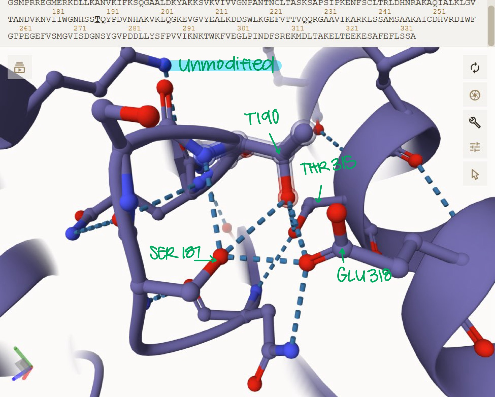
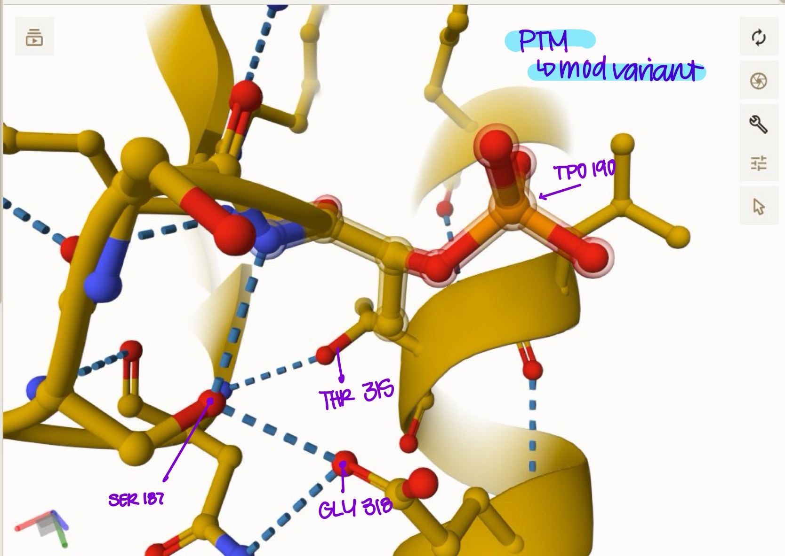
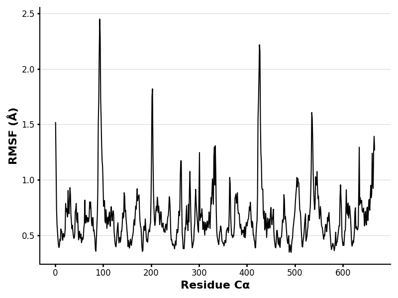
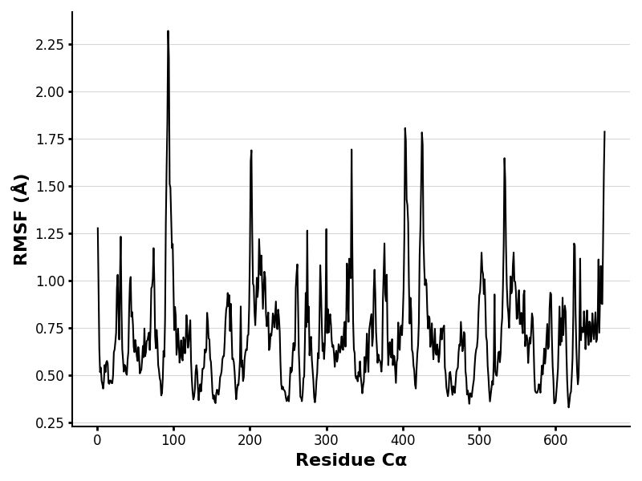
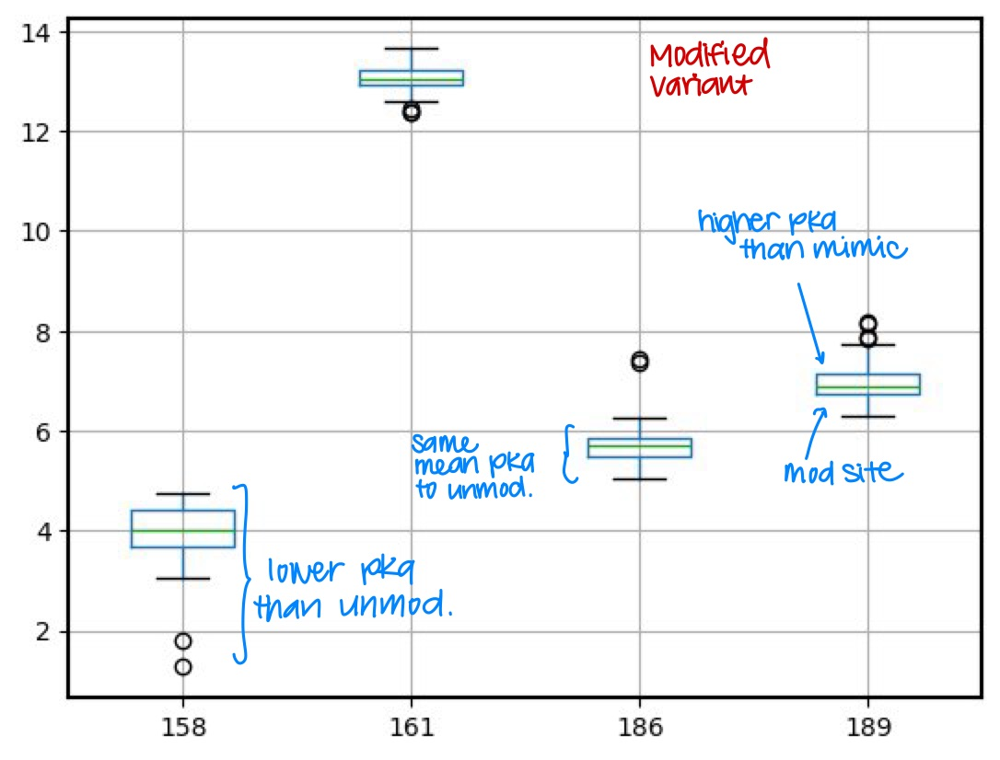
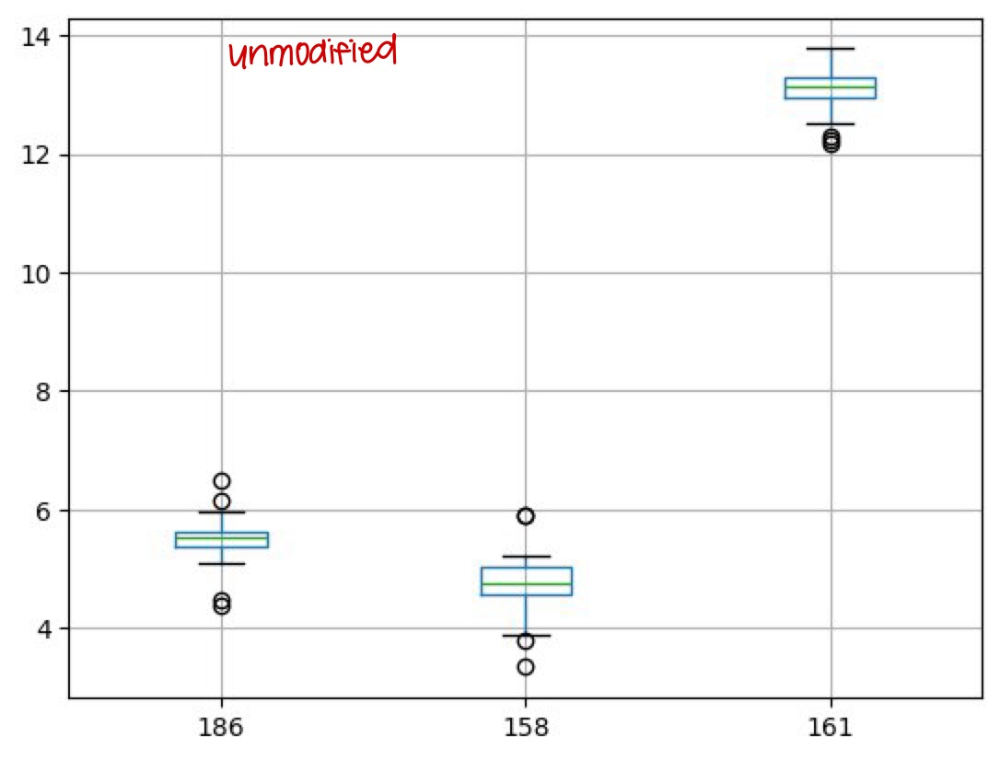

# Malate Dehydrogenase

# P40925

# T190p

The enzyme human malate dehydrogenase, also known as MDH, is an enzyme that plays a crucial role in the citric acid cycle1. The citric acid cycle produces NADH and FADH2, which are used in the electron transport chain to synthesize ATP. In the citric acid cycle, MDH1 participates in the malate-aspartate shuttle, by catalyzing malate to oxaloacetate in the cytoplasm. MDH1 extracts a hydrogen atom from malate, converting it into oxaloacetate. Simultaneously, a nearby NAD⁺ molecule accepts the hydrogen atom, resulting in the formation of NADH. These reactions are reversible, which is crucial for gluconeogenesis and regulation of the citric acid cycle3. MDH2 is responsible for converting malate to oxaloacetate in the mitochondria during the citric acid cycle.

Malate dehydrogenases are the most stable as dimers, and have two binding sites, one for a substrate and the other a coenzyme. The substrate binding site is called the carboxyl-terminal domain, and the coenzyme site is called the NAD+ binding domain (this is where the Rossman fold is found). Key residues of the substrate binding site and active site include HIS 187, ARG 92, 98, and 1624. The arginine's help orient the ligands so that the histidine is able to perform proton transfer4. In this report, the structural and functional effect of a post-translational modification variant of MDH will be studied as well as another variant of MDH that mimics the PTM. The modification will occur on T190, the type of PTM is phosphorylation and the mimic of the PTM replaces T190 with an aspartic acid (D190). The PTM variant will be referred to as the modified protein, and the PTM mimic will be referred to as the mimic protein.

There is not currently any literature on these exact modification variants or mimic variants. The location of the modification is on amino acid 190, which is on the same loop as HIS 186. This is where the active site of the protein is. On the unmodified enzyme, T190 creates hydrogen bonds with SER 187 (in 2 places) and GLU 318 (Figure 3), as well as THR 315. On both of the modified (Figure 2) and mimic protein sequences, all but one hydrogen bond are lost (Figure 1). The amino acids that interact with the PTM site of the modified protein is SER 187, with only 1 hydrogen bond, same with the mimic sequence.

2.  image of modification site 

## Effect of the sequence variant and PTM on MDH dynamics

The original, unmodified processed sequence was found in Uniprot and put into AlphaFold3. Then in AlphaFold, the Post Translational Modification (phosphorylation) was applied onto T190, and this gave a model that could be put into molstar to look closely at the structure. For the mimic sequence, the unmodified sequence was inserted into Alpha Fold, and T190 was manually changed to D190. Once again, this outputted a file where the structure could be examined in Mol\*. The modified sequence was also put into Boltz-1 to get a better understanding of the 3D structure.

According to the weak interactions as stated above, both the modification and the mimic have less hydrogen bonds around the active site. However, there are no changes of weak interactions in HIS 186, which is the main amino acid that does the chemistry of the reduction of oxaloacetate to malate. There are also no differences in hydrogen bonds or weak interactions within the amino acids that are said to hold the ligand (OAA). However, when there is a change in hydrogen bonds, there is likely to be a change in protein folding. There is likely less stability of structure without the hydrogen bonding in the modified and mimic proteins. Since the change in stability is so close to the active site, it might inhibit the function of the active site.

After running the molecular dynamic simulations5, we are able to compare pKa values and RMSF values of the mimic variant to the unmodified protein. For the unmodified protein HIS 187 has a mean pKa of 5.5 with a range of 2.09, and for the mimic protein it has a mean pKa of 5.9 with a range of 3.8. This means that histidine is deprotonated for both the mimic and unmodified proteins at a pH 7. ASP 159 has a mean pKa of 4.74 and a range of 2.5 for the unmodified protein. For the mimic, the pKa of ASP 159 is averaged to be 4.38 with a range of 2.00. This means aspartic acid is deprotonated at a pH 7. Lastly, ARG 162 has an average pKa of 13.09, a range of 1.60, and is protonated at pH 7 for the unmodified version of MDH. The pKa value for ARG162 is about the same for the mimic protein as well. Overall, there is not too much variation of pKa values between sequences.

3.  Annotated RMSF plot showing differences between the simulations 

4.  Annotated plots of pKa for the key amino acids

![Figure 5. pKa values of the mimic variant at key residues (images/MimicBoxplot.png)

## Comparison of the mimic and the authentic PTM

There are little structural differences between the modified protein and the mimic protein. The only prevalent structural difference is the modification itself. Both modification sites interact with the same amino acids. There are so many other places where the structure is different, which can be seen when the two structures are superimposed (Figure 9).

According to molecular dynamic simulation, the PTM variant has the same high peak around residue 100 and more pronounced peaks throughout the graph than the mimic. The modified graph reflects more of the unmodified RMSF values mostly at a smaller scale, rather than the mimic protein (Figure 8).The pKa values of the modified protein reflect most against the PTM mimic variant (Figure 10). Due to the structural and dynamic data, the mimic variant is a good approximation of the PTM variant.

### Colab notebook links

<https://colab.research.google.com/drive/1rNM6DEdP_kL0R8WkZrG8hakrSPNlg9d6>

<https://colab.research.google.com/drive/1DGybbAelVk3h_UXKqgHR5CJTVQkPVjS4>

## Authors

Taylor

## 5/7/2025

## James Madison University

Shield: 

This work is licensed under a [Creative Commons Attribution-NonCommercial 4.0 International License](https://creativecommons.org/licenses/by-nc/4.0/).

## References

(1) Berndsen, C. E.; Bell, J. K. The Structural Biology and Dynamics of Malate Dehydrogenases. Essays Biochem 2024, 68 (2), 57–72. <https://doi.org/10.1042/EBC20230082>.

Gives details about the structure and the configuration of malate dehydrogenase and explains the active sites in malate dehydrogenase. Also, describes how the enzyme of MDH1 functions.

(2) Akram, M. Citric Acid Cycle and Role of Its Intermediates in Metabolism. Cell Biochem Biophys 2014, 68 (3), 475–478. <https://doi.org/10.1007/s12013-013-9750-1>.

Explain in depth how the citric acid cycle functions and its role in other metabolic processes (precursor). It also gives information on MDH's role in the citric acid cycle.

(3) Takahashi-Íñiguez, T.; Aburto-Rodríguez, N.; Vilchis-González, A. L.; Flores, M. E. Function, Kinetic Properties, Crystallization, and Regulation of Microbial Malate Dehydrogenase. J Zhejiang Univ Sci B 2016, 17 (4), 247–261. <https://doi.org/10.1631/jzus.B1500219>.

This points out why it is so important for the MDH reaction to be reversible. It also gives insight to how the citric acid cycle works.

(4) Charles S. Fermaintt, Sarah A. Wacker; Malate dehydrogenase as a multi-purpose target for drug discovery. Essays Biochem 3 October 2024; 68 (2): 147–160. doi: <https://doi.org/10.1042/EBC20230081>

Gives information on potential active site residues of MDH. This gave a hint at where to look when looking for discrepancies between the different sequences.

(5) Kayll, A.; Sardelli, A.; Berndsen, C. Google colab MD Analysis. <https://colab.research.google.com/drive/1PZFE8YEK4i_HJJbnRInhofdwlOSD_Plr#scrollTo=hSssfTbJCORW> (accessed 2025-03-14).

This Colab ran a simulation of our sequence’s molecular dynamics. It outputs the pKa values of the amino acid side chains over the course of the simulation. This allowed me to account whether the active site amino acids were protonated or not, and whether there was a large change in environment around the active site.
