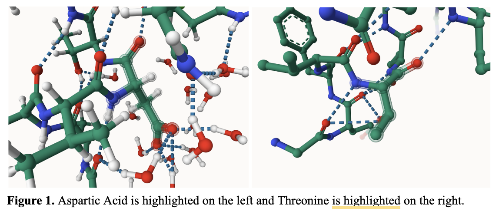
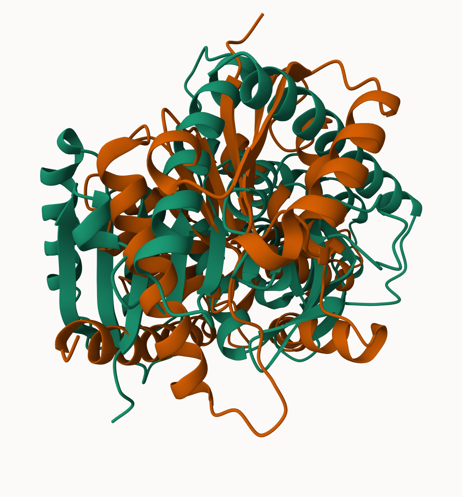
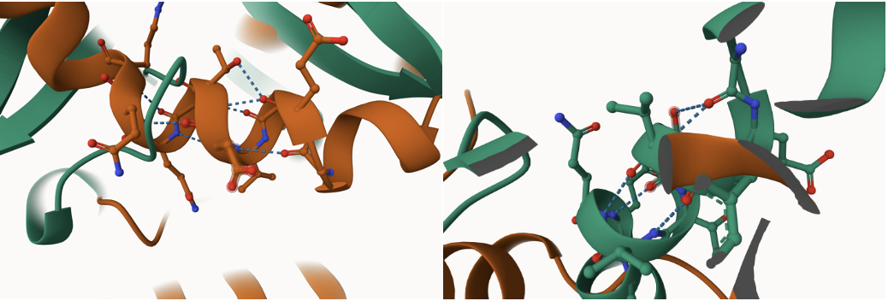
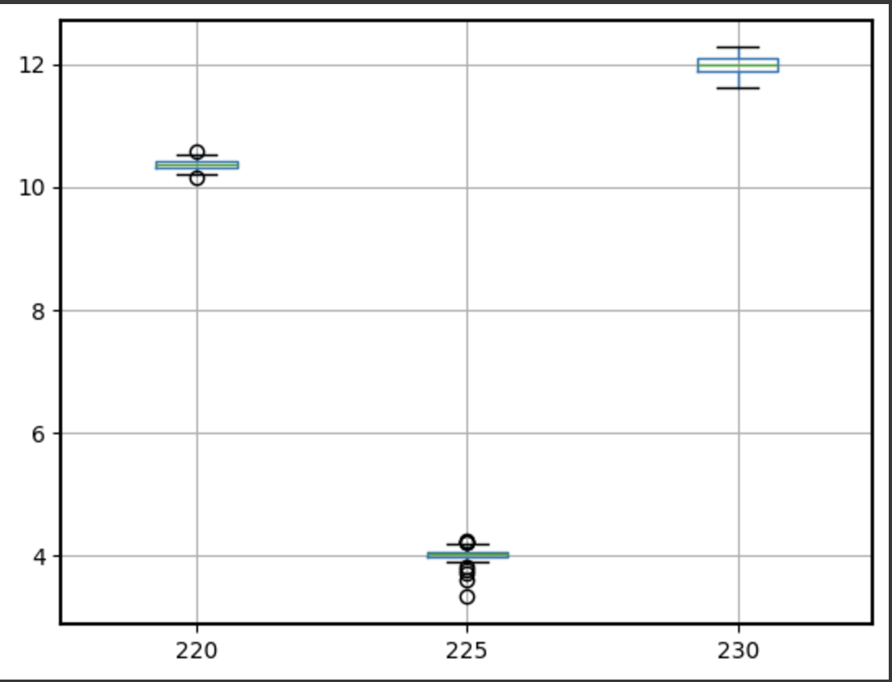
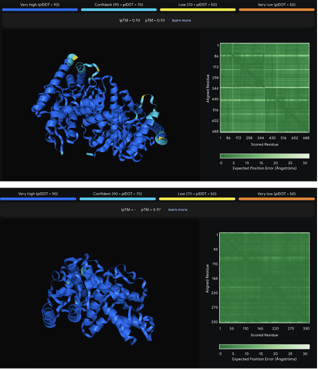

# Human MDH1
# P40925
# 225 PTM - p

MDH1 being affected at AA225 by changing Threonine to Aspartic Acid affects the overall shape of the protein.

Beta sheets are formed when multiple linear sequences of amino acids are aligned and held stable by hydrogen bonds from a carbonyl group. Threonine's functional group is a hydroxyl group and Aspartic Acids is a carboxyl group. Threonine’s hydroxyl group creates a polar but neutral amino acid the Aspartic Acid carboxyl group creates a polar but acidic amino acid. Therefore, by having Threonine mutated to Aspartic Acid, the beta sheets create more stabilization due to more hydrogen bonds allowed for form.

1. image of the unmodified site

2. image of modification site

## Effect of the sequence variant and PTM on MDH dynamics

Part 3 from the Project 4 report

1. Image of aligned PDB files (no solvent)

2. Image of the site with the aligned PDB files (no solvent)

3. Annotated RMSF plot showing differences between the simulations

4. Annotated plots of pKa for the key amino acids

With the PTM mimic being phosphorylated, it has been chemically modified and with the mimic variant, Aspartic Acid has replaced Threonine. Therefore, by modifying the protein to be Aspartic Acid in comparison to Threonine, the modification has relatively the same accuracy. With the PTM mimic, there is a largely increased accuracy. 

## Comparison of the mimic and the authentic PTM

Part 4 from the Project 4 report outline

The overall function of MDH1 could be impaired with its enzyme’s stability, activity, or the metabolic processes it supports, leading to disruptions in cellular energy homeostasis. However, with the statistics above, the mutation of Threonine to Aspartic Acid has a more defined and confident score in its structure and function meaning that Aspartic Acid could allow MDH1 to be more stable.

# Contributors names
Landen Tomlin

12/6/2024

## License

Shield: [![CC BY-NC 4.0][cc-by-nc-shield]][cc-by-nc]

This work is licensed under a
[Creative Commons Attribution-NonCommercial 4.0 International License][cc-by-nc].

[![CC BY-NC 4.0][cc-by-nc-image]][cc-by-nc]

[cc-by-nc]: https://creativecommons.org/licenses/by-nc/4.0/
[cc-by-nc-image]: https://licensebuttons.net/l/by-nc/4.0/88x31.png
[cc-by-nc-shield]: https://img.shields.io/badge/License-CC%20BY--NC%204.0-lightgrey.svg

