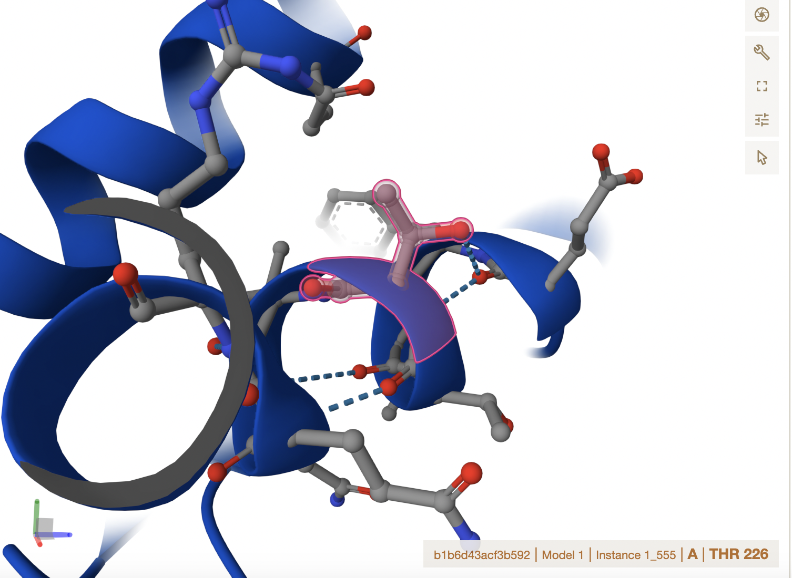
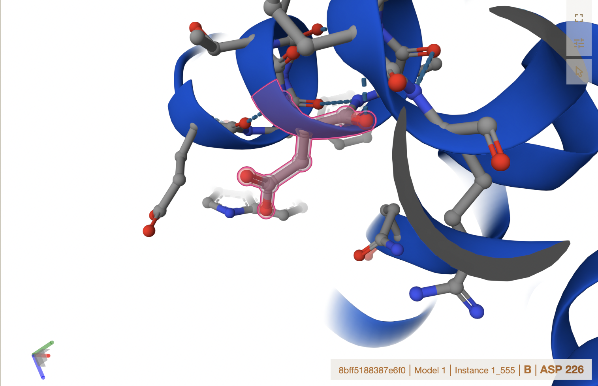
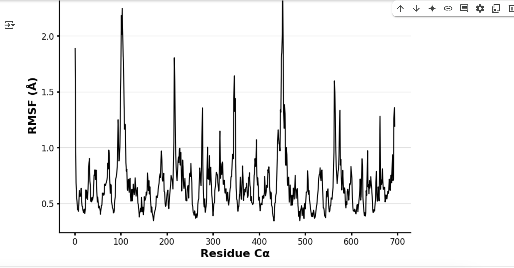

# Homo Sapien Malate Dehydrogenase

# P40925

# Phosphorylation

## Description

# Malate dehydrogenase, or MDH, is an enzyme involved in many metabolic processes in humans. MDH is composed of multiple protein subunits, and it can be seen as either a dimer or tetramer. It is seen in both the cytoplasm and the mitochondria, where it participates in different metabolic processes. MDH1, or cytoplasmic MDH, catalyzes the reductions of keto-acids, transports electrons to the mitochondrial matrix for oxidative phosphorylation, and catalyzes the conversion of malate to oxaloacetate, or vice versa, in the Krebs Cycle with NAD/NADH.1,2,3

```         
   With the importance of MDH1 in many metabolic processes that provide energy or reduce the risk for acidosis, mutations in MDH1 have been correlated with the development of cancer and disorders of the nervous system.4 Cancers in the breast tissue, prostate, and pancreatic ducts have been associated with isoforms, or different versions of a protein, due to variations in the amino acid sequence of MDH1 and MDH2. In the literature piece, ?Physiology of malate dehydrogenase and how dysregulation leads to disease,? the authors believe the correlation between these cancers and the isoforms of MDH1 and MDH2 make MDH a ?potential target in metabolic dysregulation.?5 This creates an emphasis on the importance of research on malate dehydrogenase and regulation of this enzyme. 
   After completing a literature search, there have been some types of regulation of malate dehydrogenase discovered, but more research needs to be done. However, it is known that malate dehydrogenase is regulated by feedback inhibition, competitive inhibition, and allosteric regulation.6 Feedback inhibition regarding MDH1 is triggered by high concentrations of oxaloacetate and NADH in the Krebs Cycle.7 High concentrations of oxaloacetate and NADH means that malate no longer needs to be converted to oxaloacetate for the time being. Competitive inhibition to regulate MDH1 has been studied, and phenols, except for 2,4,6-trinitophenol, were found to be competitive inhibitors by competing with NAD for the conversion of malate to oxaloacetate.8 Lastly, allosteric inhibition is evident in MDH when citrate binds to a regulatory site of MDH, reducing the binding ability of NADH.9 
```

Previous Knowledge of Modification Site

```         
   After searching the variant section of UniProt, I found two variants to amino acid 225 in the regular sequence of MDH1.10 While these variants are not the post-translation modification that has been assigned to me, it is important to explore how these variants change interactions within the enzyme. The first variant was a change from the amino acid threonine to the amino acid alanine. Once placing this variant into AlphaFold, there are immediately noticeable differences in structure and function. The left-hand side displays the structure for MDH with no variants. There is evidence of threonine binding to oxygen and hydrogen, while on the right-hand side where threonine has been replaced by alanine, there is now nitrogen bonding and hydrogen bonding. This can change how MDH1 functions, which can impact its function in metabolic processes.11
```

1.  image of the unmodified site 
2.  image of modification site  \##
    Effect of the sequence variant and PTM on MDH dynamics While there
    is evidence on how the structure may differ with variants which can
    impact the protein?s function, the post-translational modification
    and mimic variant are both not near the active site, which is at
    amino acid 187 of the regular sequence, and these variants are
    occurring at amino acid 226 of the process sequence. Since these
    variants do not clearly affect amino acids involved in substrate
    binding or around the active site, there is no evidence that this
    specific PTM or mimic variant impacts MDH1 binding with other
    enzymes or substrates. While amino acid 226 of MDH1 is not near the
    active site or any amino acids involved in substrate binding,
    changes in the protein structure can still change the overall shape
    and function of MDH1, which can impact its role in metabolic
    processes. For example, if MDH1 has a different function, malate
    will not be converted to oxaloacetate, which is used in the citric
    acid cycle for energy. MDH1 is used for transporting electrons into
    the mitochondrial matrix via the malate-aspartate shuttle, another
    important metabolic process for humans. MDH1 is also used in the
    reduction of keto-acids, which is extremely important to reduce
    one?s risk for acidosis, or acidic blood. Interruptions in these
    metabolic processes can cause issues within the human body and
    possibly even disease.1,2,3
3.  Image of aligned PDB files (no solvent)
4.  Image of the site with the aligned PDB files (no solvent)
5.  Annotated RMSF plot showing differences between the simulations
    
6.  Annotated plots of pKa for the key amino acids
7.  If needed, show ligand bound images and how modification affects
    substrate binding Description of the data and changes \## Comparison
    of the mimic and the authentic PTM When comparing the PTM and the
    mimic variant, there are many changes in weak interactions. In the
    PTM variant, there is now a phosphothreonine where the threonine
    first was. Phosphorylation, specifically of threonine and a couple
    other amino acids like serine and tyrosine, can help promote cell
    regulation.13 However, the mimic variant displayed an aspartic acid
    in replacement of threonine. There is evidence of aspartic acid
    negatively interacting with neighboring carbonyl groups, causing
    problems in how the protein develops and then works in metabolic
    processes.14 I believe that the mimic is not a good representation
    of a PTM. Different amino acids come about whether it is a PTM or a
    mimic variant, which in turn impact how the protein develops and
    functions. In this case, the PTM helped cell regulation, but the
    mimic variant did not. The mimic variant caused issues in developing
    MDH1 and its functioning in metabolic processes.13,14 Exploring
    mimic variants is a good way to understand how variants can impact
    protein function, but not specifically understanding how PTMs impact
    protein function.

## Authors

Isabel Lopes\

## Deposition Date \## License Shield: [![CC BY-NC

4.0][cc-by-nc-shield]][cc-by-nc] This work is licensed under a [Creative
Commons Attribution-NonCommercial 4.0 International
License][cc-by-nc]. 1. [![CC BY-NC 4.0][cc-by-nc-image]][cc-by-nc]
[cc-by-nc]: <https://creativecommons.org/licenses/by-nc/4.0/>
[cc-by-nc-image]: <https://licensebuttons.net/l/by-nc/4.0/88x31.png>
[cc-by-nc-shield]:
<https://img.shields.io/badge/License-CC%20BY--NC%204.0-> lightgrey.svg

## References 1. UniProt. UniProt.

<https://www.uniprot.org/uniprotkb/C9JF79/entry> (accessed 2025-05-06).\
2. Wolyniak, M. J.; Frazier, R. H.; Gemborys, P. K.; Loehr, H. E. Malate
Dehydrogenase: A Story of Diverse Evolutionary Radiation - PMC. Essays
in Biochemistry 2024, 68 (2). <https://doi.org/10.1042/EBC20230076>.\
3. Malate Dehydrogenase - an overview. ScienceDirect Topics.
<https://www.sciencedirect.com/topics/biochemistry-genetics-and-molecular-biology/malate-dehydrogenase>
(accessed 2025-05-06).\
4. Peterson,C.N.; Haberman, A. Genetics of MDH in Humans.
<https://pubmed.ncbi.nlm.nih.gov/39037390/> (accessed 2025-05-06). 5.
Parente, J.;, Bolland, D.; Huisinga, K.; Provost, J. Physiology of
Malate Dehydrogenase and How Dysregulation Leads to Disease.
<https://pubmed.ncbi.nlm.nih.gov/38962852/> (accessed 2025-05-06). 6.
Martinez-Vaz, B. M.; Howard, A. L.; Jamburuthugoda, V. K.; Callahan, K.
P. Insights into the Regulation of Malate Dehydrogenase: Inhibitors,
Activators, and Allosteric Modulation by Small Molecules. Essays in
Biochemistry 2024, 68 (2), 173?181.
<https://doi.org/10.1042/EBC20230087>.\
7. Takahashi-??iguez, T.; Aburto-Rodr?guez, N.; Vilchis-Gonz?lez, A. L.;
Flores, M. E. Function, Kinetic Properties, Crystallization, and
Regulation of Microbial Malate Dehydrogenase. Journal of Zhejiang
University-SCIENCE B 2016, 17 (4), 247?261.
<https://doi.org/10.1631/jzus.B1500219>.\
8. Wedding, R.; Hansch, C.; Fukuto, T.R. Inhibition of Malate
Dehydrogenase by Phenols and the Influence of Ring Substituents on Their
Inhibitory Effectiveness. Archives of Biochemistry and Biophysics 121
(1), 9?21.
[https://doi.org/10.1016/0003-9861(67)90004-5](https://doi.org/10.1016/0003-9861(67)90004-5){.uri}.\
9. Mullinax, T.R.; Mock, J.N.; McEvily, A.J.; Harrison, J.H. Regulation
of Mitochondrial Malate Dehydrogenase. Evidence for an Allosteric
Citrate-Binding Site. Journal of Biological Chemistry 257 (22),
13233?13239.
[https://doi.org/10.1016/S0021-9258(18)33435-5](https://doi.org/10.1016/S0021-9258(18)33435-5){.uri}.\
10. UniProt. UniProt.
<https://www.uniprot.org/uniprotkb/P40925/variant-viewer> (accessed
2025-05-06).\
11. AlphaFold Server. <https://alphafoldserver.com/> (accessed
2025-05-06). 12. Google Colab.
<https://colab.research.google.com/drive/1EGh9TR0ngnHNBMhzgm1tuVXXID8mc3I9>
(accessed 2025-05-06).\
13. Phosphorylation. Thermo Fisher Scientific - US.
<https://www.thermofisher.com/us/en/home/life-science/protein-biology/protein-biology-learning-center/protein-biology-resource-library/pierce-protein-methods/phosphorylation.html>
(accessed 2025-05-06).\
14. Pokkuluri, P.; Gu, M.; Cai, X.; Raffen, R.; Stevens, F.; Schiffer,
M. Factors Contributing to Decreased Protein Stability When Aspartic
Acid Residues Are in ?-Sheet Regions - PMC. Protein Science?: A
Publication of the Protein Society 11 (7).
<https://doi.org/10.1110/ps.4920102>.
