# Human Cytoplasmic MDH1

# Uniprot ID: P40925

# Variation: phosphorylation of T261

## Description

Modification of amino acid site 261 in cytoplasmic Malate Dehydrogenase was carried out by creating both a mimic structure and a structure with a post translational modification. This modification was done by using AlphaFold3 to predict the new structure of the protein. The mimic structure consisted of changing the threonine at site 261 to an aspartic acid. When the amino acids were changed this resulted in the number of interactions with surrounding residues changing as well. Threonine has two interactions with isoleucine 292 whereas aspartic acid has one interaction with isoleucine 292. When observing the post translational modification, which is the phosphorylation of threonine 291, it was seen that the amount of interactions increased to seven. These new interactions consist of two Ile 292, two Lys 293, two Pro 262, and one Glu265 interaction. When superimposed, there was a small RMSD value of 0.34 was observed.

1.  image of the unmodified site 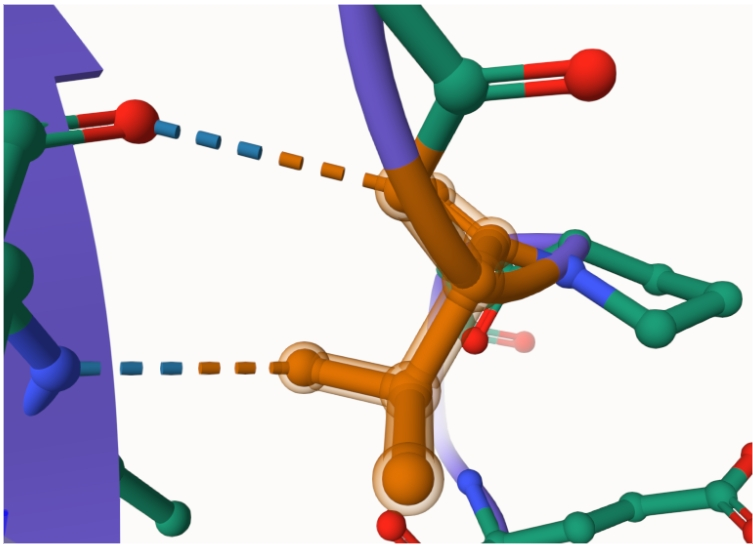

2.  image of modification site 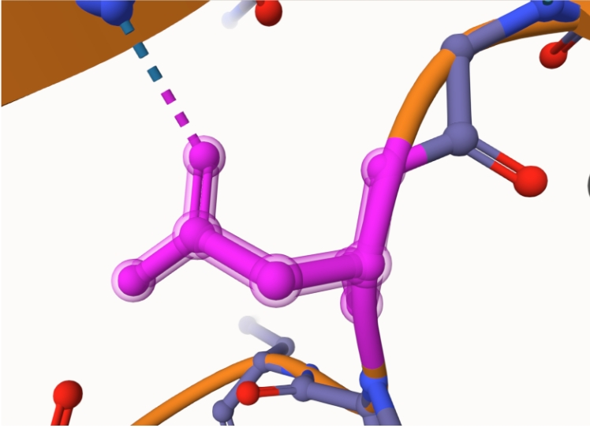

3.  image of post translational modification site 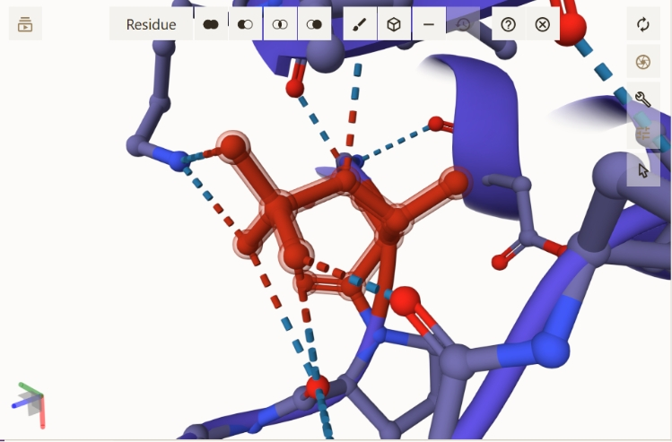

4.  image of original MDH, mimic MDH and PTM MDH 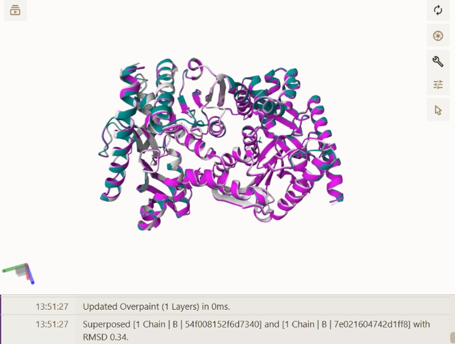

## Effect of the sequence variant and PTM on MDH dynamics

Although the PTM and mimic had differing amounts of interactions, it is only able to be seen for the mimic since that is the only modification that is computational. The PTM is unable to be run in Google Colab which can be a challenge to get data regarding molecular dynamics. It was seen that the mimic and the original had a low RMSD value of 0.26 when superimposed. Looking at the individual RMSD values, the mimic is shown to have a sudden increase then regular peaks and valleys. The original MDH is seen to have a sharp increase then gradually become more stable over time. This shows that dynamics of the mimic MDH are more stable than those of the original MDH. When looking at the RMSF plot of both the original and the mimic, the mimic has lower RMSF values. The mimic has RMSF values of around 0.35 to about 2.5 Angstroms whereas the original MDH has values of about 1 to 3.4 Angstroms. When looking at the pKa values for both the original and the mimic within the active site there is not a major difference between the two. This means that there would not be an interference when a substrate is trying to bind to the active site when there is a modification present. There is also not a structural change seen within the active site when the mimic, PTM, and original were superimposed.

1.  Mimic and original MDH superimposed 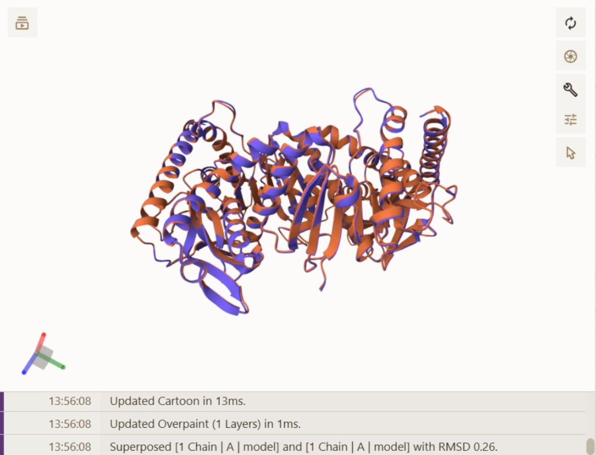

2.  PTM and original MDH superimposed 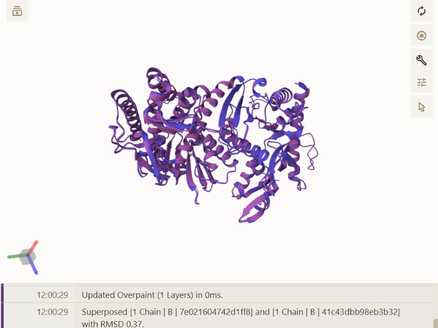

3.  RMSF plot showing differences between the simulations, original MDH 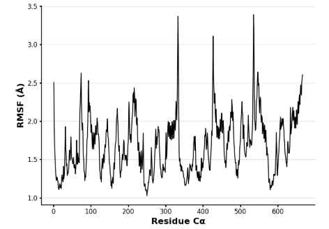

4.  RMSF plot showing differences between the simulations, mimic MDH 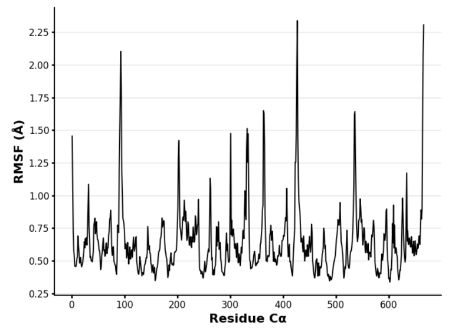

5.  pKa plot of the original MDH active site 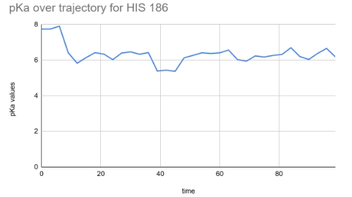

6.pKa plot of the mimic MDH active site 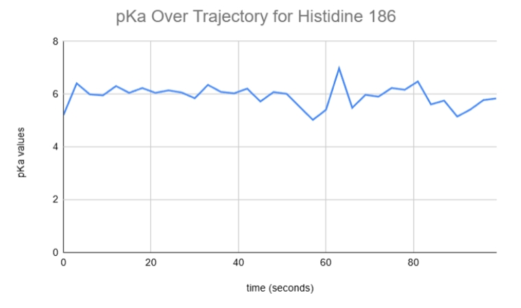

7.  Image of the aligned active sites of the mimic, PTM, and original MDH ![Superimposed active site from both of the variants in comparison to the original. There are no differences in the interactions seen among the active site] (images/all_active_AF3.png)

Description of the data and changes

## Comparison of the mimic and the authentic PTM

The modification of the mimic and the PTM are used to represent changes that can occur to the protein which could cause changes in the structure and function. Ideally, the mimic and PTM would be able to behave in similar manners since the PTM is unable to be put into computational programs. In this situation, this is not the case due to the differences in interactions among surrounding residues.

1.  Image of the interactions of the mimic variant and the PTM variant superimposed 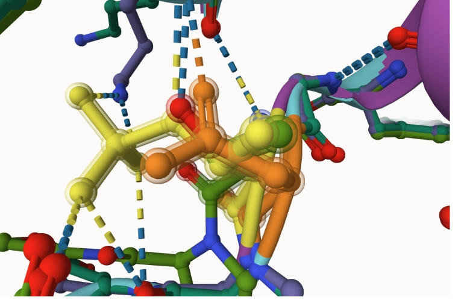

## Authors

Madison Ketterer

## Deposition Date

5/7/2025

## License

Shield: 

This work is licensed under a [Creative Commons Attribution-NonCommercial 4.0 International License](https://creativecommons.org/licenses/by-nc/4.0/).

## References

-   [The UniProt Consortium , UniProt: the Universal Protein Knowledgebase in 2025, Nucleic Acids Research, Volume 53, Issue D1, 6 January 2025, Pages D609–D617,](https://doi.org/10.1093/nar/gkae1010)

-   [Malate dehydrogenase, cytoplasmic. (2022). From AlphaFold protein structure database.](https://alphafold.ebi.ac.uk/entry/P40925)

-   [Bisong, E. Google Colaboratory. In Building Machine Learning and Deep Learning Models on Google Cloud Platform; Apress: Berkeley, CA, 2019; pp 59–64.] (<https://doi.org/10.1007/978-1-4842-4470-8_7>)

-   [David Sehnal, Sebastian Bittrich, Mandar Deshpande, Radka Svobodová, Karel Berka, Václav Bazgier, Sameer Velankar, Stephen K Burley, Jaroslav Koča, Alexander S Rose: Mol\* Viewer: modern web app for 3D visualization and analysis of large biomolecular structures, Nucleic Acids Research, 2021] (<https://doi.org/10.1093/nar/gkab314>)
