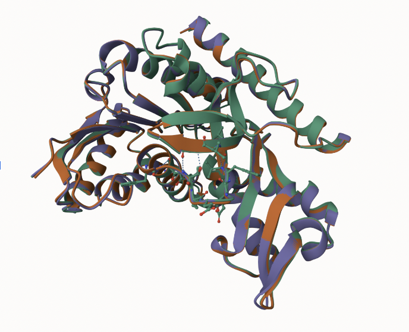
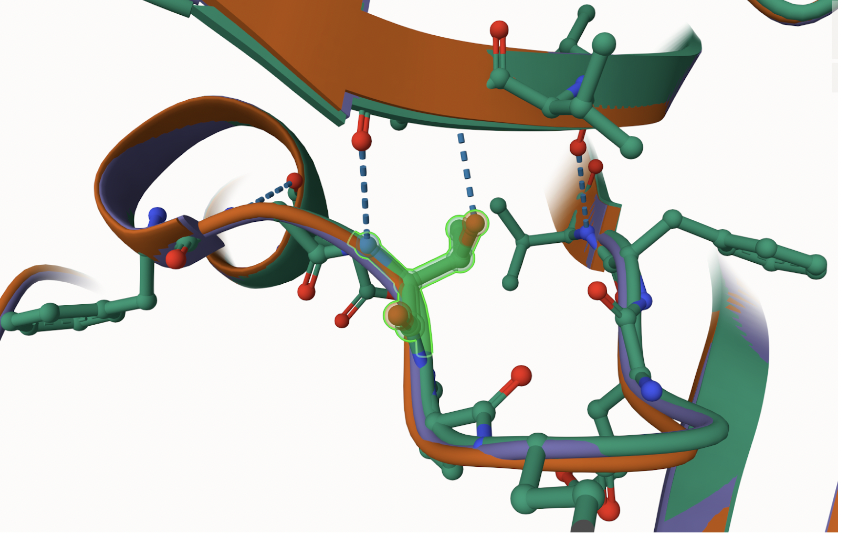
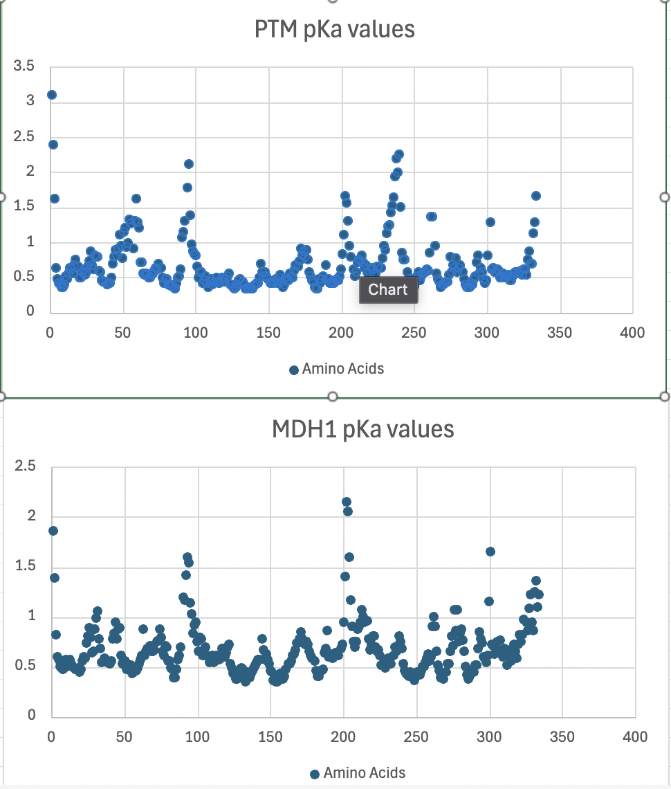
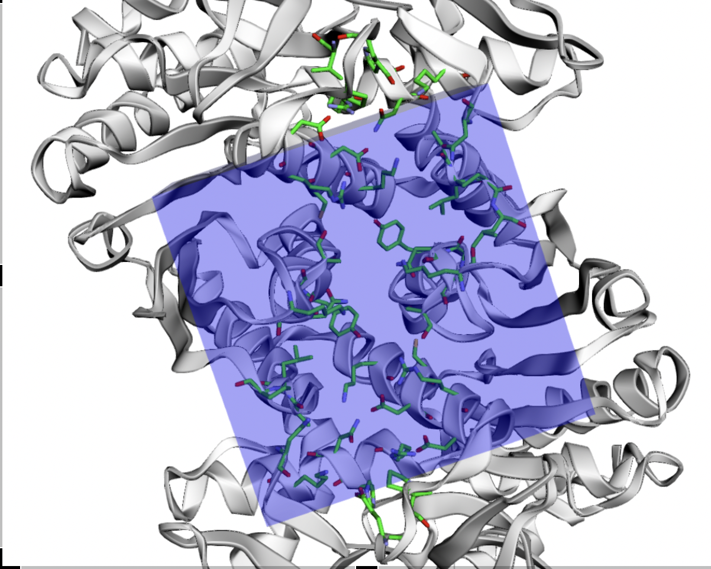
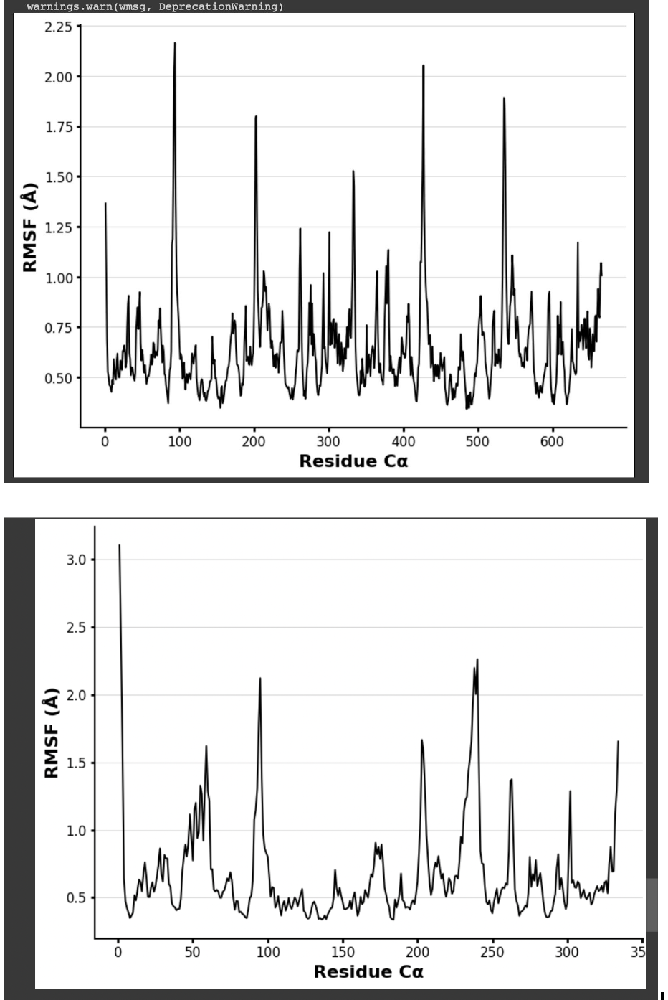
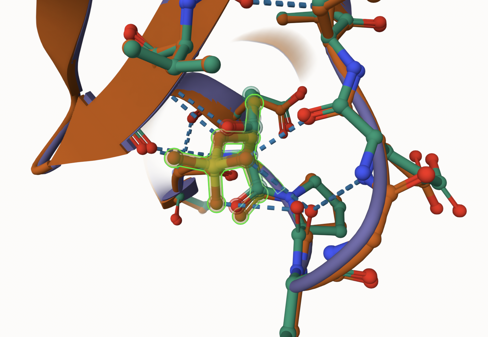

#Homo sapiens MDH1
Uniprot ID: P40925
Variation: Phosphorylation of T261

## Description

Threonine 261 was identified in Humans, Homo sapiens as a post-translationally modified site (Malone University). The study recognized the possibility that the PTM amino acid could have a possible effect on the stability of the MDH1 molecule. At this time there are no other functional studies of this site of the amino acid. 

1. image of the unmodified site

2. image of modification site

## Effect of the sequence variant and PTM on MDH dynamics

The RMSD value of MDH1 (green) and MDHT261D (orange) is .45 Å

[The simulations show that the two proteins are very similar the lower the Å the more closely the two molecules are to one another. They are then creating new hydrogen interactions with the amino acids around it including: Gly 260,  Pro 262, and Ile 292.](images/4GITHUB.png)

Comparison of the enzyme dynamics
Once molecular dynamics finished running the pKas of the PTM (top) and regular MDH1 (bottom) were compared. The most noticeable differences came around the modified site, 261. It reaches a pKa of 1 while the regular MDH1 does not reach it. This makes sense because since there are less H bonds the protein becomes less acidic and therefore would have a higher pKa. 

The active site is highlighted in the box. This area is not affected by the modified PTM

Effects of the modification of the pKa values 
The overall modification of the amino acid overall has no effect on the histidine active site. 

Comparison of the mimic and the authentic PTM
The authentic PTM and mimic superimposed on one another. The RMSD value was .22 Å. This means that there was no major difference in structure or position of the proteins. 

## Authors

Contributors names
Thomas A. Stillwell

## Deposition Date
12/6/2024

## License

Shield: [![CC BY-NC 4.0][cc-by-nc-shield]][cc-by-nc]

This work is licensed under a
[Creative Commons Attribution-NonCommercial 4.0 International License][cc-by-nc].

[![CC BY-NC 4.0][cc-by-nc-image]][cc-by-nc]

[cc-by-nc]: https://creativecommons.org/licenses/by-nc/4.0/
[cc-by-nc-image]: https://licensebuttons.net/l/by-nc/4.0/88x31.png
[cc-by-nc-shield]: https://img.shields.io/badge/License-CC%20BY--NC%204.0-lightgrey.svg

## References

* Abstract: Effects of MDH1 Mutations on Enzymatic Activity, Predicted Structure and pKa Values. Malone University. https://www.malone.edu/academics/undergraduate/research/2020-student-research-symposium/abstract-effects-of-mdh1-mutations-on-enzymatic-activity-predicted-structure-and-pka-values/.
