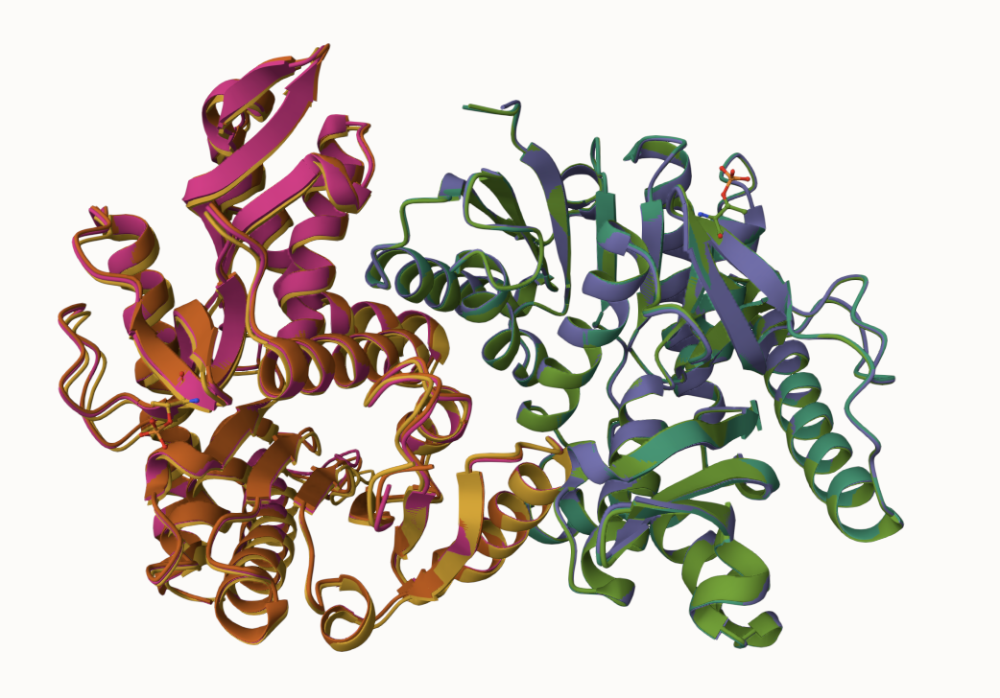
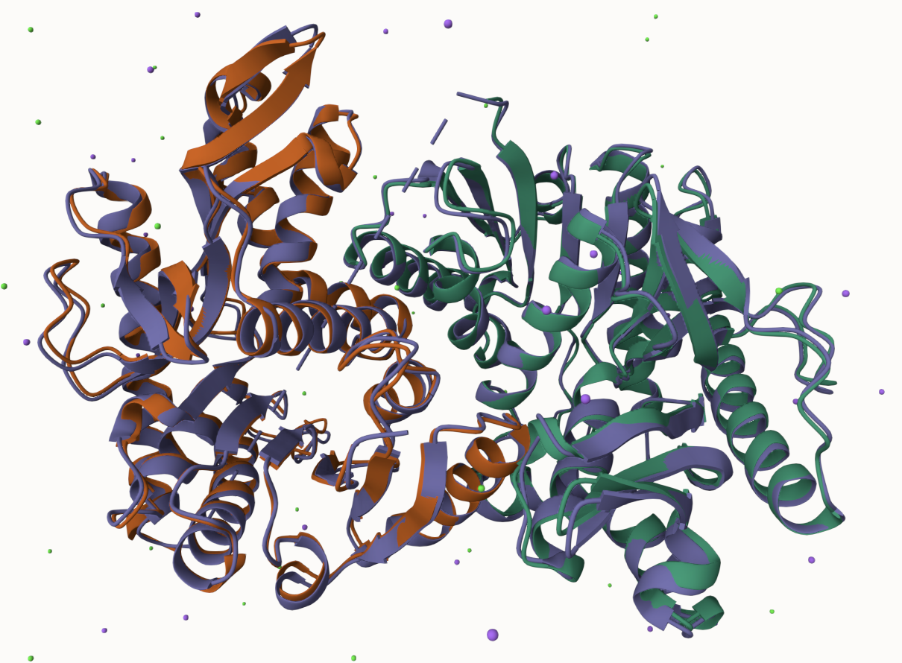
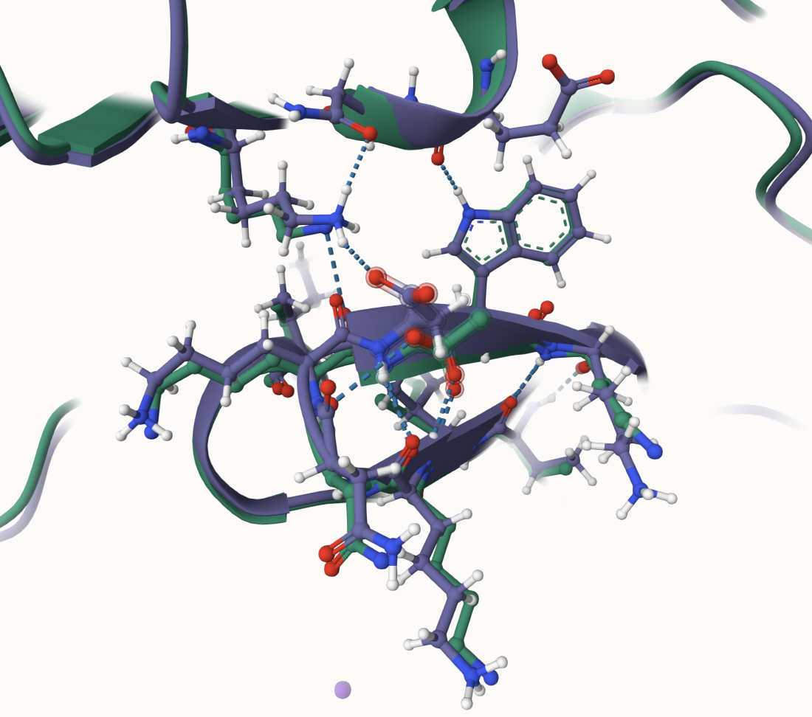

# Human malate dehydrogenase 1
# P40925
# Phosphorylation of amino acid 296

## Description

The substituted amino acid was located at position 296 on a beta sheet. Due to the phosphorylation of amino acid 296, the threonine (THR) changed to an aspartic acid (ASP). The relative position of ASP 296 was not close to the dimer interface, substrate binding sites, or the active site (HIS 187). The original, PTM, and mimic proteins all formed weak interactions with LYS 293, ASN 294, LYS 295, and TRP 297. It was noted that the mimic was the only protein to experience a weak interaction between the modified site and LYS 295. The original and PTM’s modified sites were unable to do this. 

1. image of the unmodified site

2. image of modification site

## Effect of the sequence variant and PTM on MDH dynamics

1. Image of aligned PDB files (no solvent)

2. Image of the site with the aligned PDB files (no solvent)

3. Annotated RMSF plot showing differences between the simulations

Table showing the differences in binding and active site RMSF values

4. Annotated plots of pKa for the key amino acids
![The scatterplot displayed a comparison of the pKa variation over 200 frames of the active site, HIS 187, for the original (blue) and mimic (orange). It can be seen that both proteins interacted with their environment, but the original protein's pKa was actively fluctuation throughout the simulation whereas the mimic experienced longer periods of pKa stability. This likely indicated that the unmodified protein was able to participate in chemistry by losing and gaining protons from its environment much easier than the mimic protein.](images/pka_graph.png)

## Comparison of the mimic and the authentic PTM

![Mol* was used to superpose and compare the structures of the mimic (orange/green) and the authentic PTM (pink/purple) proteins. They had an RMSD value of 0.22 Å, which indicated that there were very little structural differences. The only difference between the two structures was the fact that the mimic protein formed weak interactions between the modification site and LYS 125. According to the biochemical principal of "structure equals function" it can be assumed that the two changes would likely have the same effect on the enzymatic function of the unmodified protein.](images/mimic_ptm_align.png)

## Authors

William Moorehead

## Deposition Date

12/6/2024

## License

Shield: [![CC BY-NC 4.0][cc-by-nc-shield]][cc-by-nc]

This work is licensed under a
[Creative Commons Attribution-NonCommercial 4.0 International License][cc-by-nc].

[![CC BY-NC 4.0][cc-by-nc-image]][cc-by-nc]

[cc-by-nc]: https://creativecommons.org/licenses/by-nc/4.0/
[cc-by-nc-image]: https://licensebuttons.net/l/by-nc/4.0/88x31.png
[cc-by-nc-shield]: https://img.shields.io/badge/License-CC%20BY--NC%204.0-lightgrey.svg

## References

* AlphaFold Server. (https://alphafoldserver.com/)

* Anslyn, E. V.; Dougherty, D. A. Modern Physical Organic Chemistry; University science: Sausalito (Calif.), 2006. (https://en.wikipedia.org/wiki/Salt_bridge_(protein_and_supramolecular))

* MDH1 malate dehydrogenase 1 [Homo sapiens (Human)] - Gene - NCBI. (https://www.ncbi.nlm.nih.gov/gene/4190)

* Sehnal, D.; Bittrich, S.; Deshpande, M.; Svobodová, R.; Berka, K.; Bazgier, V.; Velankar, S.; Burley, S. K.; Koča, J.; Rose, A. S. Mol* Viewer: Modern Web App for 3D Visualization and Analysis of Large Biomolecular Structures. Nucleic Acids Research 2021, 49 (W1), W431–W437. (https://doi.org/10.1093/nar/gkab314)

* UniProt. (https://www.uniprot.org/uniprotkb/P40925/entry)

* Williams, N. C.; O’Neill, L. A. J. A Role for the Krebs Cycle Intermediate Citrate in Metabolic Reprogramming in Innate Immunity and Inflammation. Front. Immunol. 2018, 9. (https://doi.org/10.3389/fimmu.2018.00141)
