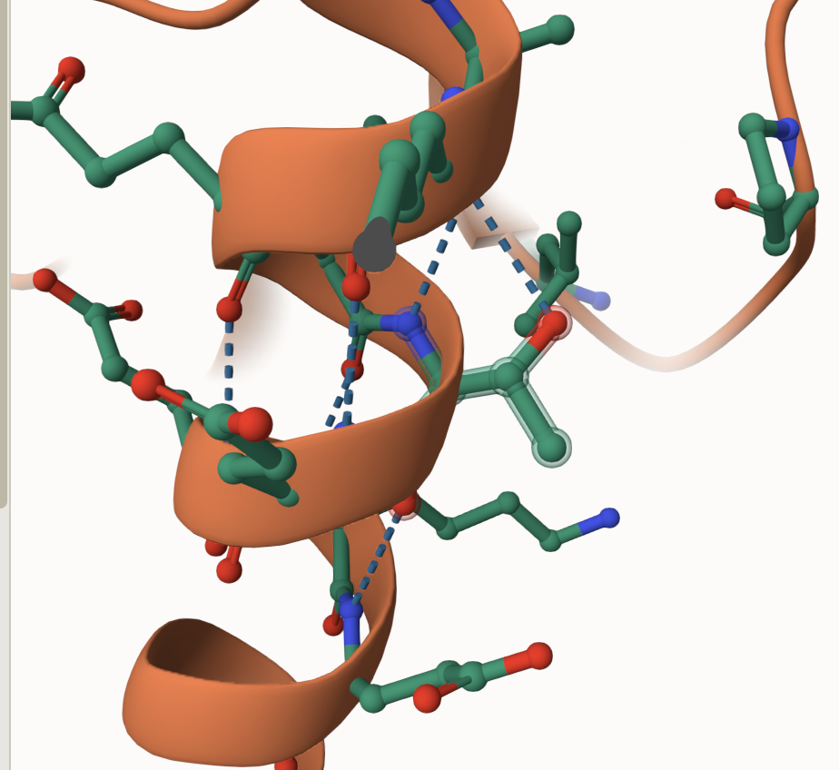
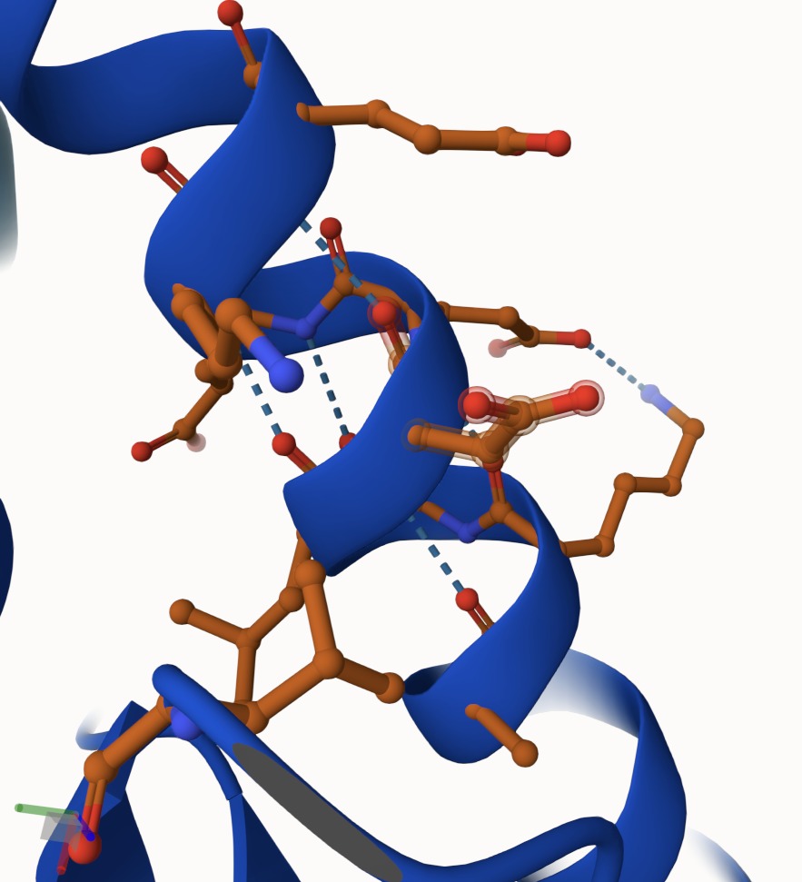
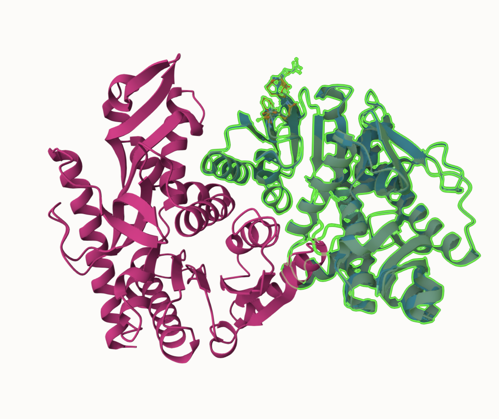
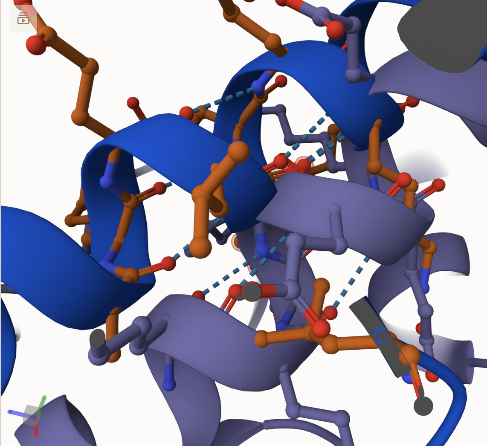
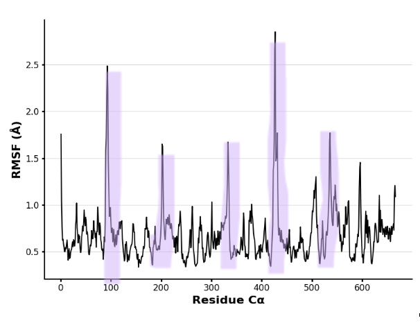
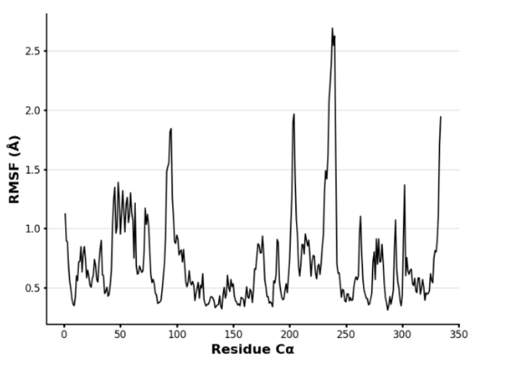
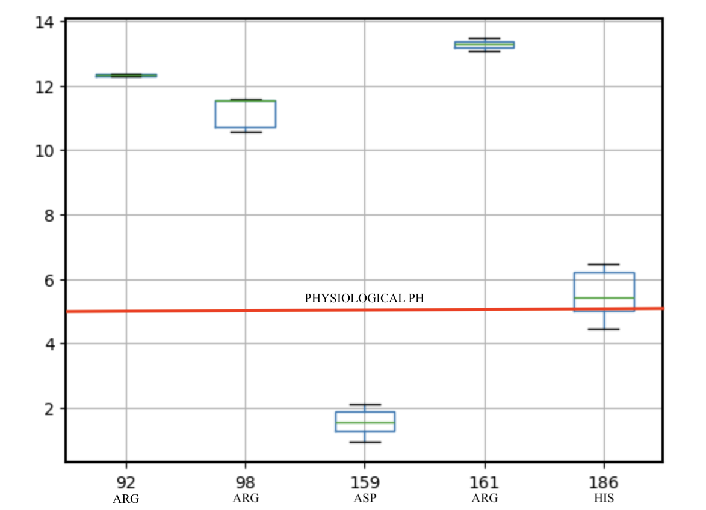
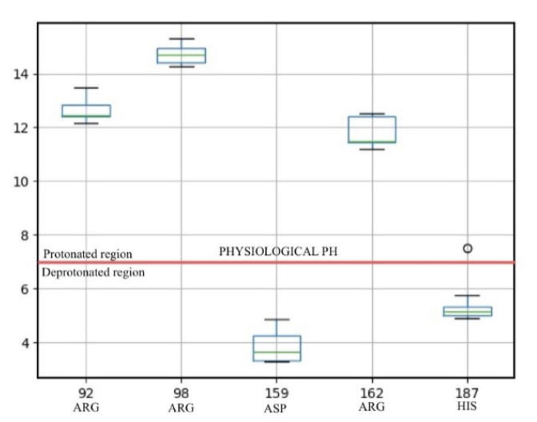

# Human Malate Dehydrogenase

# P40925

# 1

## Description

Malate dehydrogenase (MDH) is an enzyme present in many living things that is known for its important role within the central oxidative pathway; it is required for maintaining redox balance, aerobic respiration, and energy regulation between different cellular components. It is responsible for the conversion between malate and oxaloacetate utilizing the reduction of NAD+ to NADH, which is key for many metabolic pathways, including the citric acid cycle. In humans, there are two main isoforms of MDH; MDH1 which is found in the cytoplasm of cells, and MDH2, which is present in the mitochondrial matrix1. MDH1 is involved within the malate-aspartate shuttle, which enables malate to enter the mitochondria and be turned into oxaloacetate – this is needed for various other cell processes. In regard to potential medical impacts; it has been found that there is an overexpression of MDH1 in those with specific types of cancers and inadequate amounts of MDH2 can lead to metabolic disorders2.

1.  image of the unmodified site 

2.  image of modification site 

## Effect of the sequence variant and PTM on MDH dynamics

Part 3 from the Project 4 report

1.  Image of aligned PDB files (no solvent) 

2.  Image of the site with the aligned PDB files (no solvent) 

3.  Annotated RMSF plot showing differences between the simulations  

4.  Annotated plots of pKa for the key amino acids  

5.  If needed, show ligand bound images and how modification affects substrate binding

Description of the data and changes The modification of THR 320 to ASP 320 did not yield much of a change to MDH1, which can be seen in figures 1, 2, and 3, as they are all maintaining the hydrogen bonds to GLU 324 and ALA 316. The maintenance of these bonds prevents any potentially disastrous affects to the enzyme, due to the chance that a major change in the bonding and weak interactions could lead to a complete change in the structure and therefore function of the enzyme. The distance of this change from the active site as well as any of the substrate binding sites also supports the conclusion that this modification would not change the overall function of the enzyme. If this change were to be closer to HIS 187, then the ability of HIS 187 to act as a stabilizer for s-malate during hydrogen bonding interactions could be compromised. ARG 162 and ASP 159 are both also responsible for stabilization of s-malate, so any potential negative impact on either of these due to the modification could be problematic as well. HIS 187 is also responsible for the oxidation of s-malate via depronation of the hydroxyl group, however the modification did not take place close enough for any impact to have taken place.The modification did appear to alter the dynamic behavior of MDH1, as seen in the difference between figures 4 and 5. The mimic MDH1 showed a greater level of movement of each amino acid, specifically around the highlighted areas.The pKa values of the aforementioned relevant amino acids (ARG 92, ARG 98, ASP 159, ARG 162, and the active site HIS 187) did appear to have changed. ARG 92 and ASP 159 stayed relatively the same, while ARG 98 went from being over 14 to below 12. The numbers for ARG 162 and HIS 187 both had to decrease by one in the analysis of the mimic MDH1, but the amino acid being referenced is still the same. ARG 162/161 increased from around 12 to just under 14 and HIS 187/186 stayed the same.

## Comparison of the mimic and the authentic PTM

Part 4 from the Project 4 report outline include images as needed

Both generated models included hydrogen bonds with GLU 324 and ALA 316 (Figures 1 and 2) and maintained the same helical shape, they each also had the amino acid changed in the same position. Each model lacked any evidence of a negative impact from the changing of the amino acid and did not have any additions of structures that were not present before. These similarities indicate that the mimic produced was a good approximation for the PTM modified MDH1 and lends a level of validity to each structure independently, given that they were each generated very differently

## Authors

Allyssa Cole

## Deposition Date

## License

Shield: 

This work is licensed under a [Creative Commons Attribution-NonCommercial 4.0 International License](https://creativecommons.org/licenses/by-nc/4.0/).

## References

-   Takahashi-Íñiguez, T.; Aburto-Rodríguez, N.; Vilchis-González, A. L.; Flores, M. E. Function, Kinetic Properties, Crystallization, and Regulation of Microbial Malate Dehydrogenase. Journal of Zhejiang University-SCIENCE B 2016, 17 (4), 247–261. 

-   Charles S. Fermaintt; Wacker, S. Malate Dehydrogenase as a Multi-Purpose Target for Drug Discovery. Essays in biochemistry 2024, 68 (2), 147–160 
