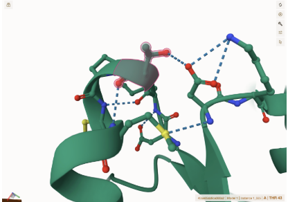
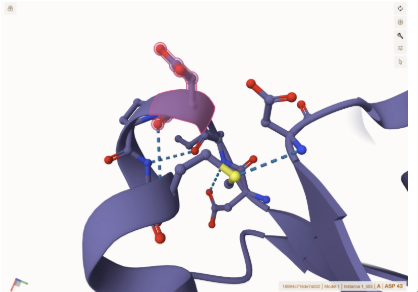

# MDH1

# P40925

# phosphorylation T44D

## Description

# Human malate dehydrogenase 1 is a cytosolic isoform of malate dehydrogenase, a key enzyme in metabolism. It catalyzes the reversible conversion of malate to oxaloacetate while reducing NAD+ to NADH, a reaction that is necessary for the malate-aspartate shuttle. The shuttle transfers the reducing equivalents out of the cytosol and into the mitochondria, supporting oxidative phosphorylation and ATP production in aerobic tissues. MDH1 belongs to the NAD+-dependent oxidoreductase family, which also includes enzymes such as LDH, LADH, and GAPDH.

MDH1 activity is an integral factor in maintaining homeostasis within
the cell. During glycolysis, the NADH produced in the cytosol must be
reoxidized to NAD+ for glycolysis to continue. Since the NADH cannot
permeate the inner mitochondrial membrane, cytosolic MDH1 and
mitochondrial MDH2 must work together to transfer the electrons,
ensuring NAD+ regeneration. This process is required by energy-demanding
tissues, such as the brain, heart, and liver, where efficient energy
production is important (1). MDH1 is encoded by the MDH1 gene located on
chromosome 2 (2p13.3). The enzyme functions as a homodimer and shows a
high binding affinity for NAD+ (2). The structure of MDH1 includes a
Rossman fold that facilitates nucleotide binding and catalysis. The
activity is tightly regulated by substrate concentration and the
NAD+/NADH ratio, linking the cytosolic redox reactions to metabolic
demands. New research has shown that MDH1 plays a role in cancer
biology. Overexpression of MDH1 has been found in several tumors,
possibly reflecting the regeneration and biosynthetic demands of cancer
cells (3). MDH1 is being explored as a potential metabolic target for
anticancer therapy. In patients with dilated cardiomyopathy, MDH1 is
overexpressed in the left ventricular muscle (4). This is likely an
adaptive response to hypoxia to enhance glucose oxidation. MDH1 is
expressed in the human embryonic heart as early as the third month of
gestation, and shows overexpression from the fifth month to birth. This
overexpression suggests MDH1’s role in supporting the high energy needs
of the developing fetal heart.

```         
Threonine 44 (T44) in MDH1 has not been previously characterized as a phosphorylation site in UniProt or other primary sources. The substitution T44D was designed to mimic phosphorylation and assess potential structural or functional consequences. The original structure for AlphaFold3 completed in Project 2 was put into Mol* (5) to observe the location of the residue. This residue is located within an Alpha Helix near the dimer interface, as seen in Figure 1. 
The unmodified Threonine at position 43 in the processed amino acid sequence shows hydrogen bonding with the nearby Aspartic Acid 71. Asp 43 in the PTM mimic model shows no weak interactions, but especially none with Asp 71, as seen in the original structure. Asp 43 in the modified structure has one hydrogen bond connecting to the proximal Methionine 46. 
```

1.  image of the unmodified site 

2.  image of modification site 

3.  image of modification site 


## Effect of the sequence variant and PTM on MDH dynamics

Part 3 from the Project 4 report \# To observe how the mimic changed the
structure and function of MDH1, we can compare the mimic output model
from Boltz-1 and the original structure from AlphaFold obtained during
Project 2. When looking at the His 186 active site of the MDH1 enzyme,
it was observed that the original structure formed weak interactions
with the amino acids Asn 133 and Asp 158, while the mimic model formed
an additional hydrogen bond with amino acid Arginine 97. In the original
structure, Threonine 43 formed hydrogen bonds with Asp 41 and Met 46. In
the mimic model, Thr 43 only formed hydrogen bonds with the Met 46 amino
acid. The RMSF data obtained from Project 3 can be compared to the
Project 4 RMSF plot from the second colab notebook to observe any
changes in the dynamics around key sites. Root Mean Square Fluctuation
(RMSF) plots provide insight into the flexibility of residues in a
protein during a molecular dynamics simulation. One key difference
between these two RMSF plots is that the mimic model has a much higher
y-axis scale, the max RMSF value being around 4.2 Å compared to the
original structure which has a max RMSF around 2.5 Å. This indicates
that the mimic model has greater structural fluctuation across its
residues than the original structure. Around residue 43 (the site of the
substitution), the mimic plot shows an increase in RMSF, which suggests
that the substitution caused greater instability or flexibility. This
may be due to the charged side chain of Aspartic acid, which alters the
local hydrogen bonding and weak interactions as compared to Threonine,
which is neutral. This correlates to what was discussed in previous
sections and how the mimic and modified models showed a loss of hydrogen
bonds and weak interactions, as compared to the original structure. The
RMSF plot obtained from Project 4 shows long peaks between 100-300
residues, possibly indicating an area of increased loop mobility.
Between residues 500-650, both plots show much fluctuation, but the
mimic plot has much greater values, suggesting an ongoing structural
effect from the substitution. Overall, the RMSF plot for the original
structure has generally lower and more consistent RMSF values, meaning
that original structure was relatively more stable throughout. It is
likely that the mimic model has destabilized the malate dehydrogenase
structure leading to increased flexibility and mobility. The pKa of His
186 as observed during Project 3 has a median pKa near 7.8, with an
interquartile range of approximately 6.0 to 8.5, indicating a more
dynamic protonation behavior. During Project 4, His 186 shows a lower
median pKa of around 6.0 with a smaller fluctuation. This suggests that
the active site is more consistently in a deprotonated state, likely due
to the change from the original sequence structure to the mimic model.
This shift in pKa indicates that the T44D substitution may have altered
the electrostatics or structural stability around the active site.
Changes in flexibility, as seen in the RMSF data, could impact the
interaction with nearby residues, explaining the decrease in pKa. The
pKa plot of the Histidine 186 active site within the original MDH1
structure from Project 3 shows broader and higher fluctuation, with pKa
values mostly greater than 7.5 .This suggests that His 186 frequently
exists in a protonated state, which is typically more favorable for
catalytic function, particularly in acid-base catalysis. The pKa plot
for the mimic model, on the other hand, shows a lower and more
stabilized pKa range, staying mostly in the 5-6 range. This shift
implies that His 186 in the mimic is protonated for less time during the
simulation, which could impair its ability to partake in the proton
transfer, which is a key step in many enzyme reactions. The mimic
appears to destabilize the protonation state of His 186, lowering its
pKa and potentially affecting the enzyme’s activity. This change in
electrostatics at the active site may reduce the efficiency of MDH1 by
impairing the chemical functionality of key residues. The RMSD plot for
the mimic model represents the structural deviation over time during the
second Molecular Dynamics (MD) simulation in Project 4. The RMSD
increases sharply early in the simulation but then gradually stabilizes
around 1.4-1.6 Å. This indicates that the system undergoes an initial
adjustment in structure before reaching a relatively stable
conformation. This indicates that the system undergoes an initial
structural adjustment before reaching a more stable conformation. This
is reasonable because the T43D substitution in the mimic model occurs
near the beginning of the MDH1 sequence, and early mutations can
influence the folding pathway and stability of residues downstream,
requiring the system to equilibrate before settling into a stable state.

1.  Image of aligned PDB files (no solvent) ! [output from MD simulation
    structure with no solvent] (images/md_nw_align.png)

2.  Image of the site with the aligned PDB files (no solvent) ! [site of
    residue 43 in output from MD simulation with no solent]
    (images/md_nw_site_43.png)

3.  Annotated RMSF plot showing differences between the simulations !
    [Figure 8.) The RMSF plots obtained from Project 2 and Project 4,
    respectively.](images/RMSF_comparison.png)

4.  Annotated plots of pKa for the key amino acids ! [pKa plot over MD
    simulation for mimic model] (image/pKa_plot_mimic) ! [pKa for sites
    His 186 and Asp 43] (images/pKa_mimic.png)

  

  

 

5.  If needed, show ligand bound images and how modification affects
    substrate binding

Description of the data and changes

## Comparison of the mimic and the authentic PTM

Part 4 from the Project 4 report outline include images as needed

#To assess whether the T43D mimic is a suitable structural and
functional approximation of the phosphorylated MDH1 model, key
simulation outputs including RMSD data, RMSF plots, pKa profiles, and
structural analyses using Mol\* were used. The mimic and modified models
displayed a high degree of structural similarity with no significant
deviations observed. The superposition in Mol\* yielded a low RMSD value
of 0.38 Å, indicating minimal deviations in the overall structure. No
significant differences in the tertiary of quaternary structure were
observed, suggesting that both structures preserved the folding of MDH1.
At the site of residue 43, the same weak interactions and hydrogen
bonding to Met 46 were observed in each model, but differences in the
branching off the residue were noted. These differences may subtly
impact the protein's flexibility and mobility, interactions with charged
regions, or binding to other molecules. However, key interactions within
the enzyme active site, His 186 with Asp 158, Asn 133, and Asn 185, were
conserved in both structures, suggesting that core catalytic function
was not directly impaired by either alteration. Further supporting this
structural similarity, RMSD plots of the mimic model during the MD
simulations displayed early fluctuations followed by stabilization,
indicating that the system equilibrates effectively. Additionally, pKa
simulations of His 186 revealed similar overall patterns in both models,
with the mimic displaying slightly lower and more stabilized pKa than
the original structure. This may suggest a slight difference in the
electrostatic environment, but not a significant enough difference to
disrupt key catalytic interactions. Despite the structural similarity,
RMSF data revealed distinct differences in flexibility between the
wild-type and mimic models. The mimic displayed significantly higher
levels of residue fluctuation, suggesting that the T43D substitution
leads to a greater overall protein mobility, which could subtly alter
the proteins stability. Overall the mimic is a reasonable approximation
of the phosphorylated MDH1 model in terms of overall structure and core
functionality. However, the simulation data revealed some subtle but
meaningful differences in the flexibility and mobility of the protein
that could influence enzyme activity under physiological conditions.
While the mimic demonstrates key structural and catalytic features of
the phosphorylated model, differences in flexibility and charge suggest
that the ability to reproduce a model with full PTM functionality is
limited.

! [Superposition of the mimic and modified
models](images/align_mimic_mod.png)

### Colab notebook links

Provide file names of completed colab notebooks

<https://colab.research.google.com/drive/1f0b9Grd7HMCigCWHa4c-AdPFSsiaZBOX>
MD_simulation_Step1.ipynb

<https://colab.research.google.com/drive/1MFj2VmSA_AyIeID-uUQ_mg6COPNj6u_1>
MDanalysis_Step2.ipynb

## Authors

Angelina Morrow

## Deposition Date

05/07/2025

## License

Shield: [](https://creativecommons.org/licenses/by-nc/4.0/)

This work is licensed under a [Creative Commons
Attribution-NonCommercial 4.0 International
License](https://creativecommons.org/licenses/by-nc/4.0/).

[](https://creativecommons.org/licenses/by-nc/4.0/)

## References

-   Citation1 !(<https://doi.org/10.1021/acsomega.1c04385>)

-   Citation2
    !(<https://www.ncbi.nlm.nih.gov/gene/4190#additional-links>)

-   Citation3 !(<https://doi.org/10.1038/onc.2017.36>)

-   Citation4 !(<https://doi.org/10.1002/jcb.20343>)

-   Citation5 !(<https://doi.org/10.1093/nar/gkab314>)

-   Citation6
    !(<https://www.uniprot.org/uniprotkb/P40925/entry#structure>)

-   Citation7 !(<https://alphafold.ebi.ac.uk/>)

-   Citation8
    

-   Citation9
    !(<https://colab.research.google.com/drive/1-Nr3oze1IWND4-eTci9TyykFhtx9fVuX?usp=sharing>)
