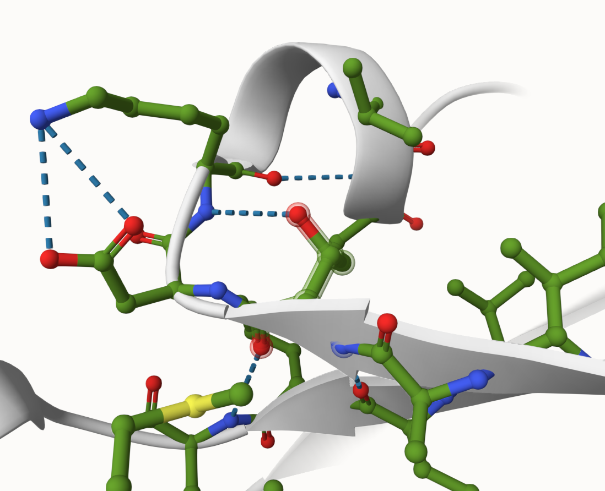
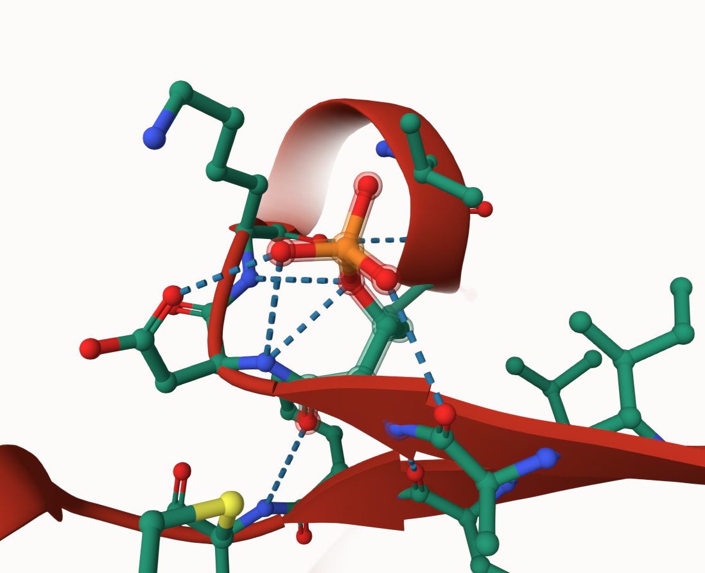
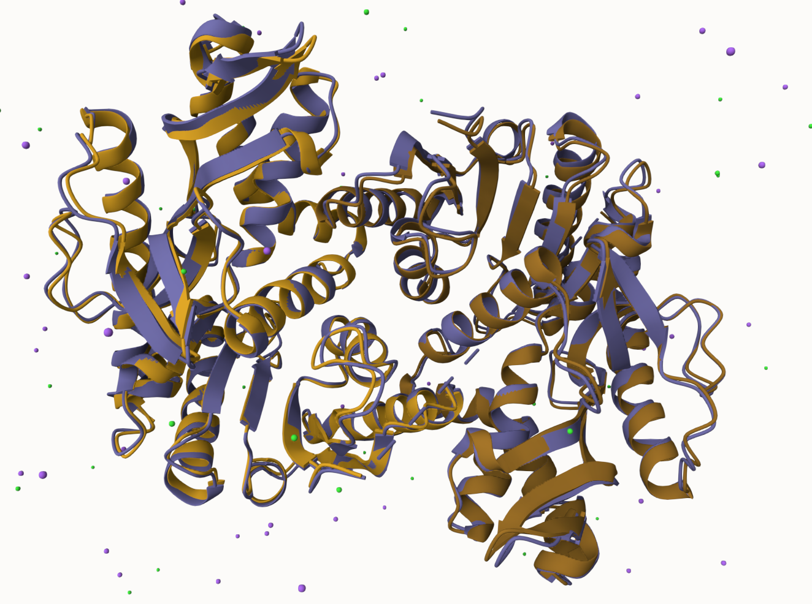
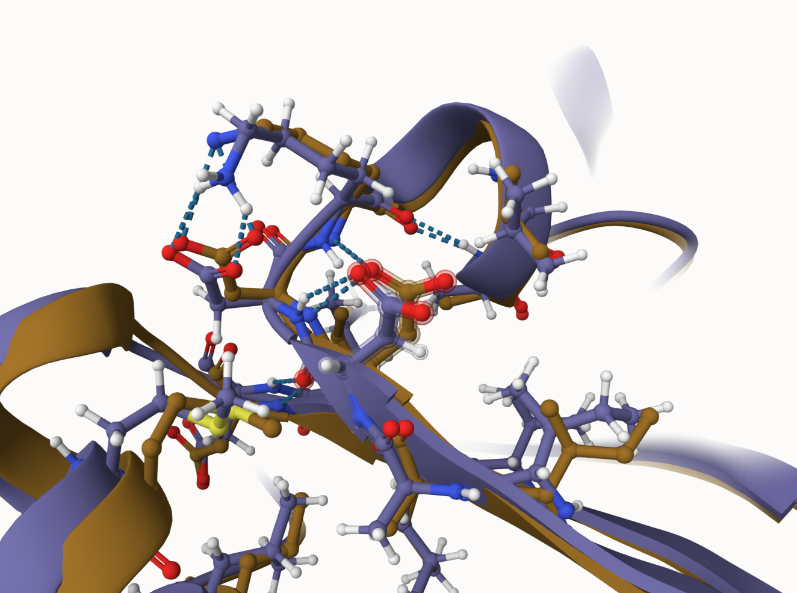
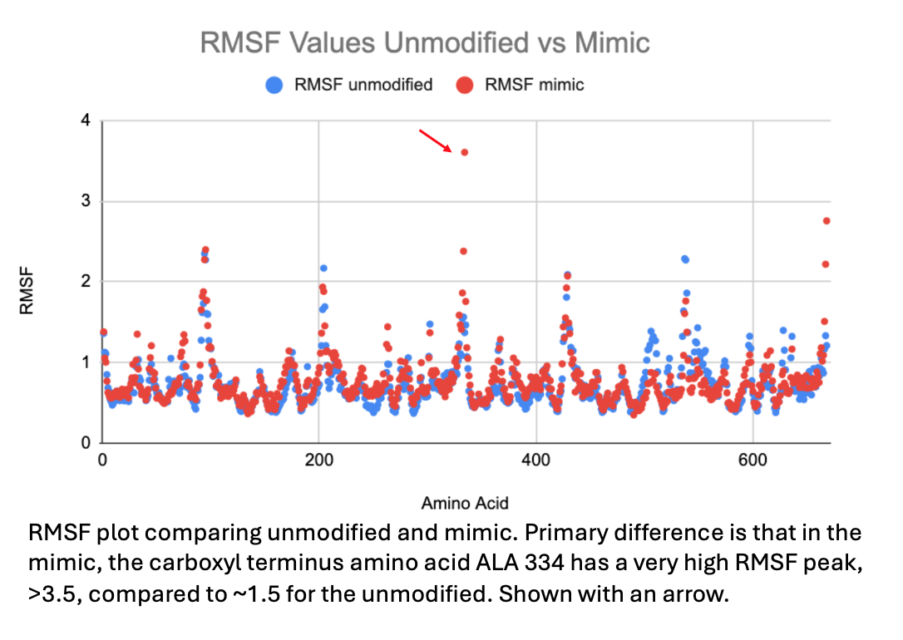
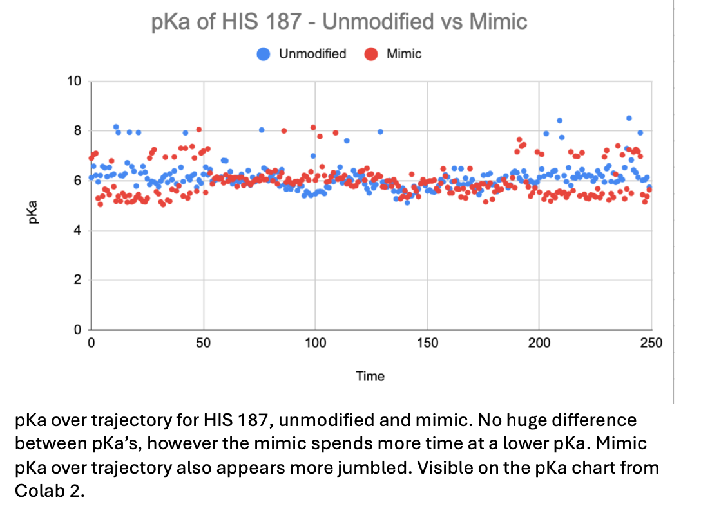
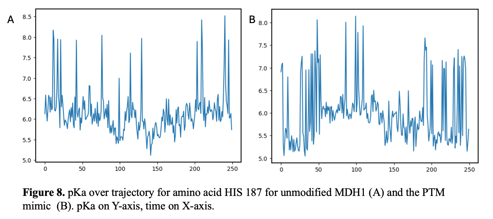
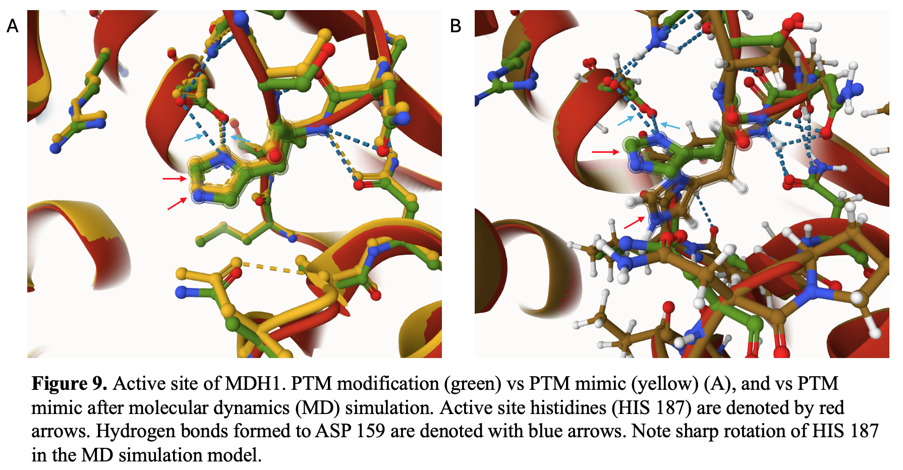
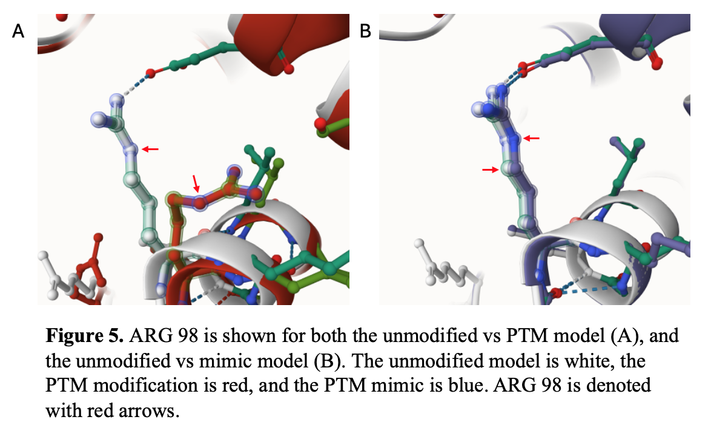

# Human MDH1 (cMDH)
# P40925
# pT71

## Description

1. image of the unmodified site

2. image of modification site

Threonine 71 is the last residue of a beta-sheet before a 2-residue loop that leads into an alpha helix. It resides on the outer surface of the protein, not directly interacting with the dimer interface or any relevant active/binding sites. 

## Effect of the sequence variant and PTM on MDH dynamics

1. Image of aligned PDB files (no solvent) 

2. Image of the site with the aligned PDB files (no solvent)

3. Annotated RMSF plot showing differences between the simulations

4. Annotated plots of pKa for the key amino acids

5. If needed, show ligand bound images and how modification affects substrate binding

Description of the data and changes

Overall, the mimic showed strong homology to the unmodified protein in the AlphaFold predictions. However, the simulated PDB structure of the mimic elucidates new bonds in the protein, in particular backbone-residue interactions in the dynamic loop that HIS 187 sits in, potentially indicating that the aspartate in the mimic structure is altering overall structure and thus the structure of the active site. Therefore, the data has shown evidence that the mimic may have an altered, likely diminished catalytic activity, but more studies will need to be done to confirm that this is not simply variations in the simulation.

## Comparison of the mimic and the authentic PTM

Some differences can be seen between the mimic models and the true PTM model. For instance, the most apparent difference is that ARG 92 and ARG 98 appear to be bent in the PTM model but not the mimic model, potentially implicating a mechanism for reduced catalytic activity in the true PTM. 

## Authors

Nicholas Henriques

## Deposition Date

12/06/2024

## License

Shield: [![CC BY-NC 4.0][cc-by-nc-shield]][cc-by-nc]

This work is licensed under a
[Creative Commons Attribution-NonCommercial 4.0 International License][cc-by-nc].

[![CC BY-NC 4.0][cc-by-nc-image]][cc-by-nc]

[cc-by-nc]: https://creativecommons.org/licenses/by-nc/4.0/
[cc-by-nc-image]: https://licensebuttons.net/l/by-nc/4.0/88x31.png
[cc-by-nc-shield]: https://img.shields.io/badge/License-CC%20BY--NC%204.0-lightgrey.svg

## References

* Schweppe, D. K.; Rigas, J. R.; Gerber, S. A. Quantitative Phosphoproteomic Profiling of Human Non-Small Cell Lung Cancer Tumors. Journal of Proteomics 2013, 91, 286–296. https://doi.org/10.1016/j.jprot.2013.07.023. 

* Kirkwood, K. J.; Ahmad, Y.; Larance, M.; Lamond, A. I. Characterization of Native Protein Complexes and Protein Isoform Variation Using Size-Fractionation-Based Quantitative Proteomics. Molecular & Cellular Proteomics 2013, 12 (12), 3851–3873. https://doi.org/10.1074/mcp.M113.032367. 
