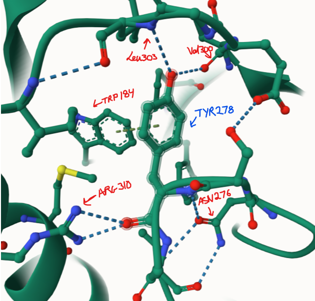
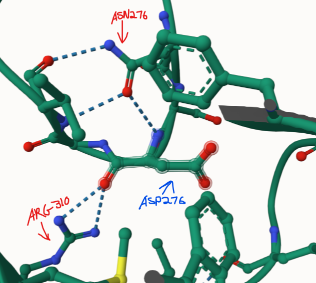
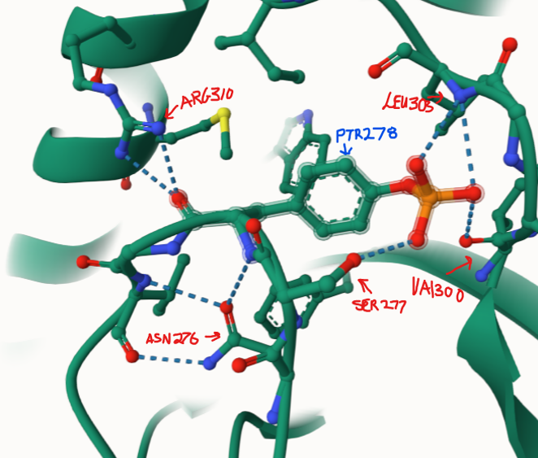
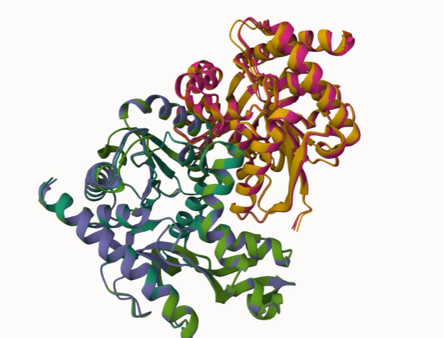
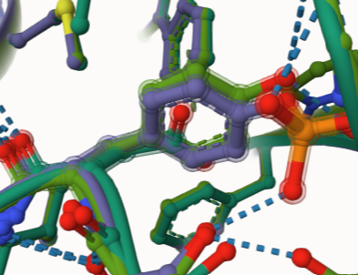
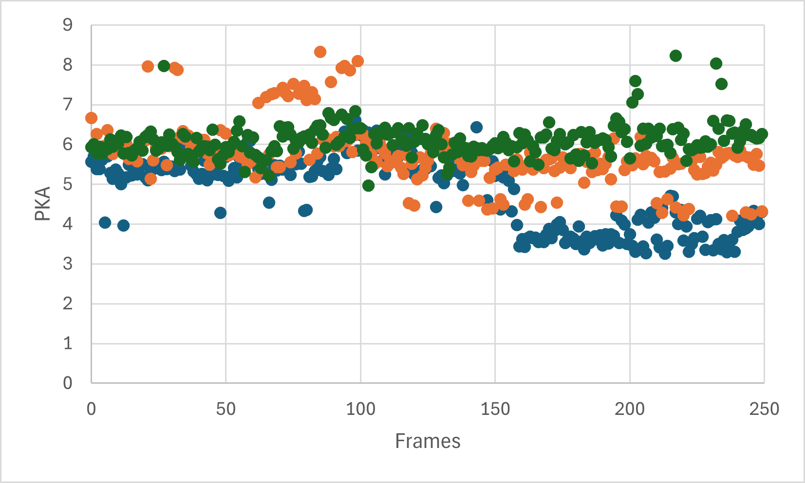

# Human malate dehydrogenase 1

# Uniprot ID: P40925
# Variation: phosphorylation of Y278

## Description

The altered amino acid was located at the base 278 on a loop. The phosphorylation of Tyr 278, the threonine (THR) changed to aspartic acid (ASP). Neither the Original, mimic, or PTM was close to the dimer interface, the binding sites, or the active site (HIS 187).All formed weak interactions with ASN 276 and ARG 310. Those however was the only bond that the mimic had. The Original and the PTM had the almost the same weak interactions, with the extra being Val 300 and Leu 303. The phosphorylation of TYR 278 however substituted the pi bond it had with TRP 184 in place of an H-bond with SER277

1. image of the unmodified site

2. image of modification site
 

## Effect of the sequence variant and PTM on MDH dynamics

1. Image of aligned PDB files (no solvent)

2. Image of the site with the aligned PDB files (no solvent)

3. Annotated RMSF plot showing differences between the simulations

4. Annotated plots of pKa for the key amino acids

## Comparison of the mimic and the authentic PTM

## Authors

Kwabena S. Mantey

## Deposition Date
12/06/2024

## License

Shield: [![CC BY-NC 4.0][cc-by-nc-shield]][cc-by-nc]

This work is licensed under a
[Creative Commons Attribution-NonCommercial 4.0 International License][cc-by-nc].

[![CC BY-NC 4.0][cc-by-nc-image]][cc-by-nc]

[cc-by-nc]: https://creativecommons.org/licenses/by-nc/4.0/
[cc-by-nc-image]: https://licensebuttons.net/l/by-nc/4.0/88x31.png
[cc-by-nc-shield]: https://img.shields.io/badge/License-CC%20BY--NC%204.0-lightgrey.svg

## References

*  AlphaFold Server. (https://alphafoldserver.com/)

*  McCue, W. M.; Finzel, B. C. Structural Characterization of the Human Cytosolic Malate Dehydrogenase I. ACS Omega 2021, 7 (1), 207–214. (https://doi.org/10.1021/acsomega.1c04385)

* MolViewer. molstar.org. (https://molstar.org/viewer/.)

* Eun Kyung Kim; Won Ho Kim; Kang, H.; Jeong Hun Kim; Chung, S. J.; Seo, Y.-S.; Sung Sup Park; Sang Yup Lee; Bae, K.-H. Acetylation of Malate Dehydrogenase 1 Promotes Adipogenic Differentiation via Activating Its Enzymatic Activity. ScienceDirect 2012, 53 (9), 1864–1876. (https://doi.org/10.1194/jlr.m026567)

* Laura de Lorenzo; Stack, Tyler M. M.; Fox, K.; Walstrom, K. Catalytic Mechanism and Kinetics of Malate Dehydrogenase. Essays in biochemistry 2024. (https://doi.org/10.1042/ebc20230086)

* UniProt. Uniprot.org. (https://www.uniprot.org/uniprotkb/P40925/entry#ptm_processing)
