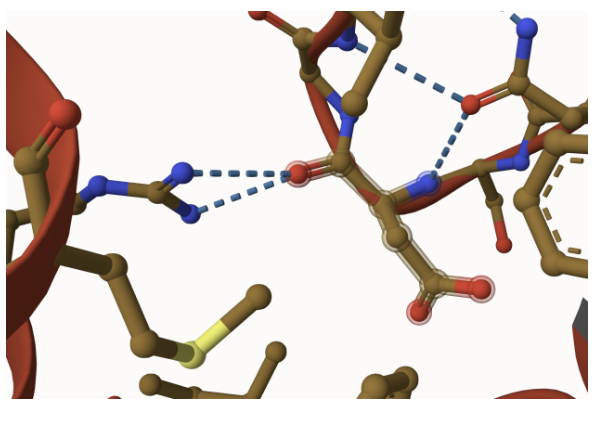
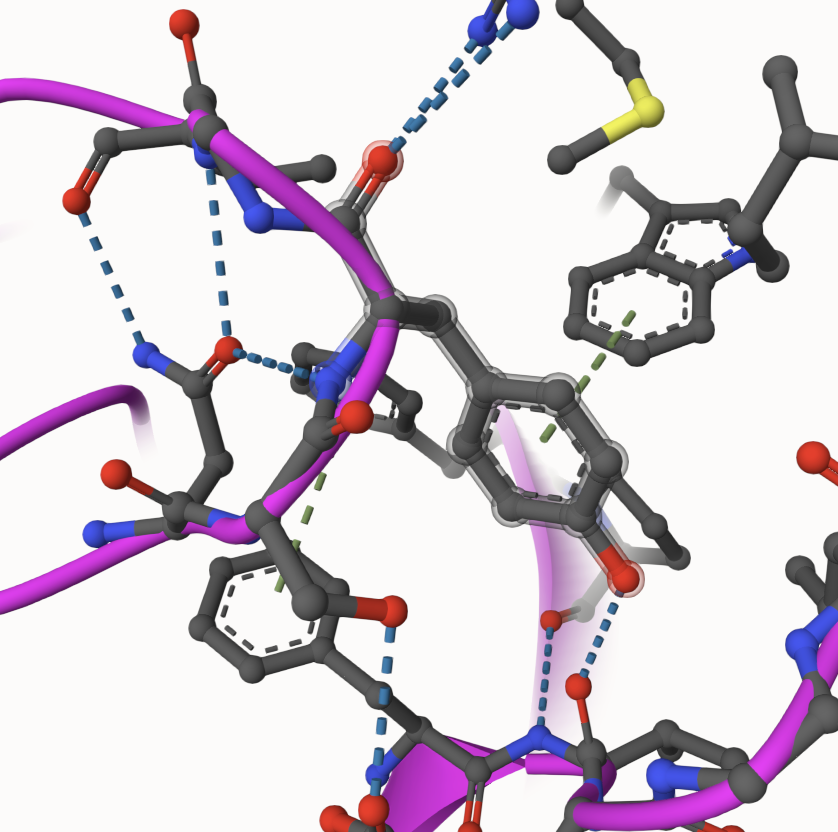
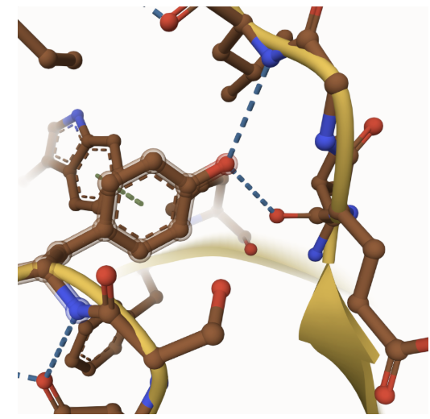
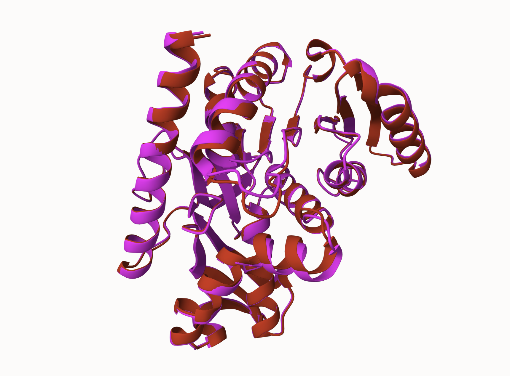
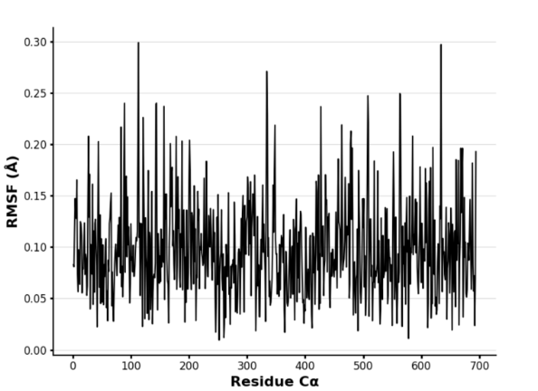
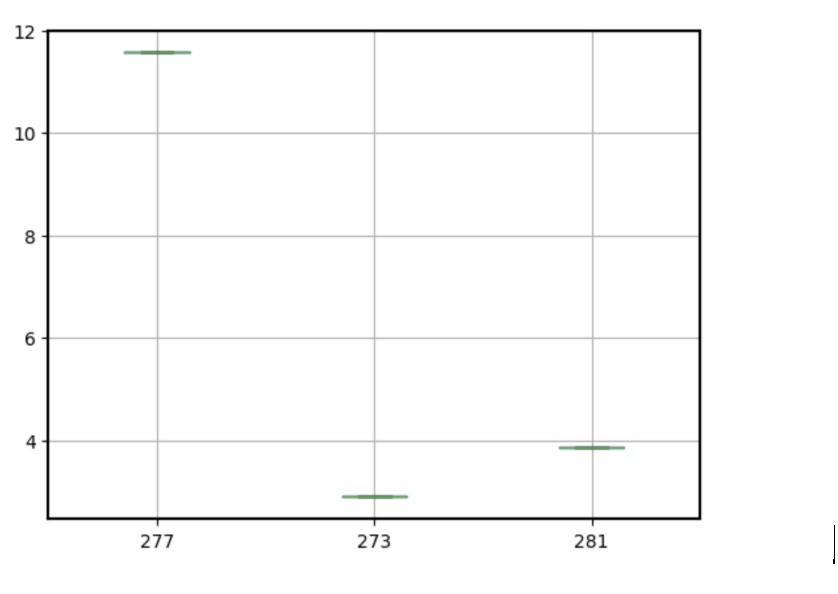

Cytoplasmic MDH1 Uniprot ID: P40925 Variation: 278p

Description Aspartic acid 278 of MDH1 was phosphorylated and analyzed the effects on the function and structure of PTM modified protein.

# Part 1 from Project 4 report outline (with citations as appropriate)

1.  image of the mimic variant model showing residue 278 is located on a loop with hydrogen bonding to arginine and asparagine. 

2.  image of the PTM modified model showing residue 278 with hydrogen bonds to arginine, asparagine, and valine. 

3.  image of the unmodified protein model shows residue 278 with hydrogen bonds to leucine and valine.\
    

## Effect of the sequence variant and PTM on MDH dynamics

Part 3 from the Project 4 report

1.  Image of the visualization of PTM modified protein model (pink) and mimic variant model (red) 

2.  Annotated RMSF plot showing differences between the simulations 

3.  Annotated plots of pKa for the key amino acids 

4.  If needed, show ligand bound images and how modification affects substrate binding

Description of the data and changes

## Comparison of the mimic and the authentic PTM

Part 4 from the Project 4 report outline include images as needed 1. Image of the visualization of PTM modified protein model (pink) and mimic variant model (red) indicated the mimic replicated the PTM modified model.\

## Authors

Contributors names Rachel Fitzpatrick

## Deposition Date

May 7, 2025

## License

Shield: 

This work is licensed under a [Creative Commons Attribution-NonCommercial 4.0 International License](https://creativecommons.org/licenses/by-nc/4.0/).

## References

-   Citation1 

-   Citation2 
