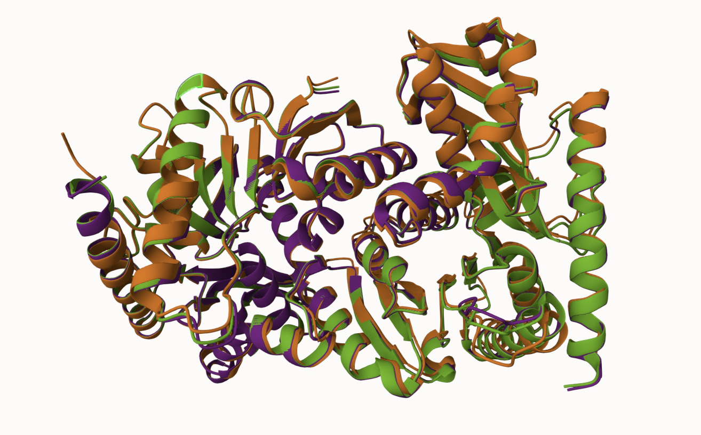
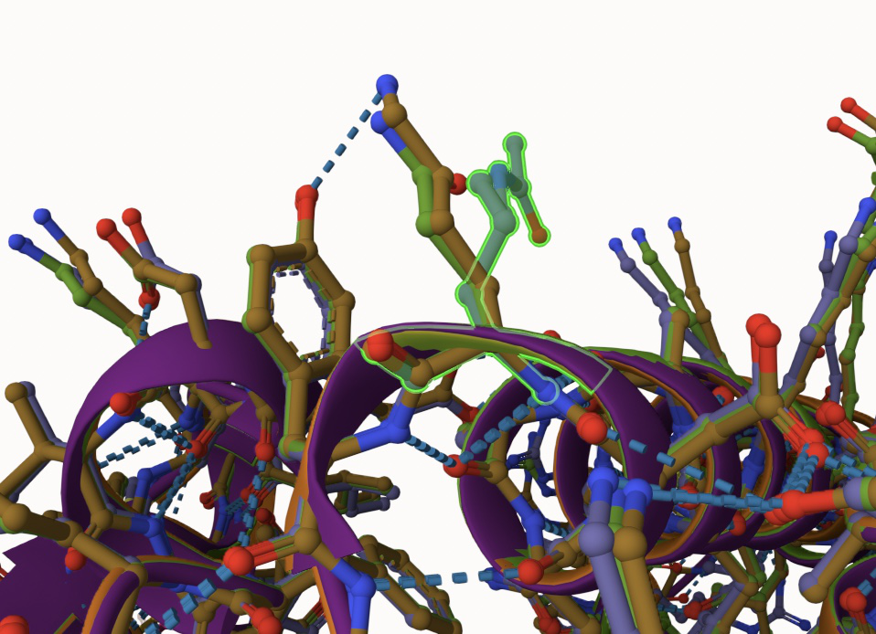
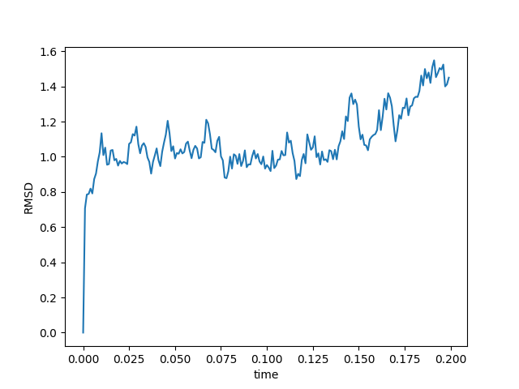
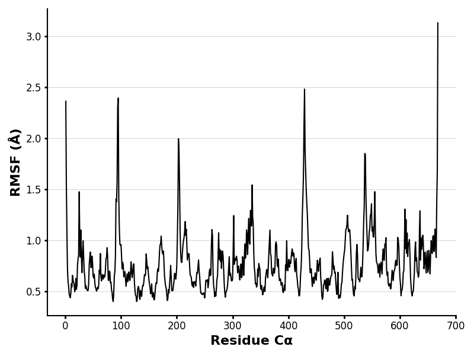
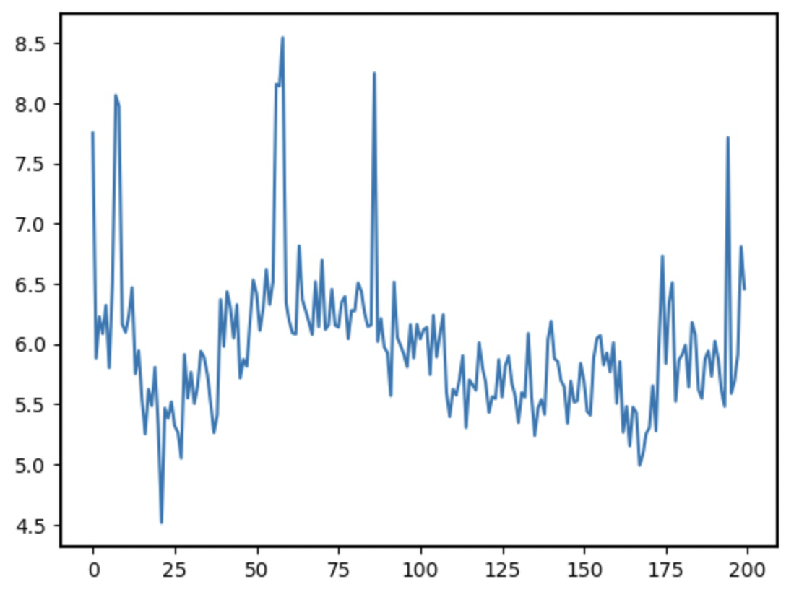
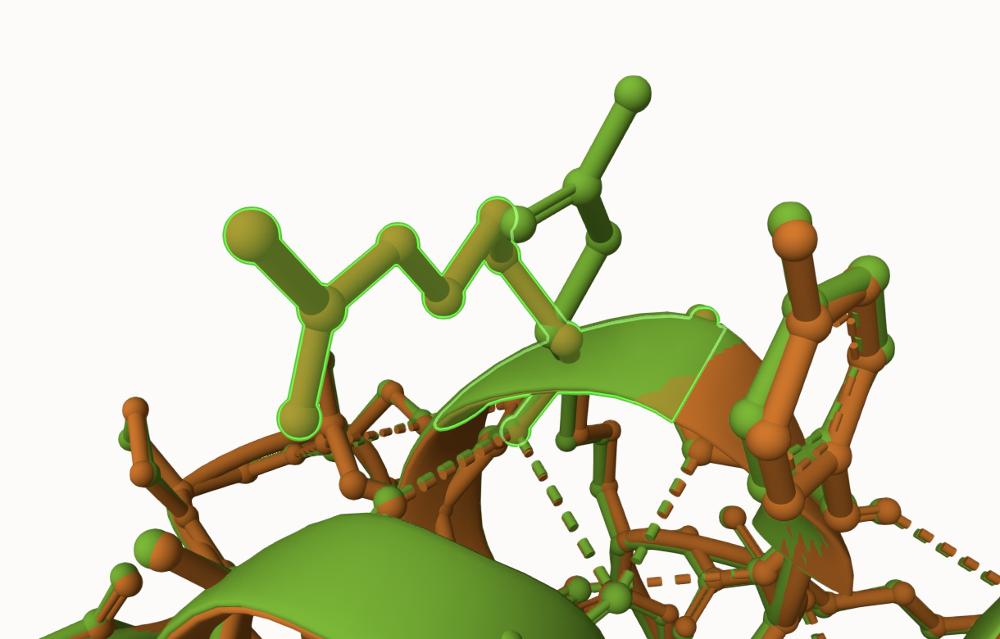

# Homo sapiens and MDH1
# P40925
# Acetylation of K118

## Description
The modification of Malate Dehyrogenase 1, specifically the acetylation of MDH1, has been a topic of study in previous literature. Kim, E. Y. et al. investigated the structural and functional impact of amino acid modifications, mutations, or post-translational modifications (PTMs) on the enzyme's activity, stability, and interactions¹. This study did specifically look at modifications to residue 118 could have structural influences and that position can alter the local conformation and could affect substrate binding and catalysis.

### Comparison of the enzyme dynamics

1. Alignment of MDH1, acetyl MDH1 with K 118 (green), and K118Q (orange)

2. Modification site alignment within MDH1

Residue 118 was depicted as Lysine and showed weak interactions with surrounding amino acids ALA 115, ASP 117, and TYR 119.

## Effect of the sequence variant and PTM on MDH dynamics

1. This rapid initial rise indicates structural adjustment from the starting conformation to a more stable state, while the plateau around 1.2 Å suggests the protein has reached a stable conformational equilibrium for remainder of the simulation. The lower RMSD value in the mimic protein when compared to the unmodified MDH1 seen primarily in 0.8–1.0 Å, suggests Q118K may cause some structural instability and flexibility, though the mutant still depicts an overall stable conformation. 

2. The RMSF shows a few peaks above 2.0 Å, with one peak exceeding 3.0 Å, while most of the residues fluctuate between 0.5–1.5 Å, indicating moderate flexibility overall. Specific regions around 100, 400, and near the C-terminal exhibit the highest fluctuations overall. With the highest peak in the C-terminal region, suggesting significant flexibility in that region, which could affect stability of the structure. Increased flexibility exhibited around residue 100 could be a result of a local structural disturbance caused by Q118K.

3. For MDH1, the active site of the histadine 187 amino acid was investigated. The pKa values show a fluctuation ranging from around 4.5 to 8.5. These fluctuations indicate changes in its local environment during the simulation, most likely due to changes in the proximity of charged residues to histidine 187 altering its pKa value. There is also apparent regions with stability and spikes, suggesting structural changes influencing histidine's pKa values.

## Comparison of the mimic and the authentic PTM

The 3-D structures of the modified MDH1 depicted as the orange structure, superimposed onto the mimic variant in which K118 is replaced Q118, shown in green. In analysis of this image and 3-D structure, there is no significant difference between the mimic and the modified enzyme. As previously stated, residue 118 only shows weak interactions in the form of hydrogen bonding with ALA 114 and ALA 115. This could be interpeted to mean that two structure would have very similar functions due to their very similar structures as evident by the RMSD value being 0.85 Å. This would also mean the mimic variant would serve as a good approximation of the PTM due to the aforementioned structural similarity.

## Authors

Carson M. Davis

## Deposition Date

## License

Shield: [![CC BY-NC 4.0][cc-by-nc-shield]][cc-by-nc]

This work is licensed under a
[Creative Commons Attribution-NonCommercial 4.0 International License][cc-by-nc].

[![CC BY-NC 4.0][cc-by-nc-image]][cc-by-nc]

[cc-by-nc]: https://creativecommons.org/licenses/by-nc/4.0/
[cc-by-nc-image]: https://licensebuttons.net/l/by-nc/4.0/88x31.png
[cc-by-nc-shield]: https://img.shields.io/badge/License-CC%20BY--NC%204.0-lightgrey.svg

## References

* Citation1 
(1) Kim, E. Y.; Kim, W. K.; Kang, H. J.; Kim, J.-H.; Chung, S. J.; Seo, Y. S.; Park, S. G.; Lee, S. C.; Bae, K.-H. Acetylation of Malate Dehydrogenase 1 Promotes Adipogenic Differentiation via Activating Its Enzymatic Activity. Journal of Lipid Research 2012, 53 (9), 1864–1876. https://doi.org/10.1194/jlr.M026567.
