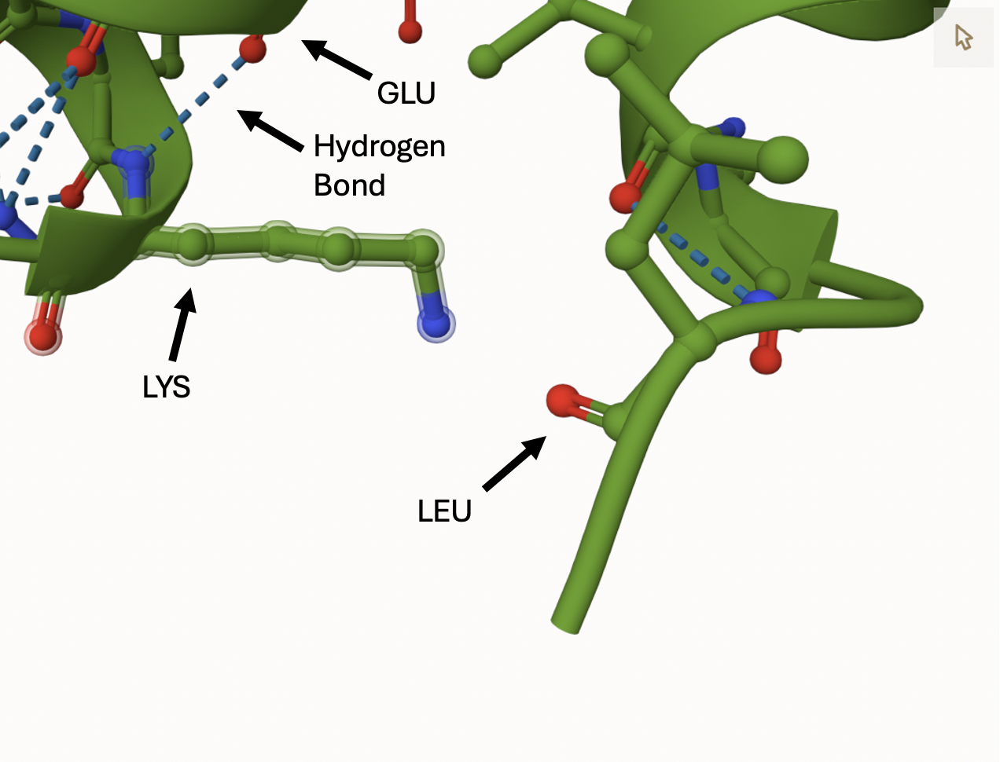
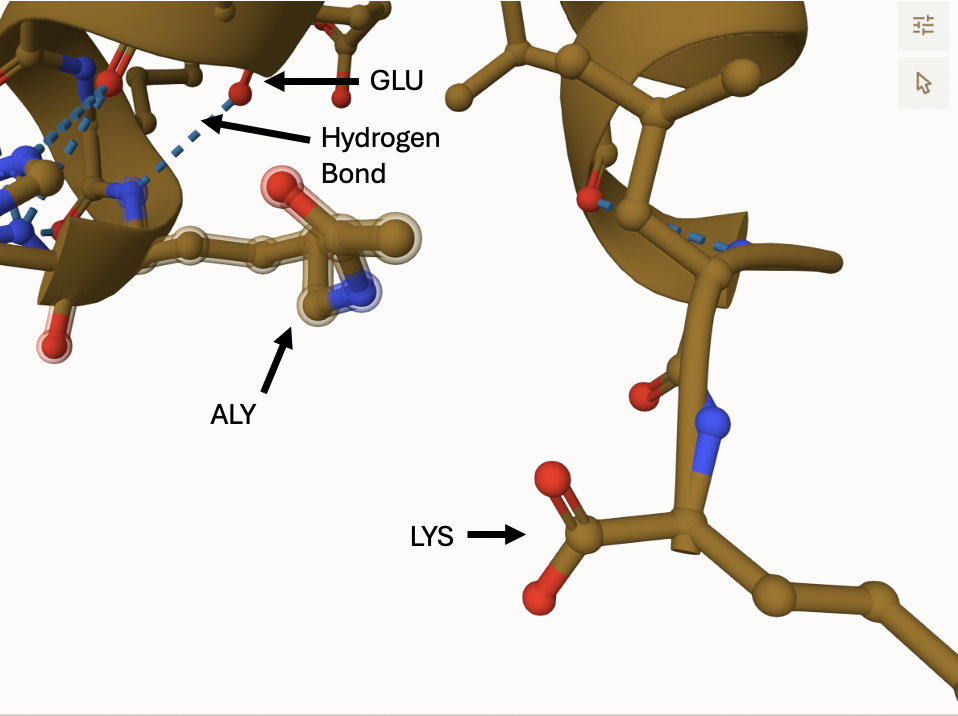
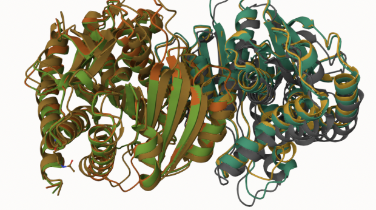
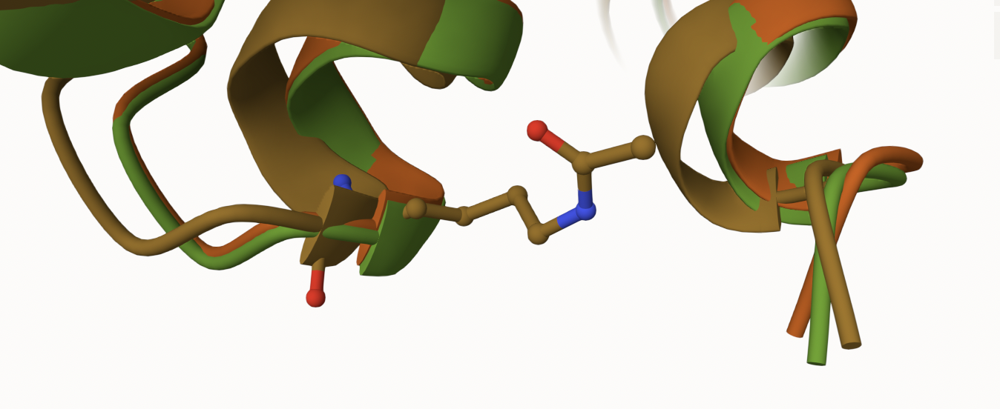
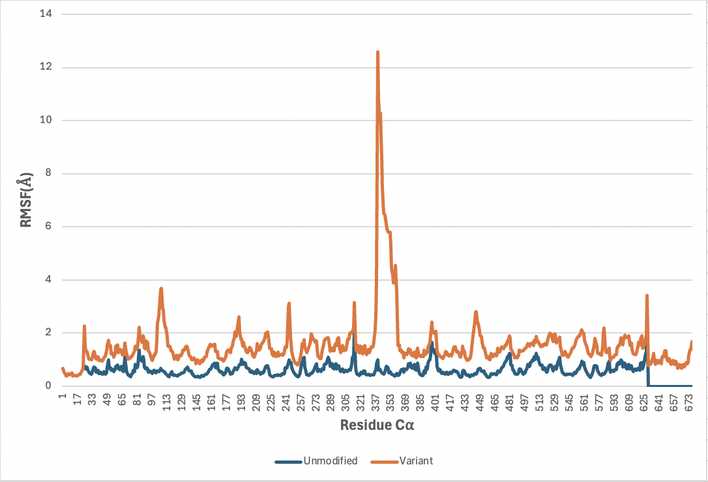
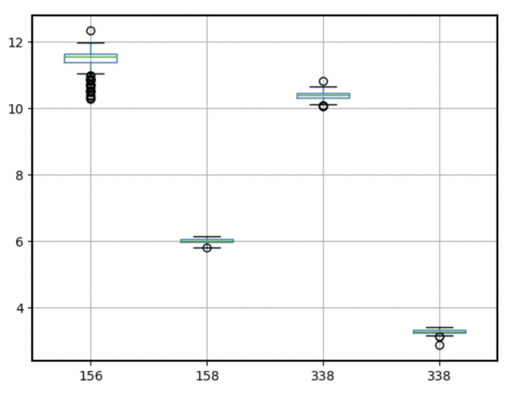
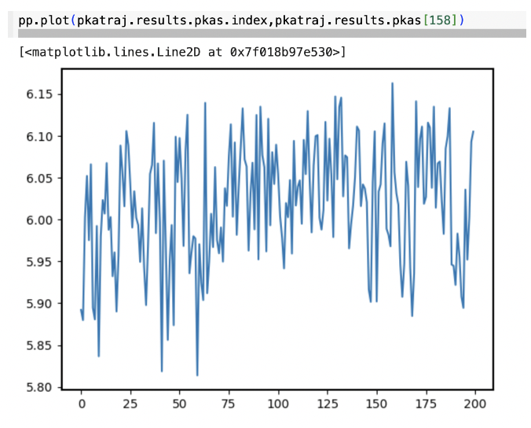
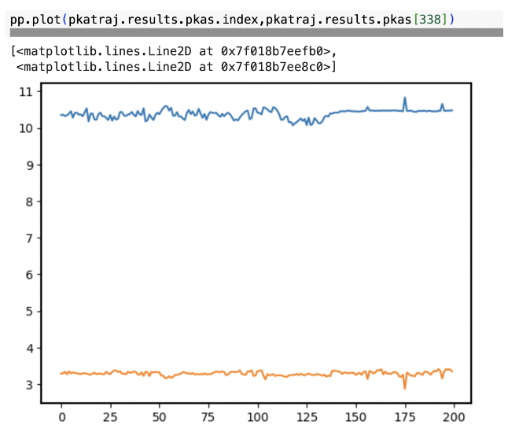

# Homo sapiens (Human) MDH2
# Uniprot ID: P40926
# Variation: acetylation of K157 (Q157 in structure)

## Description

The amino acid K157 in the MDH2 protein was modified to determine the changes in these various properties. Previous literature also discusses modification of the K157 amino acid as being one of the known lysine residues known to be acetylated2. Acetylation attaches an acetyl group obtained from the tricarboxylic acid (TCA) cycle metabolite acetyl coenzyme A (AcCoA) to a protein1. The reversible addition of acetyl groups to an E-amino group of lysine is seen as biologically significant1. As instructed, the amino acid K in position 157 was subjected to an acetylation PTM for the modified MDH2 and substituted with the amino acid Q for the variant MDH2 in AlphaFold. Two sequences were then provided from AlphaFold and utilized to identify which amino acids interacted with the K157 site for the modified, variant, and unmodified structures of MDH2 in mol*. Mol* identified the amino acid at the K157 site to be LYS in the unmodified structure, ALY in the modified structure, and GLN in the variant structure of MDH2. Weak interactions from adjacent amino acids, specifically van der Waals forces, and a hydrogen bond that connects the K157 site to GLU hold the 157 amino acid site in place. These interactions are consistent across all three structures. The unmodified structure of MDH2 in figure 1 shows interaction between LYS and LEU. Acetylation of the amino acid at the K157 site consequently, leads to new amino acid interaction at the altered K157 sites. For both the ALY in the modified structure and GLN in the variant structure, PTMs lead to interaction with LYS at the altered 157 site.

1. image of the unmodified site

2. image of modification site

## Effect of the sequence variant and PTM on MDH dynamics
The modified and variant structures of MDH2 differ from the unmodified structure as the altered 157 amino acids interact with LYS and not LEU. The original nature between the polar LYS and Non-polar LEU in the unmodified structure is subjected to hydrophobic interaction. Altering the 157 amino acids in the modified and variant structures of MDH2 likely adjusts its interaction from LEU to the LYS beside it for the purpose of retaining specific structural properties. PTMs in the modified and variant structures likely neutralized the 157 amino acids, allowing them to bind to the LYS.  These structures likely do this in an effort to keep hydrophobic interaction at the 157 amino acid site and cause the orientation of the LYS in the modified and variant structures to change as the altered amino acid is different between the two structures. Another structural change due to PTMs is the interaction of ARG with the active site based on relative distance. In the unmodified structure, ARG is part of the active site due to its relative closeness whereas, in the modified and variant structures, ARG is not part of the active site due to its large distance. Changes made to the active site can cause significant changes to the function of the protein4. Without interaction from ARG in the active site, the modified and variant structures of the MDH2 protein are less likely to bind to the target substrate effectively. This change would likely inactivate or degrade the protein, making it unable to perform its function in the citric acid cycle or metabolism. The modified and variant structures are no longer able to convert malate into oxaloacetate. The effect of this function may occur instantly or slowly diminish over time.

1. Image of aligned PDB files (no solvent)

2. Image of the site with the aligned PDB files (no solvent)

3. Annotated RMSF plot showing differences between the simulations

4. Annotated plots of pKa for the key amino acids

Description of the data and changes
The MDH2 variant sequence ran through an MDAnalysis package, providing RMSD, RMSF, and pKa results that mimicked the effect of a PTM in the laboratory. The variant RMSD values rapidly increased at a time = 0.000 before steadily increasing in the range of time 0.025 - 0.200. As previously determined by the unmodified protein, the RMSD values would begin leveling off whereas the variant protein continues to increase. RMSD values that level off or plateau show a protein reaches equilibrium, indicating the variant protein does not fully reach equilibrium as variants cause a disruption to normal protein functioning.RMSF data identified one large peak in the variant structure that is absent in the unmodified structure. The variant RMSF values indicate a peak where levels of dynamics are highest around 338 C⍺. High levels of dynamics indicated by RMSF indicate disorder within a protein3.Similarly to the unmodified structure, the variant structure of MDH2 provided by alpha fold predicted the structure to be dimeric. As indicated, the peak where the levels of dynamics are highest is around 338 C⍺. The peak around 338 C⍺, is significant as it correlates to the amino acid that interacts with the 157 site. In the variant structure of MDH2, the amino acid GLN at the 157 site interacts with LYS at the amino acid position 338. The LYS position 338, correlates to the 338 C⍺ peak in figure 4 showing high levels of dynamics. Changing the interaction from LEU at 337 to LYS at 338 due to substitution at the 157 amino acid position, explains there would be high levels of disorder at this position. Of the key amino acids that interact with the 157 site, the adjacent amino acids 156 and 158 were tested along with the amino acid 338 which is seen to have high disorder. The amino acid 158 provided a pKa around 6 while the amino acid 338 provided two completely different values around 3.3 pKa and 10.4 pKa. On the comparison graph, the amino acid 338 is listed twice as there are two varying pKa values. The two varying pKa values for amino acid 338 and the tight spread for amino acids 156 and 158 help validate high disorder only occurring at the 338 amino acid site. This disorder is not present in the unmodified structure and is the main site at which the variant structure differs due to substitution of the 157 amino acid. 

## Comparison of the mimic and the authentic PTM
The modified structure of MDH2 is also supported by the variant data from the MDAnalysis. The modified structure is similar to the variant structure since the 157 amino acids for both structures interact with LYS instead of LEU. However, the modified and variant structures have different amino acids in the 157 position. This creates different interactions with the LYS amino acid in position 338. High dynamicity discovered through MDAnalysis likely explains this ability for multiple interactions. Depending on the amino acid in the 157 position, the LYS being interacted with will change its pKa value to either 3.3 or 10.4. The lower pKa likely progresses through the citric acid cycle slower than the higher pKa. Another similarity between the modified and variant structures is the relative distance of ARG in the active site. ARG being removed from the active site is one of the key differences made by these PTMs. Finally, when the modified and variant structures are superposed, they are nearly identical outside of the LYS orientation at position 338. The similarities in overall structure and interactions around the modification site identify the variant as being a good approximation of the PTM induced in the modified structure. 

Part 4 from the Project 4 report outline
include images as needed

## Authors

Contributors names: Shane Euerle 

## Deposition Date: 12/6/2024

## License

Shield: [![CC BY-NC 4.0][cc-by-nc-shield]][cc-by-nc]

This work is licensed under a
[Creative Commons Attribution-NonCommercial 4.0 International License][cc-by-nc].

[![CC BY-NC 4.0][cc-by-nc-image]][cc-by-nc]

[cc-by-nc]: https://creativecommons.org/licenses/by-nc/4.0/
[cc-by-nc-image]: https://licensebuttons.net/l/by-nc/4.0/88x31.png
[cc-by-nc-shield]: https://img.shields.io/badge/License-CC%20BY--NC%204.0-lightgrey.svg

## References

* Citation1 

* Citation2 

* Citation3 