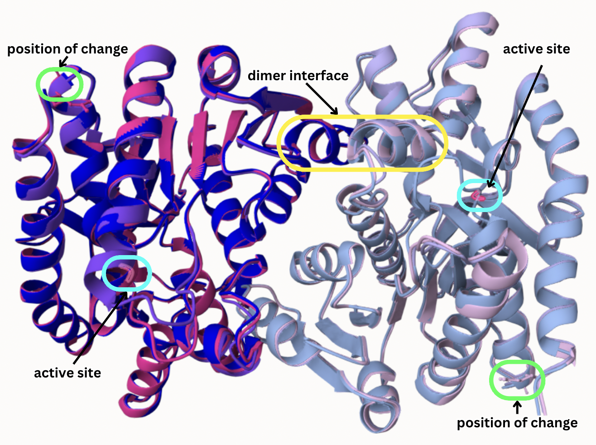
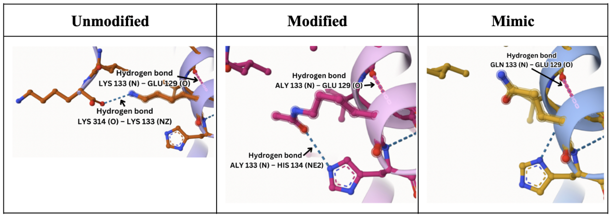
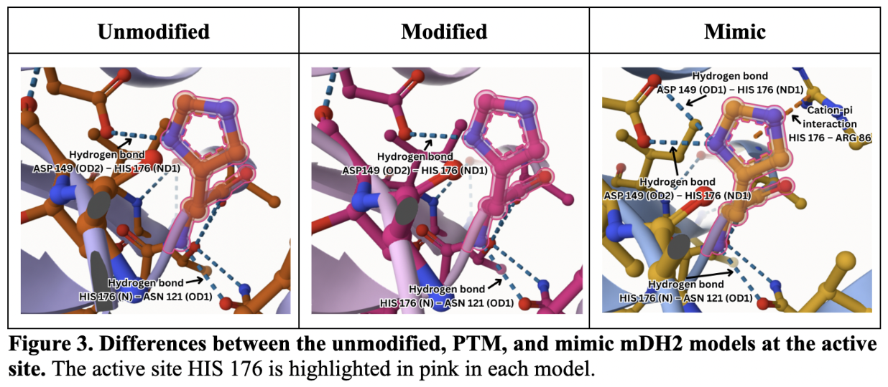
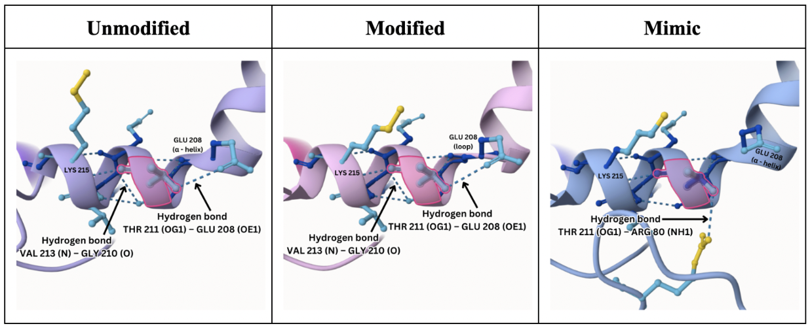
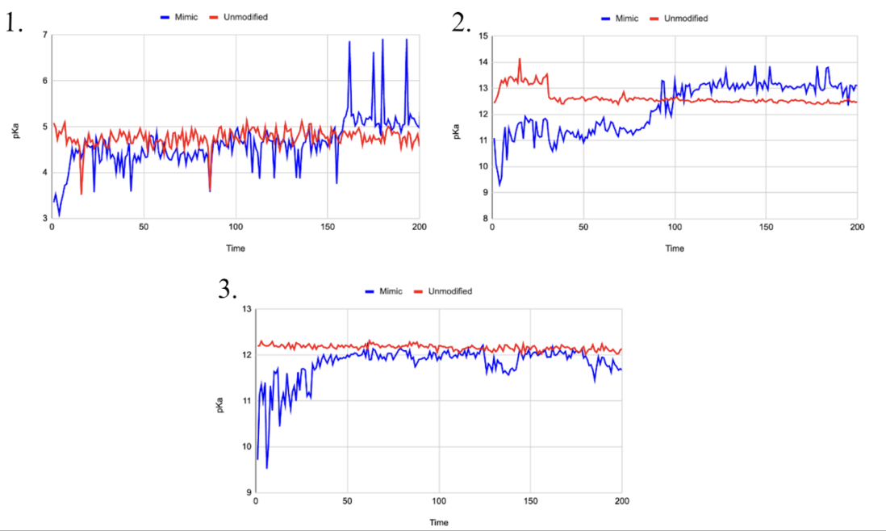
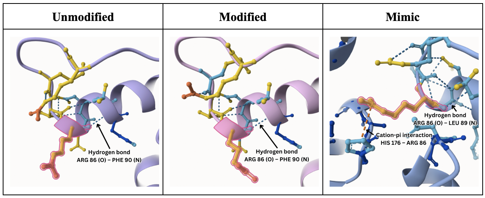
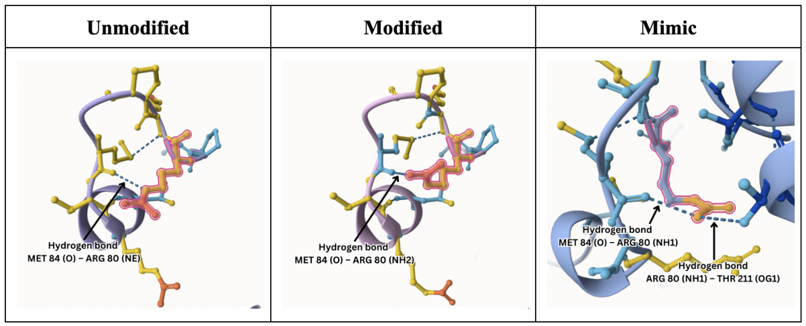

# Homo sapiens and MDH2
# P40926
# acetylation of K157 (qK133 in structure)

## Description

Lysine 177 of human MDH2 is evaluated to test its potential as a post-translationally modified site. There are no functional studies of the role of this site in human metabolism. Studies of acetylation and KQ substitution suggests the modifications could enhance the activity of MDH2. Entry started 12/06/2024

1. Alignment of MDH2 K133 (purple), MDH2 with ALY 133 (pink), MDH2 with Q133 (blue)

2. Modification site

3. Modifications at active site 

# The modification site is far from the active site and dimer interface.

## Effect of the sequence variant and PTM on MDH dynamics

The RMSD of MD simulations of MDH2 leveled starting at 0.2. RMSF visualized the movement of each amino acid. A high correlates with more movement. 

1. Annotated RMSF plot showing differences between the simulations

Analysis of significant peaks (~90, ~200, ~300, ~400, and ~600+) from both unmodifed MDH2 and the mimic. Amino acid that correlated with peak ~300 interacts with the modification site. Amino acid that correlated with peak ~400 interacts with the active site. 

2. Comparison of amino acid that correlates with peaks ~90, ~200, and ~600 

## Comparison of the pKa at key sites
The pKa trajectories from the unmodified MDH2 and mimic were compared at the active site and substrate binding sites

1. pKa trajectories at active site and binding sites

2. Molecular changes at substrate binding sites R86 and R80

## Authors

# Julia L. Hermanson

## Deposition Date
# 12/06/2024

## License

Shield: [![CC BY-NC 4.0][cc-by-nc-shield]][cc-by-nc]

This work is licensed under a
[Creative Commons Attribution-NonCommercial 4.0 International License][cc-by-nc].

[![CC BY-NC 4.0][cc-by-nc-image]][cc-by-nc]

[cc-by-nc]: https://creativecommons.org/licenses/by-nc/4.0/
[cc-by-nc-image]: https://licensebuttons.net/l/by-nc/4.0/88x31.png
[cc-by-nc-shield]: https://img.shields.io/badge/License-CC%20BY--NC%204.0-lightgrey.svg

## References

* Iwasaki, W.; Tachiwana, H.; et al. (2011). Comprehensive Structural Analysis of Mutant Nucleosomes Containing Lysine to Glutamine (KQ) Substitutions in the H3 and H4 Histone-Fold Domains. Biochemistry, 50(36). 7822-32. 

* Kim, E. Y..; Han, B. S.; et al. (2013). Acceleration of adipogenic differentiation via acetylation of malate dehydrogenase 2. Biochemical and biophysical research communications, 441(1). 77-82. 
