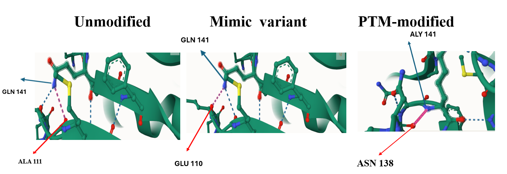
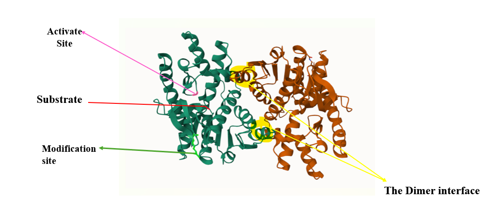
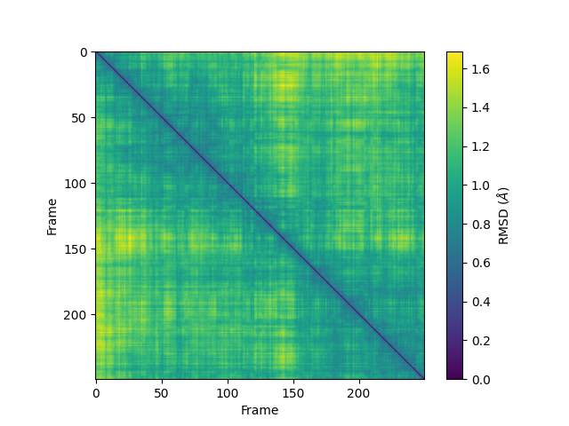
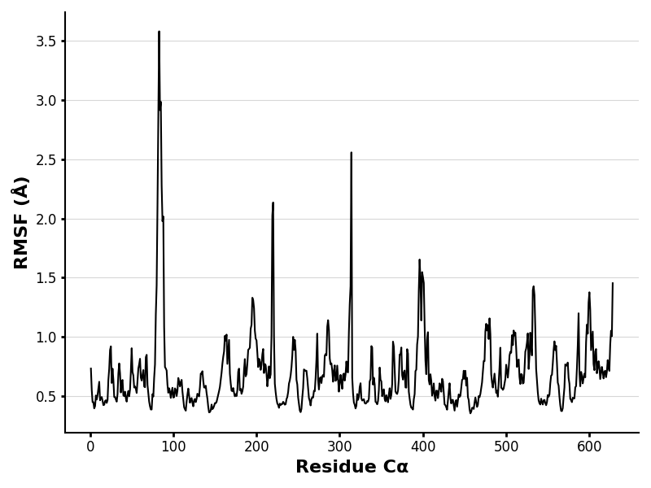
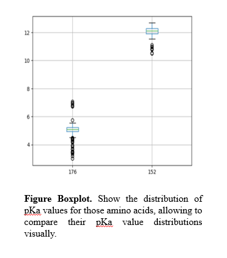

# Homo sapiens MDH2
# P40926
# Variation: acetylation of K165 (K141 in structure)

## Description

the effects of acetylation  have been experimentally studied using recombinant mutants, such as substitute glutamine (Q) for lysine residues (K) to mimic acetyl lysine (KQ mutant), showing that the binding free energy is smaller in the KQ mutant. In recent studies, a particular modification has been noted, but there remains a scarcity of detailed information regarding this site positioning on the protein.

# Part 1 from Project 4 report 

1. modification site showing weak interactions from the unmodified, variant, and PTM modified models

2.Position of modification site 

## Effect of the sequence variant and PTM on MDH dynamics

1. Some  amino acids are different  between the PTM modified and mimic variant !(PTM modified and mimic variant comparison.png)

3. Comparison of the enzyme dynamics

Analysis plot of RMSD values on the  Mimic variants becomes static around 0.60, meaning the protein is equilibrated (rmsd_compare_plot (1)). The pairwise plot of RMSD displays yellow and blue, with yellow meaning the frames are different and the blue (near aqua) color displays similarity. There is a slight pattern of yellow boxes at the cross of 200, 150 and 50 frames. This could suggest there are dynamic changes in the structure that are similar to each other and the proteins are alternating between two confirmations. 

The Root Mean Square Fluctuation (RMSF) Plot has peaks at ~90, ~210, ~310, residue Cα (Fig. 5).These peaks indicate that these amino acids experienced a lot of movement during the simulation. Looking back at the Mol* protein structure, amino acids 90,  210, and  310 are in alpha helix and are distance from the active site  and the peak heights for each amino acid corresponds to their structure. 

4. Effect of modification on the pKa values

The pKa trajectories  were compared at the active site and substrate binding sites OF unmodified MDH2 and mimic

Description of the data and changes

## Authors
Samaris. J Aranguren 

## Deposition Date
12/7/2024

## License

Shield: [![CC BY-NC 4.0][cc-by-nc-shield]][cc-by-nc]

This work is licensed under a
[Creative Commons Attribution-NonCommercial 4.0 International License][cc-by-nc].

[![CC BY-NC 4.0][cc-by-nc-image]][cc-by-nc]

[cc-by-nc]: https://creativecommons.org/licenses/by-nc/4.0/
[cc-by-nc-image]: https://licensebuttons.net/l/by-nc/4.0/88x31.png
[cc-by-nc-shield]: https://img.shields.io/badge/License-CC%20BY--NC%204.0-lightgrey.svg

## References

1.  Fujimoto, H.; Higuchi, M.; Koike, M.; Ode, H.; Miroslav Pinak; Juraj Kotulic Bunta; Nemoto, T.; Takashi Sakudoh; Honda, N.; Maekawa, H.; Saito, K.; Tsuchida, K. A Possible Overestimation of the Effect of Acetylation on Lysine Residues in KQ Mutant Analysis. Journal of Computational Chemistry 2011, 33 (3), 239–246. https://doi.org/10.1002/jcc.21956.
2.	Joseph, F. M.; Young, N. L. Histone Variant-Specific Post-Translational Modifications. Seminars in Cell & Developmental Biology 2022. https://doi.org/10.1016/j.semcdb.2022.02.012.

