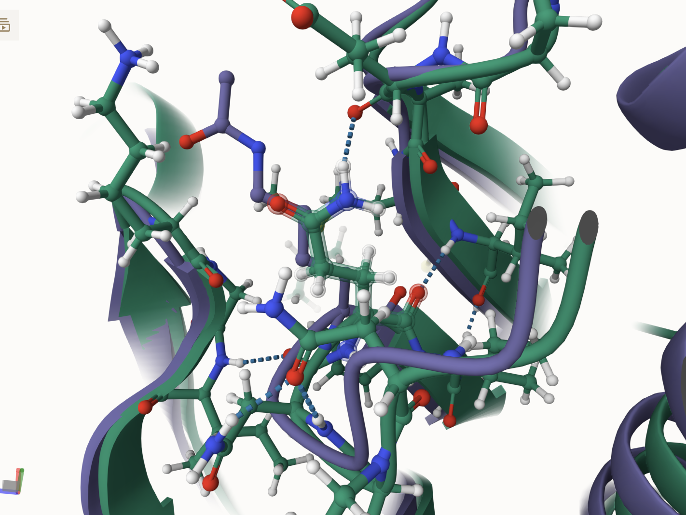

# Homo sapien MDH2
# Uniprot ID: P40926
# Variation: acetylation of K165 (acK141 in structure)

## Description
Lysine 165 of human MDH2 was identified as a reversibile post-transitionally modified site by Choundhary et. al in 2009. The study has identified 3600 lysine acteylation sites on 1750 different proteins. There are no functional studies of the impact of the PTM on this site. 

# Comparison of original MDH2, PTM modified, and mimic variant models

1. Alignment of MDH2 (dark green), PTM-modified (light green), and mimic variant (pink) models

2. Modification site alignment of MDH2, PTM-modified, and mimic variant models

The unmodified model interacts with Glu 134. The mimic variant introduces a new interaction to the modification site by interacting with Glu 110. The PTM does form any hydrogen bonds with Glu 134 or Glu 110. 

## Effect of the sequence variant and PTM on MDH dynamics

After the MD simulations, the protein structures had some differences including the area around the modification site. The mimic variant is forming an interaction with Glu 110. The modified model does not form this interaction. 

# Comparison of the enzyme dynamics
After conducting the MD simulations, the dynamics of the mimic variant model (purple) and the unmodified model (blue) were compared by plotting the root mean square fluctuation (RMSF) values against the amino acids. The plot showed differences around amino acid 90 which borders the active site. In the unmodified model this site shows helices, while in the mimic variant model, this site shows looping. 

Effect of modification on the pKa values
The mimic variant (purple) increased the pKa in the active site, His 176, to above 7. This increase may affect proton transfer steps in the MDH2 mechanism. 

## Comparison of the mimic and the authentic PTM

The RMSD for the modified modelaand the mimic was 0.98 angstroms. The structures showed slight differences in position and interactions. 

## Authors

Aliyah N. Walker

Contributors names

## Deposition Date

## License

Shield: [![CC BY-NC 4.0][cc-by-nc-shield]][cc-by-nc]

This work is licensed under a
[Creative Commons Attribution-NonCommercial 4.0 International License][cc-by-nc].

[![CC BY-NC 4.0][cc-by-nc-image]][cc-by-nc]

[cc-by-nc]: https://creativecommons.org/licenses/by-nc/4.0/
[cc-by-nc-image]: https://licensebuttons.net/l/by-nc/4.0/88x31.png
[cc-by-nc-shield]: https://img.shields.io/badge/License-CC%20BY--NC%204.0-lightgrey.svg

## References

* Choudhary, C.; Kumar, C.; Gnad, F.; Nielsen, M. L.; Rehman, M.; Walther, T. C.; Olsen, J. V.; Mann, M. Lysine Acetylation Targets Protein Complexes and Co-Regulates Major Cellular Functions. Science 2009, 325 (5942), 834–840. https://doi.org/10.1126/science.1175371.  

