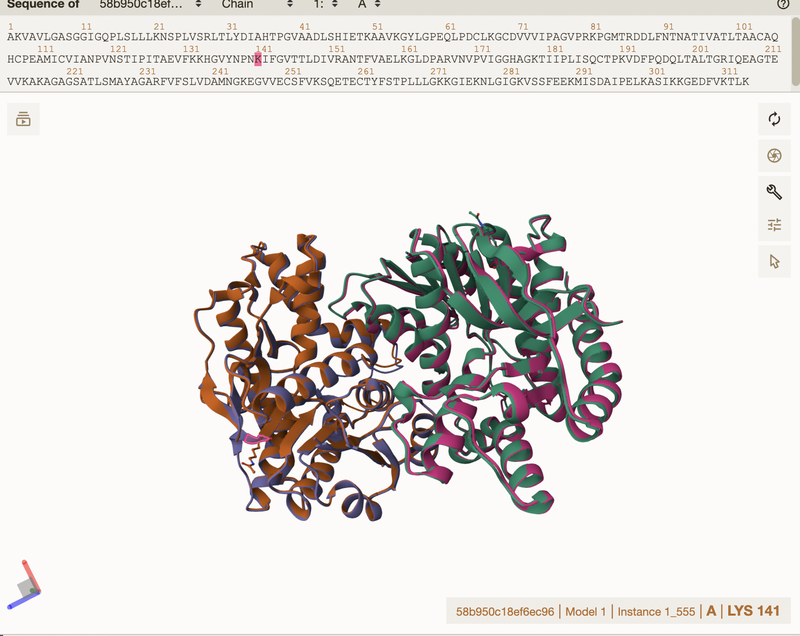
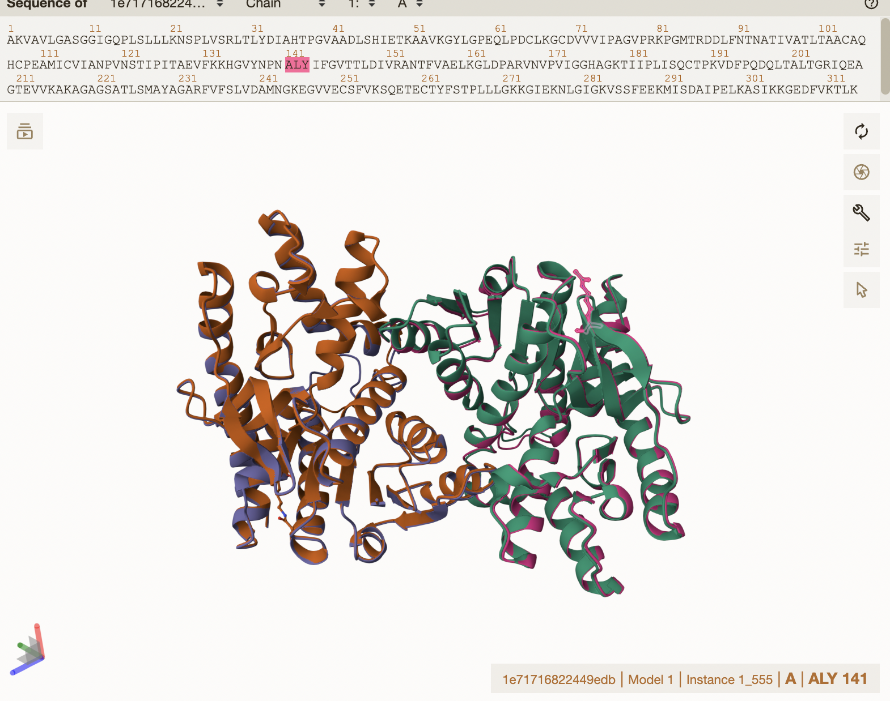
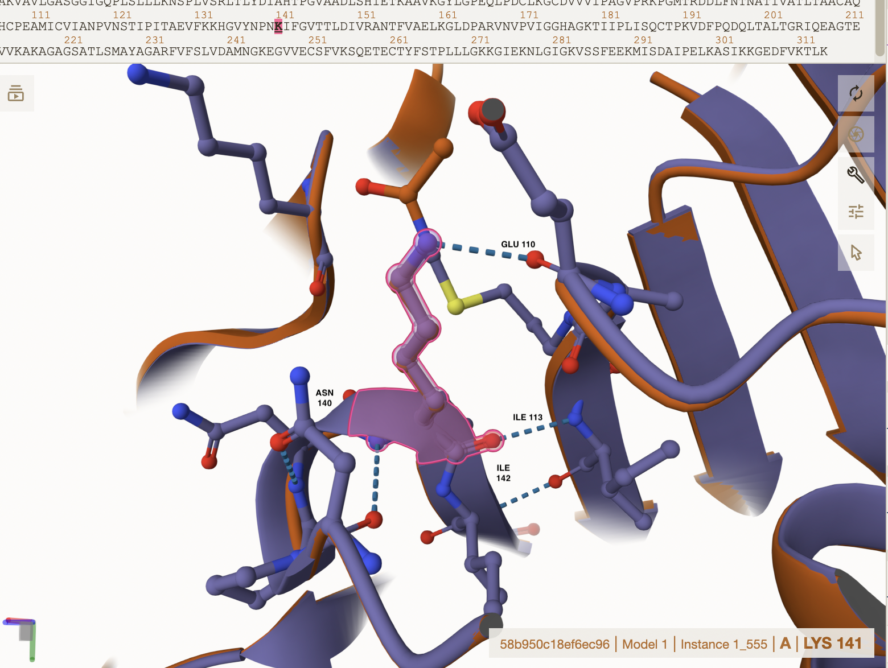
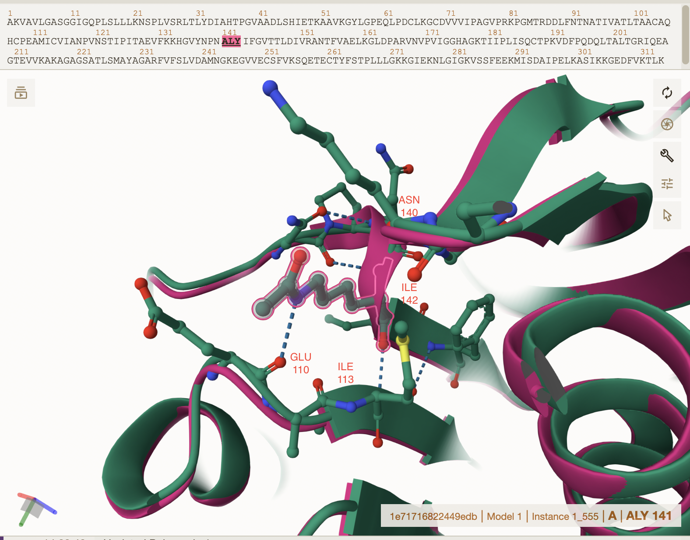
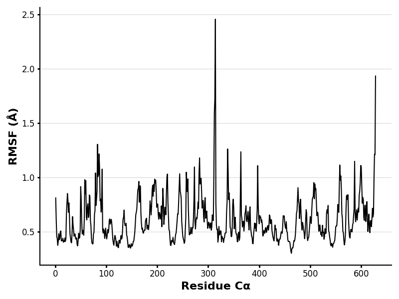
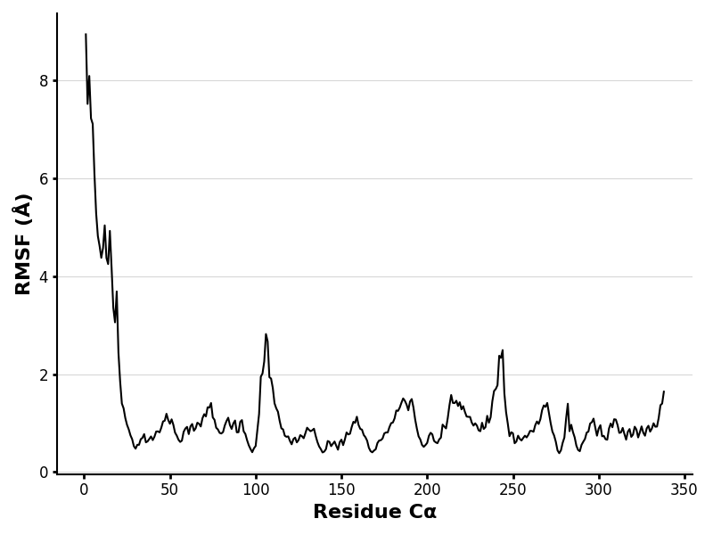
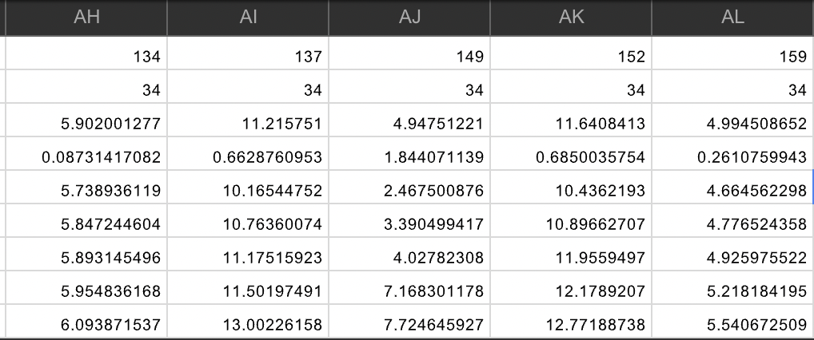

# Human Malate Dehydrogenase 2

# Uniprot ID:P40926

# Variation: acetylation of K165 (acK141 in structure)

## Description

Protein acetylation has been studied for over 50 years (Xia et al. 2020). Currently, there is limited research on acetylation at the site K165 in MDH2. However one source discovered K165 to be linked to “acute myeloid leukemia MV4-11 cells" by (Kuhn et al. 2024). It has been found that lysine acetylation mainly affects enzyme activity and causes an increase in enzyme activity (Venkat et al. 2017). Using Mol\*, inserting the mimic and original sequence, there was an obvious displacement between where the amino acid was located in the structure.

1.  Image of the unmodified site 

2.  Image of modification site 

## Effect of the sequence variant and PTM on MDH dynamics

The sequence variant on MDH2 changed placement in the enzyme compared to the unmodified sequence, however when the sequence was changed from Lysine to Glutamine, Glutamine still interacted with the same amino acids as Lysine did through hydrogen bonding. LYS 141 interacts with ASN 140 and ILE 142. In addition, LYS 141 interacts with ILE 113 and GLU 110 through hydrogen bonding. Glutamine also interacts with ASN 140 and ILE 142, and ILE 113 and GLU 110 through hydrogen bonding. Given this, it seems that the lysine acetylation in MDH2 affects enzyme activity, and not necessarily the entire structure.

1.  Image of aligned PDB files 

2.  Image of the site with the aligned PDB files (no solvent) 

3.  Annotated RMSF plot showing differences between the simulations  

4.  Annotated plots of pKa for the key amino acids 

Compared to the unmodified RMSF plot, the RMSF plot of the modified sequence change shows more activity throughout the stimulation. There are fluctuations in the graph, with some high peaks around residues 300 and 600. There seems to be constant motion throughout the entire stimulation meaning the amino acids are moving a lot within the protein and there is an increase in enzyme activity. Furthermore, the pKa values also fluctuate with surrounding amino acids indicating lysine acetylation and sequence change have an effect on the original MDH2 sequence.

## Comparison of the mimic and the authentic PTM

Given the previous research done, it seems that lysine acetylations increases enzyme activity in proteins. In this project, when lysine acetylation was completed on MDH2 substituting lysine at 141 for glutamine at 141 in AlphaFold3. This change seemed to effect enzyme activity as evidenced by the RMSD, RMSF, and pKa data given in the colabs. The research found on the PTM, acetylation aligns with the mimic in this project. There is limited research known about acetylation specifically on K165, so more research would need to be done to see the greater effects on MDH2.

## Authors

Madison E Topham

## Deposition Date

## License

Shield: 

This work is licensed under a [Creative Commons Attribution-NonCommercial 4.0 International License](https://creativecommons.org/licenses/by-nc/4.0/).

## References

-   MDH1 malate dehydrogenase 1 [Homo sapiens (human)] - Gene - NCBI. www.ncbi.nlm.nih.gov. [DOI](https://www.ncbi.nlm.nih.gov/gene/4190)

-   Xia, C.; Tao, Y.; Li, M.; Che, T.; Qu, J. Protein Acetylation and Deacetylation: An Important Regulatory Modification in Gene Transcription (Review). Experimental and Therapeutic Medicine 2020, 20 (4), 2923–2940. [DOI](https://doi.org/10.3892/etm.2020.9073)

-   Kuhn, M.; Rakus, J.; Quenet, D. Acetylation, ADP-Ribosylation and Methylation of Malate Dehydrogenase. Essays in Biochemistry 2024. [DOI](https://doi.org/10.1042/ebc20230080)

-   Venkat, S.; Gregory, C.; Sturges, J.; Gan, Q.; Fan, C. Studying the Lysine Acetylation of Malate Dehydrogenase. Journal of molecular biology 2017, 429 (9), 1396–1405. [DOI](https://doi.org/10.1016/j.jmb.2017.03.027)

-   T020 · Analyzing molecular dynamics simulations. TeachOpenCADD. [DOI](https://projects.volkamerlab.org/teachopencadd/talktorials/T020_md_analysis.html)

-   Lee, J. What is pKa? ChemTalk. [DOI](https://chemistrytalk.org/what-is-pka/)

-   Rizo, J.; Encarnación-Guevara, S. Bacterial Protein Acetylation: Mechanisms, Functions, and Methods for Study. Frontiers in Cellular and Infection Microbiology 2024, 14. [DOI](https://doi.org/10.3389/fcimb.2024.1408947)

-   Sehnal, D.; Bittrich, S.; Deshpande, M.; Svobodová, R.; Berka, K.; Bazgier, V.; Velankar, S.; Burley, S. K.; Koča, J.; Rose, A. S. Mol\* Viewer: Modern Web App for 3D Visualization and Analysis of Large Biomolecular Structures. Nucleic Acids Research 2021, 49 (W1). [DOI](https://doi.org/10.1093/nar/gkab314)

-   Abramson, J.; Adler, J.; Dunger, J.; Evans, R.; Green, T.; Pritzel, A.; Ronneberger, O.; Willmore, L.; Ballard, A. J.; Bambrick, J.; Bodenstein, S. W.; Evans, D. A.; Hung, C.-C.; O’Neill, M.; Reiman, D.; Tunyasuvunakool, K.; Wu, Z.; Žemgulytė, A.; Arvaniti, E.; Beattie, C. Accurate Structure Prediction of Biomolecular Interactions with AlphaFold 3. Nature 2024, 630 (630), 493–500. [DOI](https://doi.org/10.1038/s41586-024-07487-w)

-   Wohlwend, J.; Corso, G.; Passaro, S.; Mateo Reveiz; Leidal, K.; Swiderski, W.; Tally Portnoi; Chinn, I.; Silterra, J.; Tommi Jaakkola; Barzilay, R. Boltz-1: Democratizing Biomolecular Interaction Modeling. bioRxiv (Cold Spring Harbor Laboratory) 2024. [DOI](https://doi.org/10.1101/2024.11.19.624167)
