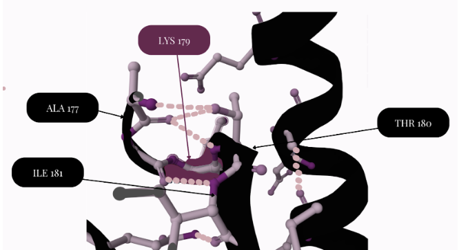
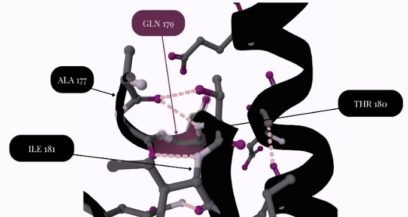
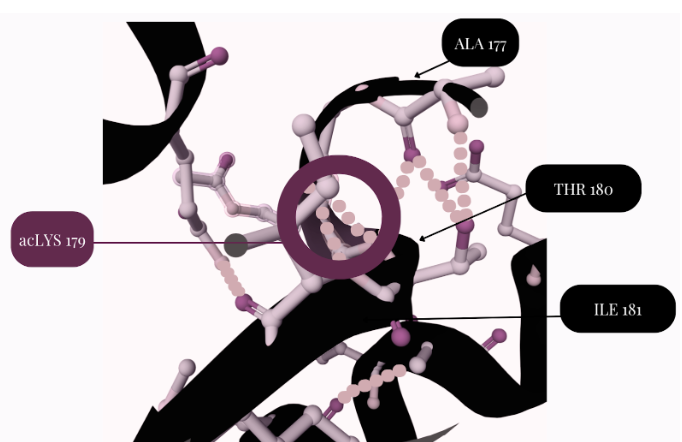
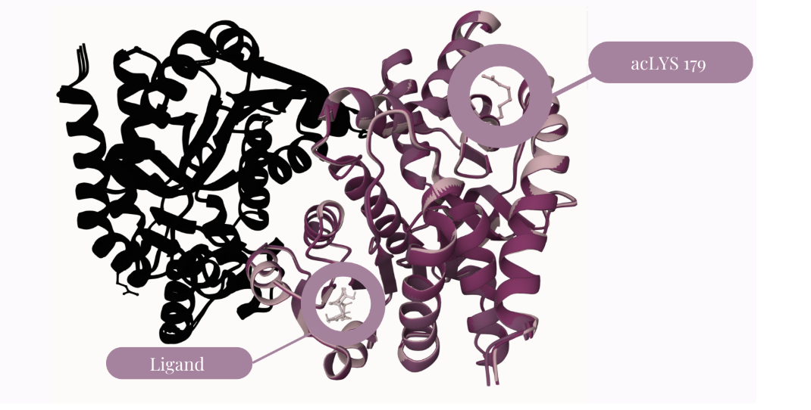
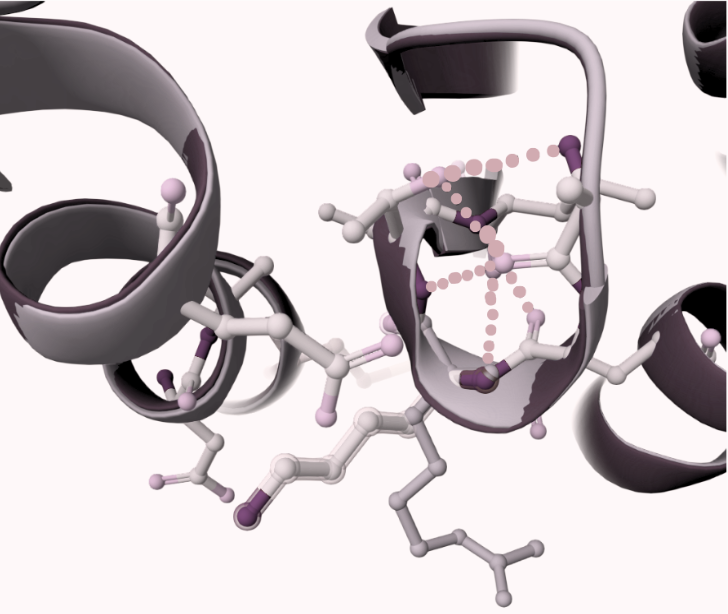
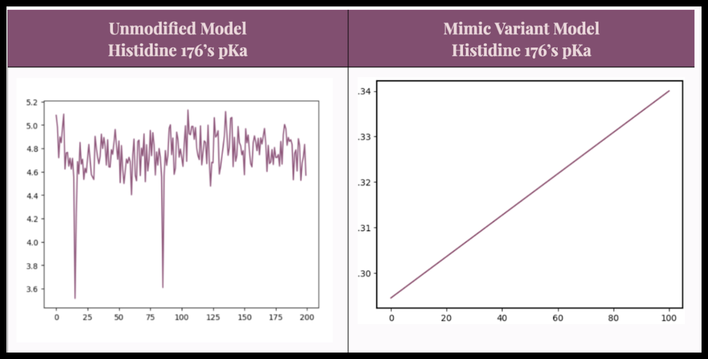
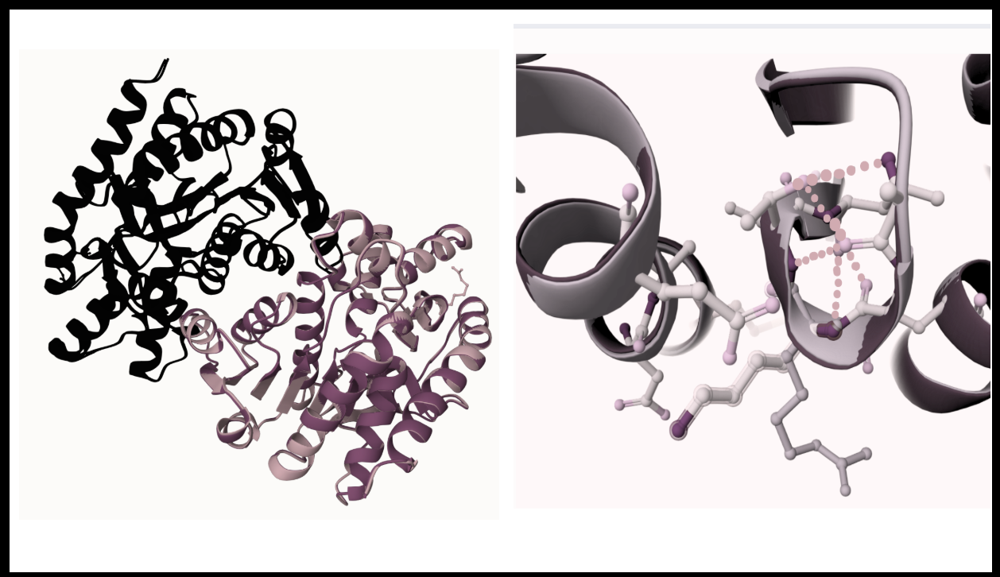

Homo sapiens and MDH2
UniProt ID: P40926
Variation: acetylation of K179

Description
Lysine 179 of human MDH2 was identified as a post-translationally modified (PTM) site by a manual assertion inferred from a sequence similarity (UniProt ID: P08249). There are no functional studies of the role of this site in human metabolism. The PTM substitutes a lysine for a glutamine, whereas the mimic variant is an acetylated lysine. Entry started 12/5/2024 BAS

Comparison of unmodified MDH2, PTM MDH2, and mimic variant MDH2
1. image of the unmodified site

2. image of PTM site

3. image of Mimic Variant site

Site 179 is located at an alpha helix in close proximity to the enzyme pocket, being only three amino acids away from the active site histidine 176. Site 179 is also distant from the dimer interface and has weak interactions, specifically hydrogen bonds, with neighboring amino acids, including alanine 177, threonine 180, and isoleucine 181.

Effect of the sequence variant and PTM on MDH dynamics

1. Image of aligned PDB files (no solvent)
The RMSD of the final frame from MD simulations of the unmodified MDH2 and mimic variant was 0.26 Å. The unmodified MDH2 is shown in orchid, while the PTM is shown in lilac and mimic variant is shown in pastel pink. 

After simulation, the overall protein structures are similar as well as the area surrounding the modification sites.

2. Image of the site with the aligned PDB files (no solvent)

3. Annotated RMSF plot showing differences between the simulations

After simulation, the dynamics as described by the root mean square fluctuation (RMSF) value were compared. The unmodified MDH2 has its highest RMSF peak of 2.5 Å at amino acid 80, whereas the PTM and mimic variants have their highest RMSF peaks of 0.28 Å at amino acid 320 and 0.25 Å at amino acid 20, respectively.

4. Annotated plots of pKa for the key amino acids

After simulation, the pKa plots for the active site histidine 176 were compared. The unmodified model has a graph pattern with a series of peaks and troughs that appear roughly horizontal on the graph, except at amino acids 15 and 83, where there are deep troughs. Comparatively, the mimic variant has a positive linear relationship between the frame number (x-axis) and pKa value (y-axis).

Comparison of the authentic PTM and mimic 
The RMSD for the PTM and mimic variant was 0.20 Å. The overall structures are similar with no major differences in structure or position.

Authors
Brittany A. Saulman

Deposition Date
12/07/2024

License

Shield: [![CC BY-NC 4.0][cc-by-nc-shield]][cc-by-nc]

This work is licensed under a
[Creative Commons Attribution-NonCommercial 4.0 International License][cc-by-nc].

[![CC BY-NC 4.0][cc-by-nc-image]][cc-by-nc]

[cc-by-nc]: https://creativecommons.org/licenses/by-nc/4.0/
[cc-by-nc-image]: https://licensebuttons.net/l/by-nc/4.0/88x31.png
[cc-by-nc-shield]: https://img.shields.io/badge/License-CC%20BY--NC%204.0-lightgrey.svg

 References
Uniprot. https://www.uniprot.org/uniprotkb/P08249/entry (accessed 2024-12-07).
