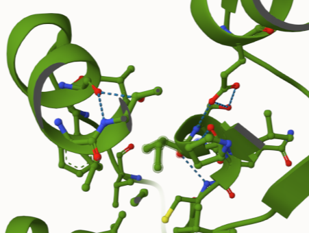
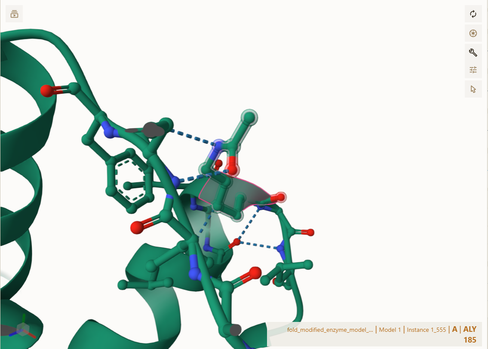
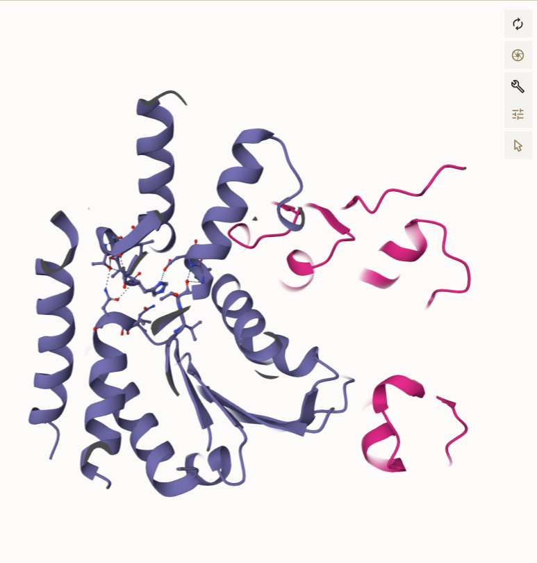
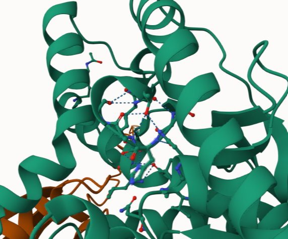

# Homo sapien and MDH2
# P40926
# K185

#Human malate dehydrogenase 2 (MDH2) is an essential enzyme in the citric acid cycle, catalyzing the conversion of malate to oxaloacetate and producing NADH. In this project, we examine the effects of post-translational modifications (PTMs) on MDH2, specifically focusing on the modification of lysine 185 (K185). By creating models of the unmodified, acetylated, and glutamine-mimic (K185Q) variants, we will compare their structural and functional changes, and its broader role in  metabolism.

The active site for the unmodified enzyme HIS 176, formed weak interactions with ASN 121 and ASP 145. This site is a substrate binding site serving as a proton acceptor. It is at this site that malate is oxidized. Here, the hydroxy (-OH) group is deprotonated from malate. Once modified, the sequence changes for the active site. The modified enzyme HIS 200 forms weak interactions with ASP 173 and ASN 145, and  the active site for the PTM mimic HIS 200 forms weak interactions with ASP 173 and ASN 145. Because of how similar the structure and charge of acetylated lysine is with glutamate, there was no difference in amino acid binding in the active site. 

1. image of the unmodified site

2. image of modification site

## Effect of the sequence variant and PTM on MDH dynamics

## Comparison of the mimic and the authentic PTM

Part 4 from the Project 4 report outline
include images as needed

### Colab notebook links

Provide file names of completed colab notebooks

## Authors

Tony Gelona

## Deposition Date

## License

Shield: [![CC BY-NC 4.0][cc-by-nc-shield]][cc-by-nc]

This work is licensed under a
[Creative Commons Attribution-NonCommercial 4.0 International License][cc-by-nc].

[![CC BY-NC 4.0][cc-by-nc-image]][cc-by-nc]

[cc-by-nc]: https://creativecommons.org/licenses/by-nc/4.0/
[cc-by-nc-image]: https://licensebuttons.net/l/by-nc/4.0/88x31.png
[cc-by-nc-shield]: https://img.shields.io/badge/License-CC%20BY--NC%204.0-lightgrey.svg

## References

