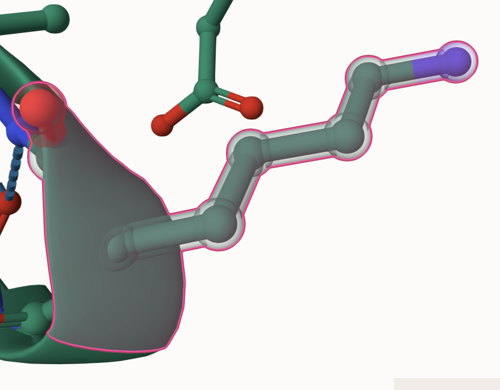
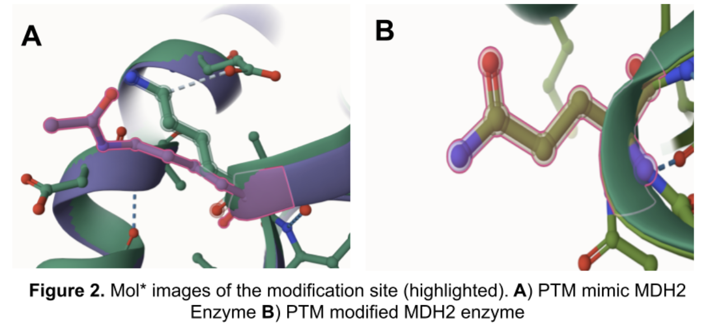
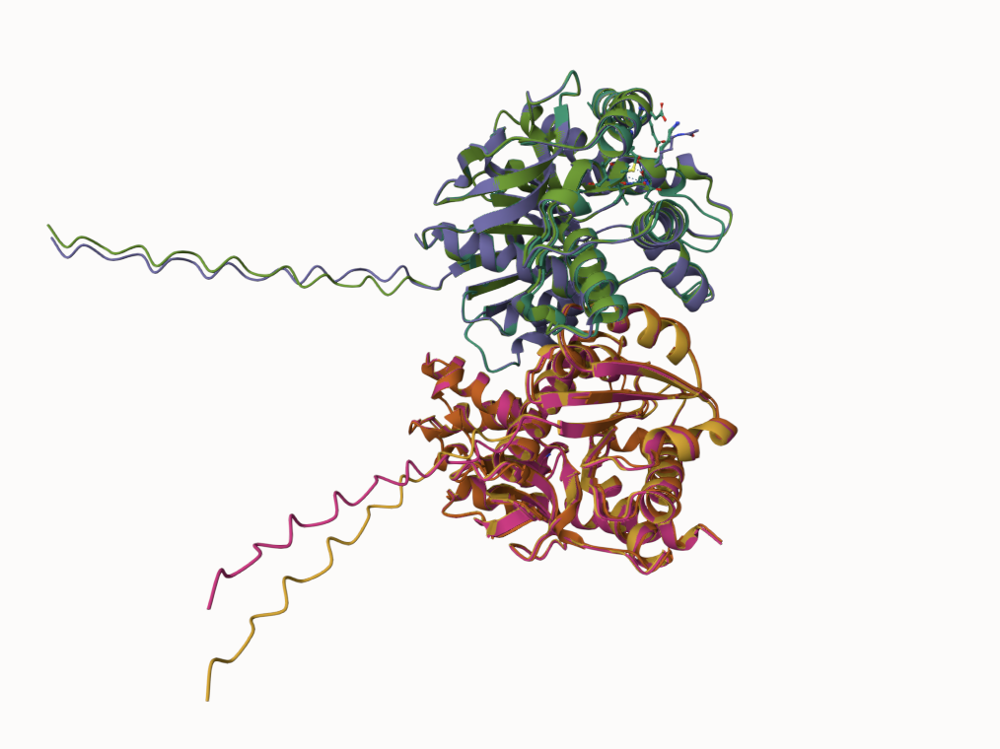
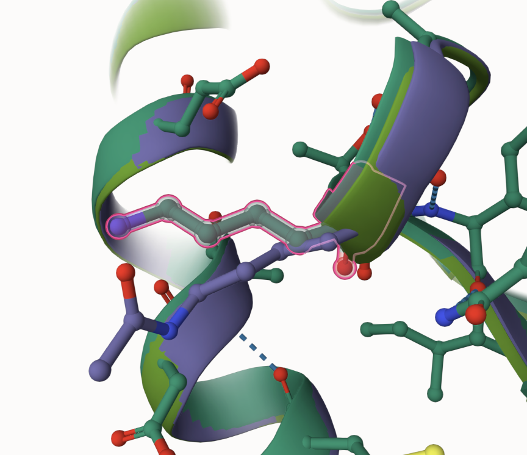
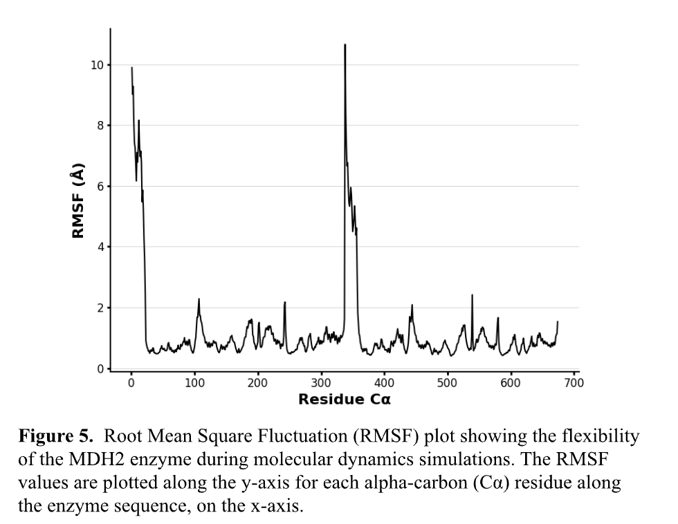
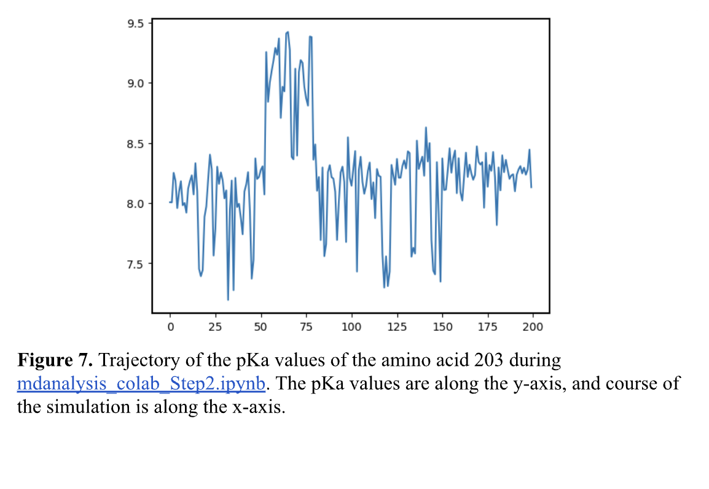

# Human MDH2
# K203
# Acetylation

## Description

Malate Dehydrogenase 2 (MDH2) plays a vital role in the Krebs cycle, ultimately driving cellular respiration [1]. In the final step of the Krebs cycle, MDH2 acts as a catalyst, oxidizing malate to oxaloacetate or aiding in the production of NADH, which is later stored as ATP in the body[1]. This reaction occurs in the mitochondria of all organisms and can act as either a forward or reverse reaction[2]. Many resources are available online on MDH2’s primary role in cellular respiration, however, post-transcriptional modifications on MDH2  remain less understood. PTMs may alter the protein’s structure, function, and interactions with other molecules [3] For this reason, research on post-transcriptional modifications done to MDH2 is vital to understanding the enzyme's effects in the body.

1. image of the unmodified site

2. image of modification site

The acetyl-lysine at the modification site was substituted for threonine, and threonine formed a polymer with the nearby glycine on residue 202. Threonine also formed many weak interactions with surrounding amino acids. These interactions and the polymerization increase the stability of the loop region, promoting more efficient substrate binding to malate. This results in higher levels of NADH and Oxaloacetate in the cell, which are products used in adipogenesis and likely disrupts the mitochondria’s steady state. Potential long-term effects of this include an increase in fat storage in the organism as well as non-alcoholic fatty liver disease due to the increase in the production of fat cells. Short-term, however, may result in a boost of energy for the organism.

1.  

2.  

3. Annotated RMSF plot showing differences between the simulations

4.  

## In the PTM-modified enzyme, this lysine’s positive charge was neutralized and modified to glutamine. In the PTM mimic enzyme, the lysine was given an acetyl group, changing lysine to acytllysine. In both modifications, the positive charge on the lysine was dropped and similarly alters numerous interactions with molecules in the Krebs cycle, therefore the PTM mimc is a good representation of an authentic post-transcriptional modification. Although the location of the modification site is relatively close to the active site in MDH2, no changes in chemistry at the active site are noted.

## Author
Devin McGovern

## 12/06/2024

## License

Shield: [![CC BY-NC 4.0][cc-by-nc-shield]][cc-by-nc]

This work is licensed under a
[Creative Commons Attribution-NonCommercial 4.0 International License][cc-by-nc].

[![CC BY-NC 4.0][cc-by-nc-image]][cc-by-nc]

[cc-by-nc]: https://creativecommons.org/licenses/by-nc/4.0/
[cc-by-nc-image]: https://licensebuttons.net/l/by-nc/4.0/88x31.png
[cc-by-nc-shield]: https://img.shields.io/badge/License-CC%20BY--NC%204.0-lightgrey.svg

## References

* Citation1 34234-5)

* Citation2 52369-7/fulltext)

* Citation3 

* Citation4 

*

