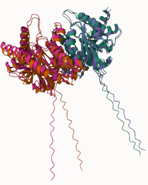

# Homo sapiens MDH2
# Uniprot ID: P40926
# Acetylation of K239

## Description

This project focuses on a post-translational modification of MDH2, specifically acetylation of lysine 239. A PTM mimic was applied by manually changing residue lysine 239 to glutamine. Although this particular variant was not characterized in UniProt, other previous experimental studies have been conducted, showing that LYS 239 is acetylated in response to caloric restriction and the absence of a protein called SIRT3 [2]. SIRT3 regulates mitochondrial function and homeostasis by removing an acetyl group at LYS 239 [4]. In the absence of this regulatory protein, an acetyl group is added to the amino group on lysine, neutralizing the positive charge and making the lysine side chain less basic [3]. This has been shown to reduce enzymatic activity, possibly having a detrimental effect on metabolic activity [2]. Structurally, the modification site is positioned at the dimer interface [2] and sits relatively close to the active site (HIS200) and substrate binding sites without directly participating within the active site. When looking at the unmodified site, the only amino acid that interacts is ASP 240; in the modified and variant sites, amino acids ALA 242 and THR 235 interact.

1. image of the unmodified site

2. image of modification site

## Effect of the sequence variant and PTM on MDH dynamics

When comparing the overall structure of the mimic variant before and after a molecular dynamics simulation, it is clear that there are differences. In the modification site, GLN 239 only interacts with THR 235 post-simulation and not THR 235 and ALA 242 as it does pre-simulation. In the active site, HIS 200 goes from bonding with ASN 145 and ASP 173 to bonding with ASN 145 and ASN 142. These shifts from the MD simulation show the level of movement that the variant components undergo and shows how the PTM mimic alters the conformation of MDH2, changing the substrate-binding pocket and decreasing overall protein stability. RMSF values were analyzed to give insight on any change in dynamics with the added variant. Positionally, the peaks in the unmodified plot show up in the same locations as in the variant plot. Height-wise, in the variant plot, the peaks at 110 Ca, 180-230 Ca, and 440 Ca all have higher RMSF values than their corresponding peaks in the unmodified plot. This points to areas of increased flexibility in the variant protein, meaning weaker interactions that allow for more dynamic movement. The locations of these peaks in the protein likely contain more loops and unstructured regions which decrease protein stability and increase the degree of disorder. A heat map of the RMSD values was generated to show the fluctuation of protein structure over time. Because there is a decent amount of yellow coloring present in the heat map, the atoms and residues within the protein have likely moved significantly from their initial conformation after molecular dynamics. With the addition of the variant, a large shift in the pKa of GLN 239 was observed. The pKa values slowly rise with a sharp increase at frame 7 and an immediate decrease at frame 9. Large shifts in pKa decrease protein stability and can promote partial unfolding at the sites where the pKa change is most drastic [1]. pKa acts as a representation of the amino acid functional group’s ability to donate a proton. With a decrease in pKa, the amide group in glutamine can no longer keep the same protonation state at physiological pH. This alters the chemistry and weak interactions around the modification site, leading to conformational changes that decrease protein stability [1]. A change in pKa was also observed at HIS 200. In the unmodified MDH2 structure, the pKa stayed relatively consistent with the variant pKa values. Later in the simulation, the variant series exhibited 4 large peaks in which the pKa rose close to 7. These examples of higher pKa could disrupt functional group protonation state, inducing local conformational changes in the active site and influencing substrate binding affinity.

1. Image of aligned PDB files (no solvent) 

2. Image of the site with the aligned PDB files (no solvent)

3. Annotated RMSF plot showing differences between the simulations

4. Annotated plots of pKa for the key amino acids

## Comparison of the mimic and the authentic PTM

There are some factors that dictate the comparison of the mimic and the authentic PTM, such as pKa. The pKa must be high enough so that acetylation can take place, but not so high that hydrogen bonding is lost and stability is decreased. When comparing the global structure of the PTM modified enzyme and the mimic variant, there wasn’t a substantial difference between the two. When looking at important sites such as the modification site and the active site, the amino acids interacting are the same between both models as are the weak interactions between them. Because there are so few structural differences, it can confidently be said that the mimic variant is a good approximation of the PTM.

1. Image of aligned mimic and modified

## Authors

Isabella L. Racz

## Deposition Date

12/06/2024

## License

Shield: [![CC BY-NC 4.0][cc-by-nc-shield]][cc-by-nc]

This work is licensed under a
[Creative Commons Attribution-NonCommercial 4.0 International License][cc-by-nc].

[![CC BY-NC 4.0][cc-by-nc-image]][cc-by-nc]

[cc-by-nc]: https://creativecommons.org/licenses/by-nc/4.0/
[cc-by-nc-image]: https://licensebuttons.net/l/by-nc/4.0/88x31.png
[cc-by-nc-shield]: https://img.shields.io/badge/License-CC%20BY--NC%204.0-lightgrey.svg

## References

* Citation1 

* Citation2 

* Citation3 

* Citation4 
