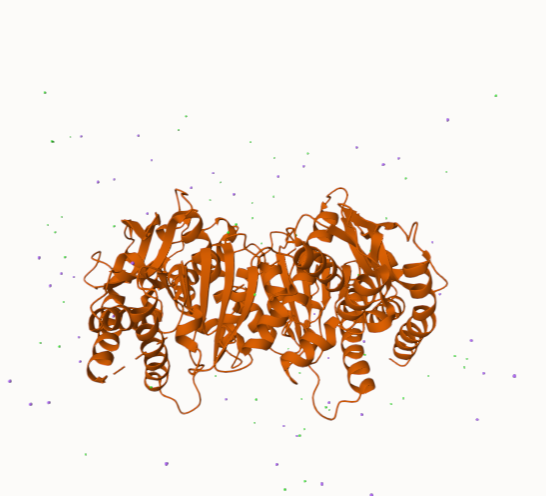

# MDH2
# P40926
# amino acid 296 K to Q

## Description

Human malate dehydrogenase 2 (MDH2) is an enzyme that plays a crucial role in cellular metabolism by catalyzing the reversible conversion of malate to oxaloacetate, a key reaction in the citric acid cycle and gluconeogenesis. There were three versions of the MDH2 studied in this project: the unmodified version, the post-translational modified version, and the mimic version. The mimic version is different from the unmodified version where lysine (K) is replaced with glutamine (Q) at the 296th position in MDH2. The post-translational modification of MDH2 was made by an acetylation of the lysine at the 296th position, which neutralizes the positive charge on the nitrogen in lysine’s R-group. While there was no study for K296, a study found that for human MDH2 at the position K307 the enzyme activity went up by 3.9 folds1. 
1. image of the unmodified site

2. image of modification site

## Effect of the sequence variant and PTM on MDH dynamics
The unmodified, mimic, and PTM (post-translational model) protein data bank (PDB) files were made using AlphaFold2. The PDB files were looked at in Mol* viewer (Figure 1). The unmodified, mimic, and PTM were superposed and aligned. The superposed structure had an RMSD value of 0.78Å, which we know is reliable and means good quality because it is under 2Å. This means the mimic and PTM were not very different from the unmodified version (Figure 2). Lysine 296 in the unmodified version has a positive charge that helps stabilize the negatively charged intermediates during catalysis, but in the mimic and PTM versions, this lysine is replaced with glutamine. This causes the positive charge to become neutral and disrupts the stabilizing interactions because the side chain is not positively charged and may not interact as strongly with the negatively charged groups in the active site or with substrates. We also see that the amide group of the glutamine can form hydrogen bonds, which can affect the flexibility of the enzyme (making it less efficient/less stable)
Part 3 from the Project 4 report

1. Image of aligned PDB files (no solvent)

2. Image of the site with the aligned PDB files (no solvent)

3. Annotated RMSF plot showing differences between the simulations

4. Annotated plots of pKa for the key amino acids

The average pKa value of HIS 200 from the molecular dynamics of the mimic version of MDH2 3.8 while the average pKa value of HIS 200 of the unmodified version of MDH2 was around 5.3 (Figure 3). This decrease in pKa value is supported by the hydrogen bonding that is happening in the mimic MDH2, which makes the R-group more acidic decreasing the pKa. 

Root Mean Square Fluctuation (RMSF) values of the unmodified and the mimic MDH2 were studied through molecular dynamics and plotted (Figure 2). There were no changes in the RMSF between the mimic and the unmodified versions. I believe the peaks that we see in orange are from the tails in the mimic version that are not there in the unmodified version. There was a difference in the active site HIS 200 though, with the unmodified version RMSF being 0.78Å, and the mimic version being an RMSF of 0.65Å, so an overall decrease of 0.13. This change demonstrates that there was more fluctuation of HIS 200 in the unmodified version than in the mimic version.  

## Author
Taylor Newman

## December 6th, 2024

## License

Shield: [![CC BY-NC 4.0][cc-by-nc-shield]][cc-by-nc]

This work is licensed under a
[Creative Commons Attribution-NonCommercial 4.0 International License][cc-by-nc].

[![CC BY-NC 4.0][cc-by-nc-image]][cc-by-nc]

[cc-by-nc]: https://creativecommons.org/licenses/by-nc/4.0/
[cc-by-nc-image]: https://licensebuttons.net/l/by-nc/4.0/88x31.png
[cc-by-nc-shield]: https://img.shields.io/badge/License-CC%20BY--NC%204.0-lightgrey.svg

## References

* Venkat, S.; Gregory, C.; Sturges, J.; Gan, Q.; Fan, C. Studying the Lysine Acetylation of Malate Dehydrogenase. J Mol Biol 2017, 429 (9), 1396–1405. 
* AlphaFold Protein Structure Database. AlphaFold Protein Structure Database. Ebi.ac.uk. https://alphafold.ebi.ac.uk/entry/P40926. 
