# Homo sapiens MDH2

# Uniprot ID: 40926
# Variation: acetylation of K301

## Description
Human Malate Dehydrogenase 2 (MDH2) is an enzyme that is essential for the Krebs Cycle of cellular metabolism and respiration. MDH2 is responsible for catalyzing the reduction of (S)-malate to oxaloacetate (de Lorenzo, et al 2024). To determine the function of different molecular structures, biochemists will make changes to the sequences and observe the result of those changes. Human Malate Dehydrogenases are commonly modified through post-translational modifications (PTMs). These modifications are covalent alterations of amino acids in a peptide chain which may produce changes in protein function and behavior (Kuhn, M. et al, 2024). In terms of MDH2, the appearance of a PTM does not always result in a functional modification. For this project, a PTM was generated for amino acid K301 or lysine. This was an acetylation of the protein which resulted in a substitution of glutamine (Q) for lysine (K). This PTM was compared to the mimic variant and unmodified structure of MDH2. Acetylation is the most common PTM found on proteins, including MDH2 (Venkat, S. et al, 2017). This modification reduces the positive charge of the N-e-amino group of the lysine side chain (Kuhn, M. et al, 2024). This modification has been previously studied. In one study, Chang liver cells were acetylated on multiple lysine amino acids including K301. The only modification that was able to alter the activity of the enzyme was K307. K301 had no impact on the activity of the enzyme (Kuhn, M. et al, 2024).  

# Comparison of MDH2 models and acetylated MDH2

The Alphafold3 structure of the mimic variant, PTM, and the unmodified MDH2 were superimposed to compare the structures at the modification site at amino acid 301. Due to transient proteins that are present in the MDH2 molecule, the amino acid numbering is adjusted for the unmodified MDH2. For the two modified MDH2 structures, amino acid 301 will be analyzed, while for the unmodified structure, amino acid 277 will be analyzed. The unmodified structure contains Lysine (K), the PTM contains an acetylated amino acid, and the mimic contains Glutamine (Q). 

1. Alignment of unmodified MDH2 (pink/purple), acetylated PTM (orange and green), and mimic (light green).
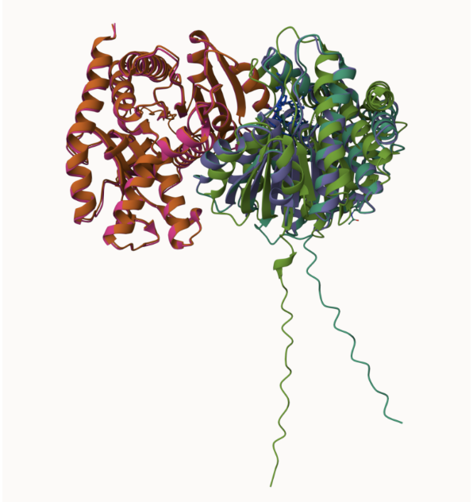

2. Modification site 301 alignment within MDH2
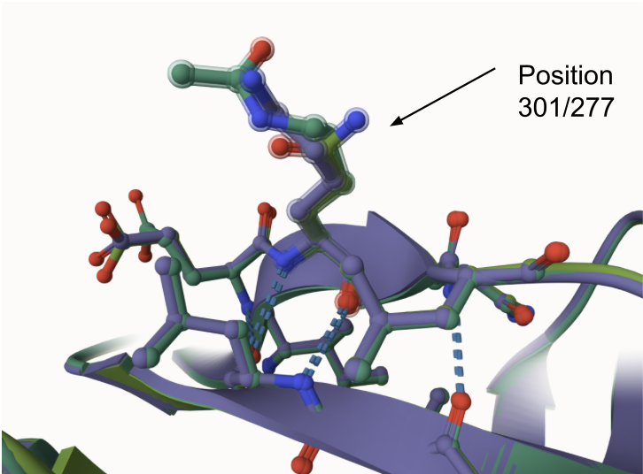

Not many differences were able to be determined when comparing the mimic to chain A (purple) of unmodified MDH2. Only structural changes within the amino acids were observed as there was a change from Lysine to Glutamine. No changes within weak interactions were identified. Three hydrogen bonds are present surrounding the modification site which are all the same between the two structures.

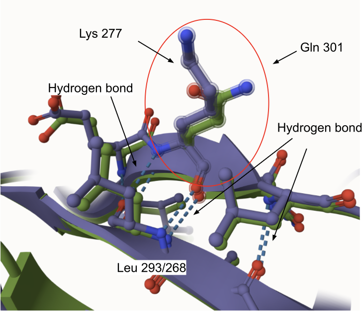 

When superimposing the mimic with chain B (pink) of MDH2, minor changes were identified. Unmodified MDH2 was found to have a hydrophobic interaction between Lys 277 and Leu 279 while the variant did not have an interaction between Gln 301 and Leu 303. All other interactions were the same between the two structures. Since Leucine is not involved in the active site of MDH2, substrate binding and the active site should not be impacted. This interaction could increase the stability of the unmodified protein compared to the mimic. 

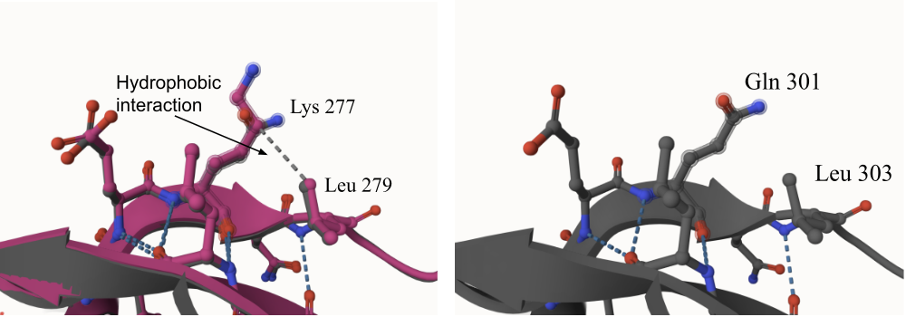

The PTM was also compared to the mimic and unmodified MDH2. There were no observable changes between the acetylated structure and the other versions of MDH2 at the modification site. Both chains of the unmodified MDH2 were compared and the weak interactions between them were the same between all structures. This further explains how the variations to site 301 in MDH2 does not have an impact on the function of the enzyme at this location. 

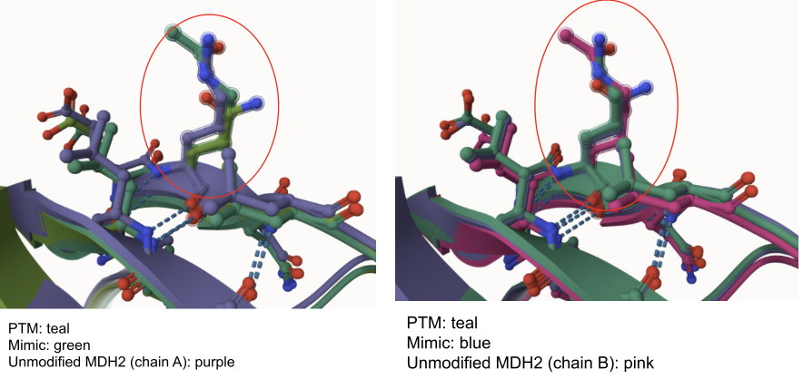

When analyzing the active site of MDH2, which is located at His 200 (His 176 for unmodified MDH2), there were also no changes found between the mimic, PTM, and the unmodified MDH2. All of the surrounding amino acids and weak interactions were the same. Lysine acetylations are known to inhibit active sites, but since the active site remains structurally the same, the binding affinity of substrates should also remain the same throughout the modified proteins (Nakayasu, et. al, 2017).

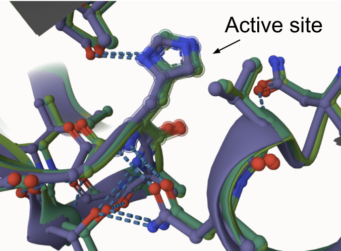

The binding sites within the Histidine active site are Arginine 176 and Asparagine 142 (Arginine 152 and Asparagine 118 for unmodified protein). There was a difference found within the binding site of Asparagine between the unmodified MDH2 and the two variants. MDH2 has a hydrogen bond between Asn 118 and Val 120 while the variants do not. 

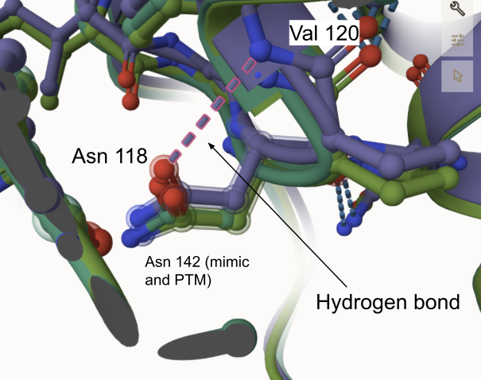

There was also a difference found in the other binding site, Arg 176 (Arg 152 for MDH2). In the PTM and unmodified MHD2, a hydrogen bond was found between the Arginine binding site and a surrounding Histidine (42 for unmodified MDH2 and 70 for PTM). This bond was not present for the mimic at this binding site location. These changes in binding sites can impact how well a substrate can bind to the active site and therefore how it performs its catalytic function. Hydrogen bonds within a binding site can enhance binding interactions (Chen, et. al, 2016). Since these interactions were not found within the mimic, the binding affinity may be weaker in these binding sites than in the PTM and unmodified MDH2. 

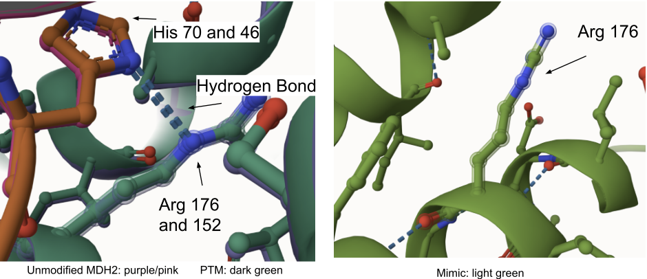

## Effect of the sequence variant and PTM on MDH dynamics

1. Superimposed mimic structure (green) and unmodifed MDH2 (pink/purple)
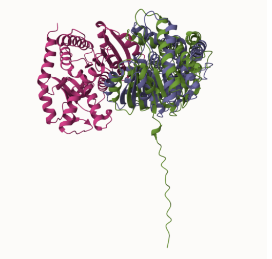

2. Superimposed unmodified MDH2, mimic, and PTM at site 301

**Comparison of ezyme dynamics**

3. RMSD plot showing differences between the simulations

Root mean square deviation (RMSD) was calculated for both the mimic and unmodified MDH2 to determine the protein's dynamics throughout the simulation. Differences were measured between the initial backbone of the structure and the final conformation which shows the stability of the protein (Kufareva, Abagyan, 2012). While the RMSD leveled out fairly quickly for the unmodified MDH2, the RMSD for the mimic gradually rose, leveled out, and then dropped around 0.125 milliseconds. The overall RMSD for the mimic was also higher than the unmodified MDH2. This shows that the protein has not reached a fixed state and that changes may be occurring in the protein throughout the simulation. 

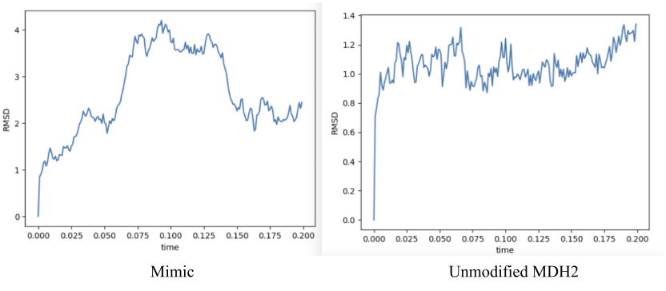

4. RMSF plot showing differences between the simulations

Root mean square fluctuation (RMSF) determines how much motion each amino acid has during the simulation. This determines how dynamic the protein is and can indicate stability of the protein. For the mimic, there were high RMSF values (>5) at the beginning of the simulation indicating more motion and had peaks throughout the rest of the simulation reaching RMSF values greater than 2. The RMSF for unmodified MDH2 also showed dynamic peaks throughout the entirety of the simulation. These peaks showed an RMSF greater than 2. Overall, the mimic RMSF shows higher values which indicates more dynamic functions. The RMSF values are low for the active sites and binding sites  (<1) for both the mimic and unmodified MDH2 showing the stability of the structure following the modification in these locations. This can make binding more favorable as high RMSF values do not make binding optimal environments (Di Vita, et. al, 2021). 

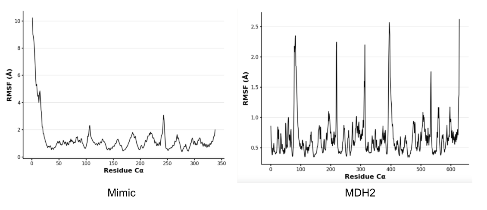

5. Plots of pKa for the key amino acids

The pKa values were determined during the Google Colab. Glutamine (Q) does not have a pKa, so the difference in pKa was not able to be determined for the modification. Instead the differences in pKa were determined for the active site and binding sites of the protein. The asparagine (Asn) also does not have a pKa value because at biological pH the amide does not carry a charge. 
The pKa of the active site (Histidine) between the unmodified MDH2 and mimic showed minimal changes (<0.5) (Table 1). This could be predicted as the active site did not show any differences when viewing in Mol*. This determines that the binding affinity remains similar with the modification. When looking at the change in pKa within the frames of the Colab, there are also minimal changes noted between the mimic and MDH2.
The Arginine pKa experienced a slight increase with the modification (>0.5). This can impact the ability of a ligand to interact with a protein and therefore its binding affinity (Thurlkill, et. al, 2006). This difference could be seen within the Mol* analysis as the unmodified MDH2 has an extra hydrogen bond with His 46 that is not present in the mimic (Figure 8). This increase in pKa can be seen throughout the progression of the Colab. The pKa remains within a certain range, but overall has increased from the unmodified enzyme.

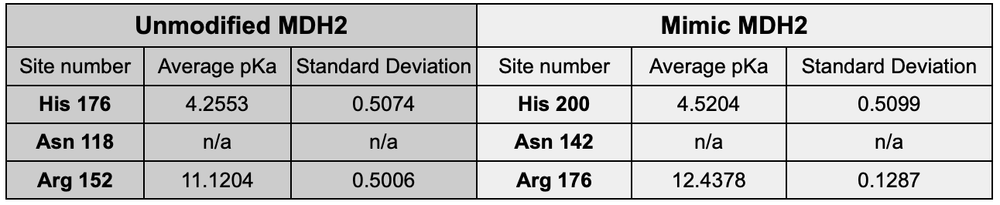

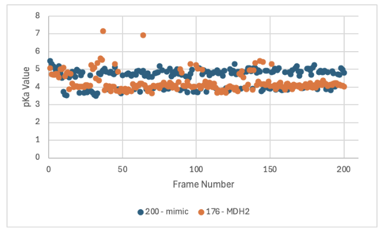

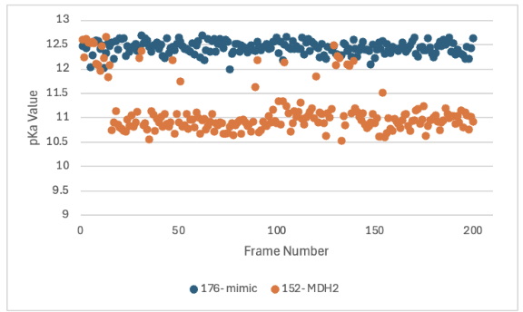

 

## Comparison of the mimic and the authentic PTM

When comparing the mimic to the PTM, there were very few changes in structure when analyzing the proteins on Mol*. As shown previously, there was no change in the structure or weak interactions of site 301 between the mimic and PTM. Although the PTM has the acetylated amino acid and the mimic has a glutamine, the weak interactions are the same for both. The active site His 200 and binding site Asn 142 were also the same between the two structures. This means that functionally, they would remain similar in terms of ligand binding. 
 
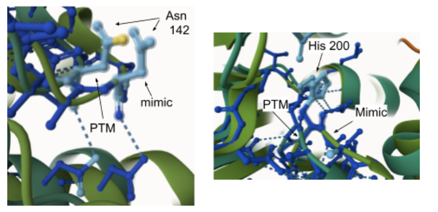

There was a difference noticed in the binding site Arg 176 between the mimic and PTM. The PTM (and unmodified MDH2) showed an extra hydrogen bond between the binding site and His 70. This hydrogen bond was not present for the mimic. The pKa values of the unmodified MDH2 might be more similar to the pKa of the PTM due to similar bonding patterns and weak interactions at this binding site. When comparing the pKa values of the active site and binding sites between the unmodified MDH2 and mimic, the only significant difference was noted between this Arginine binding site. While the mimic had a pKa of 12.4378, the unmodified MDH2 had a pKa of 11.1204 which may be lowered due to the extra hydrogen bond (Thurlkill, et. al, 2006). This difference is minor since the rest of the binding site and protein are relatively similar, but this change could still impact the ability of the protein to bind ligands (Chen, et. al, 2016). Based on the literature, acetylation at site 301 does not have any impacts on Km value of the of the substrates, NAD+, or malate which indicates that the substrate affinity remains relatively the same (Venkat, et. al, 2017).

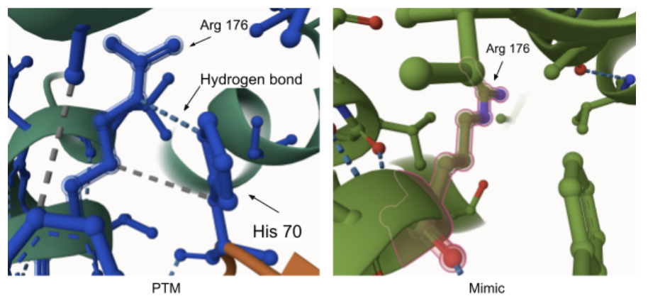

When comparing the unmodified MDH2 to the PTM and mimic, minor structural changes were found. Based on the literature, this PTM is not known to have impacts on the activity and binding of the enzyme (Kuhn, M. et al, 2024). The structural changes that were identified during this research, mainly showed weak interaction differences (hydrogen bonds) between the structures. Overall, the only major difference was found in a weak interaction between one of the binding sites (Arg 176). The lack of this bond showed an increase in pKa in the mimic which can impact ligand bonding (Chen, et. al, 2016). Since this specific alteration hasn't been cited in the literature, the overall impact is not yet known. 

## Authors

Regan Cunningham

## Deposition Date

12/06/2024

## License

Shield: [![CC BY-NC 4.0][cc-by-nc-shield]][cc-by-nc]

This work is licensed under a
[Creative Commons Attribution-NonCommercial 4.0 International License][cc-by-nc].

[![CC BY-NC 4.0][cc-by-nc-image]][cc-by-nc]

[cc-by-nc]: https://creativecommons.org/licenses/by-nc/4.0/
[cc-by-nc-image]: https://licensebuttons.net/l/by-nc/4.0/88x31.png
[cc-by-nc-shield]: https://img.shields.io/badge/License-CC%20BY--NC%204.0-lightgrey.svg

## References

* Chen, D.; Oezguen, N.; Urvil, P.; Ferguson, C.; Dann, S. M.; Savidge, T. C. Regulation of Protein-Ligand Binding Affinity by Hydrogen Bond Pairing. Sci. Adv. 2016, 2 (3), e1501240. 

* de Lorenzo, L.; Stack, T. M. M.; Fox, K. M.; Walstrom, K. M. Catalytic Mechanism and Kinetics of Malate Dehydrogenase. Essays in Biochemistry 2024, 68 (2), 73–82. 

* De Vita, S.; Chini, M. G.; Bifulco, G.; Lauro, G. Insights into the Ligand Binding to Bromodomain-Containing Protein 9 (BRD9): A Guide to the Selection of Potential Binders by Computational Methods. Molecules 2021, 26 (23), 7192. 

* Kufareva, I.; Abagyan, R. Methods of Protein Structure Comparison. Methods Mol Biol 2012, 857, 231–257.  

* Kuhn, M. L.; Rakus, J. F.; Quenet, D. Acetylation, ADP-Ribosylation and Methylation of Malate Dehydrogenase. Essays in Biochemistry 2024, 68 (2), 199–212. 

* Nakayasu, E. S.; Burnet, M. C.; Walukiewicz, H. E.; Wilkins, C. S.; Shukla, A. K.; Brooks, S.; Plutz, M. J.; Lee, B. D.; Schilling, B.; Wolfe, A. J.; Müller, S.; Kirby, J. R.; Rao, C. V.; Cort, J. R.; Payne, S. H. Ancient Regulatory Role of Lysine Acetylation in Central Metabolism. mBio 2017, 8 (6), e01894-17. 

* Thurlkill, R. L.; Grimsley, G. R.; Scholtz, J. M.; Pace, C. N. Hydrogen Bonding Markedly Reduces the pK of Buried Carboxyl Groups in Proteins. Journal of Molecular Biology 2006, 362 (3), 594–604. 

* Venkat, S.; Gregory, C.; Sturges, J.; Gan, Q.; Fan, C. Studying the Lysine Acetylation of Malate Dehydrogenase. Journal of Molecular Biology 2017, 429 (9), 1396–1405. 
