# Human MDH2
# P40926
# Acetylation of lysine 307

## Description

Human Malate Dehydrogenase is an important enzyme that plays a vital role in the Kreb’s cycle of metabolism and respiration. More specifically MDH2 is responsible for catalyzing the reduction of malate to oxaloacetate (de Lorenzo, et al, 2024). Modification to the sequence of MDH2 could have a major impact on the proteins structure and function and proteomic studies have shown the MDH is a highly modified protein, but their specific effects have not been determined (Ramazi et al., 2021). Two types of modifications can be analyzed with simulations and visualization techniques: mimic variants and post translationally modified (PTM) models of proteins. Mimic variants include a single modification of an amino acid, while PTM’s have an amino acid side chain modification after biosynthesis (Ramazi et al., 2021). Through modeling the mimic variant protein, comparing to PTM protein and concluding the effects of these modifications could be very beneficial to the scientific community as a whole (Figure 1).  

1. image of aligned unmodified, modified and PTM
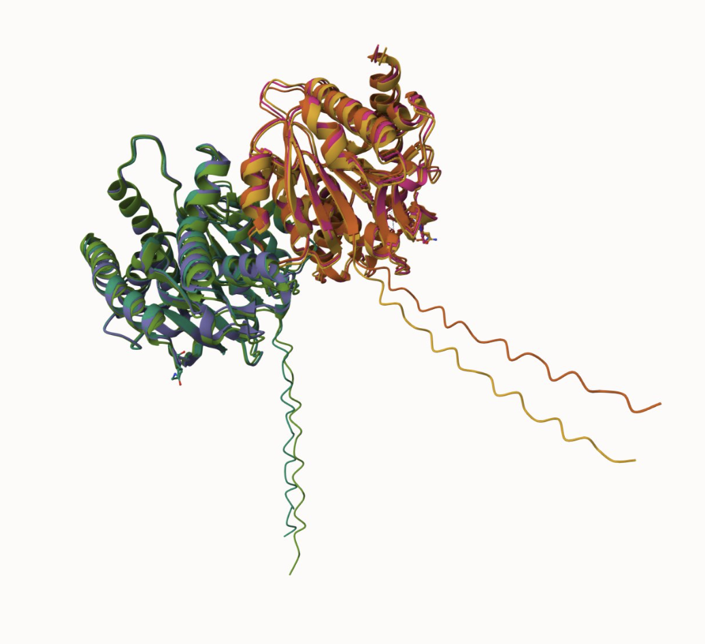

The modification site I will focus on is amino acid 307, which in the unmodified form is a lysine (Figure 2). Due to MDH2 is a transient protein the numbering between the MDH2 model and mimic variant and PTM the modification site is 307 in the mimic variant and the PTM, while in the MDH2 model the modification site is 283. Research has been done on this specific modification site and has shown a missense mutation from lysine to arginine (Figure 3), and it was concluded to potentially be destabilizing (Uniprot, 2024). The missense mutation was also concluded to not have any protein-protein interactions within the active site (EMBL-EBI ProtVar, 2024). Molecularly both arginine and lysine are positively charged and play important roles in the stability of a protein due to being able to form electrostatic interactions (Sokalingam et al., 2012).  

2. image of the unmodified site
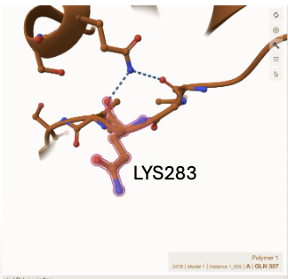

3. image of modification site
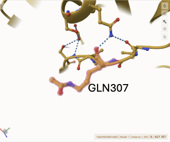

Studies have also been conducted regarding the acetylation (addition of an acetyl group) of specific amino acids in MDH2, specifically amino acid 307. When position 307 is acetylated, it increases the enzyme activity significantly and doesn’t affect substrate binding (Venkat, et al., 2017). It has also been shown that the acetylation of the lysin at site 307 has increased enzyme turnover, but still didn't change binding affinity for malate and NAD+ in the MDH2 reaction (Kuhn et al., 2024).  

From the research that has been done on the modification site 307 in MDH2, I predict that my modification from Lysine to Glutamine will destabilize the structure of MDH2, which will also impact function. I believe this will occur, due to lysine being protonated and glutamine being deprotanated resulting in bonds not being able to be formed with the mimic variant modification site. With the acetylation of the lysine at site 307, I predict that it will impact not only the structure of the protein, but also impact the function significantly.  

When the three proteins models MDH2 unmodified, mimic variant and PTM protein all superimposed both chains of the dimer are identical to each other (Figure 4). 

4. image of both dimer chains at modification site
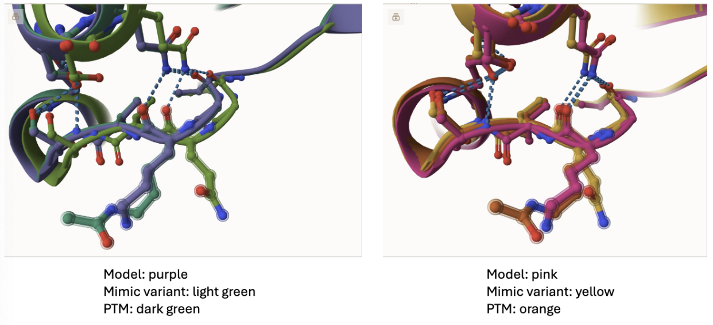

Amino acid 307 interacts with the amino acid Glutamine at site 211 in both the modified and unmodified models, as shown in figure 5. When the modification from lysine to glutamine was made, the weak interactions between the modification site and glutamine 211 remained the same, but the surrounding structure changed in the mimic varient model. The structure of the mimic protein was impacted by changing the surrounding structure with the loss of hydrogen bonding between serine 285, glutamine 288 and serine 186 that was seen in the unmodified model of MDH2 (Figure 6). I predict the loss of these interactions in the mimic variant will make the sturcute less stable and could result in less oxaloacetate and NADH formation in the mechanism of MDH2.  

5. image of modification sites in all 3 models
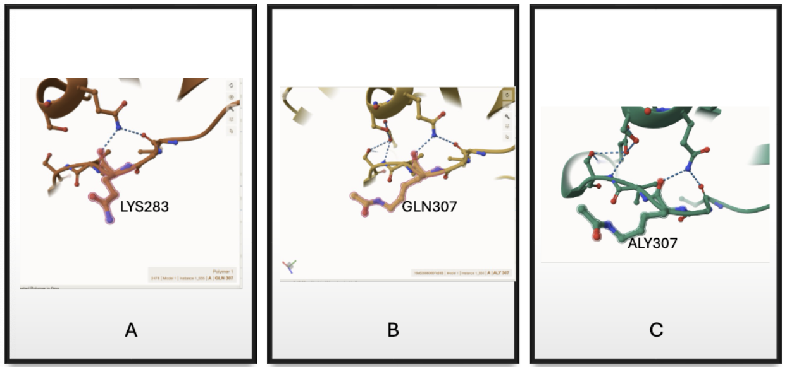

6. image of modification site of MDH2 and mimic variant
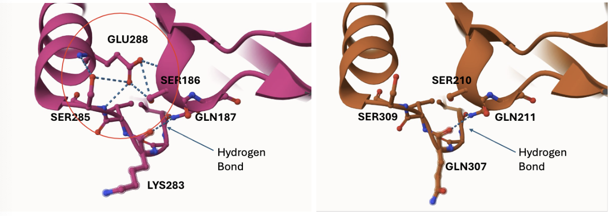

	Regarding the overall function of the protein, I think it will still be able to go through the mechanism due to the active site (Figure 7) and binding sites (Figure 8) in all 3 models (MDH2, mimic variant and PTM) being the same and not having any structural differences.  

8. image of binding sites
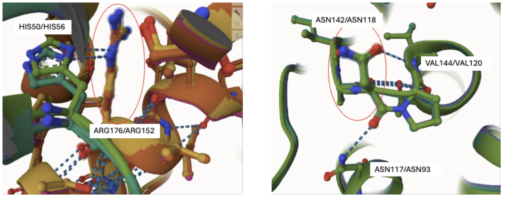

	To represent the post translationally modified (PTM) MDH2 the modification site 307 was acetylated (Figure 9). 

9. image of PTM modification site
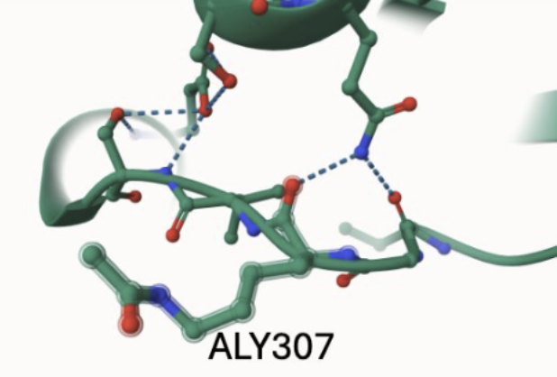

When comparing the modification site 307 between MDH2, mimic variant and the PTM model, the PTM and MDH2 are similar in the hydrogen bonding formed between serine 308/285, glutamine 312/288 and serine 210/186 (Figure 10). The similarity of the PTM to the MDH2 model show that the structure doesn’t change with the acetylation of the lysine 307, so I predict the function wouldn’t be affected. I also don’t think function or the metabolic pathway would be impacted due to the active and binding sites remaining the same (Figure 7 and Figure 8). 

10. image of modification sites PTM vs. MDH2
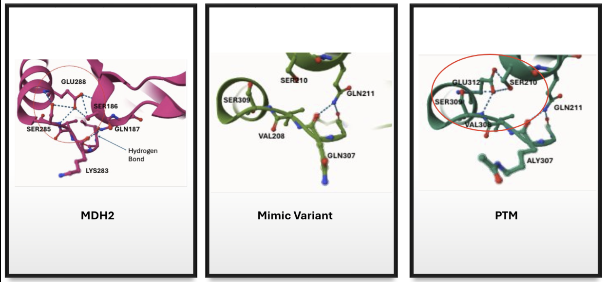

## Effect of the sequence variant and PTM on MDH dynamics

Part 3 from the Project 4 report

From the molecular dynamics simulations ran for the MDH2 model and variant protein (Figure 11), the structure was changed with the missense mutation that was added at site 307. The structural changes as shown in Mol* (Figure 12) in structure decreased the overall stability of the protein, due to the loss of hydrogen bonding near the modification site. The changes in the structure in the variant protein can be shown in the RMSF data collected. The RMSF data shows that the mimic variant has only 2-3 regions of higher flexibility with an increased amount of restricted molecular dynamics occurring in the lower peaks, compared to MDH2 (Figure 13). As shown in the RMSD data (Figure 13) the peak around modification site 307 got smaller, indicating a loss of flexibility for that region of amino acids. 

1. Image of aligned PDB files (no solvent)
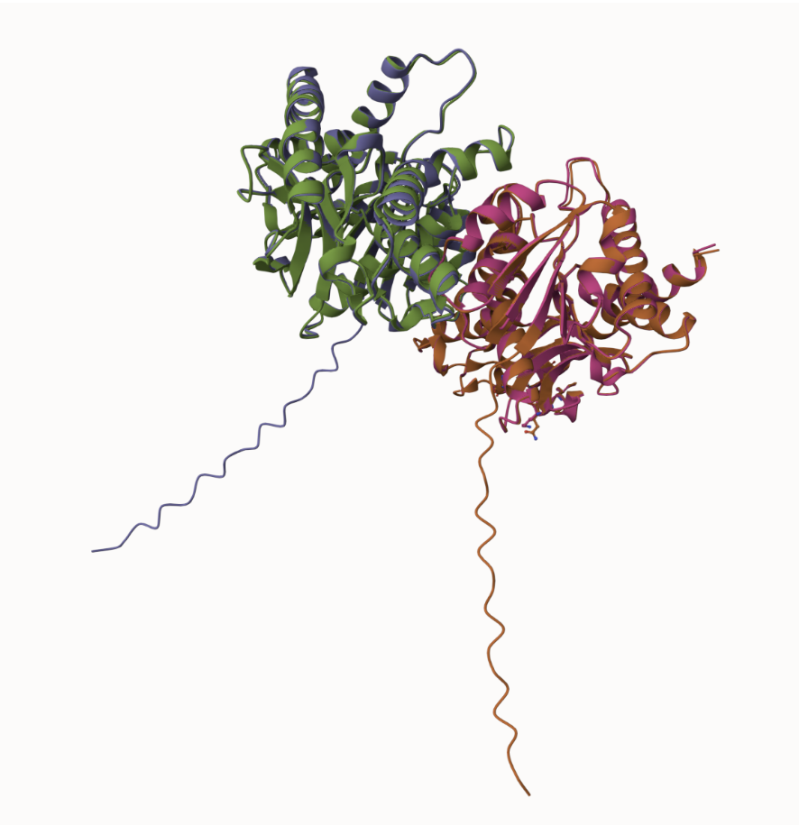

2. Image of the site with the aligned PDB files (no solvent)
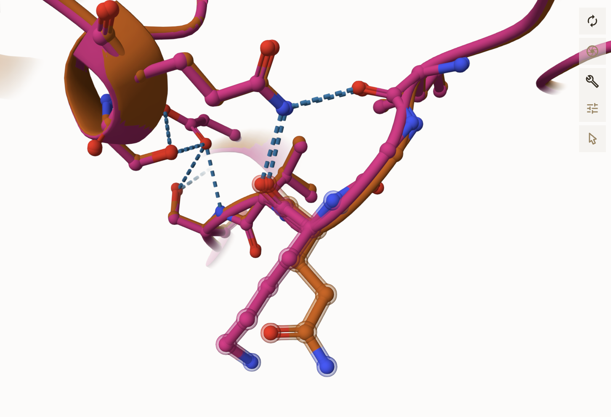

3. Annotated RMSF plot showing differences between the simulations
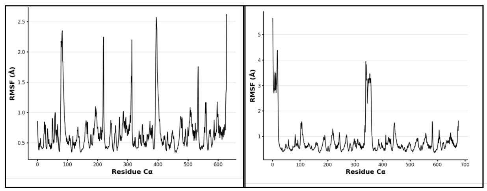

Further analysis of the RMSF plots of MDH2 and the mimic variant protein were completed, resulting in a p-value of 0.02 meaning there is a statistical significant difference between the MDH2 and mimic variant protein RMSF values. As shown in the scatterplot in Figure 14, you can see the differences in the peak values from the RMSF simulation data of the two proteins.

4. Annotated RMSF graph showing differences between the simulations
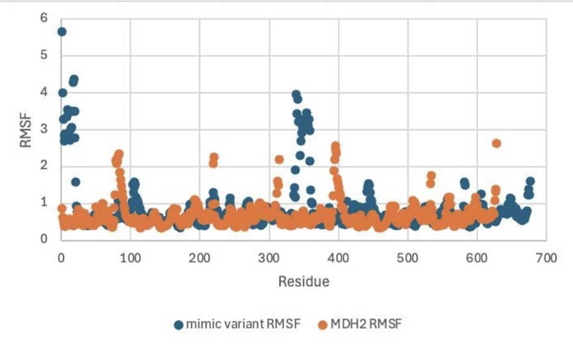

Other vital information from the simulations included the pKa values at key sites, such as the active site histidine 200 and the binding sites arginine 176 and asparagine 142. As shown in Table 1, the pKa values between MDH2 and the mimic variant were not significant due to being less than 0.5 difference, and asparagine did not produce a pKa value because the side chains are neutral at physiological pH. The modification site for the mimic variant did not produce a pKa value from the simulation, due to lysine being a protonated amino acid and glutamine being deprotonated resulting in the side chain not being neutral at physiological pH.  

5. Annotated plots of pKa for the key amino acids
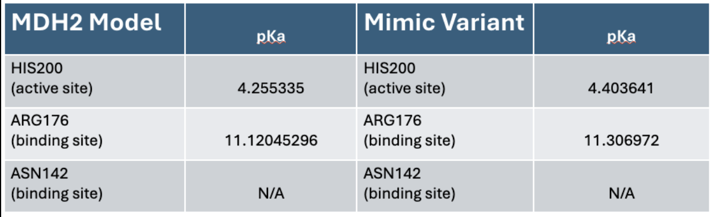

6. If needed, show ligand bound images and how modification affects substrate binding

## Comparison of the mimic and the authentic PTM

Part 4 from the Project 4 report outline
include images as needed

The comparison of the mimic variant simulation data does not match well with the PTM, this is due to the PTM having a different structure surrounding the modification site (Figure 15) that is similar to the original MDH2 model (Figure 16). Specific differences include the PTM model include the hydrogen bonding between serine 308, glutamine 312 and serine 210 which are not present in the mimic variant. The acetylation of the modification site could increase the rate at which products are made in the metabolic pathway due to these bonds increasing the stability of the structure.  

1. Image of PTM site and mimic variant site
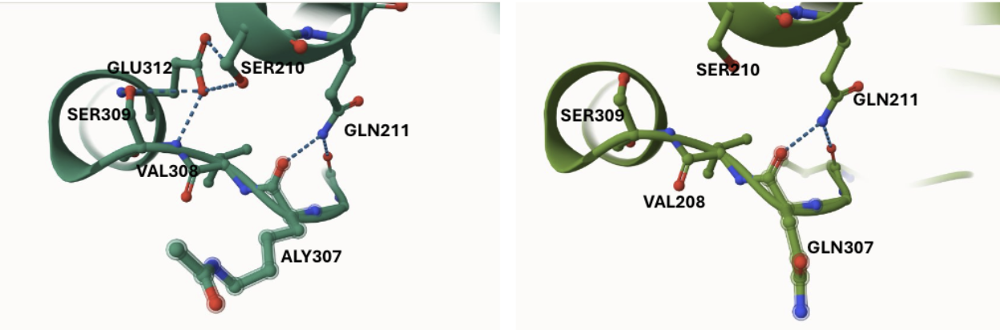

2. Image of aligned PTM and MDH2 model 
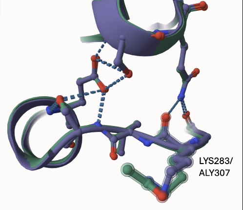

Overall I feel as if the mimic variant is not an accurate representation of the PTM due to the bonding surrounding the modification site. The PTM that was acetylated more closely represents the MDH2 model. Future work could include running simulations on the PTM model to conclude whether the pKa and RMSF values of the PTM are like that of the MDH2 model.  

## Authors

Izzy Evans 

## December 6, 2024

## License

Shield: [![CC BY-NC 4.0][cc-by-nc-shield]][cc-by-nc]

This work is licensed under a
[Creative Commons Attribution-NonCommercial 4.0 International License][cc-by-nc].

[![CC BY-NC 4.0][cc-by-nc-image]][cc-by-nc]

[cc-by-nc]: https://creativecommons.org/licenses/by-nc/4.0/
[cc-by-nc-image]: https://licensebuttons.net/l/by-nc/4.0/88x31.png
[cc-by-nc-shield]: https://img.shields.io/badge/License-CC%20BY--NC%204.0-lightgrey.svg

## References

* de Lorenzo, L.; Stack, T. M. M.; Fox, K. M.; Walstrom, K. M. Catalytic Mechanism and Kinetics of Malate Dehydrogenase. Essays in Biochemistry 2024, 68 (2), 73–82. https://doi.org/10.1042/EBC20230086. 

* EMBL-EBI ProtVar - Contextualizing human missense variation. https://www.ebi.ac.uk/ProtVar/query?search=P40926+K307R&annotation=functional-row-1) (accessed 2024-11-20).  !

* Kuhn, M. L.; Rakus, J. F.; Quenet, D. Acetylation, ADP-Ribosylation and Methylation of Malate. Essays Biochem 2024, 68 (2), 199–212. https://doi.org/10.1042/EBC20230080.   

* Ramazi, S.; Zahiri, J. Post-Translational Modifications in Proteins: Resources, Tools and Prediction Methods. Database (Oxford) 2021, 2021, baab012. https://doi.org/10.1093/database/baab012.  

*  Sokalingam, S.; Raghunathan, G.; Soundrarajan, N.; Lee, S.-G. A Study on the Effect of Surface Lysine to Arginine Mutagenesis on Protein Stability and Structure Using Green Fluorescent Protein. PLoS One 2012, 7 (7), e40410. https://doi.org/10.1371/journal.pone.0040410. 

*  UniProt. https://www.uniprot.org/uniprotkb/P40926/entry#sequences (accessed 2024-11-20) 

*  Venkat, S.; Gregory, C.; Sturges, J.; Gan, Q.; Fan, C. Studying the Lysine Acetylation of Malate Dehydrogenase. J Mol Biol 2017, 429 (9), 1396–1405. https://doi.org/10.1016/j.jmb.2017.03.027.  

