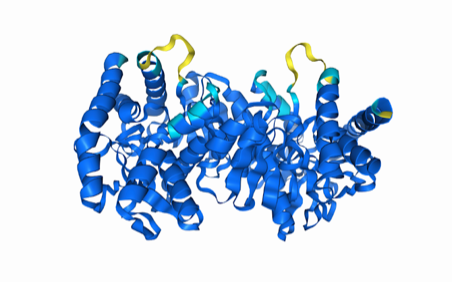
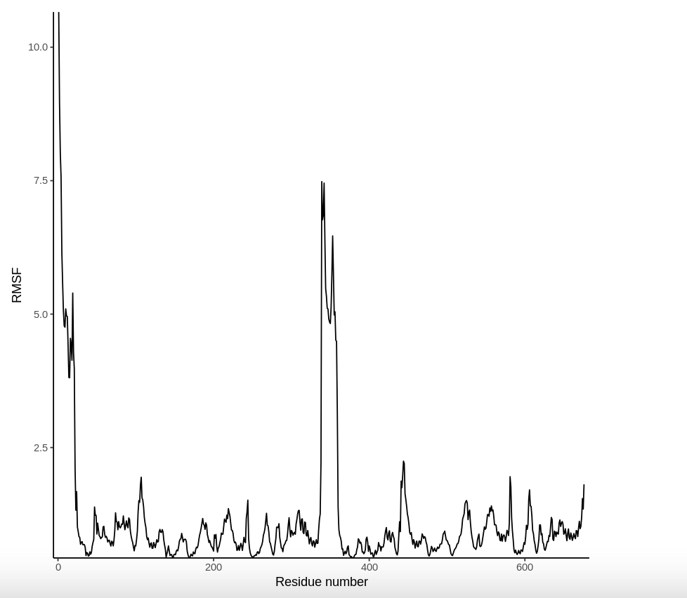

# Species and enzyme
Malate Dehydrogenase 2
# Uniprot number
P40926
# Variation
Acetylation of K314 to Q314

## Description

This project explores the structural and functional impacts of post-translational modification on lysine 314 (K314) in Human Malate Dehydrogenase 2 (HMDH2). The study specifically examines the effects of N6-acetyl-L-lysine modification at this site, hypothesizing that this PTM could influence enzymatic activity, substrate binding, and protein dimerization by altering the stability and flexibility of a critical loop near the dimer interface. To investigate, a mimic variant was created by substituting K314 with glutamine (Q) to simulate acetylation, and a PTM model was used to directly analyze the structural consequences of acetylation. Computational methods, including molecular dynamics simulations and structural modeling, were employed to visualize these changes and evaluate their implications for enzyme function and metabolic regulation.

1. image of the unmodified site

2. image of modification site

## Effect of the sequence variant and PTM on MDH dynamics
The post-translational modification (PTM) and sequence variant at position 314 of MDH2 significantly influence the protein's dynamics, particularly around the loop near the dimer interface. Acetylation at this site neutralizes lysine's charge, increasing loop flexibility and destabilizing critical interactions, while the K → Q mimic partially replicates these effects but introduces steric hindrance. These changes impact substrate binding, catalytic activity, and structural stability, with the PTM showing more pronounced effects compared to the mimic.

1. Image of aligned PDB files (no solvent)

2. Image of the site with the aligned PDB files (no solvent)

3. Annotated RMSF plot showing differences between the simulations

4. Annotated plots of pKa for the key amino acids

5. If needed, show ligand bound images and how modification affects substrate binding

Description of the data and changes 
Figure 1. Unmodified human malate dehydrogenase amino acid (LYS) 314. Shows the stabilizing interactions formed by lysine (highlighted in pink), including hydrogen bonds and electrostatic interactions. These are critical for maintaining loop integrity near the dimer interface.

Figure 2. Post-translational modification of the amino acid (ALY) 314. Shows the acetylation of lysine to ALY (highlighted in pink), emphasizing the neutralization of charge and loss of stabilizing contacts with an altered spatial positioning of the loop.

Figure 3. Mimic variant of the highlighted amino acid (GLN) 314 in orange. Illustrates the mimic variant (highlighted in pink), which introduces steric hindrance and disturbs weak interactions, mimicking but not fully replicating the effects of acetylation.

## Comparison of the mimic and the authentic PTM

## Authors

Maria Garcia-Moreno

## Deposition Date
 12/6/24

## License

Shield: [![CC BY-NC 4.0][cc-by-nc-shield]][cc-by-nc]

This work is licensed under a
[Creative Commons Attribution-NonCommercial 4.0 International License][cc-by-nc].

[![CC BY-NC 4.0][cc-by-nc-image]][cc-by-nc]

[cc-by-nc]: https://creativecommons.org/licenses/by-nc/4.0/
[cc-by-nc-image]: https://licensebuttons.net/l/by-nc/4.0/88x31.png
[cc-by-nc-shield]: https://img.shields.io/badge/License-CC%20BY--NC%204.0-lightgrey.svg

## References

AlphaFold Server. Alphafoldserver.com. https://alphafoldserver.com/fold/461763e0a39da0f (accessed 2024-11-30).
Arnittali, M.; Rissanou, A. N.; Harmandaris, V. Structure of Biomolecules through Molecular Dynamics Simulations. Procedia Computer Science 2019, 156, 69–78. https://doi.org/10.1016/j.procs.2019.08.181.
Berndsen, C. E.; Bell, J. K. The Structural Biology and Dynamics of Malate Dehydrogenases. 
Essays in Biochemistry 2024, 68 (2), 57–72. https://doi.org/10.1042/EBC20230082. 
Berndsen, C., Kayll, A., Sardelli A. MD simulation. 2024; https://colab.research.google.com/drive/1vKxP4MJhdIODzScluSeU73NHOWwJIPn8?usp=sharing 
Lee, M.; Wang, S. The Role of Flexible Loops in Substrate Binding and Dimerization. Biochem. J. 2020, 477(11), 3891-3902. https://doi.org/10.1042/BCJ20200495.
(1)Mol*. molstar.org. https://molstar.org/. (accessed 2024-10-08).
UniProt. https://www.uniprot.org/uniprotkb/P40926/entry (accessed 2024-10-08).
Yumi Eo; Hoai, T.; Ahn, H.-C. Structural Comparison of HMDH2 Complexed with Natural Substrates and Cofactors: The Importance of Phosphate Binding for Active Conformation and Catalysis. Biomolecules 2022, 12 (9), 1175–1175. https://doi.org/10.3390/biom12091175.
Zhong, X.; Yu, J.; Kim, T. Y. Post-Translational Modifications and Their Role in Protein Function and Metabolism. Cell Mol. Life Sci. 2020, 77(3), 713-728. https://doi.org/10.1002/mco2.261
