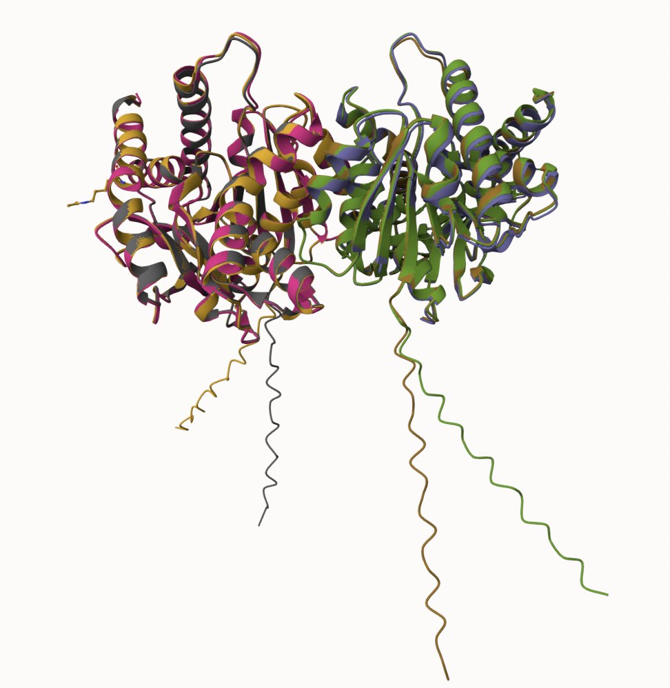
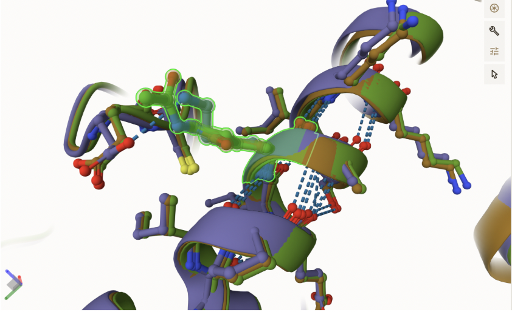
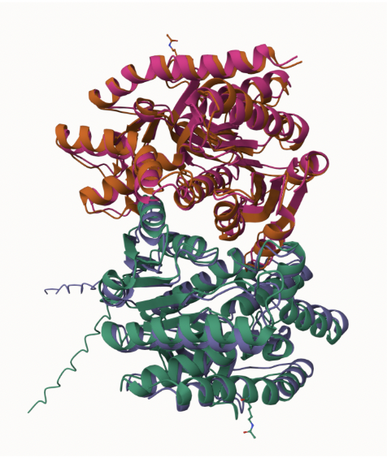

# Human MDH2
# P40926
# K324

## Description

The enzyme Malate dehydrogenase 2 (MDH2) is important for cellular respiration and metabolism, specifically in the Krebs Cycle. It catalyzes the reduction of malate to oxaloacetate (de Lorenzo, et al 2024). Modifications to this enzyme have been explored, however specifically the altering of amino acid Lys 324 to Gln has not yet been explored. Programs such as Alpha Fold, Mol Star and Google Colab were used to determine the potential effects of such a change, as well as a mimic effect by changing K 324 to an acetyl group.

1. image of the unmodified site

2. image of modification site

## Effect of the sequence variant and PTM on MDH dynamics

Part 3 from the Project 4 report

1. Image of aligned PDB files 

2. Image of the site with the aligned PDB files 

3. Annotated RMSF plot showing differences between the simulations
![The highest RMSF values occur near the beginning near amino acid 20, as well as close to amino acid 350, near the modification site. The first large fluctuation is likely accounted for by the tail. The second is closest to the modification site 324, which could indicate a conformational change occurring. Because there was a hydrogen bond lost in the Mimic and PTM that was present in the unmodified version, this could account for the large RMSF and cause potential differences in the conformation compared to the actual acetyl version](images/rmsf_plot_1.png)

## Comparison of the mimic and the authentic PTM

Part 4 from the Project 4 report outline
 Comparison between mimic variant (Q 324) and PTM (acetylation) showing additional Hydrogen bond between His 200 and Asp 173 in PTM. 
(images/active_compare.png)

## Authors

Amelia Giecek

## Deposition Date
December 6th, 2024
## License

Shield: [![CC BY-NC 4.0][cc-by-nc-shield]][cc-by-nc]

This work is licensed under a
[Creative Commons Attribution-NonCommercial 4.0 International License][cc-by-nc].

[![CC BY-NC 4.0][cc-by-nc-image]][cc-by-nc]

[cc-by-nc]: https://creativecommons.org/licenses/by-nc/4.0/
[cc-by-nc-image]: https://licensebuttons.net/l/by-nc/4.0/88x31.png
[cc-by-nc-shield]: https://img.shields.io/badge/License-CC%20BY--NC%204.0-lightgrey.svg

## References

* de Lorenzo, L.; Stack, T. M. M.; Fox, K. M.; Walstrom, K. M. Catalytic Mechanism and 
Kinetics of Malate Dehydrogenase. Essays in Biochemistry 2024, 68 (2), 73–82. 

* Citation2 
